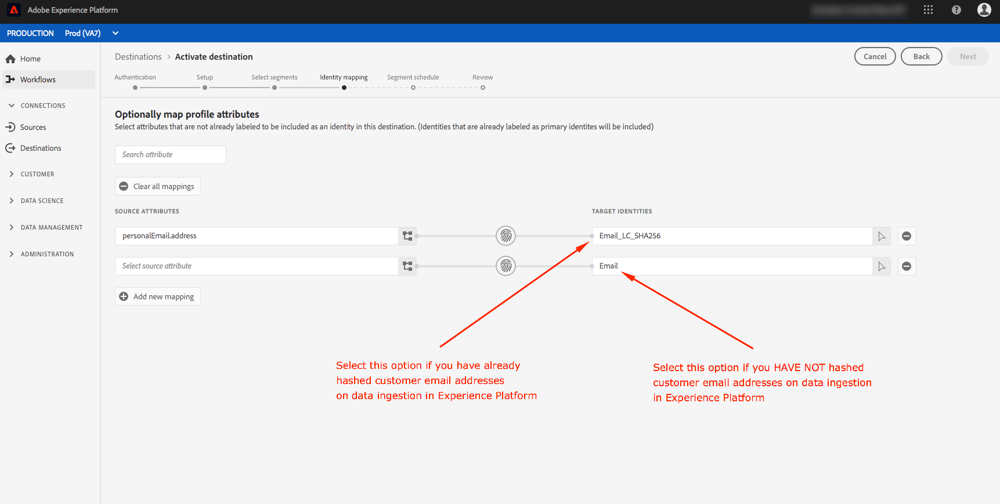

# Activar perfiles y segmentos en un destino

Active los datos que tiene en la plataforma de datos del cliente en tiempo real asignando segmentos a destinos. Para lograrlo, siga los pasos a continuación.

## Requisitos previos  {#prerequisites}

Para activar datos en destinos, debe haber [conectado correctamente un destino](./connect-destination.md). Si aún no lo ha hecho, vaya al catálogo [de](../catalog/overview.md)destinos, busque los destinos admitidos y configure uno o varios destinos.

## Activar datos {#activate-data}

Los pasos del flujo de trabajo de activación varían ligeramente entre los tipos de destino. El flujo de trabajo completo para todos los tipos de destino se describe a continuación.

### Seleccione el destino en el que activar los datos {#select-destination}

Se aplica a: Todos los destinos

En la interfaz de usuario de CDP en tiempo real, vaya a **[!UICONTROL Destinos]** > **[!UICONTROL Examinar]** y seleccione el destino en el que desea activar los segmentos.


Seleccione el nombre del destino para desplazarse al flujo de trabajo de activación.


Tenga en cuenta que si ya existe un flujo de trabajo de activación para un destino, puede ver los segmentos que se están activando en ese momento en el destino. Seleccione **[!UICONTROL Editar activación]** en el carril derecho y siga los pasos a continuación para modificar los detalles de la activación.

Una vez seleccionado un destino, seleccione **[!UICONTROL Activar]**.

### [!UICONTROL Paso Seleccionar segmentos] {#select-segments}

Se aplica a: Todos los destinos


En el flujo de trabajo **[!UICONTROL Activar destino]** , en la página **[!UICONTROL Seleccionar segmentos]** , seleccione uno o varios segmentos para activarlos en el destino. Seleccione **[!UICONTROL Siguiente]** para continuar con el paso siguiente.


### [!UICONTROL Paso de asignación] de identidades {#identity-mapping}

Se aplica a: destinos sociales y destino publicitario de Coincidencia de clientes de Google


Para los destinos sociales, puede seleccionar atributos de origen para asignarlos como identidades de destinatario en el destino. Este paso es opcional u obligatorio, según la identidad principal que utilice en el esquema.

Si utiliza la dirección de correo electrónico como identidad principal en el esquema, puede omitir el paso de asignación de identidad, como se muestra a continuación:


Si utiliza otro ID, como &quot;ID de recompensa&quot; o &quot;ID de lealtad&quot;, como identidad principal en el esquema, debe asignar manualmente la dirección de correo electrónico del esquema de identidad como identidad de destinatario en el destino social, como se muestra a continuación:


Seleccione `Email_LC_SHA256` como identidad de destinatario si ha marcado las direcciones de correo electrónico de los clientes al ingerir datos en Adobe Experience Platform, según los requisitos [!DNL Facebook] de hash de [](/help/rtcdp/destinations/facebook-destination.md#email-hashing-requirements)correo electrónico.

Seleccione `Email` como identidad de destinatario si las direcciones de correo electrónico que utiliza no están marcadas por hash. CDP en tiempo real realizará un hash de las direcciones de correo electrónico para cumplir con [!DNL Facebook] los requisitos.



### **[!UICONTROL Configurar]** paso {#configure}

Se aplica a: Destinos de marketing por correo electrónico y destinos de almacenamiento en la nube


En el paso **[!UICONTROL Configurar]** , puede configurar la programación y los nombres de archivo para cada segmento que esté exportando. La configuración de la programación es obligatoria, pero la configuración del nombre del archivo es opcional.

Para agregar una programación para el segmento, seleccione **[!UICONTROL Crear programación]**.


Aparece una ventana emergente con las opciones para crear la programación de segmentos.

- **Exportación** de archivos: Tiene la opción de exportar archivos completos o incrementales. Exportar un archivo completo publica una instantánea completa de todos los perfiles que cumplen los requisitos para ese segmento. Al exportar un archivo incremental, se publica el delta de perfiles que cumplen los requisitos para ese segmento desde la última exportación.
- **Frecuencia**: Si **[!UICONTROL Exportar archivos]** completos está seleccionado, tiene la opción de exportar **[!UICONTROL una vez]** o **[!UICONTROL diariamente]**. Si **[!UICONTROL Exportar archivos]** incrementales está seleccionado, solo tiene la opción de exportar **[!UICONTROL diariamente]**. Exportación de un archivo **[!UICONTROL Una vez]** exportado el archivo. Exportar un archivo **[!UICONTROL diariamente]** exporta el archivo todos los días desde la fecha de inicio hasta la fecha de finalización a las 12:00 AM UTC (7:00 PM EST) si se seleccionan archivos completos y a las 12:00 PM UTC (7:00 AM EST) si se seleccionan archivos incrementales.
- **Fecha**: Si selecciona **[!UICONTROL Una vez]** , puede seleccionar la fecha para la exportación única. Si selecciona **[!UICONTROL Diario]** , puede seleccionar las fechas de inicio y finalización de las exportaciones.


Los nombres de archivo predeterminados constan de nombre de destino, ID de segmento y un indicador de fecha y hora. Por ejemplo, puede editar los nombres de archivo exportados para distinguir entre diferentes campañas o para que el tiempo de exportación de datos se anexe a los archivos.

Seleccione el icono de lápiz para abrir una ventana modal y editar los nombres de archivo. Tenga en cuenta que los nombres de archivo tienen un límite de 255 caracteres.


En el editor de nombres de archivo, puede seleccionar diferentes componentes para agregarlos al nombre de archivo. El nombre de destino y la ID de segmento no se pueden eliminar de los nombres de archivo. Además de esto, puede agregar lo siguiente:

- **[!UICONTROL Nombre]** del segmento: Puede anexar el nombre del segmento al nombre del archivo.
- **[!UICONTROL Fecha y hora]**: Seleccione entre agregar un `MMDDYYYY_HHMMSS` formato o una marca de fecha y hora de 10 dígitos Unix del momento en que se generan los archivos. Elija una de estas opciones si desea que los archivos tengan un nombre de archivo dinámico generado con cada exportación incremental.
- **[!UICONTROL Texto]** personalizado: Añada el texto personalizado en los nombres de archivo.

Seleccione **[!UICONTROL Aplicar cambios]** para confirmar la selección.

>[!IMPORTANT]
> 
>Si no selecciona el componente **[!UICONTROL Fecha y hora]** , los nombres de archivo serán estáticos y el nuevo archivo exportado sobrescribirá el archivo anterior en la ubicación de almacenamiento con cada exportación. Esta es la opción recomendada cuando se ejecuta un trabajo de importación recurrente desde una ubicación de almacenamiento a una plataforma de marketing por correo electrónico.


Una vez que haya terminado de configurar todos los segmentos, seleccione **[!UICONTROL Siguiente]** para continuar.

### **[!UICONTROL Paso de programación]** de segmentos {#segment-schedule}

Se aplica a: destinos de publicidad, destinos sociales


En la página de programación **[!UICONTROL de]** segmentos, puede establecer la fecha de inicio para enviar datos al destino, así como la frecuencia con la que se envían datos al destino.

>[!IMPORTANT]
>
>Para los destinos sociales, debe seleccionar el origen de la audiencia en este paso. Sólo puede continuar con el paso siguiente después de seleccionar una de las opciones de la siguiente imagen.


### **[!UICONTROL Paso de programación]** {#scheduling}

Se aplica a: destinos de marketing por correo electrónico y destinos de almacenamiento en la nube


En la página **[!UICONTROL Programación]** , puede ver la fecha de inicio para enviar datos al destino, así como la frecuencia de envío de datos al destino. Estos valores no se pueden editar.

### **[!UICONTROL Paso Seleccionar atributos]** {#select-attributes}

Se aplica a: destinos de marketing por correo electrónico y destinos de almacenamiento en la nube


En la página **[!UICONTROL Seleccionar atributos]** , seleccione **[!UICONTROL Añadir nuevo campo]** y elija los atributos que desee enviar al destino.

>[!NOTE]
>
> CDP en tiempo real antepone su selección con cuatro atributos recomendados y utilizados comúnmente de su esquema: `person.name.firstName`, `person.name.lastName`, `personalEmail.address`, `segmentMembership.status`.

Las exportaciones de archivos variarán de las siguientes maneras, según si `segmentMembership.status` se selecciona:
- Si se selecciona el `segmentMembership.status` campo, los archivos exportados incluyen miembros **[!UICONTROL activos]** en la instantánea completa inicial y miembros **[!UICONTROL activos]** y **[!UICONTROL caducados]** en las exportaciones incrementales posteriores.
- Si el `segmentMembership.status` campo no está seleccionado, los archivos exportados solo incluyen miembros **[!UICONTROL activos]** en la instantánea completa inicial y en las posteriores exportaciones incrementales.


Además, puede marcar diferentes atributos como obligatorios. Si se marca un atributo como obligatorio, el segmento exportado debe contener dicho atributo. Como resultado, puede utilizarse como una forma adicional de filtrado. Marcar un atributo como obligatorio **no es** necesario.

Se recomienda que uno de los atributos sea un identificador [](/help/rtcdp/destinations/email-marketing-destinations.md#identity) único del esquema. Para obtener más información sobre los atributos obligatorios, consulte la sección de identidad en la documentación de destinos [de mercadotecnia de](/help/rtcdp/destinations/email-marketing-destinations.md#identity) correo electrónico.

>[!NOTE]
> 
>Si se han aplicado etiquetas de uso de datos a ciertos campos dentro de un conjunto de datos (en lugar de a todo el conjunto de datos), la aplicación de las etiquetas de nivel de campo en la activación se produce bajo las siguientes condiciones:
>- Los campos se utilizan en la definición del segmento.
>- Los campos se configuran como atributos proyectados para el destino de destinatario.

>
> 
Por ejemplo, si el campo `person.name.firstName` tiene ciertas etiquetas de uso de datos que entran en conflicto con el caso de uso de marketing del destino, se le mostrará una infracción de directiva de uso de datos en el paso de revisión. Para obtener más información, consulte Administración [de datos en CDP](../../rtcdp/privacy/data-governance-overview.md#destinations)en tiempo real.

### **[!UICONTROL Paso de revisión]** {#review}

Se aplica a: todos los destinos


En la página **[!UICONTROL Revisar]** , puede ver un resumen de su selección. Seleccione **[!UICONTROL Cancelar]** para desglosar el flujo, **[!UICONTROL Atrás]** para modificar la configuración o **[!UICONTROL Finalizar]** para confirmar la selección y el inicio de envío de datos al destino.

>[!IMPORTANT]
>
>En este paso, CDP en tiempo real comprueba las infracciones de las políticas de uso de datos. A continuación se muestra un ejemplo de violación de una política. No puede completar el flujo de trabajo de activación de segmentos hasta que no haya resuelto la infracción. Para obtener información sobre cómo resolver las infracciones de políticas, consulte Aplicación de [políticas](../../rtcdp/privacy/data-governance-overview.md#enforcement) en la sección de documentación de administración de datos.


Si no se ha detectado ninguna infracción de directiva, seleccione **[!UICONTROL Finalizar]** para confirmar la selección y el inicio al enviar datos al destino.


## Editar activación {#edit-activation}

Siga los pasos a continuación para editar los flujos de activación existentes en CDP en tiempo real:

1. Seleccione **[!UICONTROL Destinos]** en la barra de navegación izquierda, luego haga clic en la ficha **[!UICONTROL Examinar]** y, a continuación, haga clic en el nombre del destino.
2. Seleccione **[!UICONTROL Editar activación]** en el carril derecho para cambiar los segmentos que se van a enviar al destino.

## Verifique que la activación del segmento se haya realizado correctamente {#verify-activation}

### Destinos de marketing por correo electrónico y destinos de almacenamiento en la nube {#esp-and-cloud-storage}

Para los destinos de marketing por correo electrónico y los destinos de almacenamiento en la nube, CDP en tiempo real crea un archivo `.csv` `.txt` o un archivo delimitado por tabuladores en la ubicación de almacenamiento proporcionada. Se espera que cada día se cree un nuevo archivo en la ubicación del almacenamiento. The default file format is:
`<destinationName>_segment<segmentID>_<timestamp-yyyymmddhhmmss>.csv|txt`

Tenga en cuenta que puede editar el formato de archivo. Para obtener más información, vaya al paso [Configurar](#configure) para los destinos de almacenamiento en la nube y los destinos de marketing por correo electrónico.

Con el formato de archivo predeterminado, los archivos que recibiría en tres días consecutivos podrían tener este aspecto:

```console
Salesforce_Marketing_Cloud_segment12341e18-abcd-49c2-836d-123c88e76c39_20200408061804.csv
Salesforce_Marketing_Cloud_segment12341e18-abcd-49c2-836d-123c88e76c39_20200409052200.csv
Salesforce_Marketing_Cloud_segment12341e18-abcd-49c2-836d-123c88e76c39_20200410061130.csv
```

La presencia de estos archivos en la ubicación del almacenamiento es la confirmación de la activación correcta. Para comprender la estructura de los archivos exportados, puede [descargar un archivo](../assets/common/sample_export_file_segment12341e18-abcd-49c2-836d-123c88e76c39_20200408061804.csv).csv de muestra. Este archivo de ejemplo incluye los atributos `person.firstname`de perfil, `person.lastname`, `person.gender`, `person.birthyear`y `personalEmail.address`.

### Destinos publicitarios

Compruebe su cuenta en el destino de publicidad correspondiente en el que está activando sus datos. Si la activación se ha realizado correctamente, las audiencias se rellenan en la plataforma de publicidad.

### Destinos de redes sociales

Por ejemplo, [!DNL Facebook]una activación exitosa significa que se crearía una audiencia [!DNL Facebook] personalizada mediante programación en el Administrador [[!UICONTROL de publicidades de]](https://www.facebook.com/adsmanager/manage/)Facebook. La pertenencia a segmentos en la audiencia se agregaría y eliminaría a medida que los usuarios estuvieran cualificados o descalificados para los segmentos activados.

>[!TIP]
>
>La integración entre CDP en tiempo real y [!DNL Facebook] admite los rellenos de audiencia históricos. Todas las cualificaciones del segmento histórico se envían [!DNL Facebook] cuando activa los segmentos en el destino.

## Deshabilitar activación {#disable-activation}

Para deshabilitar un flujo de activación existente, siga los pasos a continuación:

1. Seleccione **[!UICONTROL Destinos]** en la barra de navegación izquierda, luego haga clic en la ficha **[!UICONTROL Examinar]** y, a continuación, haga clic en el nombre del destino.
2. Haga clic en el control **[!UICONTROL Habilitado]** en el carril derecho para cambiar el estado del flujo de activación.
3. En la ventana **Actualizar estado** de flujo de datos, seleccione **Confirmar** para desactivar el flujo de activación.
