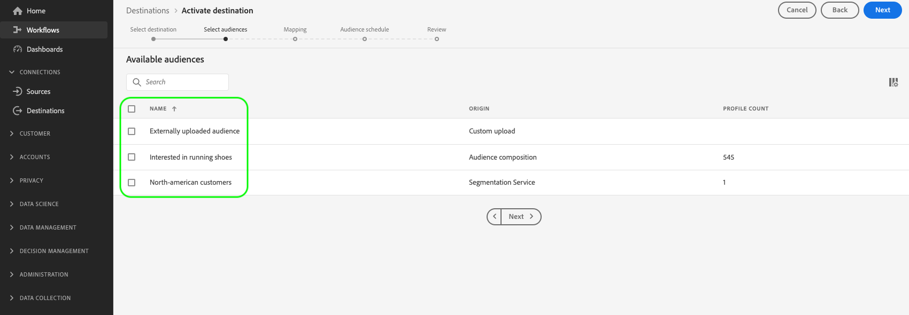

# Activación de audiencias en destinos de personalización de Edge

## Información general {#overview}

Adobe Experience Platform utiliza [segmentación de borde](../../segmentation/ui/edge-segmentation.md) junto con destinos Edge para permitir a los clientes crear y segmentar audiencias a gran escala y en tiempo real. Esta capacidad le ayuda a configurar casos de uso de personalización de la misma página y de la siguiente.

Algunos ejemplos de destinos de Edge son [Adobe Target](../../destinations/catalog/personalization/adobe-target-connection.md) y el [Personalización personalizada](../../destinations/catalog/personalization/custom-personalization.md) conexiones.

>[!NOTE]
>
>Cuándo [configuración de la conexión de Adobe Target](../catalog/personalization/adobe-target-connection.md) sin usar un ID de flujo de datos, no se admiten los casos de uso descritos en este artículo. En ausencia de un conjunto de datos, solo se admiten los casos de uso de personalización de la sesión siguiente.

>[!IMPORTANT]
> 
> * Para activar los datos y habilitar la variable [paso de asignación](#mapping) del flujo de trabajo, necesita el **[!UICONTROL Administrar destinos]**, **[!UICONTROL Activar destinos]**, **[!UICONTROL Ver perfiles]**, y **[!UICONTROL Ver segmentos]** [permisos de control de acceso](/help/access-control/home.md#permissions).
> * Para activar los datos sin pasar por el [paso de asignación](#mapping) del flujo de trabajo, necesita el **[!UICONTROL Administrar destinos]**, **[!UICONTROL Activar segmento sin asignación]**, **[!UICONTROL Ver perfiles]**, y **[!UICONTROL Ver segmentos]** [permisos de control de acceso](/help/access-control/home.md#permissions).
>* Para exportar *identidades*, necesita el **[!UICONTROL Ver gráfico de identidad]** [permiso de control de acceso](/help/access-control/home.md#permissions).   {width="100" zoomable="yes"}
> 
> Lea el [información general de control de acceso](/help/access-control/ui/overview.md) o póngase en contacto con el administrador del producto para obtener los permisos necesarios.

En este artículo se explica el flujo de trabajo necesario para activar audiencias en destinos Edge de Adobe Experience Platform. Cuando se usa junto con [segmentación de borde](../../segmentation/ui/edge-segmentation.md) y el opcional [asignación de atributos de perfil](#mapping)Sin embargo, estos destinos habilitan casos de uso de personalización de la misma página y de la siguiente página en las propiedades web y móviles.

Para obtener una breve descripción general sobre cómo configurar la conexión de Adobe Target para la personalización de Edge, vea el siguiente vídeo.

>[!NOTE]
>
>La interfaz de usuario del Experience Platform se actualiza con frecuencia y puede haber cambiado desde que se grabó este vídeo. Para obtener la información más actualizada, consulte los pasos de configuración descritos en las secciones siguientes.

>[!VIDEO](https://video.tv.adobe.com/v/3418799/?quality=12&learn=on)

Vea el siguiente vídeo para obtener una breve descripción general de cómo compartir audiencias y atributos de perfil en Adobe Target y destinos de personalización personalizados.

>[!VIDEO](https://video.tv.adobe.com/v/3419036/?quality=12&learn=on)

## Casos de uso {#use-cases}

Los destinos de personalización de Edge le permiten utilizar soluciones de personalización de Adobe, como Adobe Target, o sus propias plataformas de socios de personalización (por ejemplo, [!DNL Optimizely], [!DNL Pega]), así como sistemas propietarios (por ejemplo, CMS interno) para impulsar una experiencia de personalización del cliente más profunda mediante [Personalización personalizada](../catalog/personalization/custom-personalization.md) destino. Todo esto, al tiempo que aprovecha las funciones de segmentación y recopilación de datos de Experience Platform Edge Network.

Los casos de uso que se describen a continuación incluyen personalización del sitio y publicidad en el sitio segmentada.

Para habilitar estos casos de uso, los clientes necesitan una forma rápida y sencilla de recuperar información de audiencias y atributos de perfil de Experience Platform y de enviar esta información a [Adobe Target](../catalog/personalization/adobe-target-connection.md) o el [Personalización personalizada](../catalog/personalization/custom-personalization.md) conexiones en la interfaz de usuario de Experience Platform.

### Personalización de la misma página {#same-page}

Un usuario visita una página del sitio web. El cliente puede utilizar la información de visita de la página actual (por ejemplo, la dirección URL de referencia, el idioma del explorador, la información de producto incrustada) para seleccionar la siguiente acción/decisión (por ejemplo, personalización), utilizando [Personalización personalizada](../catalog/personalization/custom-personalization.md) conexión para plataformas que no sean de Adobe (por ejemplo, [!DNL Pega], [!DNL Optimizely], etc.).

### Personalización de la página siguiente {#next-page}

Un usuario visita la página A del sitio web. En función de esta interacción, el usuario cumple los requisitos para un conjunto de audiencias. A continuación, el usuario hace clic en un vínculo que le lleva de la página A a la B. Las audiencias para las que el usuario estuvo cualificado durante la interacción anterior en la página A, junto con las actualizaciones de perfil determinadas por la visita actual al sitio web, se utilizan para activar la siguiente acción/decisión (por ejemplo, qué titular de publicidad se mostrará al visitante o, en el caso de las pruebas A/B, qué versión de la página se mostrará).

### Personalización de próxima sesión {#next-session}

Un usuario visita varias páginas del sitio web. En función de estas interacciones, el usuario cumple los requisitos para un conjunto de audiencias. A continuación, el usuario finaliza la sesión de exploración actual.

Al día siguiente, el usuario vuelve al mismo sitio web del cliente. Las audiencias para las que se habían clasificado durante la interacción anterior con todas las páginas del sitio web visitado, junto con las actualizaciones de perfil determinadas por la visita del sitio web actual, se utilizan para seleccionar la siguiente acción/decisión (por ejemplo, qué banner publicitario mostrar al visitante o, en el caso de las pruebas A/B, qué versión de la página mostrar).

### Personalización de un titular de página de inicio {#home-page-banner}

Una empresa de venta y alquiler de viviendas quiere personalizar su página de inicio con un banner, según las cualificaciones de audiencia en Adobe Experience Platform. La empresa puede seleccionar qué audiencias deben obtener una experiencia personalizada y enviarlas a Adobe Target como criterios de segmentación para su oferta de Target.

## Requisitos previos {#prerequisites}

### Configuración de una secuencia de datos en la IU de recopilación de datos {#configure-datastream}

El primer paso para configurar el destino de personalización es configurar una secuencia de datos para el SDK web de Experience Platform. Esto se realiza en la IU de recopilación de datos.

Al configurar la secuencia de datos, en **[!UICONTROL Adobe Experience Platform]** asegúrese de que ambas **[!UICONTROL Segmentación de Edge]** y **[!UICONTROL Destinos de personalización]** están seleccionados.

Para obtener más información sobre cómo configurar un conjunto de datos, siga las instrucciones que se describen en la [Documentación del SDK web de Platform](../../datastreams/configure.md#aep).

### Crear un [!DNL Active-On-Edge] política de combinación {#create-merge-policy}

Después de crear la conexión de destino, debe crear un [!DNL Active-On-Edge] política de combinación. El [!DNL Active-On-Edge] la política de combinación garantiza que las audiencias se evalúen constantemente [en el borde](../../segmentation/ui/edge-segmentation.md) y están disponibles para casos de uso de personalización en tiempo real y de la página siguiente.

>[!IMPORTANT]
>
>Actualmente, los destinos de Edge solo admiten la activación de audiencias que utilicen [Política de combinación activa en el perímetro](../../segmentation/ui/segment-builder.md#merge-policies) se establece como valor predeterminado. Si asigna audiencias que utilizan una política de combinación diferente a destinos Edge, esas audiencias no se evalúan.

Siga las instrucciones de [creación de una política de combinación](../../profile/merge-policies/ui-guide.md#create-a-merge-policy)y asegúrese de habilitar la variable **[!UICONTROL Política de combinación activa en Edge]** alternar.

### Creación de una nueva audiencia en Platform {#create-audience}

Después de crear el [!DNL Active-On-Edge] política de combinación, debe crear una nueva audiencia en Platform.

Siga las [generador de audiencias](../../segmentation/ui/segment-builder.md) guía para crear su nueva audiencia y asegúrese de lo siguiente [asignarlo](../../segmentation/ui/segment-builder.md#merge-policies) el [!DNL Active-On-Edge] política de combinación creada en el paso 3.

### Creación de una conexión de destino {#connect-destination}

Una vez configurada la secuencia de datos, puede empezar a configurar el destino de personalización.

Siga las [tutorial de creación de conexión de destino](../ui/connect-destination.md) para obtener instrucciones detalladas sobre cómo crear una nueva conexión de destino.

Según el destino que esté configurando, consulte los siguientes artículos para conocer los requisitos previos específicos del destino y la información relacionada:

* [Conexión de Adobe Target](../catalog/personalization/adobe-target-connection.md#parameters)
* [Conexión de personalización personalizada](../catalog/personalization/custom-personalization.md##parameters)

## Seleccione su destino {#select-destination}

Después de completar los requisitos previos, ahora puede seleccionar el destino de personalización de Edge que desea utilizar para la personalización de la misma página y de la página siguiente.

1. Ir a **[!UICONTROL Conexiones > Destinos]** y seleccione la opción **[!UICONTROL Catálogo]** pestaña.

   

1. Seleccionar **[!UICONTROL Activar audiencias]** en la tarjeta correspondiente al destino de personalización en el que desee activar las audiencias, como se muestra en la siguiente imagen.

   

1. Seleccione la conexión de destino que desee utilizar para activar las audiencias y, a continuación, seleccione **[!UICONTROL Siguiente]**.

   

1. Mover a la sección siguiente para [seleccionar las audiencias](#select-audiences).

## Selección de audiencias {#select-audiences}

Utilice las casillas de verificación de la izquierda de los nombres de audiencia para seleccionar las audiencias que desea activar en el destino y, a continuación, seleccione **[!UICONTROL Siguiente]**.

Para seleccionar las audiencias que desea activar en el destino, utilice las casillas de verificación a la izquierda de los nombres de audiencia y luego seleccione **[!UICONTROL Siguiente]**.

Puede seleccionar entre varios tipos de audiencias, según su origen:

* **[!UICONTROL Servicio de segmentación]**: Audiencias generadas dentro de Experience Platform por el servicio de segmentación. Consulte la [documentación de segmentación](../../segmentation/ui/overview.md) para obtener más información.
* **[!UICONTROL Carga personalizada]**: Audiencias generadas fuera de Experience Platform y cargadas en Platform como archivos CSV. Para obtener más información acerca de las audiencias externas, consulte la documentación sobre [importación de una audiencia](../../segmentation/ui/overview.md#import-audience).
* Otros tipos de audiencias, procedentes de otras soluciones de Adobe, como [!DNL Audience Manager].

## Asignar atributos {#mapping}

>[!IMPORTANT]
>
>Los atributos de perfil pueden contener datos confidenciales. Para proteger estos datos, la variable **[!UICONTROL Personalización personalizada]** El destino requiere que utilice el [API del servidor de red perimetral](../../server-api/overview.md) al configurar el destino para la personalización basada en atributos. Todas las llamadas a la API de servidor deben realizarse en un [contexto autenticado](../../server-api/authentication.md).
>
> Si ya utiliza el SDK web o el SDK móvil para la integración, puede recuperar atributos mediante la API del servidor añadiendo una integración del lado del servidor.
>
> Si no cumple los requisitos anteriores, la personalización se basará únicamente en el abono a audiencia.

Seleccione los atributos en función de los cuales desea habilitar casos de uso de personalización para los usuarios. Esto significa que si el valor de un atributo cambia o si se añade un atributo a un perfil, ese perfil se convierte en miembro de la audiencia y se activa en el destino de personalización.

Añadir atributos es opcional y aún puede continuar con el siguiente paso y habilitar la personalización de la misma página y de la página siguiente sin seleccionar atributos. Si no agrega ningún atributo en este paso, la personalización se seguirá produciendo en función de la pertenencia a la audiencia y de las cualificaciones del mapa de identidad de los perfiles.

### Seleccionar atributos de origen {#select-source-attributes}

Para añadir atributos de origen, seleccione **[!UICONTROL Añadir nuevo campo]** control en el **[!UICONTROL Campo de origen]** y busque o navegue hasta el campo de atributo XDM deseado, como se muestra a continuación.

### Seleccionar atributos de destino {#select-target-attributes}

Para añadir atributos de destino, seleccione **[!UICONTROL Añadir nuevo campo]** control en el **[!UICONTROL Campo de destino]** y escriba el nombre de atributo personalizado al que desea asignar el atributo de origen.

>[!NOTE]
>
>La selección de atributos de destino solo se aplica a [Personalización personalizada](../catalog/personalization/custom-personalization.md) flujo de trabajo de activación, para admitir la asignación de campos de nombre descriptivo en la plataforma de destino.

## Programar exportación de público {#scheduling}

De forma predeterminada, la variable [!UICONTROL Programación de audiencia] Esta página muestra únicamente las audiencias recién seleccionadas que eligió en el flujo de activación actual.

Para ver todas las audiencias que se están activando en su destino, utilice la opción de filtrado y deshabilite la **[!UICONTROL Mostrar solo las nuevas audiencias]** filtro.

En el **[!UICONTROL Programación de audiencia]** página, seleccione cada audiencia y utilice el **[!UICONTROL Fecha de inicio]** y **[!UICONTROL Fecha de finalización]** para configurar el intervalo de tiempo para enviar datos al destino.

Seleccionar **[!UICONTROL Siguiente]** para ir a [!UICONTROL Revisar] página.

## Consulte {#review}

En el **[!UICONTROL Revisar]** , puede ver un resumen de su selección. Seleccionar **[!UICONTROL Cancelar]** para romper el flujo, **[!UICONTROL Atrás]** para modificar la configuración, o **[!UICONTROL Finalizar]** para confirmar la selección y comenzar a enviar datos al destino.

### Evaluación de directiva de consentimiento {#consent-policy-evaluation}

Si su organización ha adquirido **Adobe Healthcare Shield** o **Adobe Privacy &amp; Security Shield**, seleccione **[!UICONTROL Ver directivas de consentimiento aplicables]** para ver qué directivas de consentimiento se aplican y cuántos perfiles se incluyen en la activación como resultado de ellas. Más información [evaluación de directiva de consentimiento](/help/data-governance/enforcement/auto-enforcement.md#consent-policy-evaluation) para obtener más información.

### Comprobaciones de políticas de uso de datos {#data-usage-policy-checks}

En el **[!UICONTROL Revisar]** paso, el Experience Platform también comprueba si hay alguna infracción de la política de uso de datos. A continuación se muestra un ejemplo de infracción de una directiva. No puede completar el flujo de trabajo de activación de audiencia hasta que haya resuelto la infracción. Para obtener información sobre cómo resolver infracciones de directivas, consulte [infracciones de políticas de uso de datos](/help/data-governance/enforcement/auto-enforcement.md#data-usage-violation) en la sección documentación de control de datos.

### Filtrado de audiencias {#filter-audiences}

En este paso puede utilizar los filtros disponibles en la página para mostrar solo las audiencias cuya programación o asignación se haya actualizado como parte de este flujo de trabajo. También puede alternar qué columnas de tabla desea ver.

Si está satisfecho con la selección y no se han detectado infracciones de directivas, seleccione **[!UICONTROL Finalizar]** para confirmar la selección y comenzar a enviar datos al destino.

<!--

Commenting out this part since destination monitoring is not available currently for the Adobe Target and Custom Personalization destinations.

## Verify audience activation {#verify}

Check the [destination monitoring documentation](../../dataflows/ui/monitor-destinations.md) for detailed information on how to monitor the flow of data to your destinations.

-->
