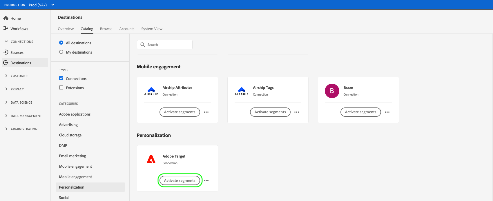
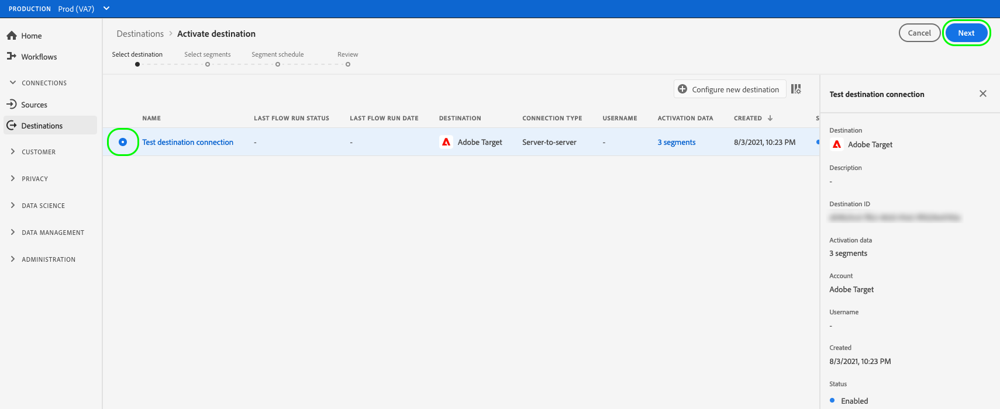

# Activar datos de audiencia en destinos de solicitud de perfil

>[!IMPORTANT]
> 
> * Para activar los datos y habilitar la variable [paso de asignación](#mapping) del flujo de trabajo, necesita el **[!UICONTROL Administrar destinos]**, **[!UICONTROL Activar destinos]**, **[!UICONTROL Ver perfiles]**, y **[!UICONTROL Ver segmentos]** [permisos de control de acceso](/help/access-control/home.md#permissions).
> * Para activar los datos sin pasar por el [paso de asignación](#mapping) del flujo de trabajo, necesita el **[!UICONTROL Administrar destinos]**, **[!UICONTROL Activar segmento sin asignación]**, **[!UICONTROL Ver perfiles]**, y **[!UICONTROL Ver segmentos]** [permisos de control de acceso](/help/access-control/home.md#permissions).
> 
> Lea el [información general de control de acceso](/help/access-control/ui/overview.md) o póngase en contacto con el administrador del producto para obtener los permisos necesarios.

## Información general {#overview}

En este artículo se explica el flujo de trabajo necesario para activar los datos de audiencia en los destinos de solicitud de perfil de Adobe Experience Platform. Cuando se usa junto con [segmentación de borde](../../segmentation/ui/edge-segmentation.md)Sin embargo, estos destinos habilitan casos de uso de personalización de la misma página y de la siguiente página en las propiedades web y móviles. Más información sobre [activación de los casos de uso de personalización de la misma página y de la siguiente página](/help/destinations/ui/configure-personalization-destinations.md).

Algunos ejemplos de destinos de solicitud de perfil son [Adobe Target](../../destinations/catalog/personalization/adobe-target-connection.md) y el [Personalización personalizada](../../destinations/catalog/personalization/custom-personalization.md) conexiones.

## Requisitos previos {#prerequisites}

Para activar los datos en los destinos, debe haber [conectado a un destino](./connect-destination.md). Si aún no lo ha hecho, vaya al [catálogo de destinos](../catalog/overview.md), examine los destinos de personalización admitidos y configure el destino que desee utilizar.

### Política de combinación de segmentos {#merge-policy}

Actualmente, los destinos de solicitud de perfil solo admiten la activación de segmentos que utilizan el [Política de combinación activa en el perímetro](../../segmentation/ui/segment-builder.md#merge-policies) se establece como valor predeterminado.

## Seleccione su destino {#select-destination}

1. Ir a **[!UICONTROL Conexiones > Destinos]** y seleccione la opción **[!UICONTROL Catálogo]** pestaña.

   

1. Seleccionar **[!UICONTROL Activar segmentos]** en la tarjeta correspondiente al destino de personalización en el que desee activar los segmentos, como se muestra en la siguiente imagen.

   

1. Seleccione la conexión de destino que desee utilizar para activar los segmentos y, a continuación, seleccione **[!UICONTROL Siguiente]**.

   

1. Mover a la sección siguiente para [seleccione sus segmentos](#select-segments).

## Seleccione sus segmentos {#select-segments}

Utilice las casillas de verificación de la izquierda de los nombres de segmentos para seleccionar los segmentos que desea activar en el destino y, a continuación, seleccione **[!UICONTROL Siguiente]**.

## (Beta) Asignar atributos {#map-attributes}

>[!IMPORTANT]
>
>El paso de asignación, que permite la personalización basada en atributos para [Adobe Target](/help/destinations/catalog/personalization/adobe-target-connection.md) y [destinos de personalización genéricos](/help/destinations/catalog/personalization/custom-personalization.md), se encuentra actualmente en la versión beta y es posible que su organización aún no tenga acceso a ella. Esta documentación está sujeta a cambios.

Seleccione los atributos en función de los cuales desea habilitar casos de uso de personalización para los usuarios. Esto significa que si el valor de un atributo cambia o si se añade un atributo a un perfil, ese perfil se convierte en miembro del segmento y se activa en el destino de personalización.

Añadir atributos es opcional y aún puede continuar con el siguiente paso y habilitar la personalización de la misma página y de la página siguiente sin seleccionar atributos. Si no agrega ningún atributo en este paso, la personalización se seguirá produciendo en función de la pertenencia al segmento y las cualificaciones del mapa de identidad de los perfiles.

### Seleccionar atributos de origen {#select-source-attributes}

Para añadir atributos de origen, seleccione **[!UICONTROL Añadir nuevo campo]** control en el **[!UICONTROL Campo de origen]** y busque o navegue hasta el campo de atributo XDM deseado, como se muestra a continuación.

### Seleccionar atributos de destino {#select-target-attributes}

>[!NOTE]
>
>Algunos destinos requieren que seleccione únicamente atributos de origen, mientras que otros requieren atributos de origen y de destino.
>
>Actualmente, la variable [Adobe Target V2](../catalog/personalization/adobe-target-connection.md) el destino solo requiere atributos de origen, mientras que [Personalización personalizada con atributos](../catalog/personalization/custom-personalization.md) requiere atributos de origen y de destino.

Para añadir atributos de destino, seleccione **[!UICONTROL Añadir nuevo campo]** control en el **[!UICONTROL Campo de destino]** y escriba el nombre de atributo personalizado al que desea asignar el atributo de origen.

## Programar exportación de segmentos {#scheduling}

De forma predeterminada, la variable [!UICONTROL Programación de segmentos] Esta página muestra únicamente los segmentos recién seleccionados que ha elegido en el flujo de activación actual.

Para ver todos los segmentos que se están activando en su destino, utilice la opción de filtrado y deshabilite la variable **[!UICONTROL Mostrar solo los segmentos nuevos]** filtro.

En el **[!UICONTROL Programación de segmentos]** página, seleccione cada segmento y, a continuación, utilice el **[!UICONTROL Fecha de inicio]** y **[!UICONTROL Fecha de finalización]** para configurar el intervalo de tiempo para enviar datos al destino.

Seleccionar **[!UICONTROL Siguiente]** para ir a [!UICONTROL Revisar] página.

## Consulte {#review}

En el **[!UICONTROL Revisar]** , puede ver un resumen de su selección. Seleccionar **[!UICONTROL Cancelar]** para romper el flujo, **[!UICONTROL Atrás]** para modificar la configuración, o **[!UICONTROL Finalizar]** para confirmar la selección y comenzar a enviar datos al destino.

### Evaluación de directiva de consentimiento {#consent-policy-evaluation}

Si su organización ha adquirido **Adobe Healthcare Shield** o **Adobe Privacy &amp; Security Shield**, seleccione **[!UICONTROL Ver directivas de consentimiento aplicables]** para ver qué directivas de consentimiento se aplican y cuántos perfiles se incluyen en la activación como resultado de ellas. Más información [evaluación de directiva de consentimiento](/help/data-governance/enforcement/auto-enforcement.md#consent-policy-evaluation) para obtener más información.

### Comprobaciones de políticas de uso de datos {#data-usage-policy-checks}

En el **[!UICONTROL Revisar]** paso, el Experience Platform también comprueba si hay alguna infracción de la política de uso de datos. A continuación se muestra un ejemplo de infracción de una directiva. No puede completar el flujo de trabajo de activación de segmentos hasta que haya resuelto la infracción. Para obtener información sobre cómo resolver infracciones de directivas, consulte [infracciones de políticas de uso de datos](/help/data-governance/enforcement/auto-enforcement.md#data-usage-violation) en la sección documentación de control de datos.

### Filtrar segmentos. {#filter-segments}

Además, en este paso puede utilizar los filtros disponibles en la página para mostrar solo los segmentos cuya programación o asignación se haya actualizado como parte de este flujo de trabajo. También puede alternar qué columnas de tabla desea ver.

Si está satisfecho con la selección y no se han detectado infracciones de directivas, seleccione **[!UICONTROL Finalizar]** para confirmar la selección y comenzar a enviar datos al destino.

<!--

Commenting out this part since destination monitoring is not available currently for the Adobe Target and Custom Personalization destinations.

## Verify segment activation {#verify}

Check the [destination monitoring documentation](../../dataflows/ui/monitor-destinations.md) for detailed information on how to monitor the flow of data to your destinations.

-->