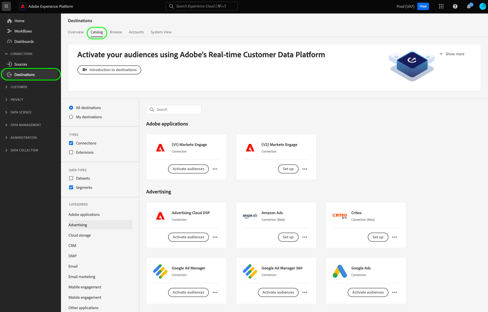
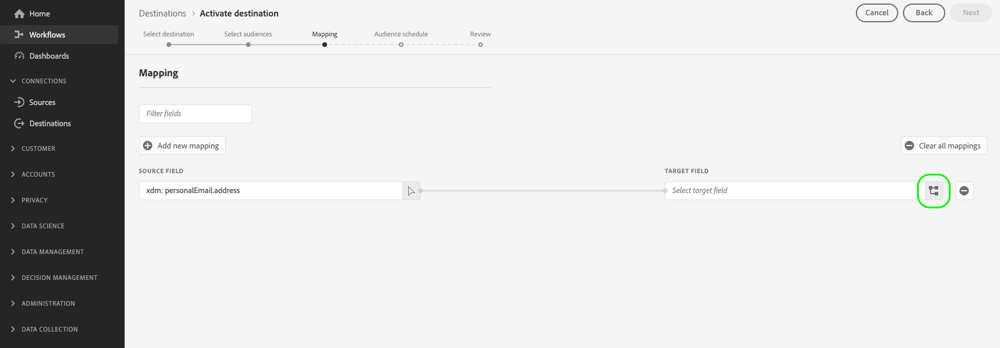
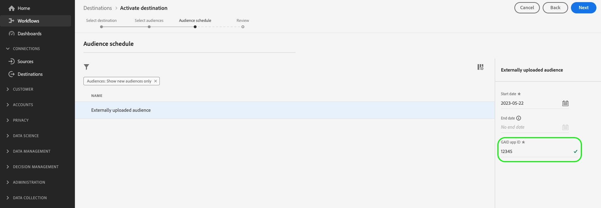

# Activar audiencias en destinos de flujo continuo

>[!IMPORTANT]
> 
> * Para activar audiencias y activar la variable [paso de asignación](#mapping) del flujo de trabajo, necesita el **[!UICONTROL Administrar destinos]**, **[!UICONTROL Activar destinos]**, **[!UICONTROL Ver perfiles]**, y **[!UICONTROL Ver segmentos]** [permisos de control de acceso](/help/access-control/home.md#permissions).
> * Para activar audiencias sin pasar por el [paso de asignación](#mapping) del flujo de trabajo, necesita el **[!UICONTROL Administrar destinos]**, **[!UICONTROL Activar segmento sin asignación]**, **[!UICONTROL Ver perfiles]**, y **[!UICONTROL Ver segmentos]** [permisos de control de acceso](/help/access-control/home.md#permissions).
> 
> Lea el [información general de control de acceso](/help/access-control/ui/overview.md) o póngase en contacto con el administrador del producto para obtener los permisos necesarios.

## Información general {#overview}

En este artículo se explica el flujo de trabajo necesario para activar audiencias en los destinos de flujo de Adobe Experience Platform.

## Requisitos previos {#prerequisites}

Para activar audiencias en destinos, debe tener [conectado a un destino](./connect-destination.md). Si aún no lo ha hecho, vaya al [catálogo de destinos](../catalog/overview.md), examine los destinos admitidos y configure el destino que desee utilizar.

## Seleccione su destino {#select-destination}

1. Ir a **[!UICONTROL Conexiones > Destinos]** y seleccione la opción **[!UICONTROL Catálogo]** pestaña.

   

1. Seleccionar **[!UICONTROL Activar audiencias]** en la tarjeta correspondiente al destino donde desea activar sus audiencias, como se muestra en la siguiente imagen.

   

1. Seleccione la conexión de destino que desee utilizar para activar las audiencias y, a continuación, seleccione **[!UICONTROL Siguiente]**.

   

1. Mover a la sección siguiente para [seleccionar las audiencias](#select-audiences).

## Selección de audiencias {#select-audiences}

Para seleccionar las audiencias que desea activar en el destino, utilice las casillas de verificación a la izquierda de los nombres de audiencia y luego seleccione **[!UICONTROL Siguiente]**.

Puede seleccionar entre varios tipos de audiencias, según su origen:

* **[!UICONTROL Servicio de segmentación]**: Audiencias generadas dentro de Experience Platform por el servicio de segmentación. Consulte la [documentación de segmentación](../../segmentation/ui/overview.md) para obtener más información.
* **[!UICONTROL Carga personalizada]**: Audiencias generadas fuera de Experience Platform y cargadas en Platform como archivos CSV. Para obtener más información acerca de las audiencias externas, consulte la documentación sobre [importación de una audiencia](../../segmentation/ui/overview.md#import-audience).
* Otros tipos de audiencias, procedentes de otras soluciones de Adobe, como [!DNL Audience Manager].

## Asignar atributos e identidades {#mapping}

>[!IMPORTANT]
>
>Este paso solo se aplica a algunos destinos de flujo de audiencia. Si su destino no tiene un **[!UICONTROL Asignación]** paso, saltar a [programación de audiencia](#scheduling).

Algunos destinos de flujo de audiencia requieren que seleccione atributos de origen o áreas de nombres de identidad para asignar como identidades de destino en el destino.

1. En el **[!UICONTROL Asignación]** página, seleccione **[!UICONTROL Añadir nueva asignación]**.

   

1. Seleccione la flecha a la derecha de la **[!UICONTROL Campo de origen]** entrada.

   

1. En el **[!UICONTROL Seleccionar campo de origen]** página, utilice el **[!UICONTROL Seleccionar atributos]** o el **[!UICONTROL Seleccionar área de nombres de identidad]** opciones para cambiar entre las dos categorías de campos de origen disponibles. De los disponibles [!DNL XDM] atributos de perfil y áreas de nombres de identidad, seleccione los que desee asignar al destino y, a continuación, elija **[!UICONTROL Seleccionar]**.

   

1. Seleccione el botón a la derecha del **[!UICONTROL Campo de destino]** entrada.

   

1. En el **[!UICONTROL Seleccionar campo de destino]** , seleccione el área de nombres de identidad de destino al que desea asignar el campo de origen y elija **[!UICONTROL Seleccionar]**.

   

1. Para agregar más asignaciones, repita los pasos del 1 al 5.

### Aplicar transformación {#apply-transformation}

>[!CONTEXTUALHELP]
>id="platform_destinations_activate_applytransformation"
>title="Aplicar transformación"
>abstract="Marque esta opción cuando utilice campos de origen sin hash, para que Adobe Experience Platform aplique un algoritmo hash en ellos automáticamente en la activación."

Cuando asigne atributos de origen sin hash a atributos de destino que el destino espera que tengan hash (por ejemplo: `email_lc_sha256` o `phone_sha256`), marque la **Aplicar transformación** para que Adobe Experience Platform agregue automáticamente los atributos de origen al activarlos.

## Programar exportación de audiencias {#scheduling}

>[!CONTEXTUALHELP]
>id="platform_destinations_activate_enddate"
>title="Fecha final"
>abstract="No está disponible la adición de una fecha de finalización para la programación de público."

De forma predeterminada, la variable **[!UICONTROL Programación de audiencia]** Esta página muestra únicamente las audiencias recién seleccionadas que eligió en el flujo de activación actual.

Para ver todas las audiencias que se están activando en su destino, utilice la opción de filtrado y deshabilite la **[!UICONTROL Mostrar solo las nuevas audiencias]** filtro.

1. En el **[!UICONTROL Programación de audiencia]** página, seleccione cada audiencia y utilice el **[!UICONTROL Fecha de inicio]** y **[!UICONTROL Fecha de finalización]** para configurar el intervalo de tiempo para enviar datos al destino.

   

   * Algunos destinos requieren que seleccione **[!UICONTROL Origen de la audiencia]** para cada audiencia, utilice el menú desplegable situado debajo de los selectores de calendario. Si el destino no incluye este selector, omita este paso.

     

   * Algunos destinos requieren que los asigne manualmente [!DNL Platform] a su homólogo en el destino de destino. Para ello, seleccione cada audiencia e introduzca el ID de audiencia correspondiente en la plataforma de destino en **[!UICONTROL ID de asignación]** field. Si el destino no incluye este campo, omita este paso.

     

   * Algunos destinos requieren que escriba un **[!UICONTROL ID de aplicación]** al activar [!DNL IDFA] o [!DNL GAID] audiencias. Si el destino no incluye este campo, omita este paso.

     

1. Seleccionar **[!UICONTROL Siguiente]** para ir a [!UICONTROL Revisar] página.

## Consulte {#review}

En el **[!UICONTROL Revisar]** , puede ver un resumen de su selección. Seleccionar **[!UICONTROL Cancelar]** para romper el flujo, **[!UICONTROL Atrás]** para modificar la configuración, o **[!UICONTROL Finalizar]** para confirmar la selección y comenzar a enviar datos al destino.

### Evaluación de directiva de consentimiento {#consent-policy-evaluation}

Si su organización ha adquirido **Adobe Healthcare Shield** o **Adobe Privacy &amp; Security Shield**, seleccione **[!UICONTROL Ver directivas de consentimiento aplicables]** para ver qué directivas de consentimiento se aplican y cuántos perfiles se incluyen en la activación como resultado de ellas. Más información [evaluación de directiva de consentimiento](/help/data-governance/enforcement/auto-enforcement.md#consent-policy-evaluation) para obtener más información.

### Comprobaciones de políticas de uso de datos {#data-usage-policy-checks}

En el **[!UICONTROL Revisar]** paso, el Experience Platform también comprueba si hay alguna infracción de la política de uso de datos. A continuación se muestra un ejemplo de infracción de una directiva. No puede completar el flujo de trabajo de activación de audiencia hasta que haya resuelto la infracción. Para obtener información sobre cómo resolver infracciones de directivas, consulte [infracciones de políticas de uso de datos](/help/data-governance/enforcement/auto-enforcement.md#data-usage-violation) en la sección documentación de control de datos.

### Filtrado de audiencias {#filter-audiences}

Además, en este paso puede utilizar los filtros disponibles en la página para mostrar solo las audiencias cuya programación o asignación se haya actualizado como parte de este flujo de trabajo. También puede alternar qué columnas de tabla desea ver.

Si está satisfecho con la selección y no se han detectado infracciones de directivas, seleccione **[!UICONTROL Finalizar]** para confirmar la selección y comenzar a enviar datos al destino.

## Verificar activación de audiencia {#verify}

Compruebe la [documentación de supervisión de destino](../../dataflows/ui/monitor-destinations.md) para obtener información detallada sobre cómo monitorizar el flujo de datos a sus destinos.

<!-- 
For [!DNL Facebook Custom Audience], a successful activation means that a [!DNL Facebook] custom audience would be created programmatically in [[!UICONTROL Facebook Ads Manager]](https://www.facebook.com/adsmanager/manage/). Audience membership in the audience would be added and removed as users are qualified or disqualified for the activated audiences.

>[!TIP]
>
>The integration between Adobe Experience Platform and [!DNL Facebook] supports historical audience backfills. All historical audience qualifications are sent to [!DNL Facebook] when you activate the audiences to the destination.
-->
