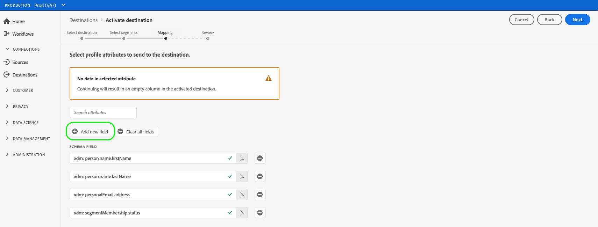

# Activar datos de audiencia en destinos de exportación de perfil de flujo continuo

>[!IMPORTANT]
> 
> * Para activar los datos y habilitar la variable [paso de asignación](#mapping) del flujo de trabajo, necesita la variable **[!UICONTROL Administrar destinos]**, **[!UICONTROL Activar destinos]**, **[!UICONTROL Ver perfiles]** y **[!UICONTROL Ver segmentos]** [permisos de control de acceso](/help/access-control/home.md#permissions).
> * Para activar los datos sin tener que pasar por el [paso de asignación](#mapping) del flujo de trabajo, necesita la variable **[!UICONTROL Administrar destinos]**, **[!UICONTROL Activar segmento sin asignación]**, **[!UICONTROL Ver perfiles]** y **[!UICONTROL Ver segmentos]** [permisos de control de acceso](/help/access-control/home.md#permissions).
> 
> Lea el [información general sobre el control de acceso](/help/access-control/ui/overview.md) o póngase en contacto con el administrador del producto para obtener los permisos necesarios.

## Información general {#overview}

En este artículo se explica el flujo de trabajo necesario para activar los datos de audiencia en destinos basados en perfiles de flujo continuo de Adobe Experience Platform, como Amazon Kinesis.

## Requisitos previos {#prerequisites}

Para activar datos en destinos, debe haber [conectado a un destino](./connect-destination.md). Si aún no lo ha hecho, vaya a la [catálogo de destinos](../catalog/overview.md), busque los destinos compatibles y configure el destino que desea utilizar.

## Seleccione el destino {#select-destination}

1. Vaya a **[!UICONTROL Conexiones > Destinos]** y seleccione **[!UICONTROL Catálogo]** pestaña .

   

1. Select **[!UICONTROL Activar segmentos]** en la tarjeta correspondiente al destino en el que desea activar los segmentos, como se muestra en la imagen siguiente.

   

1. Seleccione la conexión de destino que desee utilizar para activar los segmentos y, a continuación, seleccione **[!UICONTROL Siguiente]**.

   

1. Mover a la siguiente sección a [seleccione sus segmentos](#select-segments).

## Seleccione los segmentos {#select-segments}

Utilice las casillas de verificación a la izquierda de los nombres de los segmentos para seleccionar los segmentos que desea activar en el destino y, a continuación, seleccione **[!UICONTROL Siguiente]**.


## Seleccionar atributos de perfil {#select-attributes}

En el **[!UICONTROL Asignación]** , seleccione los atributos de perfil que desea enviar al destino de destino.

>[!NOTE]
>
> Adobe Experience Platform prefiere la selección con cuatro atributos recomendados y utilizados comúnmente del esquema: `person.name.firstName`, `person.name.lastName`, `personalEmail.address`, `segmentMembership.status`.

Las exportaciones de archivos variarán de las siguientes maneras, en función de si `segmentMembership.status` está seleccionada:
* Si la variable `segmentMembership.status` está seleccionado, los archivos exportados incluyen **[!UICONTROL Activo]** miembros en la instantánea completa inicial y **[!UICONTROL Activo]** y **[!UICONTROL Caducado]** miembros en exportaciones incrementales posteriores.
* Si la variable `segmentMembership.status` no está seleccionado, los archivos exportados solo incluyen **[!UICONTROL Activo]** miembros en la instantánea completa inicial y en las exportaciones incrementales posteriores.


1. En el **[!UICONTROL Seleccionar atributos]** página, seleccione **[!UICONTROL Añadir nuevo campo]**.

   

1. Seleccione la flecha a la derecha del **[!UICONTROL Campo Esquema]** entrada.

   

1. En el **[!UICONTROL Seleccionar campo]** , seleccione los atributos XDM que desea enviar al destino y, a continuación, elija **[!UICONTROL Select]**.

   


1. Para agregar más asignaciones, repita los pasos del 1 al 3 y, a continuación, seleccione **[!UICONTROL Siguiente]**.

## Consulte {#review}

En el **[!UICONTROL Consulte]** , puede ver un resumen de su selección. Select **[!UICONTROL Cancelar]** para desglosar el flujo, **[!UICONTROL Atrás]** para modificar la configuración, o **[!UICONTROL Finalizar]** para confirmar la selección y empezar a enviar datos al destino.


### Evaluación de la directiva de consentimiento {#consent-policy-evaluation}

Si su organización ha adquirido **Adobe Escudo Sanitario** o **Protección de seguridad y privacidad de Adobe**, seleccione **[!UICONTROL Ver directivas de consentimiento aplicables]** para ver qué políticas de consentimiento se aplican y cuántos perfiles se incluyen en la activación como resultado de ellas. Más información [evaluación de la política de consentimiento](/help/data-governance/enforcement/auto-enforcement.md#consent-policy-evaluation) para obtener más información.

### Comprobaciones de políticas de uso de datos {#data-usage-policy-checks}

En el **[!UICONTROL Consulte]** , el Experience Platform también comprueba si hay alguna infracción de la directiva de uso de datos. A continuación se muestra un ejemplo en el que se infringe una política. No puede completar el flujo de trabajo de activación de segmentos hasta que no haya resuelto la infracción. Para obtener información sobre cómo resolver violaciones de políticas, lea acerca de [infracciones de directiva de uso de datos](/help/data-governance/enforcement/auto-enforcement.md#data-usage-violation) en la sección documentación de control de datos .


### Filtrar segmentos. {#filter-segments}

Además, en este paso puede utilizar los filtros disponibles en la página para mostrar solo los segmentos cuya programación o asignación se haya actualizado como parte de este flujo de trabajo.


Si está satisfecho con la selección y no se han detectado infracciones de directiva, seleccione **[!UICONTROL Finalizar]** para confirmar la selección y empezar a enviar datos al destino.

## Verificación de la activación de segmentos {#verify}

Su exportación [!DNL Experience Platform] Los datos de aterrizan en el destino de destino en formato JSON. Por ejemplo, el evento siguiente contiene el atributo de perfil de dirección de correo electrónico de una audiencia que se ha clasificado para un segmento determinado y ha salido de otro segmento. Las identidades de este cliente potencial son ECID y correo electrónico.

```json
{
  "person": {
    "email": "yourstruly@adobe.com"
  },
  "segmentMembership": {
    "ups": {
      "7841ba61-23c1-4bb3-a495-00d3g5fe1e93": {
        "lastQualificationTime": "2020-05-25T21:24:39Z",
        "status": "exited"
      },
      "59bd2fkd-3c48-4b18-bf56-4f5c5e6967ae": {
        "lastQualificationTime": "2020-05-25T23:37:33Z",
        "status": "realized"
      }
    }
  },
  "identityMap": {
    "ecid": [
      {
        "id": "14575006536349286404619648085736425115"
      },
      {
        "id": "66478888669296734530114754794777368480"
      }
    ],
    "email_lc_sha256": [
      {
        "id": "655332b5fa2aea4498bf7a290cff017cb4"
      },
      {
        "id": "66baf76ef9de8b42df8903f00e0e3dc0b7"
      }
    ]
  }
}
```
