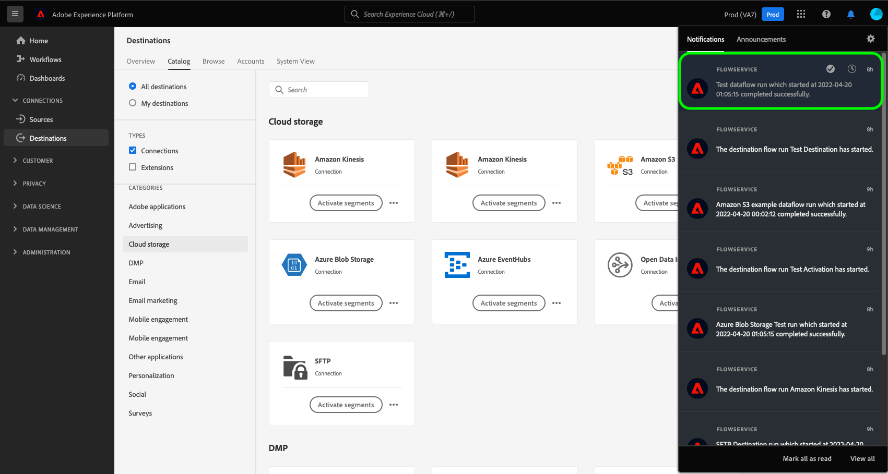

# Suscribirse a alertas de destino en contexto

Adobe Experience Platform le permite suscribirse a alertas basadas en eventos relativas a actividades de Adobe Experience Platform. Las alertas reducen o eliminan la necesidad de sondear el [[!DNL Observability Insights] API](../../observability/api/overview.md) para comprobar si un trabajo se ha completado, si se ha alcanzado un hito determinado dentro de un flujo de trabajo o si se ha producido algún error.

Puede suscribirse a alertas al crear un flujo de datos para recibir mensajes de alerta sobre el estado, el éxito o el error de la ejecución del flujo.

Este documento proporciona pasos sobre cómo suscribirse y recibir mensajes de alertas para los flujos de datos de destino.

## Primeros pasos

Este documento requiere un entendimiento práctico de los siguientes componentes de Adobe Experience Platform:

* [Destinos](../home.md): integraciones creadas previamente con plataformas de destino que permiten la activación perfecta de los datos de Adobe Experience Platform. Puede utilizar destinos para activar los datos conocidos y desconocidos para campañas de marketing entre canales, campañas por correo electrónico, publicidad segmentada y muchos otros casos de uso.
* [Observabilidad](../../observability/home.md): [!DNL Observability Insights] le permite monitorizar las actividades de Platform mediante el uso de métricas estadísticas y notificaciones de eventos.
   * [Alertas](../../observability/alerts/overview.md): Cuando se alcanza un determinado conjunto de condiciones en las operaciones de Platform (como un problema potencial cuando el sistema supera un umbral), Platform puede enviar mensajes de alerta a cualquier usuario de la organización que se haya suscrito a ellos.

## Suscripción a alertas en la IU {#subscribe-destination-alerts}

>[!CONTEXTUALHELP]
>id="platform_destination_alerts_subscribe"
>title="Suscribirse a alertas de destino"
>abstract="Las alertas le permiten recibir notificaciones basadas en el estado de sus flujos de datos de destino. Puede establecer notificaciones de alerta para obtener actualizaciones si el flujo de datos se ha iniciado, se ha realizado correctamente, ha fallado o no se ha enviado ningún dato a su destino."
>text="Learn more in documentation"

>[!IMPORTANT]
>
>Debe habilitar notificaciones instantáneas de correos electrónicos para su cuenta de Platform a fin de recibir notificaciones de alerta basadas en correo electrónico para sus flujos de datos.

Puede activar alertas para los flujos de datos durante la [!UICONTROL Configurar nuevo destino] paso del [conexión de destino](connect-destination.md) flujo de trabajo.

Seleccione las alertas a las que desea suscribirse y, a continuación, seleccione **[!UICONTROL Siguiente]** para revisar y finalizar el flujo de datos.

Las alertas disponibles para los flujos de datos de destino se describen en la siguiente tabla.

* Para destinos de flujo continuo, solo la variable [!DNL Activation Skipped Rate Exceeded] La alerta está disponible.
* Para destinos basados en archivos, todas las alertas están disponibles.

| Alertas | Descripción |
| --- | --- |
| Retraso de ejecución de flujo de destino | Esta alerta le notifica cuando una ejecución de flujo de destino tarda más de 150 minutos en activar un segmento. |
| Error de ejecución de flujo de destino | Esta alerta le notifica cuando se produce un error al activar un segmento en un destino. |
| Ejecución correcta de flujo de destino | Esta alerta le notifica cuando un segmento se activa correctamente en un destino. |
| Inicio de ejecución de flujo de destino | Esta alerta le notifica cuando una ejecución de flujo de destino comienza a activar un segmento. |
| Tasa de activación omitida superada | Esta alerta le notifica cuando la tasa de omisión de activación ha superado el 1 % del total de activaciones. Las identidades se omiten durante la activación cuando faltan atributos o una infracción de consentimiento. |

## Recepción de alertas {#receiving-alerts}

Una vez que se ejecute el flujo de datos de destino, puede recibir alertas a través de la interfaz de usuario o por correo electrónico.

### Recepción de alertas en la IU {#receiving-alerts-in-ui}

Las alertas se representan en la interfaz de usuario mediante un icono de notificación en el encabezado superior de la interfaz de usuario de Platform. Seleccione el icono de notificación para ver mensajes de alerta específicos relacionados con los flujos de datos.

Aparecerá el panel de notificaciones, que mostrará una lista de las actualizaciones de estado del flujo de datos que ha creado.

Puede colocar el ratón encima de un mensaje de alerta para marcarlo como leído o seleccionar el icono del reloj para definir recordatorios futuros sobre el estado del flujo de datos.

Seleccione el mensaje de alerta para ver información específica sobre el flujo de datos.

El [!UICONTROL Detalles de ejecución del flujo de datos] página. La mitad superior de la pantalla muestra una descripción general del flujo de datos, incluida información sobre sus atributos, el ID de ejecución del flujo de datos correspondiente y el resumen de errores de alto nivel.

La mitad inferior de la página muestra cualquier [!UICONTROL Errores de ejecución de flujo de datos] durante la fase de ejecución del flujo de datos. Desde aquí, puede obtener una vista previa de los diagnósticos de error o utilizar el [[!DNL Data Access] API](https://www.adobe.io/experience-platform-apis/references/data-access/) para descargar los diagnósticos de error o el manifiesto de archivo que corresponda a su flujo de datos.

Para obtener más información sobre la administración de errores de flujo de datos, consulte la guía de [monitorización de destinos y flujos de datos en la IU](../../dataflows/ui/monitor-destinations.md).

### Recibir alertas por correo electrónico {#receiving-alerts-by-email}

Las alertas de sus flujos de datos también se le envían por correo electrónico. Seleccione el nombre del flujo de datos en el cuerpo del correo electrónico para ver más información sobre el flujo de datos.

Similar a la alerta de IU, la variable [!UICONTROL Resumen de ejecución de flujo de datos] página, que le proporciona una interfaz para investigar cualquier error asociado con el flujo de datos.

## Suscripción y cancelación de la suscripción a alertas {#subscribe-and-unsubscribe}

Puede suscribirse a más alertas o cancelar la suscripción a alertas establecidas para un flujo de datos de destino existente en los destinos [!UICONTROL Examinar] página.

Busque la conexión de destino para la que desea recibir alertas y seleccione los puntos suspensivos (`...`) para ver un menú desplegable de opciones. A continuación, seleccione **[!UICONTROL Suscribirse a alertas]** para modificar la configuración de alertas del flujo de datos de destino.

Aparece una ventana emergente que le proporciona una lista de alertas de destino. Seleccione las alertas a las que desee suscribirse o anule la selección de las alertas cuya suscripción desee cancelar. Cuando termine, seleccione **[!UICONTROL Guardar]**.

## Pasos siguientes {#next-steps}

Este documento proporciona una guía paso a paso sobre cómo suscribirse a alertas en contexto para los flujos de datos de destino. Para obtener más información, consulte la [Guía de IU de alertas](../../observability/alerts/ui.md).
