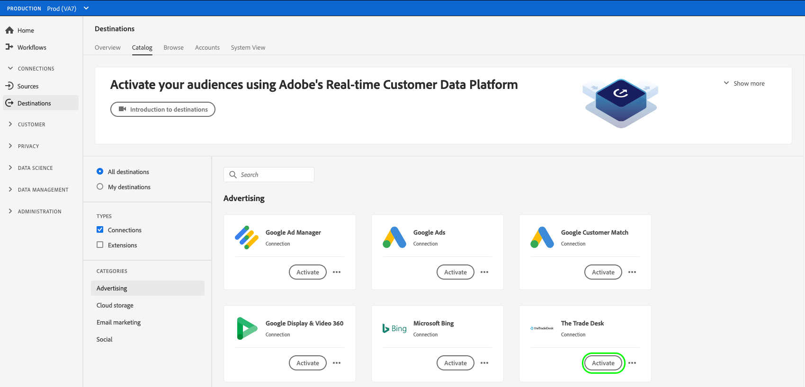
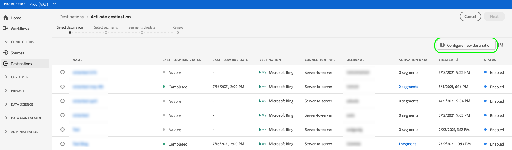

# Crear una nueva conexión de destino

>[!IMPORTANT]
> 
>* Para conectarse a un destino, necesita los **[!UICONTROL permisos de control de acceso]** de Ver destinos **[!UICONTROL y]** Administrar destinos5}. Lea la [descripción general del control de acceso](/help/access-control/ui/overview.md) o póngase en contacto con el administrador del producto para obtener los permisos necesarios.
>* Para conectarse a un destino que admita exportaciones de conjuntos de datos, necesita los **[!UICONTROL permisos Ver destinos]** y **[!UICONTROL Administrar y activar destinos de conjuntos de datos]** [permisos de control de acceso](/help/access-control/home.md#permissions). Lea la [descripción general del control de acceso](/help/access-control/ui/overview.md) o póngase en contacto con el administrador del producto para obtener los permisos necesarios.

## Información general {#overview}

Para poder enviar datos de audiencia a un destino, debe configurar una conexión con la plataforma de destino. Este artículo muestra cómo configurar una nueva conexión de destino a la que puede activar audiencias o exportar conjuntos de datos mediante la interfaz de usuario de Adobe Experience Platform.

## Buscar el destino deseado en el catálogo {#setup}

1. Vaya a **[!UICONTROL Conexiones]** > **[!UICONTROL Destinos]** y seleccione la ficha **[!UICONTROL Catálogo]**.

   

2. Las tarjetas de destino del catálogo pueden tener diferentes controles de acción, en función de si tiene una conexión existente con el destino y de si los destinos admiten la activación de audiencias y la exportación de conjuntos de datos, o ambos. Puede ver cualquiera de los siguientes controles para las tarjetas de destino:

   * **[!UICONTROL Configurado]**. Primero debe configurar una conexión con este destino para poder activar audiencias o exportar conjuntos de datos.
   * **[!UICONTROL Activar]**. Ya se ha configurado una conexión con este destino. Este destino admite la activación de audiencias y exportaciones de conjuntos de datos.
   * **[!UICONTROL Activar audiencias]**. Ya se ha configurado una conexión con este destino. Este destino solo admite la activación de audiencias.

   Para obtener más información sobre la diferencia entre estos controles, también puede consultar la sección [Catálogo](../ui/destinations-workspace.md#catalog) de la documentación del área de trabajo de destino.

   Seleccione **[!UICONTROL Configurar]**, **[!UICONTROL Activar]** o **[!UICONTROL Activar audiencias]**, según el control que esté disponible.

   

   

3. Si seleccionó **[!UICONTROL Configurar]**, vaya al paso siguiente para [autenticar](#authenticate) en el destino.

   Si seleccionó **[!UICONTROL Activar]**, **[!UICONTROL Activar audiencias]** o **[!UICONTROL Exportar conjuntos de datos]**, ahora podrá ver una lista de las conexiones de destino existentes.

   Seleccione **[!UICONTROL Configurar nuevo destino]** para establecer una nueva conexión con el destino.

   

## Autenticarse en el destino {#authenticate}

>[!CONTEXTUALHELP]
>id="platform_destinations_account_name"
>title="Nombre de la cuenta"
>abstract="Escriba un nombre que le ayude a identificar fácilmente esta cuenta de destino en el futuro. Esto resulta especialmente útil si tiene varias conexiones al mismo tipo de destino."

El primer paso para conectarse a un destino es autenticarse en la plataforma de destino.

Según el destino al que se esté conectando, es posible que se le dirija a la página del socio de destino para autenticarse, o que se le pida que introduzca las credenciales de autenticación directamente en el flujo de trabajo de Experience Platform. A continuación se muestra un ejemplo de la entrada requerida para autenticarse en un destino [!DNL Amazon S3]. En cada página de documentación de destino se proporcionan instrucciones detalladas acerca de la entrada necesaria (vea, por ejemplo, la sección de autenticación de [[!DNL Amazon S3]](/help/destinations/catalog/cloud-storage/amazon-s3.md#authenticate) y [[!DNL Facebook]](/help/destinations/catalog/social/facebook.md#authenticate)).

Se requieren **[!DNL Amazon S3]y parámetros de autenticación opcionales**

## Configurar parámetros de conexión {#set-up-connection-parameters}

Si ya ha configurado la autenticación en el destino, puede continuar con la cuenta existente o puede configurar una nueva cuenta.

Según el destino al que se conecte, es posible que se le pida que introduzca distintos tipos de parámetros de conexión. Por ejemplo, al conectarse a un destino [!DNL Amazon S3], se le pide que proporcione detalles sobre el nombre del contenedor [!DNL Amazon S3] y la ruta de acceso a la carpeta donde se depositarán los archivos. A continuación se muestran dos ejemplos de entradas necesarias para un destino [!DNL Amazon S3] y un destino [!DNL Trade Desk]. En cada página de documentación de destino se proporcionan instrucciones detalladas sobre la entrada requerida.

>[!IMPORTANT]
>
>Las siguientes imágenes se utilizan únicamente con fines ilustrativos. Los detalles de conexión de destino varían entre destinos. Para obtener información detallada sobre los detalles de conexión de su destino, lea la sección **Conectarse al destino** en cada página de [catálogo de destino](../catalog/overview.md) (por ejemplo, [[!DNL Google Customer Match]](../catalog/advertising/google-customer-match.md#connect), [[!DNL Trade Desk]](/help/destinations/catalog/advertising/tradedesk.md#connect) o [[!DNL Amazon S3]](/help/destinations/catalog/cloud-storage/amazon-s3.md#destination-details)).

**[!DNL Amazon S3]parámetros de entrada opcionales y requeridos**

**[!DNL The Trade Desk]parámetros de entrada opcionales y requeridos**

### Configurar las opciones de formato de archivo para los archivos exportados {#file-formatting-and-compression-options}

Para los destinos basados en archivos, puede configurar varias opciones relacionadas con el formato y la compresión de los archivos exportados. Para obtener más información acerca de todas las opciones de formato y compresión disponibles, lea el [tutorial Configurar opciones de formato de archivo para destinos basados en archivos](/help/destinations/ui/batch-destinations-file-formatting-options.md).

### Configurar la conexión de destino para la activación de audiencias, la activación de cuentas, la activación de clientes potenciales o las exportaciones de conjuntos de datos {#segment-activation-or-dataset-exports}

Algunos destinos basados en archivos admiten la activación de audiencias a clientes conocidos, clientes de cuenta o clientes potenciales, así como exportaciones de conjuntos de datos. Para esos destinos, puede elegir si desea crear una conexión que le permita [activar audiencias](/help/destinations/ui/activate-batch-profile-destinations.md), [cuentas](/help/destinations/ui/activate-account-audiences.md), [clientes potenciales](/help/destinations/ui/activate-prospect-audiences.md) o [exportar conjuntos de datos](/help/destinations/ui/export-datasets.md).

>[!WARNING]
>
>Al exportar conjuntos de datos, tenga en cuenta que las exportaciones a archivos JSON solo se admiten en modo comprimido. Se admiten las exportaciones a [!DNL Parquet] archivos en los modos comprimido y sin comprimir.

### Habilitar alertas de destino {#enable-alerts}

1. (Opcional) Seleccione las alertas de flujo de datos de destino a las que desee suscribirse. Puede suscribirse a alertas al crear un flujo de datos para recibir mensajes de alerta sobre el estado, el éxito o el error de la ejecución del flujo. Las alertas disponibles difieren según el tipo de destino (basado en archivos o de flujo continuo) al que se conecte. Lea [Suscribirse a alertas de destino en contexto](alerts.md) para obtener información detallada sobre las alertas de flujo de datos de destino.

   

2. Seleccione **[!UICONTROL Siguiente]**.

   

## Seleccionar acciones de marketing {#select-marketing-actions}

1. Seleccione las acciones de marketing aplicables a los datos que desea exportar al destino. Las acciones de marketing indican la intención con la que se exportarán los datos al destino. Puede seleccionar entre las acciones de marketing definidas por Adobe o crear su propia acción de marketing. Para obtener más información acerca de las acciones de marketing, consulte la página [descripción general de las políticas de uso de datos](../../data-governance/policies/overview.md).

   

2. Seleccione **[!UICONTROL Guardar y salir]** para guardar la configuración de destino o seleccione **[!UICONTROL Siguiente]** para continuar con los datos de audiencia [flujo de activación](activation-overview.md).

## Pasos siguientes {#next-steps}

Al leer este documento, ha aprendido a utilizar la interfaz de usuario de Experience Platform para establecer una conexión con un destino. Como recordatorio, los parámetros de conexión disponibles y requeridos varían de un destino a otro. También debería consultar la página de documentación de destino en el [catálogo de destinos](/help/destinations/catalog/overview.md) para obtener información específica acerca de las entradas requeridas y las opciones disponibles por tipo de destino.

A continuación, puede [activar audiencias](/help/destinations/ui/activation-overview.md) o [exportar conjuntos de datos](/help/destinations/ui/export-datasets.md) a su destino.