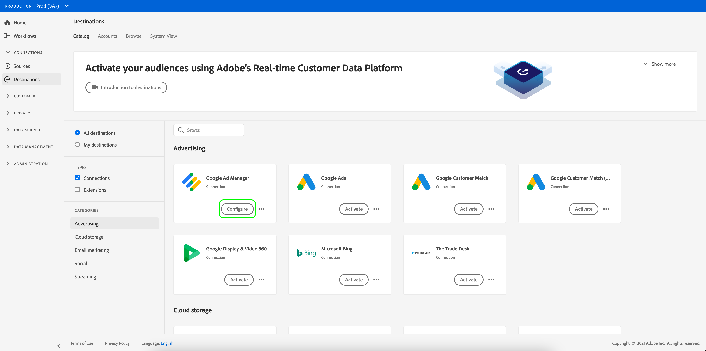

# Conectarse a un destino

Siga los pasos a continuación para conectarse a un destino en Adobe Experience Platform:

1. Inicie sesión en la [IU del Experience Platform](https://platform.adobe.com/) y seleccione **[!UICONTROL Destinations]** en la barra de navegación izquierda.

   

2. En la pestaña [[!UICONTROL Catalog]](./destinations-workspace.md#catalog), seleccione el destino al que desea conectarse.

3. Seleccione **[!UICONTROL Configure]** para iniciar el asistente de conexión de destino.

   

   >[!NOTE]
   >
   >Si existe una conexión con un destino, puede ver un botón **[!UICONTROL Activate]** en la tarjeta de destino. Para obtener más información sobre la diferencia entre **[!UICONTROL Activate]** y **[!UICONTROL Configure]**, consulte la sección [Catalog](../ui/destinations-workspace.md#catalog) de la documentación del espacio de trabajo de destino.

4. Consulte [Descripción general del catálogo de destinos](../catalog/overview.md) para obtener instrucciones sobre cómo conectar con tipos de destinos específicos.

5. Si lo desea, vea el siguiente vídeo para obtener información general sobre cómo conectar con un destino y activar segmentos para él.

   >[!VIDEO](https://video.tv.adobe.com/v/29710?quality=12)
