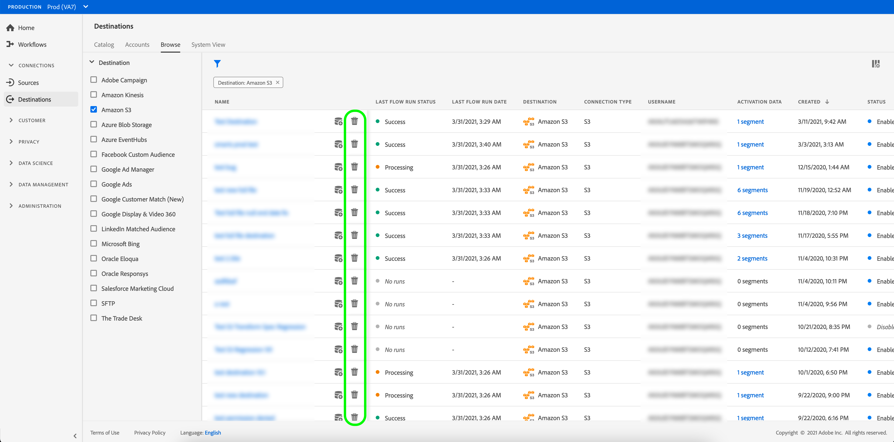

# Eliminar destinos {#delete-destinations}

## Información general {#overview}

En la interfaz de usuario de Adobe Experience Platform, puede eliminar las conexiones existentes con los destinos.

Al eliminar un destino, se eliminan los flujos de datos existentes en ese destino. Todas las audiencias activadas en los destinos que elimine se desasignan antes de que se elimine el flujo de datos.

Existen dos maneras de eliminar destinos de [!DNL Platform] [!DNL UI]. Puede hacer lo siguiente:

* [Eliminar destinos de la ficha [!UICONTROL Examinar]](#delete-browse-tab)
* [Eliminar destinos de la página de detalles de destino](#delete-destination-details-page)

## Eliminar destinos de la pestaña Examinar{#delete-browse-tab}

Siga los pasos a continuación para eliminar un destino de la ficha [!UICONTROL Examinar].

1. Inicie sesión en la [interfaz de usuario del Experience Platform](https://platform.adobe.com/) y seleccione **[!UICONTROL Destinos]** en la barra de navegación izquierda. Para ver los destinos existentes, selecciona **[!UICONTROL Examinar]** en el encabezado superior.

   

2. Seleccione el icono de filtro  en la parte superior izquierda para iniciar el panel de ordenación. El panel de ordenación proporciona una lista de todos sus destinos. Puede seleccionar más de un destino de la lista para ver una selección filtrada de flujos de datos asociados al destino seleccionado.

   

3. Seleccione el botón  en la columna Nombre y, a continuación, seleccione  **[!UICONTROL Eliminar]** para eliminar una conexión de destino existente.
   

4. Seleccione **[!UICONTROL Eliminar]** para confirmar la eliminación de la conexión de destino.

   

## Eliminar destinos de la página de detalles de destino{#delete-destination-details-page}

Siga los pasos a continuación para eliminar un destino de la página de detalles de destino.

1. Inicie sesión en la [interfaz de usuario del Experience Platform](https://platform.adobe.com/) y seleccione **[!UICONTROL Destinos]** en la barra de navegación izquierda. Para ver los destinos existentes, selecciona **[!UICONTROL Examinar]** en el encabezado superior.

   

2. Seleccione el icono de filtro  en la parte superior izquierda para iniciar el panel de ordenación. El panel de ordenación proporciona una lista de todos sus destinos. Puede seleccionar más de un destino de la lista para ver una selección filtrada de flujos de datos asociados al destino seleccionado.

   

3. Seleccione el nombre del destino que desea eliminar.

   

   * Si el destino tiene flujos de datos existentes, se le redirigirá a la ficha [!UICONTROL Ejecuciones de flujo de datos].

     

   * Si el destino no tiene flujos de datos existentes, se le redirige a una página vacía en la que puede empezar a activar audiencias.

     

4. Seleccione **[!UICONTROL Delete]** en el carril derecho.

   

5. Seleccione **[!UICONTROL Eliminar]** en el cuadro de diálogo de confirmación para eliminar el destino.

   

   >[!NOTE]
   >
   >Según la carga del servidor, [!DNL Platform] puede tardar unos minutos en eliminar el destino.
