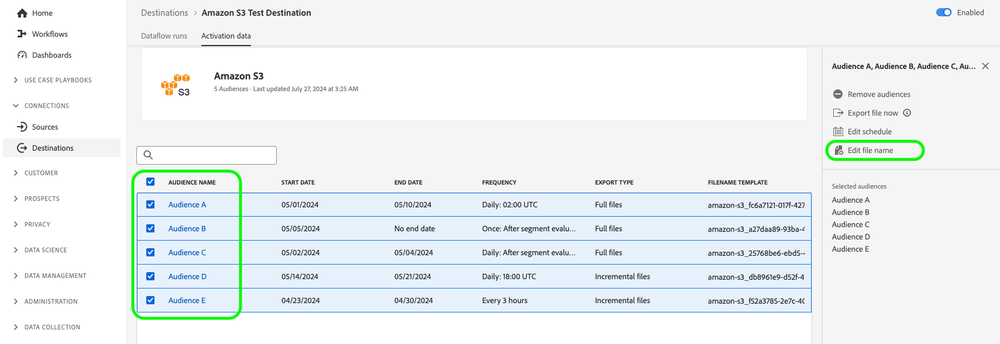

# Ver detalles de destino

## Información general {#overview}

En la interfaz de usuario de Adobe Experience Platform, puede ver y monitorizar los atributos y las actividades de sus destinos. Estos detalles incluyen el nombre y el ID del destino, controles para activar o desactivar los destinos, etc. Los detalles también incluyen métricas para registros de perfil activados, identidades activadas, fallidas y excluidas, y un historial de ejecuciones de flujo de datos.

>[!NOTE]
>
>La página de detalles de destinos forma parte del área de trabajo [!UICONTROL Destinos] en [!DNL Platform] [!DNL UI]. Consulte la [[!UICONTROL Descripción general del área de trabajo de destinos]](./destinations-workspace.md) para obtener más información.

## Ver detalles de destino {#view-details}

Siga los pasos a continuación para ver más detalles sobre un destino existente. Puede averiguar el ID de destino de un destino, el usuario que lo creó, cuándo se creó y otra información.

1. Inicie sesión en la [interfaz de usuario del Experience Platform](https://platform.adobe.com/) y seleccione **[!UICONTROL Destinos]** en la barra de navegación izquierda. Seleccione **[!UICONTROL Examinar]** en el encabezado superior para ver los destinos existentes.

   

2. Seleccione el icono de filtro  en la parte superior izquierda para iniciar el panel de ordenación. El panel de ordenación proporciona una lista de todos sus destinos. Puede seleccionar más de un destino de la lista para ver una selección filtrada de flujos de datos asociados al destino seleccionado.

   

3. Seleccione la fila del destino para el que desea que aparezca más información. Esto abre un carril derecho con información sobre el destino, incluido el ID de destino, el usuario que creó la conexión de destino y otra información.

   

4. También puede mostrar otra información sobre el destino seleccionando *el nombre del destino* que desea ver.

   

5. La página de detalles del destino aparece en el carril derecho, con sus controles disponibles.

   

## Carril derecho {#right-rail}

El carril derecho muestra información básica sobre el destino seleccionado.

La siguiente tabla recoge los controles y detalles proporcionados por el carril derecho:

| Elemento del carril derecho | Descripción |
| --- | --- |
| [!UICONTROL Activar audiencias] | Seleccione este control para editar qué audiencias se asignan al destino, actualizar las programaciones de exportación o añadir y eliminar atributos e identidades asignados. Consulte las guías sobre [activación de datos de audiencia a destinos de flujo continuo de audiencia](./activate-segment-streaming-destinations.md), [activación de datos de audiencia a destinos basados en perfiles por lotes](./activate-batch-profile-destinations.md) y [activación de datos de audiencia a destinos basados en perfiles de flujo](./activate-streaming-profile-destinations.md) para obtener más información. |
| [!UICONTROL Eliminar] | Permite eliminar este flujo de datos y desasigna las audiencias que se activaron anteriormente, si las hay. |
| [!UICONTROL Nombre de destino] | Este campo se puede editar para actualizar el nombre del destino. |
| [!UICONTROL Descripción] | Este campo se puede editar para actualizar o añadir una descripción opcional al destino. |
| [!UICONTROL Destino] | Representa la plataforma de destino a la que se envían las audiencias. Consulte el [catálogo de destinos](../catalog/overview.md) para obtener más información. |
| [!UICONTROL Estado] | Indica si el destino está habilitado o deshabilitado. |
| [!UICONTROL Acciones de marketing] | Indica las acciones de marketing (casos de uso) que se aplican a este destino con fines de control de datos. |
| [!UICONTROL Categoría] | Indica el tipo de destino. Consulte el [catálogo de destinos](../catalog/overview.md) para obtener más información. |
| [!UICONTROL Tipo de conexión] | Indica el formulario mediante el cual las audiencias se envían al destino. Los valores posibles incluyen [!UICONTROL Cookie] y [!UICONTROL Basado en perfil]. |
| [!UICONTROL Frecuencia] | Indica la frecuencia con la que las audiencias se envían al destino. Los valores posibles incluyen [!UICONTROL Transmisión] y [!UICONTROL Lote]. |
| [!UICONTROL Identidad] | Representa el área de nombres de identidad aceptado por el destino, como `GAID`, `IDFA` o `email`. Para obtener más información sobre áreas de nombres de identidad aceptadas, vea la [descripción general del área de nombres de identidad](../../identity-service/features/namespaces.md). |
| [!UICONTROL Creado por] | Indica el usuario que creó este destino. |
| [!UICONTROL Creado] | Indica la fecha y hora UTC en que se creó este destino. |

{style="table-layout:auto"}

## Conmutador [!UICONTROL Enabled]/[!UICONTROL Disabled] {#enabled-disabled-toggle}

Puede usar la opción **[!UICONTROL Habilitado]/[!UICONTROL Deshabilitado]** para iniciar y pausar todas las exportaciones de datos al destino.

## [!UICONTROL Ejecuciones de flujo de datos] {#dataflow-runs}

La ficha [!UICONTROL Ejecuciones de flujo de datos] proporciona datos de métricas sobre las ejecuciones de flujo de datos a destinos por lotes y de flujo continuo. Consulte [Supervisar flujos de datos](monitor-dataflows.md) para obtener detalles y definiciones de métricas.

>[!NOTE]
>
>* Actualmente, la funcionalidad de supervisión de destinos es compatible con todos los destinos del Experience Platform *excepto*: [Adobe Target](/help/destinations/catalog/personalization/adobe-target-connection.md), [Personalización personalizada](/help/destinations/catalog/personalization/custom-personalization.md) y [Audiencias de Experience Cloud](/help/destinations/catalog/adobe/experience-cloud-audiences.md).
>* Para los destinos [Amazon Kinesis](/help/destinations/catalog/cloud-storage/amazon-kinesis.md), [Azure Event Hubs](/help/destinations/catalog/cloud-storage/azure-event-hubs.md) y [HTTP API](/help/destinations/catalog/streaming/http-destination.md), se estiman las métricas relacionadas con identidades excluidas, con errores y activadas. Los volúmenes más altos de datos de activación conducen a una mayor precisión de las métricas.

### Duración de ejecuciones de flujo de datos {#dataflow-runs-duration}

Hay una diferencia en la duración mostrada de las ejecuciones de flujo de datos entre los destinos de flujo continuo y los basados en archivos.

### Destinos de streaming {#streaming}

Aunque la **[!UICONTROL duración de procesamiento]** indicada para la mayoría de las ejecuciones de flujo de datos de streaming es de unas cuatro horas, como se muestra en la imagen siguiente, el tiempo de procesamiento real de cualquier ejecución de flujo de datos es mucho más corto. Las ventanas de ejecución de flujo de datos permanecen abiertas durante más tiempo en el caso de que el Experience Platform necesite volver a intentar realizar llamadas al destino y también asegurarse de que no se pierda ningún dato que llegue tarde para la misma ventana de tiempo.

Para obtener más información, lea acerca de [ejecuciones de flujo de datos a destinos de flujo continuo](/help/dataflows/ui/monitor-destinations.md#dataflow-runs-for-streaming-destinations) en la documentación de supervisión.

### Destinos basados en archivos {#file-based}

Para que el flujo de datos se ejecute en destinos basados en archivos, la **[!UICONTROL duración del procesamiento]** depende del tamaño de los datos que se exportan y de la carga del sistema. Tenga en cuenta también que el flujo de datos se ejecuta en destinos basados en archivos y se desglosa por audiencia.

Para obtener más información, lea acerca de [las ejecuciones de flujo de datos a destinos por lotes (basados en archivos)](/help/dataflows/ui/monitor-destinations.md#dataflow-runs-for-batch-destinations) en la documentación de supervisión.

## [!UICONTROL Datos de activación] {#activation-data}

La pestaña **[!UICONTROL Datos de activación]** muestra una lista de audiencias que se han asignado al destino, incluidas su fecha de inicio y finalización (si corresponde), y otra información relevante para la exportación de datos, como el tipo de exportación, la programación y la frecuencia. Para ver los detalles de una audiencia determinada, seleccione su nombre en la lista.

>[!TIP]
>
>Para ver y editar los detalles sobre los atributos y las identidades asignados a un destino, seleccione **[!UICONTROL Activar audiencias]** en el [carril derecho](#right-rail).

>[!BEGINSHADEBOX]

Ficha **[!UICONTROL Datos de activación]** para un destino basado en archivos.

>[!ENDSHADEBOX]

>[!BEGINSHADEBOX]

Ficha **[!UICONTROL Datos de activación]** para un destino de flujo continuo.

>[!ENDSHADEBOX]

### Filtrar audiencias activadas {#filter-audiences}

Para filtrar por la lista de audiencias activadas en un destino, introduzca un nombre de audiencia en el cuadro de búsqueda. La lista de audiencias se actualiza automáticamente con los resultados de búsqueda.

### Eliminar varias audiencias de los flujos de activación {#bulk-remove}

Para quitar varias audiencias de los flujos de activación existentes, selecciónelas y, a continuación, seleccione **[!UICONTROL Quitar audiencias]**.

### Exportar varios archivos bajo demanda a destinos por lotes {#bulk-export}

Puede [exportar varios archivos bajo demanda](../ui/export-file-now.md) desde la página de **[!UICONTROL datos de activación]**. Para ello, seleccione las audiencias para las que desea exportar archivos bajo demanda y seleccione el control **[!UICONTROL Exportar archivo ahora]** para almacenar en déclencheur una exportación única que enviará un archivo para cada audiencia seleccionada a su destino de lote.

### Editar programaciones de activación para varias audiencias exportadas a destinos por lotes {#bulk-edit-schedule}

Para editar la programación de activación existente de varias audiencias al mismo tiempo, seleccione las audiencias que desee y luego seleccione **[!UICONTROL Editar programación]**. Para obtener información detallada sobre cómo definir o editar una programación de exportación, lea la sección [exportación de audiencia de programación](../ui/activate-batch-profile-destinations.md#scheduling).

>[!NOTE]
>
>Para obtener más información sobre cómo explorar la página de detalles de una audiencia, consulte la [descripción general de Audience Portal](../../segmentation/ui/audience-portal.md#segment-details).

### Editar nombres de archivo para varias audiencias exportadas a destinos por lotes {#bulk-edit-file-names}

Para editar los nombres de archivo exportados de varias audiencias al mismo tiempo, seleccione las audiencias que desee y, a continuación, seleccione **[!UICONTROL Editar nombre de archivo]**. Para obtener información detallada sobre cómo definir o editar un nombre de archivo, lea la sección sobre cómo [configurar nombres de archivo](../ui/activate-batch-profile-destinations.md#configure-file-names).

