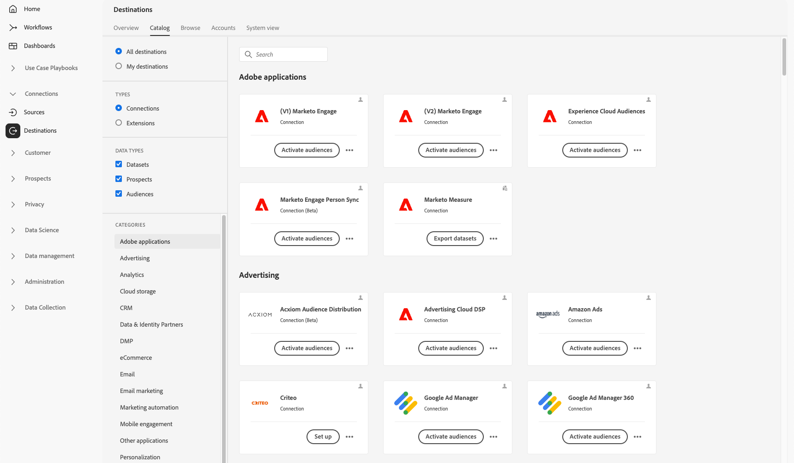

# Espacio de trabajo Destinos {#destinations-workspace}

En Adobe Experience Platform, seleccione **[!UICONTROL Destinos]** desde la barra de navegación izquierda para acceder a [!UICONTROL Destinos] workspace.

El [!UICONTROL Destinos] espacio de trabajo consta de cinco secciones, [!UICONTROL Información general], [!UICONTROL Catálogo], [!UICONTROL Examinar], [!UICONTROL Cuentas], y [!UICONTROL Vista del sistema], tal y como se describe en las secciones siguientes.

## Información general de  {#overview}

El **[!UICONTROL Información general]** muestra la pestaña [!UICONTROL Destinos] , que proporciona métricas clave relacionadas con los datos de destino de su organización. Para obtener más información, visite la [[!UICONTROL Destinos] guía de panel](../../dashboards/guides/destinations.md).

>[!NOTE]
>
>Si su organización es nueva en Experience Platform y aún no tiene destinos activos, la variable [!UICONTROL Destinos] panel y [!UICONTROL Información general] no son visibles. En su lugar, seleccione [!UICONTROL Destinos] desde la navegación izquierda se muestra el [[!UICONTROL Catálogo] pestaña](#catalog).

## [!UICONTROL Catálogo] {#catalog}

El **[!UICONTROL Catálogo]** La pestaña muestra una lista de todos los destinos disponibles en [!DNL Platform], a los que puede enviar datos.

El [!DNL Platform] La interfaz de usuario de proporciona varias opciones de búsqueda y filtro en la página del catálogo de destinos:

* Utilice la funcionalidad de búsqueda de la página para localizar un destino específico.
* Filtrar destinos utilizando [!UICONTROL Categorías] control.
* Alternar entre [!UICONTROL Todos los destinos] y [!UICONTROL Mis destinos]. Al seleccionar **[!UICONTROL Todos los destinos]**, todos disponibles [!DNL Platform] se muestran los destinos. Al seleccionar **[!UICONTROL Mis destinos]**, solo puede ver los destinos con los que ha establecido una conexión.
* Seleccione para ver la **[!UICONTROL Conexiones]** y/o **[!UICONTROL Extensiones]** tipos. Para entender la diferencia entre las dos categorías, lea [Tipos y categorías de destino](../destination-types.md).

Las tarjetas de destino contienen opciones de control principales y secundarias. Los controles principales incluyen [!UICONTROL Configuración de], [!UICONTROL Activar], [!UICONTROL Activar audiencias], o [!UICONTROL Exportar conjuntos de datos]. Los controles secundarios permiten ver las opciones. Estos controles se describen a continuación:

| Control | Descripción |
|---------|----------|
| [!UICONTROL Configuración de] | Permite crear una conexión con el destino. |
| [!UICONTROL Activar] | Una vez establecida una conexión con el destino, puede activar audiencias o exportar conjuntos de datos a este destino. |
| [!UICONTROL Activar audiencias] | Una vez establecida una conexión con el destino, puede activar audiencias en este destino. |
| [!UICONTROL Exportar conjuntos de datos] | Una vez establecida una conexión con el destino, puede exportar conjuntos de datos a este destino. |
| [!UICONTROL Ver cuenta] | Ver las cuentas que ha conectado para un destino. |
| [!UICONTROL Ver flujos de datos] | Vea los flujos de activación de datos que existen para un destino. |
| [!UICONTROL Ver documentación] | Abre un vínculo a la página de documentación de ese destino específico, para obtener más información y para ayudarle a configurarlo. |

{style="table-layout:auto"}

Seleccione una tarjeta de destino en el catálogo para abrir el carril derecho. Aquí puede ver una descripción del destino. El carril derecho proporciona los mismos controles descritos en la tabla anterior, incluida una descripción del destino e indicación de la categoría y el tipo de destino.

Para obtener más información sobre las categorías de destino e información sobre cada destino, consulte la [Catálogo de destino](../catalog/overview.md) y [Tipos y categorías de destino](../destination-types.md).

## [!UICONTROL Cuentas] {#accounts}

El **[!UICONTROL Cuentas]** La pestaña muestra detalles acerca de las conexiones que ha establecido con varios destinos y le permite actualizar o eliminar detalles de la cuenta existente. Consulte la tabla siguiente para obtener toda la información que puede obtener sobre cada cuenta de destino.

>[!TIP]
>
> * Seleccione los puntos suspensivos (`...`) en el [!UICONTROL Plataforma] y utilice la columna **[!UICONTROL Activar ]**/**[!UICONTROL  Activar audiencias ]**/**[!UICONTROL  Exportar conjuntos de datos ]**para exportar audiencias o conjuntos de datos a ese destino.
> * Seleccione los puntos suspensivos (`...`) en el [!UICONTROL Plataforma] y utilice la columna **[!UICONTROL Editar detalles ]**control a [actualizar](update-accounts.md) los detalles de una cuenta de destino existente.
> * Seleccione los puntos suspensivos (`...`) en el [!UICONTROL Plataforma] y utilice la columna **[!UICONTROL Eliminar ]**control a [eliminar](delete-destination-account.md) una cuenta de destino existente.

| Elemento | Descripción |
|---|---|
| [!UICONTROL Plataforma] | El destino para el que ha configurado la conexión. |
| [!UICONTROL Tipo de conexión] | Representa el tipo de conexión de cuenta al espacio de almacenamiento o destino. Según el destino, las opciones de autenticación son: <ul><li>Para destinos de marketing por correo electrónico: puede ser S3, FTP o Azure Blob.</li><li>Para destinos de publicidad en tiempo real: de servidor a servidor</li><li>Para destinos de almacenamiento en la nube de Amazon S3: clave de acceso </li><li>Para destinos de almacenamiento en la nube SFTP: autenticación básica para SFTP.</li><li>Autenticación OAuth 1 u OAuth 2</li><li>Autenticación de token de portador</li></ul> |
| [!UICONTROL Nombre de usuario] | El nombre de usuario seleccionado en la [conectar asistente de destino](../catalog/email-marketing/overview.md#connect-destination). |
| [!UICONTROL Destinos] | Representa el número de flujos de datos de destino únicos correctos conectados con información básica creada para un destino. |
| [!UICONTROL Autorizado] | La fecha en la que se autorizó la conexión con este destino. |

{style="table-layout:auto"}

## [!UICONTROL Examinar] {#browse}

El **[!UICONTROL Examinar]** La pestaña muestra los destinos con los que se ha establecido una conexión. Destinos con **[!UICONTROL Activado/Desactivado]** alternar activado establezca el destino en activo o inactivo, respectivamente. También puede ver los destinos en los que tiene flujos de datos seleccionando **[!UICONTROL Audiencias]** > **[!UICONTROL Examinar]** y seleccionar una audiencia para inspeccionar. Consulte la tabla siguiente para obtener toda la información proporcionada sobre cada destino en la [!UICONTROL Examinar] pestaña:

>[!TIP]
>
> * Seleccione los puntos suspensivos (`...`) en el [!UICONTROL Nombre] y utilice la columna **[!UICONTROL Activar ]**para exportar audiencias o conjuntos de datos a ese destino.
> * Seleccione los puntos suspensivos (`...`) en el [!UICONTROL Nombre] y utilice la columna **[!UICONTROL Eliminar ]**control a [quitar](delete-destinations.md) una conexión existente con un destino.
> * Seleccione los puntos suspensivos (`...`) en el [!UICONTROL Nombre] y utilice la columna **[!UICONTROL Ver en monitorización ]**para ver la información de activación de este destino en la [panel de monitorización](/help/dataflows/ui/monitor-destinations.md#monitoring-destinations-dashboard).
> * Seleccione los puntos suspensivos (`...`) en el [!UICONTROL Nombre] y utilice la columna **[!UICONTROL Suscribirse a alertas ]**para suscribirse a las alertas del flujo de datos de destino. Puede suscribirse a alertas para recibir mensajes sobre el estado, el éxito o el error de la ejecución del flujo. Consulte [Suscribirse a alertas de destino en contexto](alerts.md) para obtener información detallada sobre las alertas de flujo de datos de destino.

| Elemento | Descripción |
|---------|----------|
| Nombre | El nombre proporcionado para el flujo de activación a este destino. La misma columna incluye dos controles: [!UICONTROL Activar] y [!UICONTROL Eliminar destino]. |
| [!UICONTROL Último estado de ejecución de flujo] | El estado de la última ejecución del flujo de datos. Consulte [Ver detalles de destino](destination-details-page.md) para obtener más información sobre las ejecuciones de flujo de datos. |
| [!UICONTROL Fecha de última ejecución de flujo] | Fecha y hora en la que se produjo la última ejecución del flujo de datos. Consulte [Ver detalles de destino](destination-details-page.md) para obtener más información sobre las ejecuciones de flujo de datos. |
| [!UICONTROL Destino] | La plataforma de destino seleccionada para el flujo de activación. |
| [!UICONTROL Tipo de conexión] | Representa el tipo de conexión a su espacio de almacenamiento o destino. <ul><li>Para destinos de marketing por correo electrónico: puede ser S3, FTP o [!DNL Azure Blob].</li><li>Para destinos de publicidad en tiempo real: de servidor a servidor.</li><li>Para destinos de flujo continuo: Puede ser [!DNL Azure Event Hubs] o [!DNL Amazon Kinesis].</li></ul> |
| [!UICONTROL Nombre de usuario] | Las credenciales de cuenta seleccionadas para el flujo de destino. |
| [!UICONTROL Datos de activación] | Indica la cantidad de audiencias que se están activando en este destino. Seleccione este control para obtener más información sobre las audiencias activadas. Consulte [Datos de activación](/help/destinations/ui/destination-details-page.md#activation-data) en la página de detalles de destino para obtener más información sobre las audiencias activadas. |
| [!UICONTROL Creado] | La fecha y la hora en formato UTC en que se creó el flujo de activación al destino. Seleccione el símbolo de flecha arriba/abajo para ordenar los flujos de activación por el más reciente primero o el más antiguo primero. |
| [!UICONTROL Estado] | `Enabled` o `Disabled`. Indica si los datos se están activando en este destino. |

Haga clic en una fila de destino para que aparezca más información sobre el destino en el carril derecho, como el ID de destino, la descripción, el número de audiencias activadas, etc.

Seleccione el nombre del destino para ver información sobre las audiencias activadas en este destino. Clic **[!UICONTROL Editar activación]** para modificar o añadir audiencias que se envían a este destino.

## [!UICONTROL Vista del sistema] {#system-view}

El **[!UICONTROL Vista del sistema]** La pestaña muestra una representación gráfica de los flujos de activación que ha configurado en Adobe Experience Platform.

Seleccione cualquier destino mostrado en la página y haga clic en **[!UICONTROL Ver flujos de datos]** para ver información sobre todas las conexiones configuradas para cada destino.

