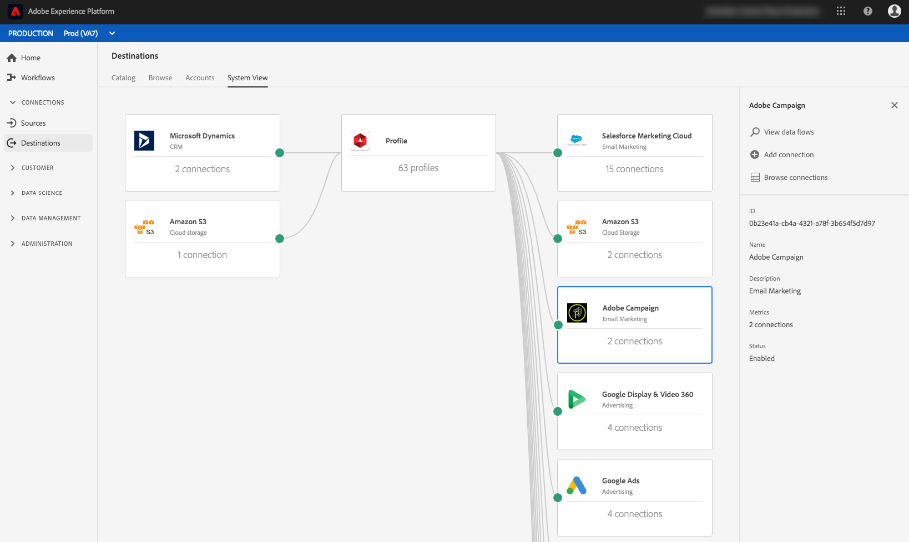

# Espacio de trabajo Destinos {#destinations-workspace}

En la plataforma de datos del cliente en tiempo real, seleccione **[!UICONTROL Destinos]** en la barra de navegación izquierda para acceder al espacio de trabajo [!UICONTROL Destinos] .

El espacio de trabajo [!UICONTROL Destinos] consta de cuatro secciones, [!UICONTROL Catálogo], [!UICONTROL Examinar], [!UICONTROL Cuentas]y Vista [!UICONTROL del sistema], que se describen en las secciones siguientes.

## [!UICONTROL Catálogo] {#catalog}

La ficha **[!UICONTROL Catálogo]** muestra una lista de todos los destinos disponibles en CDP en tiempo real a los que puede enviar datos.

La interfaz de usuario de CDP en tiempo real proporciona una serie de opciones de búsqueda y filtro en la página del catálogo de destinos:

* Utilice la funcionalidad de búsqueda de la página para localizar un destino específico.
* Filtre los destinos mediante el control de [!UICONTROL Categorías] .
* Alternar entre [!UICONTROL Todos los destinos] y [!UICONTROL Mis destinos]. Cuando se selecciona **[!UICONTROL Todos los destinos]** , se muestran todos los destinos CDP disponibles en tiempo real. Cuando se selecciona **[!UICONTROL Mis destinos]** , solo puede ver los destinos con los que ha establecido una conexión.
* Seleccione para **[!UICONTROL Conexiones]** de vista y/o **[!UICONTROL Extensiones]**. Para comprender la diferencia entre las dos categorías, consulte Tipos [de destino y Categorías](../destination-types.md).

Las tarjetas de destino contienen un control **[!UICONTROL Configurar]** o **[!UICONTROL Activar]** y un control secundario que muestra más opciones. Todos ellos se describen a continuación:

| Control | Descripción |
---------|----------
| [!UICONTROL Configurar] | Permite crear una conexión con el destino. |
| [!UICONTROL Activar] | Una vez que haya establecido una conexión con el destino, puede activar segmentos. |
| [!UICONTROL Cuenta de vista] | Vista las cuentas que ha conectado para un destino. |
| [!UICONTROL Flujos de datos de vista] | Vista los flujos de activación de datos que existen para un destino. |
| [!UICONTROL Documentación de vista] | Abre un vínculo a la página de documentación de ese destino específico, para obtener más información y ayudarle a configurarla. |

Seleccione una tarjeta de destino en el catálogo para abrir el carril correcto.  Aquí puede ver una descripción del destino. El carril derecho proporciona los mismos controles descritos en la tabla anterior, así como una descripción del destino y una indicación de la categoría y el tipo de destino.

Para obtener más información sobre las categorías de destino e información sobre cada destino, consulte el Catálogo [de](../catalog/overview.md) destino y Tipos y Categorías [de](../destination-types.md)destino.

## [!UICONTROL Cuentas] {#accounts}

En la ficha **[!UICONTROL Cuentas]** , puede obtener más información sobre las conexiones que ha establecido con varios destinos. Consulte la tabla siguiente para obtener toda la información que puede obtener sobre cada destino:

>[!TIP]
>
>Utilice el botón  Añadir datos de la columna **[!UICONTROL Plataforma]** para crear una nueva conexión de destino para esa cuenta.

| Elemento | Descripción |
---------|----------
| [!UICONTROL Plataforma] | Destino para el que ha configurado la conexión. |
| [!UICONTROL Tipo de conexión] | Representa el tipo de conexión con el contenedor o destino de almacenamiento. <ul><li>Para destinos de marketing por correo electrónico: Puede ser S3 o FTP.</li><li>Para destinos de publicidad en tiempo real: Servidor a servidor</li><li>Para destinos de almacenamiento en la nube Amazon S3: Clave de acceso </li><li>Para destinos de almacenamiento en la nube SFTP: Autenticación básica para SFTP</li></ul> |
| [!UICONTROL Nombre de usuario] | Nombre de usuario seleccionado en el asistente [de](../catalog/email-marketing/overview.md#connect-destination)conexión de destino. |
| [!UICONTROL Destinos] | Representa el número de flujos de destino exitosos únicos conectados con la información básica creada para un destino. |
| [!UICONTROL Con autorización] | La fecha en que se autorizó la conexión a este destino. |

Además, puede editar o actualizar la información de su cuenta. Seleccione el botón  Editar cuenta en la columna **[!UICONTROL Plataforma]** para editar la información de la cuenta.

Para las cuentas que utilizan un tipo de `OAuth2` conexión, puede seleccionar **[!UICONTROL Volver a conectar OAuth]** para renovar las credenciales de la cuenta.

En el caso de las cuentas que utilizan un tipo de conexión `Access Key` o `ConnectionString` , puede editar la información de autenticación de la cuenta, incluida información como el ID de acceso, las claves secretas o las cadenas de conexión.

Una vez que haya terminado de editar los detalles de la cuenta, seleccione **[!UICONTROL Guardar]** para completar la actualización.

## [!UICONTROL Examinar] {#browse}

La ficha **[!UICONTROL Examinar]** muestra los destinos con los que ha establecido una conexión. Los destinos con la opción **[!UICONTROL Habilitado]** activada establecen el destino en activo y viceversa. También puede realizar la vista de los destinos en los que fluyen los datos seleccionando **[!UICONTROL Segmentos]** > **[!UICONTROL Examinar]** y un segmento para inspeccionar. Consulte la tabla siguiente para obtener toda la información proporcionada para cada destino en la ficha Examinar:

>[!TIP]
>
>Utilice el botón  Añadir datos de la columna **[!UICONTROL Nombre]** para activar segmentos adicionales en ese destino.

| Elemento | Descripción |
---------|----------
| Nombre | Nombre proporcionado para el flujo de activación a este destino. |
| [!UICONTROL Destino] | La plataforma de destino seleccionada para el flujo de activación. |
| [!UICONTROL Tipo de conexión] | Representa el tipo de conexión con el contenedor o destino de almacenamiento. <ul><li>Para destinos de marketing por correo electrónico: Puede ser S3 o FTP.</li><li>Para destinos de publicidad en tiempo real: Servidor a servidor</li></ul> |
| [!UICONTROL Nombre de usuario] | Las credenciales de cuenta que ha seleccionado para el flujo de destino. |
| [!UICONTROL Segmentos] | Número de segmentos que se están activando en este destino. |
| [!UICONTROL Creado] | Fecha y hora UTC en que se creó el flujo de activación al destino. |
| [!UICONTROL Estado] | `Active` O bien `Inactive`. Indica si los datos se están activando en este destino. Para editar el estado, consulte [Deshabilitar activación](./activate-destinations.md#disable-activation). |

Haga clic en una fila de destino para ver más información sobre el destino en el carril derecho.

Seleccione el nombre del destino para ver la información sobre los segmentos activados en este destino. Haga clic en **[!UICONTROL Editar activación]** para modificar o agregar los segmentos que se están enviando a este destino.

## [!UICONTROL Vista del sistema] {#system-view}

La ficha Vista **** del sistema muestra una representación gráfica de los flujos de activación que ha configurado en la plataforma de datos del cliente en tiempo real.

Seleccione cualquiera de los destinos que se muestran en la página y pulse los flujos **[!UICONTROL de]** Vista para ver la información sobre todas las conexiones configuradas para cada destino.

