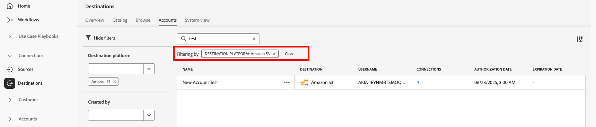

# Espacio de trabajo Destinos {#destinations-workspace}

En Adobe Experience Platform, seleccione **[!UICONTROL Destinos]** en la barra de navegación izquierda para acceder al área de trabajo [!UICONTROL Destinos].

El área de trabajo [!UICONTROL Destinos] consta de cinco secciones, [!UICONTROL Información general], [!UICONTROL Catálogo], [!UICONTROL Examinar], [!UICONTROL Cuentas] y [!UICONTROL Vista del sistema], que se describen en las secciones siguientes.

## [!UICONTROL Información general] {#overview}

La pestaña **[!UICONTROL Información general]** muestra el panel [!UICONTROL Destinos], que proporciona métricas clave relacionadas con los datos de destino de su organización. Para obtener más información, visita la guía de panel [[!UICONTROL Destinos]](../../dashboards/guides/destinations.md).

>[!NOTE]
>
>Si su organización es nueva en Experience Platform y aún no tiene destinos activos, el panel [!UICONTROL Destinos] y la pestaña [!UICONTROL Información general] no están visibles. En su lugar, al seleccionar [!UICONTROL Destinos] en el panel de navegación izquierdo, se muestra la ficha [[!UICONTROL Catálogo]](#catalog).

## [!UICONTROL Catálogo] {#catalog}

La ficha **[!UICONTROL Catálogo]** muestra una lista de todos los destinos disponibles en [!DNL Experience Platform] a los que puede enviar datos.

La interfaz de usuario [!DNL Experience Platform] proporciona varias opciones de búsqueda y filtrado en la página del catálogo de destinos:

* Utilice la funcionalidad de búsqueda de la página para localizar un destino específico.
* Filtrar destinos utilizando el control **[!UICONTROL Categories]**.
* Alternar entre **[!UICONTROL Todos los destinos]** y **[!UICONTROL Mis destinos]**. Al seleccionar **[!UICONTROL Todos los destinos]**, se muestran todos los destinos disponibles [!DNL Experience Platform]. Al seleccionar **[!UICONTROL Mis destinos]**, solo podrá ver los destinos con los que estableció una conexión.
* Seleccione para ver los tipos de **[!UICONTROL Conexiones]** y/o **[!UICONTROL Extensiones]**. Para comprender la diferencia entre las dos categorías, lea [Tipos de destino y Categorías](../destination-types.md).
* Filtre los destinos disponibles según el [tipo de datos](/help/destinations/destination-sdk/functionality/destination-configuration/audience-data-type.md) admitido. Elija entre audiencias de personas, audiencias de cuenta, audiencias de clientes potenciales o exportaciones de conjuntos de datos.

Las tarjetas de destino contienen opciones de control principales y secundarias. Los controles principales incluyen [!UICONTROL Configurar], [!UICONTROL Activar], [!UICONTROL Activar audiencias] o [!UICONTROL Exportar conjuntos de datos]. Los controles secundarios permiten ver las opciones. Estos controles se describen a continuación:

| Control | Descripción |
|---------|----------|
| [!UICONTROL Configurar] | Permite crear una conexión con el destino. |
| [!UICONTROL Activar] | Una vez establecida una conexión con el destino, puede activar audiencias o exportar conjuntos de datos a este destino. |
| [!UICONTROL Activar audiencias] | Una vez establecida una conexión con el destino, puede activar audiencias en este destino. |
| [!UICONTROL Exportar conjuntos de datos] | Una vez establecida una conexión con el destino, puede exportar conjuntos de datos a este destino. |
| [!UICONTROL Ver cuenta] | Ver las cuentas que ha conectado para un destino. |
| [!UICONTROL Ver flujos de datos] | Vea los flujos de activación de datos que existen para un destino. |
| [!UICONTROL Ver documentación] | Abre un vínculo a la página de documentación de ese destino específico, para obtener más información y para ayudarle a configurarlo. |

{style="table-layout:auto"}

Seleccione una tarjeta de destino en el catálogo para abrir el carril derecho. Aquí puede ver una descripción del destino. El carril derecho proporciona los mismos controles descritos en la tabla anterior, incluida una descripción del destino e indicación de la categoría y el tipo de destino.

Para obtener más información sobre las categorías de destino e información sobre cada destino, consulte el [catálogo de destino](../catalog/overview.md) y [tipos y categorías de destino](../destination-types.md).

## [!UICONTROL Examinar] {#browse}

La ficha **[!UICONTROL Examinar]** muestra los destinos con los que ha establecido una conexión.

>[!TIP]
>
> Comience por [buscar en la barra](#search-browse) para encontrar flujos de datos específicos y, a continuación, utilice los [filtros de la barra lateral](#filter-options-browse) para reducir aún más los resultados.

Los destinos con la opción **[!UICONTROL Habilitado/Deshabilitado]** activada establecen el destino en **[!UICONTROL Habilitado]** o **[!UICONTROL Deshabilitado]**, respectivamente. También puede ver los destinos a los que le están fluyendo los datos seleccionando **[!UICONTROL Audiencias]** > **[!UICONTROL Examinar]** y una audiencia para inspeccionar.

>[!TIP]
>
> 
> 
> * Seleccione los puntos suspensivos (`...`) en la columna [!UICONTROL Nombre] y use el control  **[!UICONTROL Activar audiencias]** para exportar audiencias o conjuntos de datos a ese destino.
> * Seleccione los puntos suspensivos (`...`) en la columna [!UICONTROL Nombre] y use el control **[!UICONTROL Editar destino &#x200B;]**&#x200B;para editar las conexiones de destino existentes. Lea el tutorial sobre [editar destinos](/help/destinations/ui/edit-destination.md) para obtener más información.
> * Seleccione los puntos suspensivos (`...`) en la columna [!UICONTROL Nombre] y use el control  **[!UICONTROL Editar acciones de marketing]** para [cambiar las acciones de marketing](/help/destinations/ui/edit-activation.md#edit-marketing-actions) para el destino seleccionado.
> * Seleccione los puntos suspensivos (`...`) en la columna [!UICONTROL Nombre] y use el control  **[!UICONTROL Eliminar]** para [quitar](delete-destinations.md) una conexión existente a un destino.
> * Seleccione los puntos suspensivos (`...`) en la columna [!UICONTROL Nombre] y use la vista  **[!UICONTROL Ver en el control de supervisión]** para ver la información de activación de este destino en el [panel de supervisión](/help/dataflows/ui/monitor-destinations.md#monitoring-destinations-dashboard).
> * Seleccione los puntos suspensivos (`...`) en la columna [!UICONTROL Nombre] y use el control  **[!UICONTROL Suscribirse a alertas]** para suscribirse a las alertas del flujo de datos de destino. Puede suscribirse a alertas para recibir mensajes sobre el estado, el éxito o el error de la ejecución del flujo. Consulte [Suscribirse a alertas de destino en contexto](alerts.md) para obtener información detallada sobre las alertas de flujo de datos de destino.
> * Seleccione los puntos suspensivos (`...`) en la columna [!UICONTROL Nombre] y use el control  **[!UICONTROL Administrar etiquetas]** para agregar o quitar etiquetas de un destino. Consulte la sección [Administrar etiquetas de destino](#manage-tags) para obtener información detallada sobre el uso de etiquetas.

Consulte la tabla siguiente para obtener toda la información que se proporciona para cada destino en la ficha [!UICONTROL Examinar].

| Elemento | Descripción |
|---------|----------|
| Nombre | El nombre proporcionado para el flujo de activación a este destino. |
| Tipo de datos | Tipo de datos admitidos por la conexión de destino. Tipos de datos admitidos: <ul><li>**[!UICONTROL Clientes]**</li><li>**[!UICONTROL Clientes potenciales]**</li><li>**[!UICONTROL Cuentas]**</li><li>**[!UICONTROL Conjuntos de datos]**</li></ul> |
| [!UICONTROL Último estado de ejecución del flujo de datos] | El estado de la última ejecución del flujo de datos. Consulte [Ver detalles de destino](destination-details-page.md) para obtener más información sobre las ejecuciones de flujo de datos. |
| [!UICONTROL Última fecha de ejecución del flujo de datos] | Fecha y hora en la que se produjo la última ejecución del flujo de datos. Seleccione el encabezado de la columna para acceder a las opciones de ordenación (**[!UICONTROL Orden ascendente]**, **[!UICONTROL Orden descendente]**). Consulte [Ver detalles de destino](destination-details-page.md) para obtener más información sobre las ejecuciones de flujo de datos. |
| [!UICONTROL Destino] | La plataforma de destino seleccionada para el flujo de activación. |
| [!UICONTROL Fecha de caducidad de la cuenta] | La fecha en la que caducará la autorización de conexión a este destino.   Aparece un icono de advertencia  antes de la fecha de caducidad para avisarle de que la conexión caducará y puede que sea necesario renovarla. Los flujos de datos a conexiones caducadas se detienen y debe volver a autenticarse para reanudar los flujos de trabajo de activación.  **Importante**: Actualmente, esta columna solo está disponible para las conexiones de [Pinterest](../catalog/advertising/pinterest.md), [LinkedIn](../catalog/social/linkedin.md) y [Audiencias coincidentes de LinkedIn](../catalog/social/linkedin-b2b.md).   {width="100" zoomable="yes" alt="Screenshot showing the account expiration warning icon and expiration date in the Browse tab."} |
| [!UICONTROL Nombre de usuario] | Las credenciales de cuenta seleccionadas para el flujo de destino. |
| [!UICONTROL Datos de activación] | Indica la cantidad de audiencias que se están activando en este destino. Seleccione este control para obtener más información sobre las audiencias activadas. Consulte [Datos de activación](/help/destinations/ui/destination-details-page.md#activation-data) en la página de detalles de destino para obtener más información sobre las audiencias activadas. |
| [!UICONTROL Creado] | La fecha y la hora en que se creó el flujo de activación al destino. Seleccione el símbolo de flecha arriba/abajo para ordenar los flujos de activación por el más reciente primero o el más antiguo primero. |
| [!UICONTROL Modificado] | La fecha y la hora en que se modificó por última vez el flujo de activación al destino. |
| [!UICONTROL Estado] | `Enabled` o `Disabled`. Indica si los datos se están activando en este destino. |
| [!UICONTROL Etiquetas de acceso] | Muestra cualquier etiqueta de acceso que se haya agregado a este flujo de datos de destino. Obtenga más información sobre [aplicar etiquetas de acceso a flujos de datos de destino](/help/access-control/abac/apply-access-labels-destinations.md). |
| [!UICONTROL Etiquetas] | Muestra cualquier etiqueta añadida a este flujo de datos de destino. Utilice etiquetas para organizar y categorizar los flujos de datos para facilitar la administración. |

Haga clic en una fila de destino para que aparezca más información sobre el destino en el carril derecho, como el ID de destino, la descripción, el número de audiencias activadas, etc.

Seleccione el nombre del destino para ver información sobre las audiencias activadas en este destino. Haga clic en **[!UICONTROL Editar destino]** para [modificar la configuración de destino](/help/destinations/ui/edit-destination.md) o en **[!UICONTROL Activar audiencias]** para agregar nuevas audiencias al flujo de datos.

### Filtrado de flujos de datos en la pestaña Browse {#filter-browse}

La pestaña **[!UICONTROL Examinar]** incluye capacidades mejoradas de filtrado y búsqueda para ayudarle a encontrar y administrar rápidamente los flujos de datos de destino. Utilice la barra lateral izquierda para aplicar filtros y la barra de búsqueda para buscar flujos de datos específicos por nombre.

### Funcionalidad de búsqueda {#search-browse}

Utilice la barra de búsqueda situada en la parte superior de la tabla para buscar rápidamente flujos de datos por nombre. A medida que escribe, los resultados filtran automáticamente para mostrar solo los flujos de datos coincidentes.

>[!NOTE]
>
> Al buscar flujos de datos usando el cuadro de búsqueda, los resultados pueden incluir flujos de datos que sus [etiquetas de acceso de usuario](/help/access-control/abac/apply-access-labels-destinations.md) le impiden ver. Este comportamiento se corregirá en una actualización futura. Al seleccionar estos flujos de datos, no se muestra la información en el carril derecho y los usuarios sin acceso a las etiquetas requeridas no pueden realizar ninguna modificación, como asignar audiencias al flujo de datos o editar su programación.

### Opciones de filtro {#filter-options-browse}

Utilice los filtros de la barra lateral izquierda para acotar la búsqueda.

* **[!UICONTROL Plataforma de destino]**: filtre flujos de datos por plataformas de destino específicas (por ejemplo, [!DNL Amazon S3], [!DNL Facebook Custom Audience], [!DNL LinkedIn Matched Audience], etc.). Puede seleccionar varias plataformas simultáneamente.
* **[!UICONTROL Tiene cualquier etiqueta]**: filtre flujos de datos que tengan etiquetas específicas asignadas. Esto le ayuda a organizar y buscar flujos de datos en función del etiquetado personalizado.
* **[!UICONTROL Estado]**: filtre los flujos de datos según su estado operativo:
   * **[!UICONTROL Habilitado]**: Muestra solo los flujos de datos activos
   * **[!UICONTROL Deshabilitado]**: Muestra solo flujos de datos inactivos
* **[!UICONTROL Nombre de cuenta]**: filtre los flujos de datos por el nombre de cuenta asociado. Esto le ayuda a encontrar todos los flujos de datos conectados a una cuenta de destino específica.
* **[!UICONTROL Creado]**: filtre los flujos de datos por el usuario que los creó. Utilice este filtro para buscar flujos de datos creados por integrantes del equipo específicos.
* **[!UICONTROL Modificado por]**: filtra los flujos de datos por el usuario que los modificó por última vez. Utilice este filtro para identificar los cambios recientes realizados por usuarios específicos.
* **[!UICONTROL Fecha de creación]**: filtre los flujos de datos por su fecha de creación mediante un intervalo de fechas:
   * **[!UICONTROL Fecha de inicio]**: establezca el comienzo del intervalo de fecha
   * **[!UICONTROL Fecha de finalización]**: establezca el final del intervalo de fecha
* **[!UICONTROL Fecha de modificación]**: filtre los flujos de datos por su fecha de modificación mediante un intervalo de fechas:
   * **[!UICONTROL Fecha de inicio]**: establezca el comienzo del intervalo de fecha
   * **[!UICONTROL Fecha de finalización]**: establezca el final del intervalo de fecha

### Filtros activos {#active-filters-browse}

Al aplicar filtros, aparecen como etiquetas debajo de la barra de búsqueda.

Aquí puede:

* Ver todos los filtros activos actualmente
* Elimine filtros individuales haciendo clic en el icono `X` de cada etiqueta de filtro
* Borrar todos los filtros a la vez mediante la opción **[!UICONTROL Borrar todo]**

### Administrar etiquetas de destino {#manage-tags}

Las etiquetas ayudan a organizar y categorizar los flujos de datos de destino para facilitar la administración. Puede añadir y eliminar etiquetas de flujos de datos individuales para agruparlas según sus necesidades comerciales.

Para agregar una etiqueta a un flujo de datos, seleccione los puntos suspensivos (`...`) en la columna **[!UICONTROL Nombre]** y seleccione **[!UICONTROL Administrar etiquetas]** del menú contextual.
Escriba el nombre de una etiqueta nueva en el campo **[!UICONTROL Etiquetas]** y seleccione **[!UICONTROL Guardar]** para aplicar los cambios.

Para quitar una etiqueta de un flujo de datos, seleccione los puntos suspensivos (`...`) en la columna **[!UICONTROL Nombre]**, seleccione **[!UICONTROL Administrar etiquetas]** del menú contextual y, a continuación, seleccione el icono `X` de la etiqueta que desee quitar.

### Prácticas recomendadas de etiquetado {#tag-best-practices}

Asegúrese de que los flujos de datos de destino permanezcan organizados, fáciles de encontrar y administrables siguiendo las directrices de etiquetado a continuación.

* **Use nombres descriptivos**: Cree etiquetas que indiquen claramente el propósito o la categoría del flujo de datos (por ejemplo, &quot;Campañas de marketing&quot;, &quot;Retención de clientes&quot;, &quot;Promociones de temporada&quot;)
* **Sea coherente**: Use una convención de nombres uniforme en toda la organización
* **Sea simple**: evite crear demasiadas etiquetas, ya que esto puede hacer que el filtrado sea menos efectivo
* **Usar etiquetas jerárquicas**: considere la posibilidad de usar prefijos para agrupar etiquetas relacionadas (por ejemplo, &quot;Campaign-Q4&quot;, &quot;Campaign-Q1&quot;)

## [!UICONTROL Cuentas] {#accounts}

La ficha **[!UICONTROL Cuentas]** muestra detalles acerca de las conexiones que ha establecido con varios destinos y le permite actualizar o eliminar los detalles de cuenta existentes. Consulte la tabla siguiente para obtener toda la información que puede obtener sobre cada cuenta de destino.

>[!TIP]
>
> * Seleccione los puntos suspensivos (`...`) en la columna [!UICONTROL Plataforma] y use el control **[!UICONTROL Activar &#x200B;]**/**[!UICONTROL &#x200B; Activar audiencias &#x200B;]**/**[!UICONTROL &#x200B; Exportar conjuntos de datos &#x200B;]**&#x200B;para exportar audiencias o conjuntos de datos a ese destino.
> * Seleccione los puntos suspensivos (`...`) en la columna [!UICONTROL Plataforma] y use el control **[!UICONTROL Editar detalles &#x200B;]**&#x200B;para [actualizar](update-accounts.md) los detalles de una cuenta de destino existente.
> * Seleccione los puntos suspensivos (`...`) en la columna [!UICONTROL Plataforma] y use el control **[!UICONTROL Eliminar &#x200B;]**&#x200B;para [eliminar](delete-destination-account.md) una cuenta de destino existente.

| Elemento | Descripción |
|---|---|
| [!UICONTROL Nombre] | El nombre que asignó a la cuenta de destino al [configurar](connect-destination.md#authenticate) el destino. Seleccione el encabezado de la columna para acceder a las opciones de ordenación (**[!UICONTROL Orden ascendente]**, **[!UICONTROL Orden descendente]**). |
| [!UICONTROL Destino] | El conector de destino para el que ha configurado la conexión. |
| [!UICONTROL Tipo de conexión] | Representa el tipo de conexión de cuenta al espacio de almacenamiento o destino. Según el destino, las opciones de autenticación son: <ul><li>Para destinos de marketing por correo electrónico: puede ser S3, FTP o Azure Blob.</li><li>Para destinos de publicidad en tiempo real: de servidor a servidor</li><li>Para destinos de almacenamiento en la nube de Amazon S3: clave de acceso </li><li>Para destinos de almacenamiento en la nube SFTP: autenticación básica para SFTP.</li><li>Autenticación OAuth 1 u OAuth 2</li><li>Autenticación de token de portador</li></ul> |
| [!UICONTROL Nombre de usuario] | El nombre de usuario que seleccionó en [conectar flujo de trabajo de destino](../catalog/email-marketing/overview.md#connect-destination). |
| [!UICONTROL Conexiones] | Representa el número de flujos de datos de destino únicos correctos conectados con información básica creada para un destino. |
| [!UICONTROL Fecha de autorización] | La fecha en la que se autorizó la conexión con este destino. |
| [!UICONTROL Fecha de caducidad] | La fecha en la que caducará la autorización de conexión a este destino.   Un icono de advertencia  aparece antes de la fecha de caducidad para avisarle de que la conexión caducará y podría requerir renovación. Los flujos de datos a conexiones caducadas se detienen y debe volver a autenticarse para reanudar los flujos de trabajo de activación.  **Importante**: Actualmente esta columna solo está disponible para las conexiones de [Pinterest](../catalog/advertising/pinterest.md), [LinkedIn](../catalog/social/linkedin.md) y [Audiencias coincidentes de LinkedIn](../catalog/social/linkedin-b2b.md).   {width="100" zoomable="yes"} |

{style="table-layout:auto"}

### Filtrado de cuentas {#filter-accounts}

La ficha **[!UICONTROL Cuentas]** incluye capacidades mejoradas de filtrado y búsqueda para ayudarle a encontrar y administrar rápidamente sus cuentas de destino. Utilice la barra lateral izquierda para aplicar filtros y la barra de búsqueda para buscar cuentas específicas por nombre.

#### Búsqueda de cuentas {#search-accounts}

Utilice la barra de búsqueda situada en la parte superior de la tabla para buscar rápidamente cuentas por nombre. A medida que escribe, los resultados filtran automáticamente para mostrar solo las cuentas coincidentes.

#### Opciones de filtro {#filter-options-accounts}

Utilice los filtros de la barra lateral izquierda para acotar la búsqueda.

* **[!UICONTROL Plataforma de destino]**: filtre las cuentas por plataformas de destino específicas (por ejemplo: [!DNL Microsoft Bing], [!DNL Amazon S3], [!DNL Facebook Custom Audiences], [!DNL LinkedIn Matched Audiences], etc.). Puede seleccionar varias plataformas simultáneamente.
* **[!UICONTROL Creado por]**: filtra las cuentas por el usuario que las creó. Utilice este filtro para buscar cuentas creadas por integrantes específicos del equipo.

#### Filtros activos {#active-filters-accounts}

Al aplicar filtros, aparecen como etiquetas debajo de la barra de búsqueda.

Aquí puede:

* Ver todos los filtros activos actualmente
* Elimine filtros individuales haciendo clic en el icono `X` de cada etiqueta de filtro
* Borrar todos los filtros a la vez mediante la opción **[!UICONTROL Borrar todo]**

## [!UICONTROL Vista de sistema] {#system-view}

La ficha **[!UICONTROL Vista de sistema]** muestra una representación gráfica de los flujos de activación que ha configurado en Adobe Experience Platform.

Seleccione cualquiera de los destinos mostrados en la página y haga clic en **[!UICONTROL Ver flujos de datos]** para ver información sobre todas las conexiones configuradas para cada destino.

