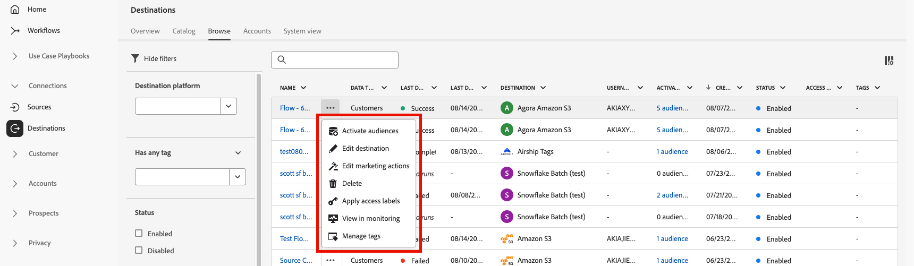

# Información general del espacio de trabajo de destinos {#destinations-workspace}

En Adobe Experience Platform, seleccione **[!UICONTROL Destinations]** en la barra de navegación izquierda para acceder al espacio de trabajo [!UICONTROL Destinations].

El espacio de trabajo [!UICONTROL Destinations] consta de cuatro secciones, [!UICONTROL Catalog], [!UICONTROL Browse], [!UICONTROL Accounts] y [!UICONTROL System View], que se describen en las secciones siguientes.

## [!UICONTROL Catálogo] {#catalog}

La pestaña **[!UICONTROL Catalog]** muestra una lista de todos los destinos disponibles en Platform a los que puede enviar datos.

La interfaz de usuario de Platform proporciona varias opciones de búsqueda y filtro en la página del catálogo de destinos:

* Utilice la funcionalidad de búsqueda de la página para localizar un destino específico.
* Filtre los destinos mediante el control [!UICONTROL Categories].
* Alternar entre [!UICONTROL Todos los destinos] y [!UICONTROL Mis destinos]. Cuando se selecciona **[!UICONTROL Todos los destinos]** , se muestran todos los destinos de Platform disponibles. Cuando se selecciona **[!UICONTROL Mis destinos]**, solo puede ver los destinos con los que ha establecido una conexión.
* Seleccione para ver **[!UICONTROL Conexiones]** o **[!UICONTROL Extensiones]**. Para comprender la diferencia entre las dos categorías, consulte [Tipos de destino y Categorías](../destination-types.md).

Las tarjetas de destino contienen un control **[!UICONTROL Configure]** o **[!UICONTROL Activate]** y un control secundario que muestra más opciones. A continuación se describen todas estas situaciones:

| Control | Descripción |
---------|----------
| [!UICONTROL Configurar] | Permite crear una conexión con el destino. |
| [!UICONTROL Activar] | Una vez que haya establecido una conexión con el destino, puede activar segmentos. |
| [!UICONTROL Ver cuenta] | Ver las cuentas que se han conectado para un destino. |
| [!UICONTROL Ver flujos de datos] | Ver los flujos de activación de datos que existen para un destino. |
| [!UICONTROL Ver documentación] | Abre un vínculo a la página de documentación para ese destino específico, para obtener más información y para ayudarle a configurarla. |

Seleccione una tarjeta de destino en el catálogo para abrir el carril derecho.  Aquí puede ver una descripción del destino. El carril derecho proporciona los mismos controles descritos en la tabla anterior, así como una descripción del destino y una indicación de la categoría y el tipo de destino.

Para obtener más información sobre las categorías de destino y la información sobre cada destino, consulte [Destination Catalog](../catalog/overview.md) y [Destination Types and Categories](../destination-types.md).

## [!UICONTROL Cuentas] {#accounts}

En la pestaña **[!UICONTROL Accounts]**, puede obtener más información sobre las conexiones establecidas con varios destinos. Consulte la tabla siguiente para obtener toda la información sobre cada destino:

>[!TIP]
>
>Utilice el botón  de la columna **[!UICONTROL Platform]** para crear una nueva conexión de destino para esa cuenta.

| Elemento | Descripción |
---------|----------
| [!UICONTROL Plataforma] | Destino para el que ha configurado la conexión. |
| [!UICONTROL Tipo de conexión] | Representa el tipo de conexión con su espacio de almacenamiento o destino. <ul><li>Para destinos de marketing por correo electrónico: Puede ser S3 o FTP.</li><li>Para destinos de publicidad en tiempo real: Servidor a servidor</li><li>Para destinos de almacenamiento en la nube de Amazon S3: Clave de acceso </li><li>Para destinos de almacenamiento en la nube SFTP: Autenticación básica para SFTP</li></ul> |
| [!UICONTROL Nombre de usuario] | El nombre de usuario seleccionado en el asistente de [conexión de destino](../catalog/email-marketing/overview.md#connect-destination). |
| [!UICONTROL Destinos] | Representa el número de flujos de destino correctos únicos conectados con la información básica creada para un destino. |
| [!UICONTROL Con autorización] | La fecha en la que se autorizó la conexión a este destino. |

Además, puede editar o actualizar la información de su cuenta. Seleccione el  en la columna **[!UICONTROL Platform]** para editar la información de la cuenta.

Para las cuentas que utilizan un tipo de conexión `OAuth2`, puede seleccionar **[!UICONTROL Volver a conectar OAuth]** para renovar sus credenciales de cuenta.

En el caso de las cuentas que utilizan un tipo de conexión `Access Key` o `ConnectionString`, puede editar la información de autenticación de la cuenta, incluida información como ID de acceso, claves secretas o cadenas de conexión.

Una vez que haya terminado de editar los detalles de la cuenta, seleccione **[!UICONTROL Guardar]** para completar la actualización.

## [!UICONTROL Examinar] {#browse}

La pestaña **[!UICONTROL Browse]** muestra los destinos con los que ha establecido una conexión. Los destinos con la opción **[!UICONTROL Enabled]** activada establecen el destino en activo y viceversa. También puede ver los destinos en los que tiene datos fluyendo seleccionando **[!UICONTROL Segments]** > **[!UICONTROL Browse]** y un segmento para inspeccionar. Consulte la tabla siguiente para obtener toda la información proporcionada para cada destino en la pestaña Examinar:

>[!TIP]
>
>Utilice el botón  de la columna **[!UICONTROL Name]** para activar segmentos adicionales en ese destino.

| Elemento | Descripción |
---------|----------
| Nombre | Nombre que ha proporcionado para el flujo de activación a este destino. |
| [!UICONTROL Destino] | La plataforma de destino que seleccionó para el flujo de activación. |
| [!UICONTROL Tipo de conexión] | Representa el tipo de conexión con su espacio de almacenamiento o destino. <ul><li>Para destinos de marketing por correo electrónico: Puede ser S3 o FTP.</li><li>Para destinos de publicidad en tiempo real: Servidor a servidor</li></ul> |
| [!UICONTROL Nombre de usuario] | Credenciales de cuenta que ha seleccionado para el flujo de destino. |
| [!UICONTROL Datos de activación] | Indica el número de segmentos que se están activando en este destino. Seleccione este control para obtener más información sobre los segmentos activados. Consulte [Datos de activación](/help/destinations/ui/destination-details-page.md#activation-data) en la página de detalles de destino para obtener más información sobre los segmentos activados. |
| [!UICONTROL Creado] | La fecha y la hora UTC en que se creó el flujo de activación al destino. |
| [!UICONTROL Estado] | `Active` O bien `Inactive`. Indica si se están activando datos en este destino. Para editar el estado, consulte [Desactivar activación](./activate-destinations.md#disable-activation). |

Haga clic en una fila de destino para que aparezca más información sobre el destino en el carril derecho.

Seleccione el nombre del destino para ver información sobre los segmentos activados en este destino. Haga clic en **[!UICONTROL Editar activación]** para modificar o agregar a los segmentos que se envían a este destino.

## [!UICONTROL Vista del sistema] {#system-view}

La pestaña **[!UICONTROL Vista del sistema]** muestra una representación gráfica de los flujos de activación que ha configurado en Adobe Experience Platform.

Seleccione cualquiera de los destinos mostrados en la página y pulse **[!UICONTROL View flows]** para ver información sobre todas las conexiones configuradas para cada destino.

