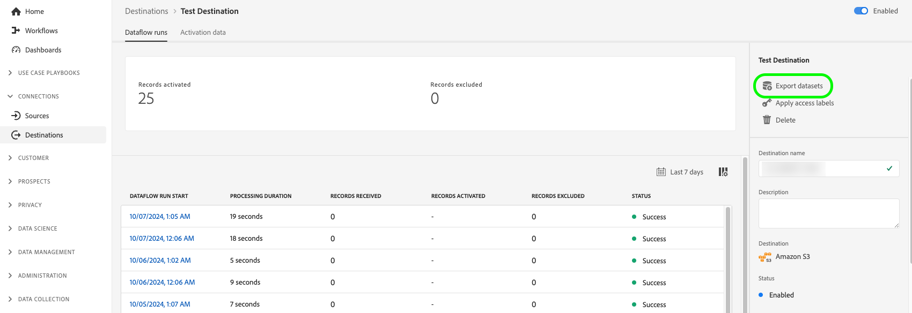
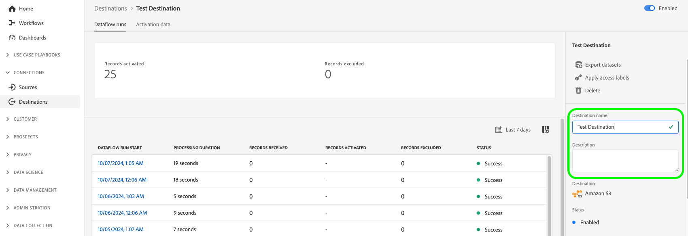

# Editar flujos de datos de activación {#edit-activation-flows}

En Adobe Experience Platform, puede configurar varios componentes de flujos de datos de activación existentes en destinos como, por ejemplo:

* [Habilitar o deshabilitar](#enable-disable-dataflows) flujos de datos de activación
* [Agregar audiencias adicionales](#add-audiences) a flujos de datos de activación
* [Editar atributos e identidades asignados](#edit-mapped-attributes)
* [Editar la programación de activación y la frecuencia de exportación](#edit-schedule-frequency)
* [Agregar conjuntos de datos adicionales](#add-datasets) al flujo de trabajo de activación
* [Aplicar etiquetas de acceso](#apply-access-labels) a los datos exportados
* [Editar nombres y descripciones](#edit-names-descriptions) para sus flujos de datos de activación

## Examinar flujos de datos de activación {#browse-activation-dataflows}

Siga los pasos a continuación para examinar los flujos de datos de activación existentes e identificar el que desea editar.

1. Inicie sesión en la [interfaz de usuario de Experience Platform](https://platform.adobe.com/) y seleccione **[!UICONTROL Destinos]** en la barra de navegación izquierda. Seleccione **[!UICONTROL Examinar]** en el encabezado superior para ver los flujos de datos de destino existentes.

   

2. Seleccione el icono de filtro  en la parte superior izquierda para iniciar el panel de ordenación. El panel de ordenación proporciona una lista de todos sus destinos. Puede seleccionar más de un destino de la lista para ver una selección filtrada de flujos de datos asociados al destino seleccionado.

   

3. Seleccione el nombre del flujo de datos de destino que desea editar.

   

4. Aparecerá la página **[!UICONTROL Flujo de datos ejecuta]** para el destino, mostrando sus controles disponibles. Según el tipo de destino, puede realizar varias operaciones de flujo de datos. Consulte las secciones siguientes para cada operación de flujo de datos admitida.

## Habilitar o deshabilitar flujos de datos de activación {#enable-disable-dataflows}

Utilice la opción **[!UICONTROL Habilitado]/[!UICONTROL Deshabilitado]** para iniciar o pausar todas las exportaciones de datos al destino.

## Añadir audiencias a un flujo de datos de activación {#add-audiences}

Seleccione **[!UICONTROL Activar audiencias]** en el carril derecho para cambiar las audiencias que se enviarán al destino. Esta acción lo lleva al flujo de trabajo de activación.

En el paso **[!UICONTROL Seleccionar audiencias]** del flujo de trabajo de activación, puede quitar audiencias existentes o agregar nuevas audiencias al flujo de trabajo de activación.

El flujo de trabajo de activación difiere ligeramente según el tipo de destino. Para obtener más información sobre los flujos de trabajo de activación para cada tipo de destino, lea las siguientes guías:

* [Activar audiencias en destinos de streaming](./activate-segment-streaming-destinations.md) (por ejemplo, Facebook o Twitter);
* [Activar audiencias para destinos de exportación de perfiles por lotes](./activate-batch-profile-destinations.md) (por ejemplo, Amazon S3 o Oracle Eloqua);
* [Activar audiencias en destinos de exportación de perfiles de streaming](./activate-streaming-profile-destinations.md) (por ejemplo, API HTTP o Amazon Kinesis).

## Editar la programación de activación y la frecuencia de exportación {#edit-schedule-frequency}

Seleccione **[!UICONTROL Activar audiencias]** en el carril derecho. Esta acción lo lleva al flujo de trabajo de activación.

Seleccione el paso **[!UICONTROL Scheduling]** del flujo de trabajo de activación para editar la programación de activación y la frecuencia de exportación del flujo de datos. Este paso le permite configurar la frecuencia con la que se exportan los datos al destino.

En el paso **[!UICONTROL Scheduling]** del flujo de trabajo de activación, puede:
* Ajuste la frecuencia de exportación.
* Establezca o modifique las fechas de inicio y finalización del flujo de datos de activación, etc.

Las operaciones de programación que puede realizar varían ligeramente según el tipo de destino. Para obtener más información sobre los flujos de trabajo de activación para cada tipo de destino, lea las siguientes guías:

* [Activar audiencias en destinos de streaming](./activate-segment-streaming-destinations.md) (por ejemplo, Facebook o Twitter);
* [Activar audiencias para destinos de exportación de perfiles por lotes](./activate-batch-profile-destinations.md) (por ejemplo, Amazon S3 o Oracle Eloqua);
* [Activar audiencias en destinos de exportación de perfiles de streaming](./activate-streaming-profile-destinations.md) (por ejemplo, API HTTP o Amazon Kinesis).

## Editar atributos e identidades asignados {#edit-mapped-attributes}

Seleccione **[!UICONTROL Activar audiencias]** en el carril derecho. Esta acción lo lleva al flujo de trabajo de activación.

Seleccione el paso **[!UICONTROL Mapping]** del flujo de trabajo de activación para editar los atributos e identidades asignados al flujo de datos de activación. Esto le permite ajustar qué atributos e identidades de perfil se deben exportar al destino.

En el paso **[!UICONTROL Mapping]** del flujo de trabajo de activación, puede:

* Agregue nuevos atributos o identidades a la asignación.
* Elimine atributos o identidades existentes de la asignación.
* Ajuste el orden de las asignaciones para definir el orden de las columnas en los archivos exportados.

El flujo de trabajo de activación difiere ligeramente según el tipo de destino. Para obtener más información sobre los flujos de trabajo de activación para cada tipo de destino, lea las siguientes guías:

* [Activar audiencias en destinos de streaming](./activate-segment-streaming-destinations.md) (por ejemplo, Facebook o Twitter);
* [Activar audiencias para destinos de exportación de perfiles por lotes](./activate-batch-profile-destinations.md) (por ejemplo, Amazon S3 o Oracle Eloqua);
* [Activar audiencias en destinos de exportación de perfiles de streaming](./activate-streaming-profile-destinations.md) (por ejemplo, API HTTP o Amazon Kinesis).

## Adición de conjuntos de datos a un flujo de datos de activación {#add-datasets}

Seleccione **[!UICONTROL Exportar conjuntos de datos]** en el carril derecho para seleccionar conjuntos de datos adicionales para exportarlos a su destino. Esta opción lo lleva al [flujo de trabajo de exportación del conjunto de datos](export-datasets.md).

>[!NOTE]
>
>Esta opción solo está visible para [destinos que admiten la exportación del conjunto de datos](export-datasets.md#supported-destinations).

## Aplicación de etiquetas de acceso {#apply-access-labels}

Seleccione **[!UICONTROL Aplicar etiquetas de acceso]** para editar las etiquetas de uso de datos para los datos exportados. Consulte la [documentación de etiquetas de uso de datos](../../data-governance/labels/overview.md) para obtener más información.

## Editar nombres y descripciones de flujo de datos de activación {#edit-names-descriptions}

Para editar el nombre y la descripción del flujo de datos de activación, use los campos **[!UICONTROL Nombre de destino]** y **[!UICONTROL Descripción]**.

## Próximos pasos {#next-steps}

Al seguir este tutorial, ha utilizado correctamente el espacio de trabajo **[!UICONTROL destinos]** para actualizar los flujos de datos de destino existentes.

Para obtener más información sobre los destinos, consulte la [descripción general de los destinos](../catalog/overview.md).
