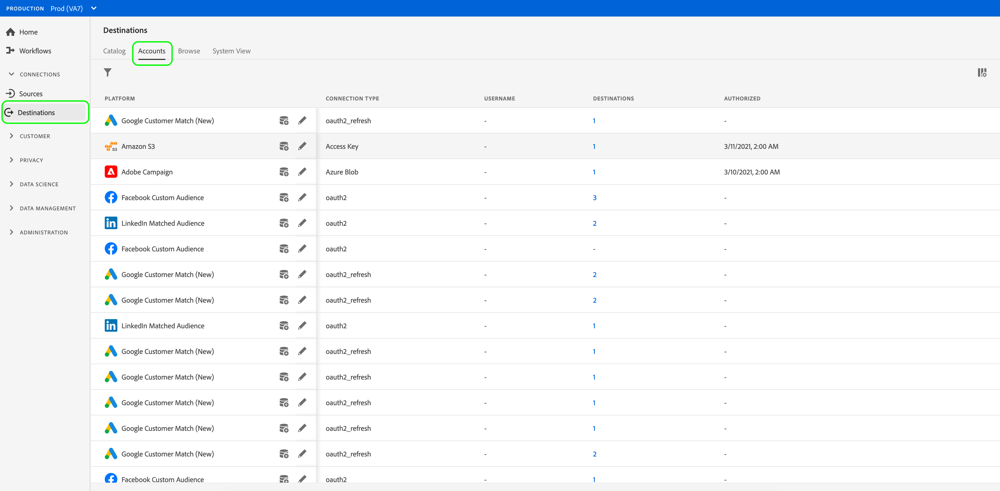
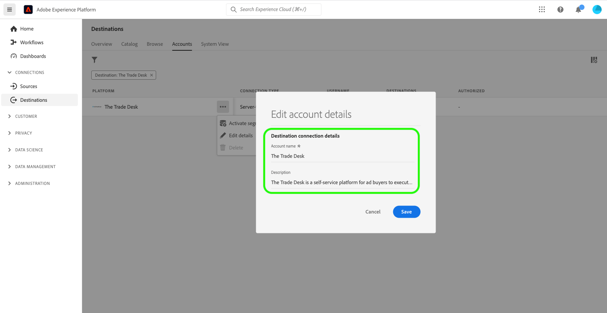

# Actualizar cuentas de destino

## Información general {#overview}

La ficha **[!UICONTROL Cuentas]** muestra detalles acerca de las conexiones que ha establecido con varios destinos. Consulta la [descripción general de cuentas](../ui/destinations-workspace.md#accounts) para obtener toda la información que puedes obtener sobre cada cuenta de destino.

Este tutorial explica los pasos para actualizar los detalles de la cuenta de destino mediante la interfaz de usuario de Experience Platform.

Puede actualizar los detalles de la cuenta de destino para actualizar y volver a autenticar las credenciales de sus cuentas actuales o caducadas para los destinos que está utilizando actualmente. Normalmente, los tokens de OAuth y portador tienen una duración limitada, según la plataforma de destino. Cuando estos tokens caduquen, puede actualizarlos en el flujo de trabajo que se describe más adelante. Este flujo de trabajo le indica que pase por el flujo de trabajo de OAuth o que vuelva a insertar un token. Del mismo modo, si ha cambiado la contraseña o el acceso de un usuario en la plataforma descendente, puede actualizar las credenciales.

Para los destinos por lotes, puede actualizar el acceso o la clave secreta, si alguno de ellos ha cambiado. Además, si desea cifrar los archivos en adelante, puede insertar una clave pública RSA y los archivos exportados se cifrarán en adelante.

## Actualización de cuentas {#update}

Siga los pasos a continuación para actualizar los detalles de conexión a destinos existentes.

1. Inicie sesión en la [interfaz de usuario del Experience Platform](https://platform.adobe.com/) y seleccione **[!UICONTROL Destinos]** en la barra de navegación izquierda. Seleccione **[!UICONTROL Cuentas]** del encabezado superior para ver sus cuentas existentes.

   

2. Seleccione el icono de filtro  en la parte superior izquierda para iniciar el panel de ordenación. El panel de ordenación proporciona una lista de todos sus destinos. Puede seleccionar más de un destino de la lista para ver una selección filtrada de cuentas asociadas con los destinos seleccionados.

   

3. Seleccione los puntos suspensivos (`...`) junto al nombre de la cuenta que desea actualizar. Aparece un panel emergente que proporciona opciones para **[!UICONTROL Activar audiencias]**, **[!UICONTROL Editar detalles]** y **[!UICONTROL Eliminar]** la cuenta. Seleccione el botón  **[!UICONTROL Editar detalles]** para editar la información de la cuenta.

   

4. Introduzca las credenciales actualizadas de la cuenta.

   * Para las cuentas que usan un tipo de conexión `OAuth1` o `OAuth2`, seleccione **[!UICONTROL Volver a conectar OAuth]** para renovar las credenciales de su cuenta. También puede actualizar el nombre y la descripción de su cuenta.

   

   * Para las cuentas que utilizan un tipo de conexión `Access Key` o `ConnectionString`, puede editar la información de autenticación de la cuenta, incluida la información como el identificador de acceso, las claves secretas o las cadenas de conexión. También puede actualizar el nombre y la descripción de su cuenta.

   

   * Para las cuentas que utilizan un tipo de conexión `Bearer token`, puede introducir un nuevo token de portador, si es necesario. También puede actualizar el nombre y la descripción de su cuenta.

   

   * Para las cuentas que usan un tipo de conexión `Server to server`, puede actualizar el nombre y la descripción de su cuenta.

   

5. Seleccione **[!UICONTROL Guardar]** para finalizar la actualización de los detalles de la cuenta.

## Pasos siguientes

Al seguir este tutorial, ha utilizado correctamente el área de trabajo **[!UICONTROL destinos]** para actualizar las cuentas existentes.

Para obtener más información sobre los destinos, consulte la [descripción general de los destinos](../catalog/overview.md).