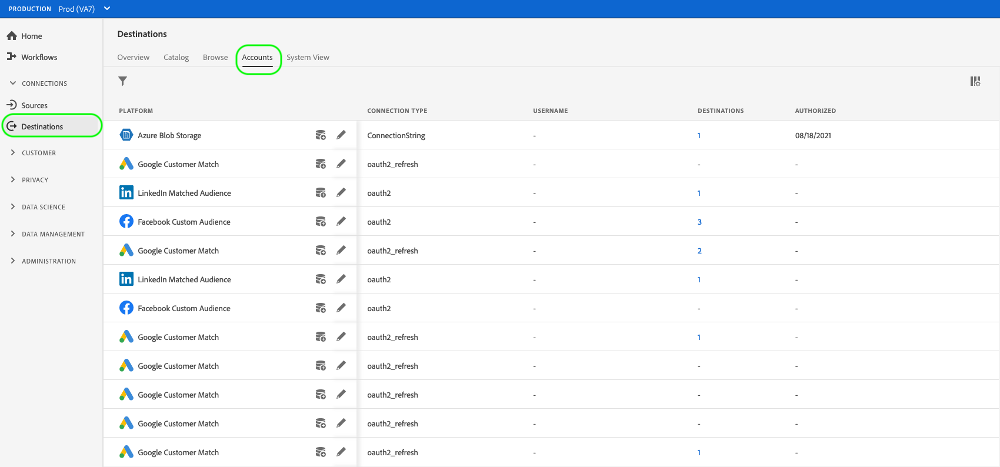
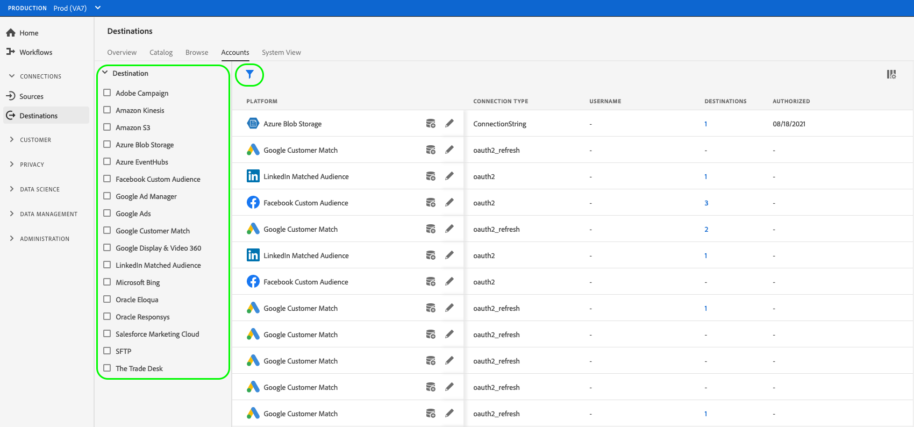
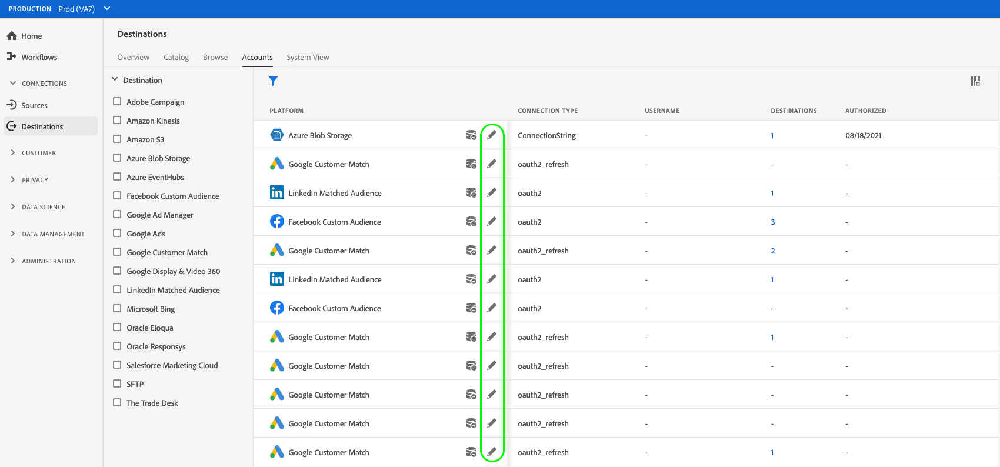
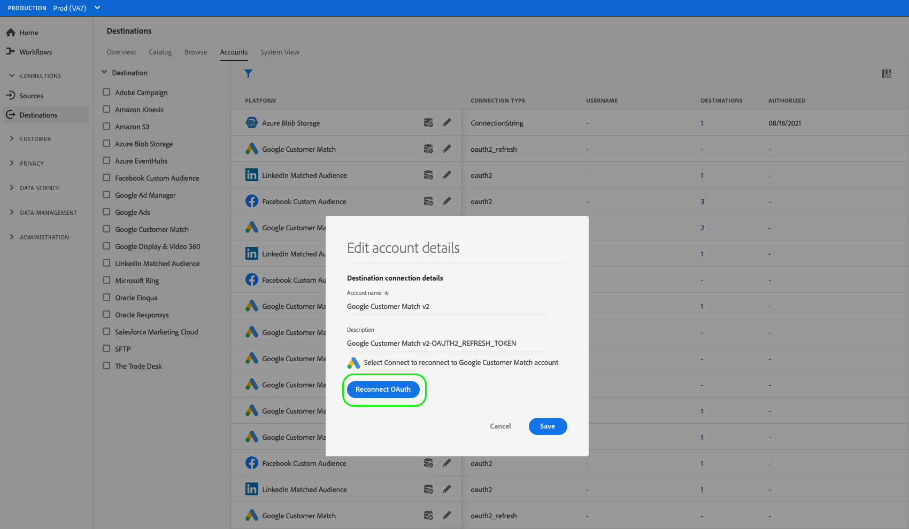
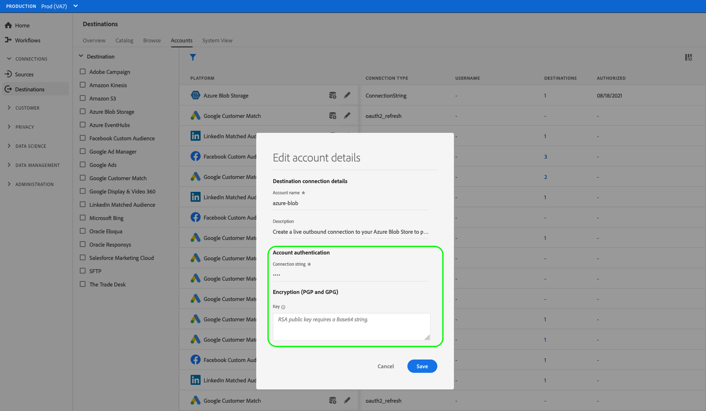
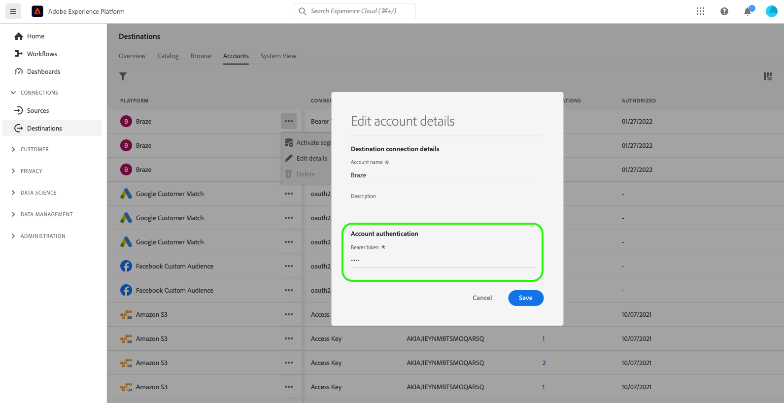
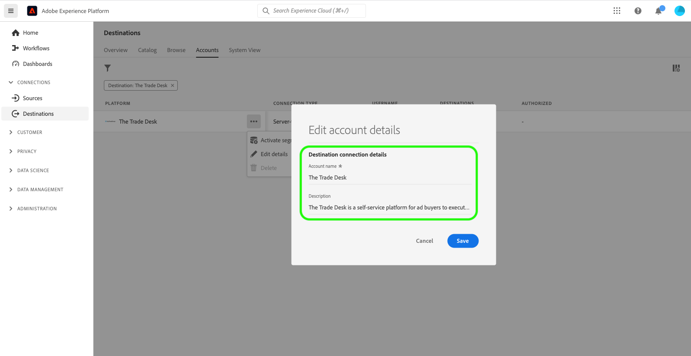

# Actualizar cuentas de destino

## Información general {#overview}

La ficha **[!UICONTROL Accounts]** muestra detalles acerca de las conexiones que ha establecido con varios destinos. Consulte [Resumen de cuentas](../ui/destinations-workspace.md#accounts) para obtener toda la información disponible para cada cuenta de destino.

Este tutorial cubre los pasos para actualizar los detalles de la cuenta de destino mediante la interfaz de usuario de Experience Platform.

Puede actualizar los detalles de la cuenta de destino para actualizar y volver a autenticar las credenciales de sus cuentas actuales o caducadas para los destinos que está utilizando actualmente. Normalmente, los tokens de OAuth y portador tienen una duración limitada, según la plataforma de destino. Cuando estos tokens caduquen, puede actualizarlos en el flujo de trabajo que se describe más adelante. Este flujo de trabajo le indica que pase por el flujo de trabajo de OAuth o que vuelva a insertar un token. Del mismo modo, si ha cambiado la contraseña o el acceso de un usuario en la plataforma descendente, puede actualizar las credenciales.

Para los destinos por lotes, puede actualizar el acceso o la clave secreta, si alguno de ellos ha cambiado. Además, si desea cifrar los archivos en adelante, puede insertar una clave pública RSA y los archivos exportados se cifrarán en adelante.

## Actualización de cuentas {#update}

Siga los pasos a continuación para actualizar los detalles de conexión a destinos existentes.

1. Vaya a la [interfaz de usuario de Experience Platform](https://platform.adobe.com/) y seleccione **[!UICONTROL Destinations]** en la barra de navegación izquierda. Seleccione **[!UICONTROL Accounts]** en el encabezado superior para ver sus cuentas existentes.

   

2. Seleccione el icono de filtro  en la parte superior izquierda para iniciar el panel de ordenación. El panel de ordenación proporciona una lista de todos sus destinos. Puede seleccionar más de un destino de la lista para ver una selección filtrada de cuentas asociadas con los destinos seleccionados.

   

3. Seleccione los puntos suspensivos (`...`) junto al nombre de la cuenta que desea actualizar. Aparece un panel emergente que proporciona opciones para **[!UICONTROL Activate audiences]**, **[!UICONTROL Edit details]** y **[!UICONTROL Delete]** la cuenta. Seleccione el botón  **[!UICONTROL Edit details]** para editar la información de la cuenta.

   

4. Introduzca las credenciales actualizadas de la cuenta.

   * Para las cuentas que usan un tipo de conexión `OAuth1` o `OAuth2`, seleccione **[!UICONTROL Reconnect OAuth]** para renovar las credenciales de su cuenta. También puede actualizar el nombre y la descripción de su cuenta.

   

   * Para las cuentas que utilizan un tipo de conexión `Access Key` o `ConnectionString`, puede editar la información de autenticación de la cuenta, incluida la información como el identificador de acceso, las claves secretas o las cadenas de conexión. También puede actualizar el nombre y la descripción de su cuenta.

   

   * Para las cuentas que utilizan un tipo de conexión `Bearer token`, puede introducir un nuevo token de portador, si es necesario. También puede actualizar el nombre y la descripción de su cuenta.

   

   * Para las cuentas que usan un tipo de conexión `Server to server`, puede actualizar el nombre y la descripción de su cuenta.

   

5. Seleccione **[!UICONTROL Save]** para finalizar la actualización de detalles de la cuenta.

## Próximos pasos {#next-steps}

Ha actualizado correctamente las cuentas existentes usando el área de trabajo **[!UICONTROL destinations]**.

Para obtener más información sobre los destinos, consulte [descripción general de los destinos](../catalog/overview.md).