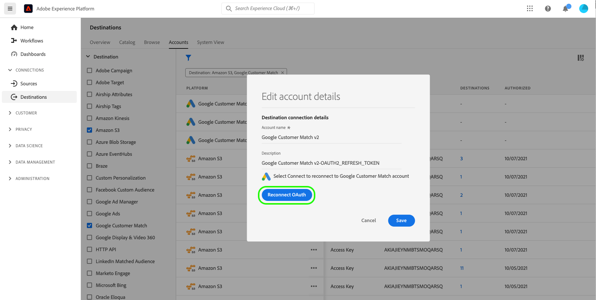

# Actualizar cuentas de destino

## Información general {#overview}

El **[!UICONTROL Cuentas]** La pestaña muestra detalles sobre las conexiones que ha establecido con varios destinos. Consulte la [Resumen de cuentas](../ui/destinations-workspace.md#accounts) para toda la información que puede obtener en cada cuenta de destino.

Este tutorial explica los pasos para actualizar los detalles de la cuenta de destino mediante la interfaz de usuario de Experience Platform.

Puede actualizar los detalles de la cuenta de destino para actualizar y volver a autenticar las credenciales de sus cuentas actuales o caducadas para los destinos que está utilizando actualmente. Normalmente, los tokens de OAuth y portador tienen una duración limitada, según la plataforma de destino. Cuando estos tokens caduquen, puede actualizarlos en el flujo de trabajo que se describe más adelante. Este flujo de trabajo le indica que pase por el flujo de trabajo de OAuth o que vuelva a insertar un token. Del mismo modo, si ha cambiado la contraseña o el acceso de un usuario en la plataforma descendente, puede actualizar las credenciales.

Para los destinos por lotes, puede actualizar el acceso o la clave secreta, si alguno de ellos ha cambiado. Además, si desea cifrar los archivos en adelante, puede insertar una clave pública RSA y los archivos exportados se cifrarán en adelante.

## Actualización de cuentas {#update}

Siga los pasos a continuación para actualizar los detalles de conexión a destinos existentes.

1. Inicie sesión en [IU de Experience Platform](https://platform.adobe.com/) y seleccione **[!UICONTROL Destinos]** en la barra de navegación izquierda. Seleccionar **[!UICONTROL Cuentas]** desde el encabezado superior para ver sus cuentas existentes.

   

2. Seleccione el icono de filtro  en la parte superior izquierda para iniciar el panel ordenar. El panel de ordenación proporciona una lista de todos sus destinos. Puede seleccionar más de un destino de la lista para ver una selección filtrada de cuentas asociadas con los destinos seleccionados.

   

3. Seleccione los puntos suspensivos (`...`) junto al nombre de la cuenta que desea actualizar. Aparecerá un panel emergente con las opciones siguientes **[!UICONTROL Activar audiencias]**, **[!UICONTROL Editar detalles]**, y **[!UICONTROL Eliminar]** la cuenta. Seleccione el  **[!UICONTROL Editar detalles]** para editar la información de la cuenta.

   

4. Introduzca las credenciales actualizadas de la cuenta.

   * Para cuentas que utilizan un `OAuth1` o `OAuth2` tipo de conexión, seleccione **[!UICONTROL Volver a conectar OAuth]** para renovar las credenciales de su cuenta. También puede actualizar el nombre y la descripción de su cuenta.

   

   * Para cuentas que utilizan un `Access Key` o `ConnectionString` Tipo de conexión, puede editar la información de autenticación de su cuenta, incluida la información como el ID de acceso, las claves secretas o las cadenas de conexión. También puede actualizar el nombre y la descripción de su cuenta.

   

   * Para cuentas que utilizan un `Bearer token` tipo de conexión, puede introducir un nuevo token de portador, si es necesario. También puede actualizar el nombre y la descripción de su cuenta.

   

   * Para cuentas que utilizan un `Server to server` tipo de conexión, puede actualizar el nombre y la descripción de su cuenta.

   

5. Seleccionar **[!UICONTROL Guardar]** para finalizar la actualización de detalles de la cuenta.

## Pasos siguientes

Al seguir este tutorial, ha utilizado correctamente la variable **[!UICONTROL destinos]** espacio de trabajo para actualizar cuentas existentes.

Para obtener más información sobre los destinos, consulte la [información general sobre destinos](../catalog/overview.md).