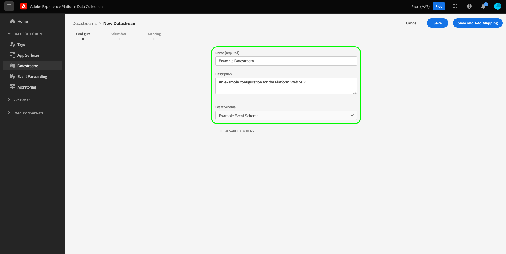

# Configurar una secuencia de datos

Este documento describe los pasos para configurar una [secuencia de datos](./overview.md) en la interfaz de usuario.

## Acceda a la [!UICONTROL Datastreams] workspace

Puede crear y administrar flujos de datos en la IU de recopilación de datos o en la IU del Experience Platform seleccionando **[!UICONTROL Datastreams]** en el panel de navegación izquierdo.

El [!UICONTROL Datastreams] La pestaña muestra una lista de los flujos de datos existentes, incluido su nombre descriptivo, ID y fecha de la última modificación. Seleccione el nombre de una secuencia de datos para [ver sus detalles y configurar servicios](#view-details).

Seleccione el icono &quot;más&quot; (**...**) de un conjunto de datos concreto para mostrar más opciones. Seleccionar **[!UICONTROL Editar]** para actualizar el [configuración básica](#configure) para el conjunto de datos o seleccione **[!UICONTROL Eliminar]** para eliminar la secuencia de datos.

## Crear una nueva secuencia de datos {#create}

Para crear una secuencia de datos, comience seleccionando **[!UICONTROL Nueva secuencia de datos]**.

Aparece el flujo de trabajo de creación de secuencia de datos, empezando por el paso de configuración. Aquí, debe proporcionar un nombre y una descripción opcional para el conjunto de datos.

Si está configurando esta secuencia de datos para utilizarla en Experience Platform y utiliza el SDK web de Platform, también debe seleccionar una [Esquema del modelo de datos de experiencia (XDM) basado en eventos](../../xdm/classes/experienceevent.md) para representar los datos que planea introducir.

Seleccionar **[!UICONTROL Opciones avanzadas]** para mostrar controles adicionales y configurar la secuencia de datos.

 {#advanced-options}

| Configuración | Descripción |
| --- | --- |
| [!UICONTROL Ubicación geográfica] | Determina si se producen búsquedas geográficas en función de la dirección IP del usuario. La configuración predeterminada **[!UICONTROL Ninguno]** deshabilita las búsquedas geográficas, mientras que la variable **[!UICONTROL Ciudad]** proporciona coordenadas GPS con dos decimales. |
| [!UICONTROL Cookie de ID de origen] | Cuando está habilitada, esta configuración indica a la red perimetral que haga referencia a una cookie especificada al buscar una [ID de dispositivo de origen](../identity/first-party-device-ids.md), en lugar de buscar este valor en el mapa de identidad.  Al habilitar esta configuración, debe proporcionar el nombre de la cookie en la que se espera almacenar el ID. |
| [!UICONTROL Sincronización de ID de terceros] | Las sincronizaciones de ID se pueden agrupar en contenedores para permitir que diferentes sincronizaciones de ID se ejecuten en momentos diferentes. Cuando está habilitada, esta configuración le permite especificar qué contenedor de sincronizaciones de ID se ejecuta para este conjunto de datos. |
| [!UICONTROL Tipo de acceso] | Define el tipo de autenticación que la red perimetral acepta para el conjunto de datos. <ul><li>**[!UICONTROL Autenticación mixta]**: cuando se selecciona esta opción, la red perimetral acepta solicitudes autenticadas y no autenticadas. Seleccione esta opción cuando vaya a utilizar el SDK web o [Mobile SDK](https://aep-sdks.gitbook.io/docs/), junto con el [API de servidor](../../server-api/overview.md). </li><li>**[!UICONTROL Solo autenticado]**: cuando se selecciona esta opción, la red perimetral solo acepta solicitudes autenticadas. Seleccione esta opción cuando vaya a usar únicamente la API de servidor y desee evitar que la red perimetral procese solicitudes no autenticadas.</li></ul> |

A partir de aquí, si está configurando el flujo de datos para Experience Platform, siga el tutorial de [Preparación de datos para la recopilación de datos](./data-prep.md) para asignar los datos a un esquema de evento de Platform antes de volver a esta guía. De lo contrario, seleccione **[!UICONTROL Guardar]** y continúe a la siguiente sección.

## Ver detalles del flujo de datos {#view-details}

Después de configurar una secuencia de datos nueva o seleccionar una existente para verla, aparecerá la página de detalles de dicha secuencia de datos. Aquí puede encontrar más información sobre el conjunto de datos, incluido su ID.

En la pantalla de detalles del flujo de datos, puede hacer lo siguiente [agregar servicios](#add-services) para habilitar las funciones de los productos de Adobe Experience Cloud a los que tiene acceso. También puede editar la secuencia de datos de [configuración básica](#create), actualice su [reglas de asignación](./data-prep.md), [copiar la secuencia de datos](#copy), o elimínelo por completo.

## Agregar servicios a un conjunto de datos {#add-services}

En la página de detalles de un conjunto de datos, seleccione **[!UICONTROL Añadir servicio]** para empezar a agregar servicios disponibles para ese conjunto de datos.

En la pantalla siguiente, utilice el menú desplegable para seleccionar un servicio para configurar para este conjunto de datos. En esta lista solo aparecen los servicios a los que tiene acceso.

Seleccione el servicio deseado, rellene las opciones de configuración que aparecen y, a continuación, seleccione **[!UICONTROL Guardar]** para agregar el servicio al conjunto de datos. Todos los servicios agregados aparecen en la vista de detalles del conjunto de datos.

Las subsecciones siguientes describen las opciones de configuración de cada servicio.

>[!NOTE]
>
>Cada configuración de servicio contiene un **[!UICONTROL Habilitado]** que se activa automáticamente cuando se selecciona el servicio. Para deshabilitar el servicio seleccionado para este conjunto de datos, seleccione la **[!UICONTROL Habilitado]** alternar de nuevo.

### Configuración de Adobe Analytics {#analytics}

Este servicio controla si los datos se envían a Adobe Analytics y cómo. Puede encontrar más información en la guía de [envío de datos a Analytics](../data-collection/adobe-analytics/analytics-overview.md).

| Configuración | Descripción |
| --- | --- |
| [!UICONTROL ID del grupo de informes] | **(Obligatorio)** El ID del grupo de informes de Analytics al que desea enviar los datos. Esta ID se encuentra en la interfaz de usuario de Adobe Analytics, en [!UICONTROL Administrador] > [!UICONTROL ReportSuites]. Si se especifican varios grupos de informes, los datos se copian en cada grupo de informes. |

### Configuración de Adobe Audience Manager {#audience-manager}

Este servicio controla si los datos se envían a Adobe Audience Manager y cómo. Todo lo que se necesita para enviar datos al Audience Manager es habilitar esta sección. Las demás configuraciones son opcionales pero se recomienda usarlas.

| Configuración | Descripción |
| --- | --- |
| [!UICONTROL Destinos de cookies habilitados] | Permite al SDK compartir información de segmentos mediante [destinos de cookies](https://experienceleague.adobe.com/docs/audience-manager/user-guide/features/destinations/custom-destinations/create-cookie-destination.html) de [!DNL Audience Manager]. |
| [!UICONTROL Destinos URL habilitados] | Permite al SDK compartir información de segmentos mediante [Destinos URL](https://experienceleague.adobe.com/docs/audience-manager/user-guide/features/destinations/custom-destinations/create-url-destination.html) de [!DNL Audience Manager]. |

### Configuración de Adobe Experience Platform {#aep}

>[!IMPORTANT]
>
>Al habilitar un flujo de datos para Platform, tome nota del simulador de pruebas de Platform que está utilizando, como se muestra en la cinta superior de la interfaz de usuario.
>
>
>
>Los entornos limitados son particiones virtuales en Adobe Experience Platform que le permiten aislar los datos y las implementaciones de otros miembros de la organización. Una vez creada una secuencia de datos, su zona protegida no se puede cambiar. Para obtener más información sobre la función de los entornos limitados en Experience Platform, consulte la [documentación de zonas protegidas](../../sandboxes/home.md).

Este servicio controla si los datos se envían a Adobe Experience Platform y cómo.

| Configuración | Descripción |
|---| --- |
| [!UICONTROL Conjunto de datos de evento] | **(Obligatorio)** Seleccione el conjunto de datos de Platform al que se transmitirán los datos de evento del cliente. Este esquema debe utilizar el [clase XDM ExperienceEvent](../../xdm/classes/experienceevent.md). |
| [!UICONTROL Conjunto de datos de perfil] | Seleccione el conjunto de datos de Platform al que se enviarán los datos de atributos del cliente. Este esquema debe utilizar el [Clase de perfil individual de XDM](../../xdm/classes/individual-profile.md). |
| [!UICONTROL Offer Decisioning] | Seleccione esta casilla de verificación para habilitar el Offer decisioning en una implementación de SDK web de Platform. Consulte la guía de [uso del Offer decisioning con el SDK web de Platform](../personalization/offer-decisioning/offer-decisioning-overview.md) para obtener más información sobre la implementación.  Para obtener más información sobre las capacidades de Offer decisioning, consulte la [Documentación de Adobe Journey Optimizer](https://experienceleague.adobe.com/docs/journey-optimizer/using/offer-decisioniong/get-started/starting-offer-decisioning.html?lang=es). |
| [!UICONTROL Segmentación de Edge] | Seleccione esta casilla de verificación para activar [segmentación de borde](../../segmentation/ui/edge-segmentation.md) para este conjunto de datos. Cuando el SDK envía datos a través de un flujo de datos habilitado para la segmentación de Edge, cualquier pertenencia a segmentos actualizada para el perfil en cuestión se devuelve en la respuesta.  Esta opción se puede utilizar en combinación con [!UICONTROL Destinos de personalización] para [casos de uso de personalización de página siguiente](../../destinations/ui/configure-personalization-destinations.md). |
| [!UICONTROL Destinos de personalización] | Al habilitar esto después de habilitar la variable [!UICONTROL Segmentación de Edge] , esta opción permite que el conjunto de datos se conecte a destinos de personalización como [Personalización personalizada](../../destinations/catalog/personalization/custom-personalization.md).  Consulte la documentación de destinos para ver los pasos específicos de [configuración de destinos de personalización](../../destinations/ui/configure-personalization-destinations.md). |
| [!UICONTROL Adobe Journey Optimizer] | Seleccione esta casilla de verificación para activar [Adobe Journey Optimizer](https://experienceleague.adobe.com/docs/journey-optimizer/using/ajo-home.html?lang=es) para este conjunto de datos.    Al habilitar esta opción, el conjunto de datos devolverá contenido personalizado de las campañas entrantes basadas en la web y la aplicación en [!DNL Adobe Journey Optimizer]. Esta opción requiere [!UICONTROL Segmentación de Edge] para estar activo. If [!UICONTROL Segmentación de Edge] no está marcada, esta opción está atenuada. |

### Configuración de Adobe Target {#target}

Este servicio controla si los datos se envían a Adobe Target y cómo.

| Configuración | Descripción |
| --- | --- |
| [!UICONTROL Token de propiedad] | [!DNL Target] permite a los clientes controlar los permisos mediante el uso de propiedades. Para obtener más información sobre las propiedades, consulte la guía de [configuración de permisos de enterprise](https://experienceleague.adobe.com/docs/target/using/administer/manage-users/enterprise/properties-overview.html?lang=es) en el [!DNL Target] documentación.  El token de propiedad se puede encontrar en la interfaz de usuario de Adobe Target en [!UICONTROL Configurar] > [!UICONTROL Propiedades]. |
| [!UICONTROL ID de entorno de destino] | [Entornos en Adobe Target](https://experienceleague.adobe.com/docs/target/using/administer/hosts.html) le ayuda a administrar la implementación en todas las etapas de desarrollo. Esta configuración especifica qué entorno va a utilizar con este conjunto de datos.  La práctica recomendada es configurarlo de forma diferente para cada uno de sus `dev`, `stage`, y `prod` entornos de flujo de datos para mantener las cosas simples. Sin embargo, si ya tiene definidos los entornos de Adobe Target, puede utilizarlos. |
| [!UICONTROL Área de nombres de ID de terceros de Target] | El área de nombres de identidad para `mbox3rdPartyId` que desee utilizar para este conjunto de datos. Consulte la guía de [implementación `mbox3rdPartyId` con el SDK web](../personalization/adobe-target/using-mbox-3rdpartyid.md) para obtener más información. |

### [!UICONTROL Reenvío de eventos] configuración

Este servicio controla si los datos se envían a y cómo [reenvío de eventos](../../tags/ui/event-forwarding/overview.md).

| Configuración | Descripción |
| --- | --- |
| [!UICONTROL Propiedad Launch] | **(Obligatorio)** La propiedad de reenvío de eventos a la que desea enviar datos. |
| [!UICONTROL Entorno de Launch] | **(Obligatorio)** El entorno dentro de la propiedad seleccionada al que desea enviar datos. |

>[!NOTE]
>
>Puede seleccionar **[!UICONTROL Introducir ID manualmente]** para escribir los nombres de las propiedades y los entornos en lugar de utilizar los menús desplegables.

## Copiar una secuencia de datos {#copy}

Puede crear una copia de un conjunto de datos existente y modificar sus detalles según sea necesario.

>[!NOTE]
>
>Las secuencias de datos solo se pueden copiar dentro del mismo [espacio aislado](../../sandboxes/home.md). En otras palabras, no se puede copiar un conjunto de datos de una zona protegida a otra.

Desde la página principal en [!UICONTROL Datastreams] workspace, seleccione los puntos suspensivos (**....**) para el conjunto de datos en cuestión y, a continuación, seleccione **[!UICONTROL Copiar]**.

![Imagen que muestra el [!UICONTROL Copiar] opción seleccionada en la vista de lista de secuencia de datos](../assets/datastreams/configure/copy-datastream-list.png)

Como alternativa, puede seleccionar **[!UICONTROL Copiar flujo de datos]** desde la vista de detalles de un conjunto de datos determinado.

![Imagen que muestra el [!UICONTROL Copiar] opción seleccionada en la vista de detalles del conjunto de datos](../assets/datastreams/configure/copy-datastream-details.png)

Aparecerá un cuadro de diálogo de confirmación en el que se le pedirá que proporcione un nombre único para el nuevo conjunto de datos que se va a crear, junto con detalles sobre las opciones de configuración que se copiarán. Cuando esté listo, seleccione **[!UICONTROL Copiar]**.

La página principal de [!UICONTROL Datastreams] workspace vuelve a aparecer con el nuevo conjunto de datos en la lista.

## Pasos siguientes

En esta guía se explica cómo administrar flujos de datos en la IU de recopilación de datos. Para obtener más información sobre cómo instalar y configurar el SDK web después de configurar una secuencia de datos, consulte la [Guía E2E de recopilación de datos](../../collection/e2e.md#install).
