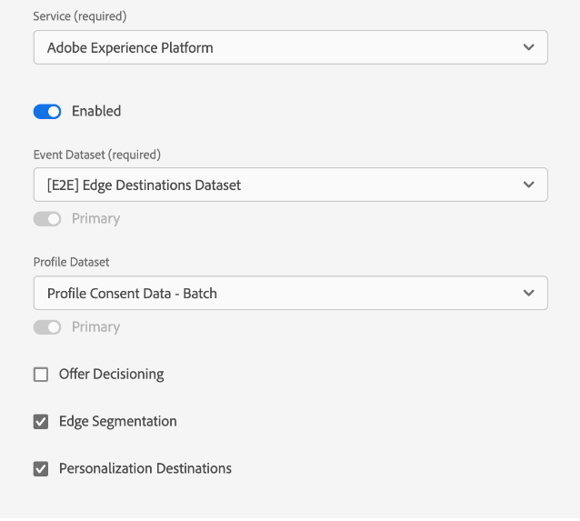

# Información general sobre Datastreams

Un conjunto de datos representa la configuración del lado del servidor al implementar los SDK web y móviles de Adobe Experience Platform. Mientras que la variable [configurar, comando](../fundamentals/configuring-the-sdk.md) en el SDK controla los elementos que se deben gestionar en el cliente (como el `edgeDomain`), los conjuntos de datos administran todas las demás configuraciones para el SDK. Cuando se envía una solicitud a la red perimetral de Adobe Experience Platform, la variable `edgeConfigId` se utiliza para hacer referencia al conjunto de datos. Esto le permite actualizar la configuración del lado del servidor sin tener que realizar cambios de código en el sitio web.

Este documento cubre los pasos para configurar un conjunto de datos en la interfaz de usuario.

## Acceda a la [!UICONTROL Datastreams] workspace

Puede crear y administrar conjuntos de datos en la interfaz de usuario o la interfaz de usuario del Experience Platform de la recopilación de datos seleccionando **[!UICONTROL Datastreams]** en el panel de navegación izquierdo.

La variable [!UICONTROL Datastreams] muestra una lista de conjuntos de datos existentes, que incluye su nombre descriptivo, ID y fecha de la última modificación. Seleccione el nombre de un conjunto de datos a [ver sus detalles y configurar servicios](#view-details).

Seleccione el icono &quot;more&quot; (**...**) para un conjunto de datos específico para mostrar más opciones. Select **[!UICONTROL Editar]** para actualizar el [configuración básica](#configure) para el conjunto de datos, o seleccione **[!UICONTROL Eliminar]** para eliminar el conjunto de datos.

## Crear un nuevo conjunto de datos {#create}

Para crear un conjunto de datos, comience seleccionando **[!UICONTROL Nuevo conjunto de datos]**.

Aparecerá el flujo de trabajo de creación del conjunto de datos, empezando por el paso de configuración. A partir de aquí, debe proporcionar un nombre y una descripción opcional para el conjunto de datos.

Si está configurando este conjunto de datos para utilizarlo en Experience Platform y utiliza el SDK web de plataforma, también debe seleccionar una [esquema del Modelo de datos de experiencias (XDM) basado en eventos](../../xdm/classes/experienceevent.md) para representar los datos que planea introducir.

Select **[!UICONTROL Opciones avanzadas]** para mostrar controles adicionales para configurar el conjunto de datos.

| Configuración | Descripción |
| --- | --- |
| [!UICONTROL Ubicación geográfica] | Determina si se producen búsquedas de GPS en función de la dirección IP del usuario. La configuración predeterminada **[!UICONTROL Ninguna]** deshabilita las búsquedas de GPS, mientras que la función **[!UICONTROL Ciudad]** proporciona coordenadas GPS a dos decimales. |
| [!UICONTROL Cookie de ID de origen] | Cuando está habilitada, esta configuración indica a la red perimetral que haga referencia a una cookie especificada al buscar una [ID de dispositivo de origen](../identity/first-party-device-ids.md), en lugar de buscar este valor en el mapa de identidad.  Al habilitar esta configuración, debe proporcionar el nombre de la cookie en la que se espera que se almacene el ID. |
| [!UICONTROL Sincronización de ID de terceros] | Las sincronizaciones de ID se pueden agrupar en contenedores para permitir que diferentes sincronizaciones de ID se ejecuten en momentos diferentes. Cuando está habilitada, esta configuración le permite especificar qué contenedor de sincronizaciones de ID se ejecuta para este conjunto de datos. |
| [!UICONTROL Tipo de acceso] | Define el tipo de autenticación que la variable [!DNL Edge Network] acepta para el conjunto de datos. <ul><li>**[!UICONTROL Autenticación mixta]**: Cuando se selecciona esta opción, la red perimetral acepta solicitudes autenticadas y no autenticadas. Seleccione esta opción cuando desee utilizar el SDK web o [SDK móvil](https://aep-sdks.gitbook.io/docs/), junto con la variable [API de servidor](../../server-api/overview.md). </li><li>**[!UICONTROL Solo autenticado]**: Cuando se selecciona esta opción, la red perimetral solo acepta solicitudes autenticadas. Seleccione esta opción cuando vaya a utilizar solo la API de servidor y desee evitar que el [!DNL Edge Network]. </li></ul> |

A partir de aquí, si va a configurar el conjunto de datos para el Experience Platform, siga el tutorial en [Preparación de datos para la recopilación de datos](./data-prep.md) para asignar los datos a un esquema de eventos de Platform antes de volver a esta guía. De lo contrario, seleccione **[!UICONTROL Guardar]** y continúe con la siguiente sección.

## Ver detalles del almacén de datos {#view-details}

Después de configurar un nuevo conjunto de datos o de seleccionar uno existente para verlo, aparecerá la página de detalles de ese conjunto de datos. Aquí puede encontrar más información sobre el conjunto de datos, incluido su ID.

Desde la pantalla de detalles del almacén de datos, puede [agregar servicios](#add-services) para habilitar las funcionalidades de los productos de Adobe Experience Cloud a los que tiene acceso. También puede editar el [configuración básica](#create), actualice su [reglas de asignación](./data-prep.md), [copiar el conjunto de datos](#copy)o elimínelo por completo.

## Añadir servicios a un conjunto de datos {#add-services}

En la página de detalles de un conjunto de datos, seleccione **[!UICONTROL Añadir servicio]** para empezar a añadir servicios disponibles para ese conjunto de datos.

En la siguiente pantalla, utilice el menú desplegable para seleccionar un servicio de configuración para este conjunto de datos. En esta lista solo aparecen los servicios a los que tiene acceso.

Seleccione el servicio deseado, rellene las opciones de configuración que aparecen y, a continuación, seleccione **[!UICONTROL Guardar]** para agregar el servicio al conjunto de datos. Todos los servicios añadidos aparecen en la vista de detalles del conjunto de datos.

Las subsecciones siguientes describen las opciones de configuración de cada servicio.

>[!NOTE]
>
>Cada configuración de servicio contiene un **[!UICONTROL Habilitado]** que se activa automáticamente cuando se selecciona el servicio. Para desactivar el servicio seleccionado para este conjunto de datos, seleccione el **[!UICONTROL Habilitado]** volver a alternar.

### Configuración de Adobe Analytics {#analytics}

Este servicio controla si los datos se envían a Adobe Analytics y cómo se hacen. Encontrará más detalles en la guía de [envío de datos a Analytics](../data-collection/adobe-analytics/analytics-overview.md).

| Configuración | Descripción |
| --- | --- |
| [!UICONTROL ID del grupo de informes] | **(Obligatorio)** El ID del grupo de informes de Analytics al que desea enviar los datos. Este ID se puede encontrar en la interfaz de usuario de Adobe Analytics, en [!UICONTROL Administrador] > [!UICONTROL Grupos de informes]. Si se especifican varios grupos de informes, los datos se copian en cada grupo de informes. |

### Configuración de Adobe Audience Manager {#audience-manager}

Este servicio controla si los datos se envían a Adobe Audience Manager y cómo se hacen. Todo lo que se necesita para enviar datos al Audience Manager es habilitar esta sección. Los demás ajustes son opcionales, pero se recomienda.

| Configuración | Descripción |
| --- | --- |
| [!UICONTROL Destinos de cookies habilitados] | Permite al SDK compartir información de segmentos mediante [destinos de cookies](https://experienceleague.adobe.com/docs/audience-manager/user-guide/features/destinations/custom-destinations/create-cookie-destination.html) from [!DNL Audience Manager]. |
| [!UICONTROL Destinos de URL habilitados] | Permite al SDK compartir información de segmentos mediante [Destinos de URL](https://experienceleague.adobe.com/docs/audience-manager/user-guide/features/destinations/custom-destinations/create-url-destination.html) from [!DNL Audience Manager]. |

### Configuración de Adobe Experience Platform {#aep}

>[!IMPORTANT]
>
>Al habilitar un conjunto de datos para Platform, tome nota del simulador de pruebas de Platform que está utilizando actualmente, tal y como se muestra en la cinta superior de la interfaz de usuario.
>
>
>
>Los entornos limitados son particiones virtuales en Adobe Experience Platform que le permiten aislar los datos y las implementaciones de otras personas de su organización. Una vez creado un conjunto de datos, su simulador de pruebas no se puede cambiar. Para obtener más información sobre la función de los entornos limitados en el Experience Platform, consulte la [documentación de entornos limitados](../../sandboxes/home.md).

Este servicio controla si los datos se envían a Adobe Experience Platform y cómo se hacen.

| Configuración | Descripción |
|---| --- |
| [!UICONTROL Conjunto de datos del evento] | **(Obligatorio)** Seleccione el conjunto de datos de Platform al que se transmitirán los datos de eventos del cliente. Este esquema debe utilizar la variable [Clase XDM ExperienceEvent](../../xdm/classes/experienceevent.md). |
| [!UICONTROL Conjunto de datos de perfil] | Seleccione el conjunto de datos de Platform al que se enviarán los datos de atributos del cliente. Este esquema debe utilizar la variable [Clase de perfil individual XDM](../../xdm/classes/individual-profile.md). |
| [!UICONTROL Offer Decisioning] | Seleccione esta casilla de verificación para habilitar el Offer decisioning para una implementación del SDK web de Platform. Consulte la guía de [uso del Offer decisioning con el SDK web de Platform](../personalization/offer-decisioning/offer-decisioning-overview.md) para obtener más información sobre la implementación. Para obtener más información sobre las funciones de Offer decisioning, consulte la [Documentación de Adobe Journey Optimizer](https://experienceleague.adobe.com/docs/journey-optimizer/using/offer-decisioniong/get-started/starting-offer-decisioning.html?lang=es). |
| [!UICONTROL Segmentación de Edge] | Active esta casilla de verificación para habilitar [segmentación de arista](../../segmentation/ui/edge-segmentation.md) para este conjunto de datos. Cuando el SDK envía datos a través de un conjunto de datos habilitado para la segmentación perimetral, cualquier pertenencia de segmento actualizada para el perfil en cuestión se devuelve en la respuesta.  Esta opción se puede utilizar en combinación con [!UICONTROL Destinos de personalización] para [casos de uso de personalización de páginas siguientes](../../destinations/ui/configure-personalization-destinations.md). |
| [!UICONTROL Destinos de personalización] | Al habilitar esto después de habilitar la variable [!UICONTROL Segmentación de Edge] , esta opción permite que el conjunto de datos se conecte a destinos de personalización, como [Personalización personalizada](../../destinations/catalog/personalization/custom-personalization.md). Consulte la documentación de destinos para ver los pasos específicos sobre [configuración de destinos de personalización](../../destinations/ui/configure-personalization-destinations.md). |

### Configuración de Adobe Target {#target}

Este servicio controla si los datos se envían a Adobe Target y cómo se hacen.

| Configuración | Descripción |
| --- | --- |
| [!UICONTROL Token de propiedad] | [!DNL Target] permite a los clientes controlar los permisos mediante el uso de propiedades. Para obtener más información sobre las propiedades, consulte la guía de [configuración de permisos de Enterprise](https://experienceleague.adobe.com/docs/target/using/administer/manage-users/enterprise/properties-overview.html?lang=es) en el [!DNL Target] documentación.  El token de propiedad se puede encontrar en la interfaz de usuario de Adobe Target, en [!UICONTROL Configuración] > [!UICONTROL Propiedades]. |
| [!UICONTROL ID de entorno de Target] | [Entornos en Adobe Target](https://experienceleague.adobe.com/docs/target/using/administer/hosts.html) le ayuda a administrar su implementación en todas las etapas de desarrollo. Esta configuración especifica el entorno que se va a utilizar con este conjunto de datos.  Una práctica recomendada es configurar esto de forma diferente para cada uno de sus `dev`, `stage`y `prod` entornos de datastream para mantener las cosas simples. Sin embargo, si ya tiene definidos entornos de Adobe Target, puede utilizarlos. |
| [!UICONTROL Área de nombres de ID de terceros de Target] | El área de nombres de identidad para la variable `mbox3rdPartyId` desea usar para este conjunto de datos. Consulte la guía de [implementación `mbox3rdPartyId` con el SDK web](../personalization/adobe-target/using-mbox-3rdpartyid.md) para obtener más información. |

### [!UICONTROL Reenvío de eventos] configuración

Este servicio controla si los datos se envían a [reenvío de eventos](../../tags/ui/event-forwarding/overview.md).

| Configuración | Descripción |
| --- | --- |
| [!UICONTROL Propiedad Launch] | **(Obligatorio)** La propiedad de reenvío de eventos a la que desea enviar datos. |
| [!UICONTROL Entorno de Launch] | **(Obligatorio)** El entorno dentro de la propiedad seleccionada al que desea enviar los datos. |

>[!NOTE]
>
>Puede seleccionar **[!UICONTROL Introducir ID manualmente]** para escribir los nombres de propiedad y entorno en lugar de usar los menús desplegables.

## Copiar un conjunto de datos {#copy}

Puede crear una copia de un conjunto de datos existente y modificar sus detalles según sea necesario.

>[!NOTE]
>
>Los conjuntos de datos solo se pueden copiar dentro del mismo [entorno limitado](../../sandboxes/home.md). En otras palabras, no se puede copiar un conjunto de datos de un entorno limitado a otro.

Desde la página principal en la [!UICONTROL Datastreams] espacio de trabajo, seleccione los puntos suspensivos (**....**) para el conjunto de datos en cuestión, seleccione **[!UICONTROL Copiar]**.

![Imagen que muestra la variable [!UICONTROL Copiar] opción seleccionada en la vista de lista del conjunto de datos](../images/datastreams/overview/copy-datastream-list.png)

También puede seleccionar **[!UICONTROL Copiar conjunto de datos]** de la vista de detalles de un conjunto de datos determinado.

![Imagen que muestra la variable [!UICONTROL Copiar] opción seleccionada en la vista de detalles del conjunto de datos](../images/datastreams/overview/copy-datastream-details.png)

Aparecerá un cuadro de diálogo de confirmación en el que se le pedirá que proporcione un nombre único para el nuevo conjunto de datos que se creará, junto con detalles sobre las opciones de configuración que se copiarán. Cuando esté listo, seleccione **[!UICONTROL Copiar]**.

La página principal del [!UICONTROL Datastreams] El espacio de trabajo vuelve a aparecer con el nuevo conjunto de datos enumerado.

## Pasos siguientes

Esta guía describe cómo administrar conjuntos de datos en la interfaz de usuario. Para obtener más información sobre cómo instalar y configurar el SDK web después de configurar un conjunto de datos, consulte la [Guía de recopilación de datos E2E](../../collection/e2e.md#install).
