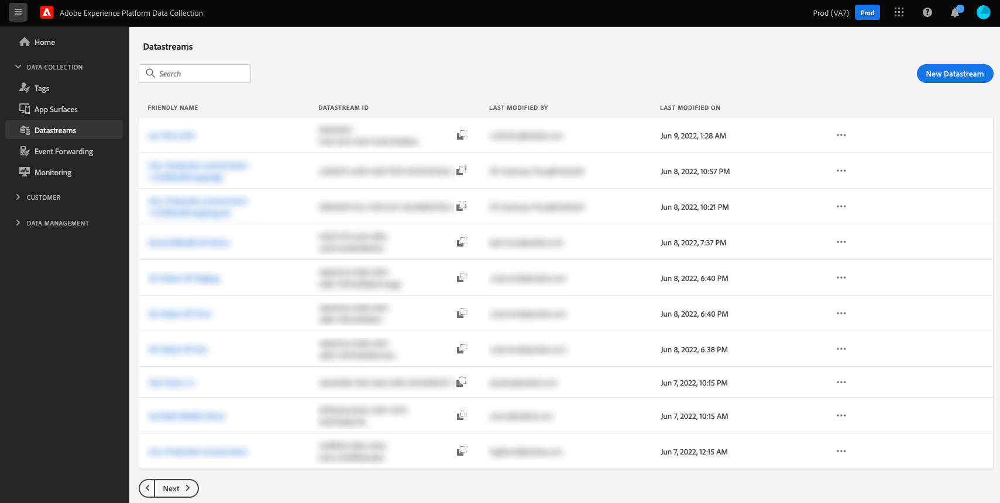

# Resumen de flujos de datos

Una secuencia de datos representa la configuración del lado del servidor al implementar los SDK web y móvil de Adobe Experience Platform. Mientras que el [configure, comando](../fundamentals/configuring-the-sdk.md) en el SDK controla los elementos que se deben gestionar en el cliente (como `edgeDomain`), los flujos de datos gestionan todas las demás configuraciones del SDK. Cuando se envía una solicitud a Adobe Experience Platform Edge Network, la variable `edgeConfigId` se utiliza para hacer referencia al conjunto de datos. Esto le permite actualizar la configuración del lado del servidor sin tener que realizar cambios en el código del sitio web.

Puede crear y administrar flujos de datos seleccionando **[!UICONTROL Datastreams]** en el panel de navegación izquierdo dentro de la interfaz de usuario de Adobe Experience Platform o de la recopilación de datos.

Para obtener más información sobre cómo configurar un conjunto de datos en la interfaz de usuario de, consulte la [guía de configuración](./configure.md).

## Gestión de datos confidenciales en flujos de datos {#sensitive}

>[!IMPORTANT]
>
>El contenido de este documento no constituye asesoramiento jurídico y no está pensado para sustituir el asesoramiento jurídico. Consulte con el departamento legal de su empresa para obtener asesoramiento sobre el tratamiento de datos confidenciales.

Las políticas de administración de datos corporativos y los requisitos regulatorios son restricciones cada vez mayores sobre cómo se pueden recopilar, procesar y utilizar los datos confidenciales de los clientes. Esto incluye la recopilación, el procesamiento y el uso de los Datos de salud protegidos (PHI), que están sujetos a regulaciones como la Ley de Portabilidad y Responsabilidad del Seguro de Salud (HIPAA, por sus siglas en inglés).

Datastreams proporciona tres métodos para ayudarle a gestionar de forma segura sus datos confidenciales:

* [Cifrado mejorado](#encryption)
* [Gobernanza de datos](#governance)
* [Registros de auditoría](#audit-logs)

### Cifrado mejorado {#encryption}

Todos los datos en tránsito a través de la red perimetral se realizan a través de conexiones seguras y cifradas mediante [HTTPS TLS 1.2](https://datatracker.ietf.org/doc/html/rfc5246). Si la secuencia de datos introduce datos en Experience Platform, estos se cifran en reposo en el lago de datos del Experience Platform. Consulte el documento sobre [cifrado de datos en el Experience Platform](../../landing/governance-privacy-security/encryption.md) para obtener más información.

### Gobernanza de datos {#governance}

Datastreams aprovecha las capacidades integradas de control de datos de Experience Platform para evitar que los datos confidenciales se envíen a servicios no preparados para HIPAA. Al etiquetar campos específicos que contienen datos confidenciales en los esquemas del conjunto de datos, puede tomar el control granular sobre qué campos de datos se pueden utilizar para fines específicos.

El siguiente vídeo proporciona una breve descripción sobre cómo se configuran y aplican las restricciones de uso de datos para flujos de datos en la interfaz de usuario:

>[!VIDEO](https://video.tv.adobe.com/v/3409588/?quality=12&learn=on&speedcontrol=on)

En Experience Platform, puede aplicar lo siguiente [etiquetas de uso de datos confidenciales](../../data-governance/labels/reference.md#sensitive) a esquemas y campos que contienen datos que su organización considera confidenciales. Por ejemplo, la variable `RHD` La etiqueta se usa para denotar la Información médica protegida (PHI), y la `S1` representa los datos de geolocalización.

>[!NOTE]
>
>Para obtener más información sobre cómo aplicar etiquetas de uso de datos dentro de [!UICONTROL Esquemas] en la IU del Experience Platform o la IU de recopilación de datos, consulte la [tutorial de etiquetado de esquemas](../../xdm/tutorials/labels.md).

Al crear una nueva secuencia de datos, si el esquema seleccionado contiene etiquetas de uso de datos confidenciales, la secuencia de datos solo se puede configurar para enviar esos datos a destinos compatibles con HIPAA. Actualmente, el único destino compatible con HIPAA que admiten flujos de datos es Adobe Experience Platform. Otros servicios de destino, como Adobe Target, Adobe Analytics, Adobe Audience Manager, el reenvío de eventos y los destinos perimetrales, se desactivan para los flujos de datos que contienen etiquetas de uso de datos confidenciales.

Si se utiliza un esquema en un conjunto de datos existente con servicios no preparados para HIPAA, intentar agregar una etiqueta de uso de datos confidencial al esquema genera un mensaje de infracción de directiva y se impide la acción. El mensaje especifica qué secuencia de datos activó la infracción y sugiere eliminar cualquier servicio no compatible con HIPAA de la secuencia de datos para resolver el problema.

### Registros de auditoría

En Experience Platform, las actividades de flujo de datos se pueden monitorizar en forma de registros de auditoría. Un registro de auditoría indica **quién** realizado **qué** acción, y **cuando**, junto con otros datos contextuales que pueden ayudarle a solucionar problemas relacionados con flujos de datos para ayudar a su empresa a cumplir con las políticas de administración de datos corporativos y los requisitos regulatorios.

Cada vez que un usuario crea, actualiza o elimina un conjunto de datos, se crea un registro de auditoría para registrar la acción. Lo mismo ocurre cada vez que un usuario crea, actualiza o elimina una asignación mediante [Preparación de datos para la recopilación de datos](./data-prep.md). Independientemente de si se ha actualizado un conjunto de datos o una asignación, el registro de auditoría resultante se clasifica en la categoría [!UICONTROL Datastreams] tipo de recurso.

Consulte la documentación sobre [registros de auditoría](../../landing/governance-privacy-security/audit-logs/overview.md) para obtener más información sobre cómo interpretar los registros de flujos de datos y otros servicios compatibles.

## Pasos siguientes

En esta guía se proporciona una amplia descripción general de los flujos de datos y su uso en la recopilación de datos y el procesamiento de datos confidenciales. Para ver los pasos sobre cómo configurar un nuevo conjunto de datos, consulte la [guía de configuración de datastream](./configure.md).
