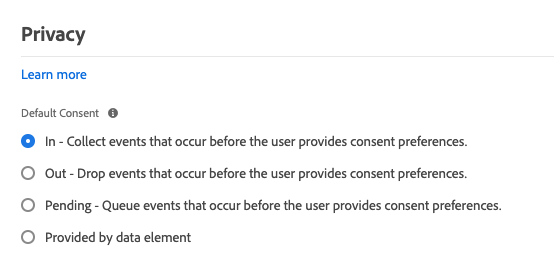

# Información general

La extensión del SDK web de Adobe Experience Platform envía datos a Adobe Experience Cloud desde las propiedades web a través de Adobe Experience Platform Edge Network. La extensión le permite transmitir datos a Platform, sincronizar identidades, procesar señales de consentimiento del cliente y recopilar automáticamente datos de contexto.

Este documento explica cómo configurar la extensión en la interfaz de usuario de Adobe Experience Platform Launch.

## Configurar la extensión de

Si la extensión del SDK web de Platform ya se ha instalado para una propiedad, abra la propiedad en la interfaz de usuario del Platform launch y seleccione la pestaña **[!UICONTROL Extensions]**. En el SDK web de Platform, seleccione **[!UICONTROL Configurar]**.

Si todavía no ha instalado la extensión, seleccione la pestaña **[!UICONTROL Catalog]**. En la lista de extensiones disponibles, busque la extensión del SDK web de Platform y seleccione **[!UICONTROL Install]**.

En ambos casos, llega a la página de configuración del SDK web de Platform. Las secciones siguientes explican las opciones de configuración de la extensión.

## Opciones de configuración generales

Las opciones de configuración en la parte superior de la página indican a Adobe Experience Platform dónde enrutar los datos y qué configuraciones utilizar en el servidor.

### [!UICONTROL Nombre]

La extensión del SDK web de Adobe Experience Platform admite varias instancias en la página. El nombre se utiliza para enviar datos a varias organizaciones con una sola configuración de Platform launch.

El nombre predeterminado de la extensión es &quot;[!DNL alloy]&quot;. Sin embargo, puede cambiar el nombre de la instancia a cualquier nombre de objeto JavaScript válido.

### **[!UICONTROL ID de organización de IMS]**

El [!UICONTROL IMS Organization ID] es la organización a la que desea que se envíen los datos en el Adobe. La mayoría de las veces, utilice el valor predeterminado que se rellena automáticamente. Cuando tenga varias instancias en la página, rellene este campo con el valor de la segunda organización a la que desee enviar datos.

### **[!UICONTROL Dominio de Edge]**

El [!UICONTROL Dominio perimetral] es el dominio desde el cual la extensión de Adobe Experience Platform envía y recibe datos. La extensión requiere que utilice un CNAME de origen para el tráfico de producción. El dominio de terceros predeterminado funciona para entornos de desarrollo, pero no es adecuado para entornos de producción. Las instrucciones sobre cómo configurar un CNAME de origen se enumeran [aquí](https://experienceleague.adobe.com/docs/core-services/interface/ec-cookies/cookies-first-party.html?lang=es).

## [!UICONTROL Corrientes de datos]

Cuando se envía una solicitud a la red perimetral de Adobe Experience Platform, se utiliza un ID de conjunto de datos para hacer referencia a la configuración del lado del servidor. Puede actualizar la configuración sin tener que realizar cambios de código en el sitio web.

Consulte la guía de [datastreams](../fundamentals/datastreams.md) para obtener más información.

## [!UICONTROL Privacidad]

La sección [!UICONTROL Privacidad] le permite configurar el modo en que el SDK gestiona las señales de consentimiento del usuario desde el sitio web. Específicamente, le permite seleccionar el nivel predeterminado de consentimiento que se asume de un usuario si no se ha proporcionado ninguna otra preferencia de consentimiento explícito. El nivel de consentimiento predeterminado no se guarda en el perfil del usuario. La tabla siguiente desglosa lo que implica cada opción:

| [!UICONTROL Nivel de consentimiento predeterminado] | Descripción |
| --- | --- |
| [!UICONTROL En] | Recopile eventos que se producen antes de que el usuario proporcione preferencias de consentimiento. |
| [!UICONTROL Salida] | Descartar los eventos que se producen antes de que el usuario proporcione las preferencias de consentimiento. |
| [!UICONTROL Pendiente] | Eventos de cola que se producen antes de que el usuario proporcione las preferencias de consentimiento. Cuando se proporcionan las preferencias de consentimiento, los eventos se recopilan o descartan en función de las preferencias proporcionadas. |
| [!UICONTROL Proporcionado por un elemento de datos] | El nivel de consentimiento predeterminado está determinado por un elemento de datos independiente que usted defina. Al utilizar esta opción, debe especificar el elemento de datos mediante el menú desplegable proporcionado. |

Utilice Out o Pending si necesita consentimiento explícito del usuario para sus operaciones comerciales.

## [!UICONTROL Identidad]

### [!UICONTROL Migración de ECID desde VisitorAPI]

Esta opción está habilitada de manera predeterminada. Cuando esta función está habilitada, el SDK puede leer las cookies AMCV y s_ecid y establecer la cookie AMCV utilizada por Visitor.js. Esta función es importante al migrar al SDK web de Adobe Experience Platform, ya que algunas páginas podrían seguir utilizando Visitor.js. Permite al SDK seguir utilizando el mismo ECID para que los usuarios no se identifiquen como dos usuarios independientes.

### [!UICONTROL Usar cookies de terceros]

Esta opción permite al SDK intentar almacenar un identificador de usuario en una cookie de terceros. Si se realiza correctamente, el usuario se identifica como un único usuario a medida que navega por varios dominios, en lugar de identificarse como un usuario independiente en cada dominio. Si esta opción está habilitada, es posible que el SDK no pueda almacenar el identificador de usuario en una cookie de terceros si el explorador no admite cookies de terceros o si el usuario lo ha configurado para que no permita cookies de terceros. En este caso, el SDK solo almacena el identificador en el dominio de origen.

## [!UICONTROL Personalización]

Si desea ocultar ciertas partes si el sitio mientras se carga contenido personalizado, puede especificar los elementos que desea ocultar en el editor de estilos de preocultación. A continuación, puede copiar el fragmento de preocultación predeterminado que se le ha proporcionado y pegarlo dentro del elemento `<head>`del sitio HTML.

## [!UICONTROL Recopilación de datos]

### [!UICONTROL Función Callback]

La función de llamada de retorno proporcionada en la extensión también se denomina [`onBeforeEventSend` función](https://experienceleague.adobe.com/docs/experience-platform/edge/fundamentals/configuring-the-sdk.html?lang=en) en la biblioteca. Esta función le permite modificar eventos globalmente antes de enviarlos a Adobe Edge Network. Puede encontrar más información detallada sobre cómo utilizar esta función [aquí](https://experienceleague.adobe.com/docs/experience-platform/edge/fundamentals/tracking-events.html?lang=en#modifying-events-globally).

### [!UICONTROL Haga clic en la recopilación de datos]

El SDK puede recopilar automáticamente información sobre clics en vínculos. De forma predeterminada, esta función está habilitada, pero se puede deshabilitar con esta opción. Los vínculos también se etiquetan como vínculos de descarga si contienen una de las expresiones de descarga enumeradas en el cuadro de texto [!UICONTROL Download Link Qualifier]. Adobe le proporciona algunos calificadores de vínculo de descarga predeterminados, pero estos se pueden editar en cualquier momento.

### [!UICONTROL Datos de contexto recopilados automáticamente]

De forma predeterminada, el SDK recopila ciertos datos de contexto relacionados con el dispositivo, la web, el entorno y el contexto de lugar. Si desea ver una lista de la información que recopila el Adobe, puede encontrarla [aquí](https://experienceleague.adobe.com/docs/experience-platform/edge/data-collection/automatic-information.html?lang=en). Si no desea que se recopilen estos datos o solo desea que se recopilen determinadas categorías de datos, puede cambiar estas opciones.

## [!UICONTROL Configuración avanzada]

### [!UICONTROL Ruta base del borde]

Utilice este campo si necesita cambiar la ruta base que se utiliza para interactuar con Adobe Edge Network. Esto no debería requerir actualización, pero en el caso de que participe en una versión beta o alfa, el Adobe podría pedirle que cambie este campo.
