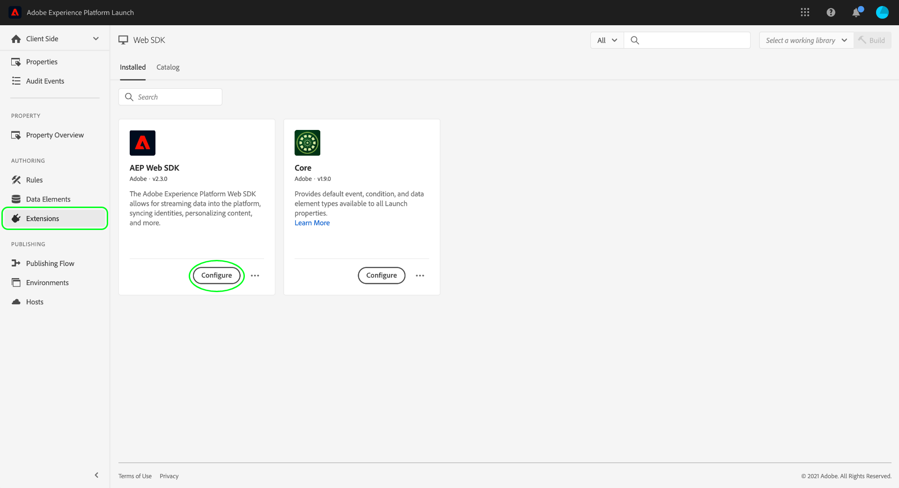
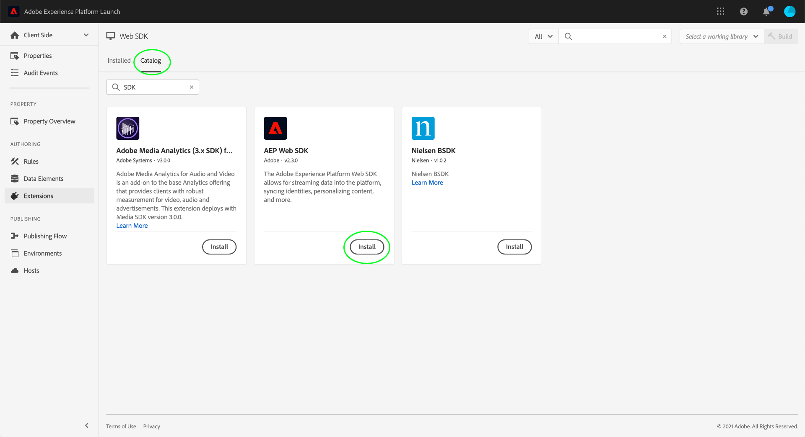

# Información general sobre la extensión del SDK web de Adobe Experience Platform

La extensión Adobe Experience Platform Web SDK envía datos a Adobe Experience Cloud desde las propiedades web a través de Adobe Experience Platform Edge Network. La extensión le permite transmitir datos a la plataforma, sincronizar identidades, procesar señales de consentimiento del cliente y recopilar automáticamente datos de contexto.

Este documento explica cómo configurar la extensión en la interfaz de usuario de Adobe Experience Platform Launch.

## Configurar la extensión de

Si la extensión del SDK web de plataforma ya se ha instalado para una propiedad, abra la propiedad en la interfaz de usuario de Platform launch y seleccione la ficha **[!UICONTROL Extensiones]**. En el SDK web de plataforma, seleccione **[!UICONTROL Configurar]**.

Si aún no ha instalado la extensión, seleccione la ficha **[!UICONTROL Catálogo]**. En la lista de extensiones disponibles, busque la extensión del SDK web de plataforma y seleccione **[!UICONTROL Instalar]**.

En ambos casos, se llega a la página de configuración del SDK web de plataforma. Las secciones siguientes explican las opciones de configuración de la extensión.

## Opciones de configuración generales

Las opciones de configuración en la parte superior de la página indican a Adobe Experience Platform dónde enrutar los datos y qué configuraciones deben utilizarse en el servidor.

### [!UICONTROL Nombre]

La extensión Adobe Experience Platform Web SDK admite varias instancias en la página. Se utiliza para enviar datos a varias organizaciones con una sola configuración de Platform Launch.

El nombre predeterminado de la extensión es &quot;[!DNL alloy]&quot;. Sin embargo, puede cambiar el nombre de la instancia a cualquier nombre de objeto JavaScript válido.

### **[!UICONTROL ID de organización de IMS]**

El [!UICONTROL identificador de organización de IMS] es la organización a la que desea que se envíen los datos en el Adobe. La mayoría de las veces, debe utilizar el valor predeterminado que se propaga automáticamente. Cuando tenga varias instancias en la página, rellene este campo con el valor de la segunda organización a la que desee enviar datos.

### **[!UICONTROL Dominio de Edge]**

El [!UICONTROL Dominio de Edge] es el dominio desde el que la extensión de Adobe Experience Platform envía y recibe datos. La extensión requiere que utilice un CNAME de origen para el tráfico de producción. El dominio de terceros predeterminado funciona para entornos de desarrollo, pero no es adecuado para entornos de producción. Las instrucciones sobre cómo configurar un CNAME de origen se enumeran [aquí](https://docs.adobe.com/content/help/es-ES/core-services/interface/ec-cookies/cookies-first-party.html).

## [!UICONTROL Configuraciones de Edge]

Cuando se envía una solicitud a Adobe Experience Platform Edge Network, se utiliza un ID de configuración Edge para hacer referencia a la configuración del lado del servidor. Esto le permite actualizar la configuración sin tener que realizar cambios de código en el sitio web.

Consulte la guía de [configuraciones de Edge](../fundamentals/edge-configuration.md) para obtener más información.

## [!UICONTROL Privacidad]

La sección [!UICONTROL Privacidad] permite configurar la forma en que el SDK gestiona las señales de consentimiento del cliente desde su sitio Web. Específicamente, le permite seleccionar el nivel predeterminado de consentimiento que se supone de un cliente si no se ha proporcionado ninguna otra preferencia de consentimiento explícito. En la tabla siguiente se desglosa el contenido de cada opción:

| [!UICONTROL Nivel de consentimiento predeterminado] | Descripción |
| --- | --- |
| [!UICONTROL En] | Inclusión. Utilice esta opción si asume el consentimiento del cliente de forma predeterminada y solo respeta las señales de exclusión. |
| [!UICONTROL Pendiente] | Se supone que los clientes con consentimiento &quot;pendiente&quot; se exclusión hasta que se envía una señal de inclusión. Utilice esta opción si necesita el consentimiento explícito del cliente para sus operaciones comerciales. |
| [!UICONTROL Proporcionado por el elemento de datos] | El nivel de consentimiento predeterminado está determinado por un elemento de datos independiente que usted define. Al utilizar esta opción, debe especificar el elemento de datos mediante el menú desplegable proporcionado. |