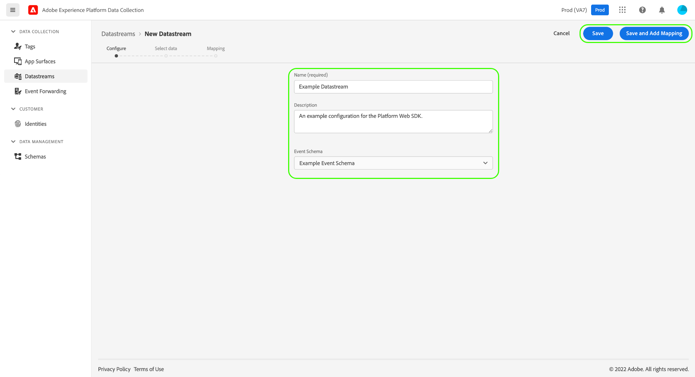

# Configurar un conjunto de datos

Un conjunto de datos representa la configuración del lado del servidor al implementar los SDK web y móviles de Adobe Experience Platform. Mientras que la variable [configurar, comando](configuring-the-sdk.md) en el SDK controla los elementos que se deben gestionar en el cliente (como el `edgeDomain`), los conjuntos de datos administran todas las demás configuraciones para el SDK. Cuando se envía una solicitud a la red perimetral de Adobe Experience Platform, la variable `edgeConfigId` se utiliza para hacer referencia al conjunto de datos. Esto le permite actualizar la configuración del lado del servidor sin tener que realizar cambios de código en el sitio web.

Este documento trata los pasos para configurar un conjunto de datos en la interfaz de usuario de la recopilación de datos.

>[!NOTE]
>
>Su organización debe estar aprovisionada para esta función a fin de acceder a ella en la interfaz de usuario de . Si no tiene acceso, rellene lo siguiente [formulario](http://adobe.ly/websdkaccess) y le concederemos el acceso necesario.

## Acceda a la [!UICONTROL Datastreams] workspace

Puede crear y administrar conjuntos de datos en la interfaz de usuario de recopilación de datos seleccionando **[!UICONTROL Datastreams]** en el panel de navegación izquierdo.

>[!NOTE]
>
>Mientras que puede acceder a la [!UICONTROL Datastreams] independientemente de si utiliza las funcionalidades de administración de etiquetas de Platform, debe tener permisos de desarrollador para administrar los propios conjuntos de datos. Consulte la [permisos de usuario](../../tags/ui/administration/user-permissions.md) en la documentación de etiquetas para obtener más información.

La variable [!UICONTROL Datastreams] muestra una lista de conjuntos de datos existentes, que incluye su nombre descriptivo, ID y fecha de la última modificación. Seleccione el nombre de un conjunto de datos a [ver sus detalles y configurar servicios](#view-details).

Seleccione el icono &quot;more&quot; (**...**) para un conjunto de datos específico para mostrar más opciones. Select **[!UICONTROL Editar]** para actualizar el [configuración básica](#configure) para el conjunto de datos, o seleccione **[!UICONTROL Eliminar]** para eliminar el conjunto de datos.

## Crear un nuevo conjunto de datos {#create}

Para crear un conjunto de datos, comience seleccionando **[!UICONTROL Nuevo conjunto de datos]**.

### [!UICONTROL Configurar] {#configure}

Aparecerá el flujo de trabajo de creación del conjunto de datos, empezando por el paso de configuración. A partir de aquí, debe proporcionar un nombre y una descripción opcional para el conjunto de datos.

Si está configurando este conjunto de datos para utilizarlo en Experience Platform y utiliza el SDK web de plataforma, también debe seleccionar una [esquema del Modelo de datos de experiencias (XDM) basado en eventos](../../xdm/classes/experienceevent.md) para representar los datos que planea introducir.

Select **[!UICONTROL Opciones avanzadas]** para mostrar controles adicionales para configurar el conjunto de datos.

| Configuración | Descripción |
| --- | --- |
| [!UICONTROL Ubicación geográfica] | Determina si se producen búsquedas de GPS en función de la dirección IP del usuario. La configuración predeterminada **[!UICONTROL Ninguna]** deshabilita las búsquedas de GPS, mientras que la función **[!UICONTROL Ciudad]** proporciona coordenadas GPS a dos decimales. |
| [!UICONTROL Cookie de ID de origen] | Cuando está habilitada, esta configuración indica a la red perimetral que haga referencia a una cookie especificada al buscar una [ID de dispositivo de origen](../identity/first-party-device-ids.md), en lugar de buscar este valor en el mapa de identidad.  Al habilitar esta configuración, debe proporcionar el nombre de la cookie en la que se espera que se almacene el ID. |
| [!UICONTROL Sincronización de ID de terceros] | Las sincronizaciones de ID se pueden agrupar en contenedores para permitir que diferentes sincronizaciones de ID se ejecuten en momentos diferentes. Cuando está habilitada, esta configuración le permite especificar qué contenedor de sincronizaciones de ID se ejecuta para este conjunto de datos. |

El resto de esta sección se centra en los pasos para asignar datos a un esquema de evento de Platform seleccionado. Si utiliza el SDK móvil o no está configurando el conjunto de datos para la plataforma, seleccione **[!UICONTROL Guardar]** antes de pasar a la siguiente sección de [agregar servicios al conjunto de datos](#add-services).

### Preparación de datos para la recopilación de datos {#data-prep}

>[!IMPORTANT]
>
>Actualmente, la preparación de datos para la recopilación de datos no es compatible con las implementaciones de SDK para móviles.

La preparación de datos es un servicio de Experience Platform que permite asignar, transformar y validar datos desde y hacia el modelo de datos de Experience (XDM). Al configurar un conjunto de datos habilitado para la plataforma, puede utilizar las capacidades de preparación de datos para asignar los datos de origen a XDM al enviarlos a la red perimetral de la plataforma.

Las subsecciones siguientes tratan los pasos básicos para asignar los datos dentro de la interfaz de usuario de recopilación de datos. Para obtener una guía completa sobre todas las funciones de preparación de datos, incluidas las funciones de transformación para campos calculados, consulte la siguiente documentación:

* [Resumen de la preparación de datos](../../data-prep/home.md)
* [Funciones de asignación de preparación de datos](../../data-prep/functions.md)
* [Gestión de formatos de datos con la preparación de datos](../../data-prep/data-handling.md)

#### [!UICONTROL Selección de datos]

Select **[!UICONTROL Guardar y agregar asignaciones]** después de completar la [paso básico de configuración](#configure)y **[!UICONTROL Seleccionar datos]** aparece. A partir de aquí, debe proporcionar un objeto JSON de muestra que represente la estructura de los datos que planea enviar a Platform. Puede seleccionar la opción para cargar el objeto como archivo o pegar el objeto sin procesar en el cuadro de texto proporcionado.

>[!IMPORTANT]
>
>El objeto JSON debe tener un solo nodo raíz `data` para pasar la validación.

Si el JSON es válido, se muestra un esquema de vista previa en el panel derecho. Haga clic en **[!UICONTROL Siguiente]** para continuar.

#### [!UICONTROL Asignación]

La variable **[!UICONTROL Asignación]** , lo que le permite asignar los campos de los datos de origen a los del esquema de evento de destino en Platform. Para empezar, seleccione **[!UICONTROL Añadir nueva asignación]** para crear una nueva fila de asignación.

Seleccione el icono de origen () y, en el cuadro de diálogo que aparece, seleccione el campo de origen que desea asignar en el lienzo proporcionado. Una vez que haya elegido un campo, utilice la variable **[!UICONTROL Select]** para continuar.

A continuación, seleccione el icono de esquema () para abrir un cuadro de diálogo similar para el esquema de eventos de destino. Elija el campo al que desea asignar los datos antes de confirmar con **[!UICONTROL Select]**.

La página de asignación vuelve a aparecer con la asignación de campo completada que se muestra. La variable **[!UICONTROL Asignación del progreso]** actualizaciones de sección para reflejar el número total de campos que se han asignado correctamente.

Siga los pasos anteriores para asignar el resto de los campos al esquema de destino. Aunque no es necesario asignar todos los campos de origen disponibles, cualquier campo del esquema de destino que esté configurado como necesario debe asignarse para completar este paso. La variable **[!UICONTROL Campos requeridos]** counter indica cuántos campos obligatorios aún no están asignados en la configuración actual.

Una vez que el recuento de campos requerido alcance cero y esté satisfecho con la asignación, seleccione **[!UICONTROL Guardar]** para finalizar los cambios.

## Ver detalles del almacén de datos {#view-details}

Después de configurar un nuevo conjunto de datos o de seleccionar uno existente para verlo, aparecerá la página de detalles de ese conjunto de datos. Aquí puede encontrar más información sobre el conjunto de datos, incluido su ID.

Desde la pantalla de detalles del almacén de datos, puede [agregar servicios](#add-services) para habilitar las funcionalidades de los productos de Adobe Experience Cloud a los que tiene acceso.

## Añadir servicios a un conjunto de datos {#add-services}

En la página de detalles de un conjunto de datos, seleccione **[!UICONTROL Añadir servicio]** para empezar a añadir servicios disponibles para ese conjunto de datos.

En la siguiente pantalla, utilice el menú desplegable para seleccionar un servicio de configuración para este conjunto de datos. En esta lista solo aparecen los servicios a los que tiene acceso.

Seleccione el servicio deseado, rellene las opciones de configuración que aparecen y, a continuación, seleccione **[!UICONTROL Guardar]** para agregar el servicio al conjunto de datos. Todos los servicios añadidos aparecen en la vista de detalles del conjunto de datos.

Las subsecciones siguientes describen las opciones de configuración de cada servicio.

>[!NOTE]
>
>Cada configuración de servicio contiene un **[!UICONTROL Habilitado]** que se activa automáticamente cuando se selecciona el servicio. Para desactivar el servicio seleccionado para este conjunto de datos, seleccione el **[!UICONTROL Habilitado]** volver a alternar.

### Configuración de Adobe Analytics

Este servicio controla si los datos se envían a Adobe Analytics y cómo se hacen. Encontrará más detalles en la guía de [envío de datos a Analytics](../data-collection/adobe-analytics/analytics-overview.md).

| Configuración | Descripción |
| --- | --- |
| [!UICONTROL ID del grupo de informes] | **(Obligatorio)** El ID del grupo de informes de Analytics al que desea enviar los datos. Este ID se puede encontrar en la interfaz de usuario de Adobe Analytics, en [!UICONTROL Administrador] > [!UICONTROL Grupos de informes]. Si se especifican varios grupos de informes, los datos se copian en cada grupo de informes. |

### Configuración de Adobe Audience Manager

Este servicio controla si los datos se envían a Adobe Audience Manager y cómo se hacen. Todo lo que se necesita para enviar datos al Audience Manager es habilitar esta sección. Los demás ajustes son opcionales, pero se recomienda.

| Configuración | Descripción |
| --- | --- |
| [!UICONTROL Destinos de cookies habilitados] | Permite al SDK compartir información de segmentos mediante [destinos de cookies](https://experienceleague.adobe.com/docs/audience-manager/user-guide/features/destinations/custom-destinations/create-cookie-destination.html) from [!DNL Audience Manager]. |
| [!UICONTROL Destinos de URL habilitados] | Permite al SDK compartir información de segmentos mediante [Destinos de URL](https://experienceleague.adobe.com/docs/audience-manager/user-guide/features/destinations/custom-destinations/create-url-destination.html) from [!DNL Audience Manager]. |

### Configuración de Adobe Experience Platform

>[!IMPORTANT]
>
>Al habilitar un conjunto de datos para Platform, tome nota del simulador de pruebas de Platform que está utilizando actualmente, tal y como se muestra en la cinta superior de la interfaz de usuario de la recopilación de datos.
>
>
>
>Los entornos limitados son particiones virtuales en Adobe Experience Platform que le permiten aislar los datos y las implementaciones de otras personas de su organización. Una vez creado un conjunto de datos, su simulador de pruebas no se puede cambiar. Para obtener más información sobre la función de los entornos limitados en el Experience Platform, consulte la [documentación de entornos limitados](../../sandboxes/home.md).

Este servicio controla si los datos se envían a Adobe Experience Platform y cómo se hacen.

| Configuración | Descripción |
| --- | --- |
| [!UICONTROL Conjunto de datos del evento] | **(Obligatorio)** Seleccione el conjunto de datos de Platform al que se transmitirán los datos de eventos del cliente. Este esquema debe utilizar la variable [Clase XDM ExperienceEvent](../../xdm/classes/experienceevent.md). |
| [!UICONTROL Conjunto de datos de perfil] | Seleccione el conjunto de datos de Platform al que se enviarán los datos de atributos del cliente. Este esquema debe utilizar la variable [Clase de perfil individual XDM](../../xdm/classes/individual-profile.md). |
| [!UICONTROL Offer Decisioning] | Seleccione esta casilla de verificación para habilitar el Offer decisioning para una implementación del SDK web de Platform. Consulte la guía de [uso del Offer decisioning con el SDK web de Platform](../personalization/offer-decisioning/offer-decisioning-overview.md) para obtener más información sobre la implementación. Para obtener más información sobre las funciones de Offer decisioning, consulte la [Documentación de Adobe Journey Optimizer](https://experienceleague.adobe.com/docs/journey-optimizer/using/offer-decisioniong/get-started/starting-offer-decisioning.html?lang=es). |
| [!UICONTROL Segmentación de Edge] | Active esta casilla de verificación para habilitar [segmentación de arista](../../segmentation/ui/edge-segmentation.md) para este conjunto de datos. Cuando el SDK envía datos a través de un conjunto de datos habilitado para la segmentación perimetral, cualquier pertenencia de segmento actualizada para el perfil en cuestión se devuelve en la respuesta.  Esta opción se puede utilizar en combinación con [!UICONTROL Destinos de personalización] para [casos de uso de personalización de páginas siguientes](../../destinations/ui/configure-personalization-destinations.md). |
| [!UICONTROL Destinos de personalización] | Cuando se utiliza en combinación con la variable [!UICONTROL Segmentación de Edge] , esta opción permite que el conjunto de datos se conecte a motores de personalización como Adobe Target. Consulte la documentación de destinos para ver los pasos específicos sobre [configuración de destinos de personalización](../../destinations/ui/configure-personalization-destinations.md). |

### Configuración de Adobe Target

Este servicio controla si los datos se envían a Adobe Target y cómo se hacen.

| Configuración | Descripción |
| --- | --- |
| [!UICONTROL Token de propiedad] | [!DNL Target] permite a los clientes controlar los permisos mediante el uso de propiedades. Para obtener más información sobre las propiedades, consulte la guía de [configuración de permisos de Enterprise](https://experienceleague.adobe.com/docs/target/using/administer/manage-users/enterprise/properties-overview.html?lang=es) en el [!DNL Target] documentación.  El token de propiedad se puede encontrar en la interfaz de usuario de Adobe Target, en [!UICONTROL Configuración] > [!UICONTROL Propiedades]. |
| [!UICONTROL ID de entorno de Target] | [Entornos en Adobe Target](https://experienceleague.adobe.com/docs/target/using/administer/hosts.html) le ayuda a administrar su implementación en todas las etapas de desarrollo. Esta configuración especifica el entorno que se va a utilizar con este conjunto de datos.  Una práctica recomendada es configurar esto de forma diferente para cada uno de sus `dev`, `stage`y `prod` entornos de datastream para mantener las cosas simples. Sin embargo, si ya tiene definidos entornos de Adobe Target, puede utilizarlos. |
| [!UICONTROL Área de nombres de ID de terceros de Target] | El área de nombres de identidad para la variable `mbox3rdPartyId` desea usar para este conjunto de datos. Consulte la guía de [implementación `mbox3rdPartyId` con el SDK web](../personalization/adobe-target/using-mbox-3rdpartyid.md) para obtener más información. |

### [!UICONTROL Reenvío de eventos] configuración

Este servicio controla si los datos se envían a [reenvío de eventos](../../tags/ui/event-forwarding/overview.md).

| Configuración | Descripción |
| --- | --- |
| [!UICONTROL Propiedad Launch] | **(Obligatorio)** La propiedad de reenvío de eventos a la que desea enviar datos. |
| [!UICONTROL Entorno de Launch] | **(Obligatorio)** El entorno dentro de la propiedad seleccionada al que desea enviar los datos. |

>[!NOTE]
>
>Puede seleccionar **[!UICONTROL Introducir ID manualmente]** para escribir los nombres de propiedad y entorno en lugar de usar los menús desplegables.

## Pasos siguientes

Esta guía explica cómo configurar un conjunto de datos en la interfaz de usuario de la recopilación de datos. Para obtener más información sobre cómo instalar y configurar el SDK web después de configurar un conjunto de datos, consulte la [Guía de recopilación de datos E2E](../../collection/e2e.md#install).
