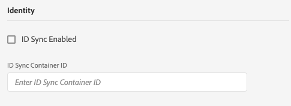

# Configuración del borde

La configuración del SDK web de Adobe Experience Platform se divide entre dos lugares. El comando  configure del SDK controla los elementos que deben gestionarse en el cliente, como el `edgeDomain`. La configuración de Edge gestiona el resto de la configuración del SDK. Cuando se envía una solicitud a Adobe Experience Platform Edge Network, `edgeConfigId` se utiliza para hacer referencia a la configuración del lado del servidor. Esto le permite actualizar la configuración sin tener que realizar cambios de código en el sitio web.

Se debe aprovisionar a su organización para esta función. Póngase en contacto con su administrador de software certificado (CSM) para ponerse en la lista de permitidos.

## Creación de una configuración de Edge

Las configuraciones de Edge se pueden crear en Adobe [!DNL Experience Platform Launch] mediante la herramienta de configuración de Edge.

>[!NOTE]
>
>La herramienta de configuración de Edge está disponible para los clientes de la lista de permitidos, independientemente de si utilizan [!DNL Experience Platform Launch] como administrador de etiquetas. Además, los usuarios necesitan permisos de desarrollo en [!DNL Experience Platform Launch]. Consulte el artículo Permisos [de](https://docs.adobe.com/content/help/es-ES/launch/using/reference/admin/user-permissions.html) usuario en la [!DNL Experience Platform Launch] documentación para obtener más información.

Cree una configuración de Edge haciendo clic en **[!UICONTROL Nueva configuración]** de Edge en el área superior derecha de la pantalla. Después de proporcionar un nombre y una descripción, se le pedirá la configuración predeterminada para cada entorno. La configuración disponible se detalla a continuación.

Al crear una configuración de borde, se crean automáticamente tres entornos con una configuración idéntica. Estos tres entornos son *dev*, *stage* y *prod*. Coinciden con los tres entornos predeterminados de [!DNL Experience Platform Launch]. Cuando crea una [!DNL Experience Platform Launch] biblioteca en un entorno dev, la biblioteca utiliza automáticamente el entorno dev de la configuración. Puede editar la configuración de entornos individuales tanto como desee.

El ID utilizado en el SDK como `edgeConfigId` es un ID compuesto que especifica la configuración y el entorno (por ejemplo, `1c86778b-cdba-4684-9903-750e52912ad1:stage`). Si no hay ningún entorno presente en el ID compuesto (por ejemplo, `stage` en el ejemplo anterior), se utiliza el entorno de producción.

A continuación encontrará la configuración disponible para cada entorno de configuración. La mayoría de las secciones se pueden habilitar o deshabilitar. Cuando se deshabilita, la configuración se guarda pero no se activa.

## [!UICONTROL Configuración de identidad]

La sección de identidad es la única sección que siempre está activada. Tiene dos configuraciones disponibles: &quot;Sincronizaciones[!UICONTROL de ID habilitadas]&quot; e &quot;ID de Contenedor[!UICONTROL de sincronización de]ID&quot;.

### [!UICONTROL Sincronización de ID habilitada]

Controla si el SDK realiza o no sincronizaciones de identidad con socios de terceros.

### [!UICONTROL ID de Contenedor de sincronización de ID]

Las sincronizaciones de ID se pueden agrupar en contenedores para permitir que las distintas sincronizaciones de ID se ejecuten en momentos diferentes. Controla qué contenedor de sincronización de ID se ejecuta para un ID de configuración determinado.

## Configuración de Adobe Experience Platform

La configuración que se muestra aquí le permite enviar datos a Adobe Experience Platform. Solo debe habilitar esta sección si ha adquirido el Adobe Experience Platform.

### [!UICONTROL Simulador para pruebas]

Los Simuladores para pruebas son ubicaciones en Adobe Experience Platform que permiten a los clientes aislar sus datos e implementaciones entre sí. Para obtener más información sobre cómo funcionan, consulte la documentación [de los](../../sandboxes/home.md)Simuladores para pruebas.

### [!UICONTROL Entrada de flujo continuo]

Una entrada de flujo continuo es un origen HTTP en Adobe Experience Platform. Se crean en la ficha &quot;[!UICONTROL Fuentes]&quot; de Adobe Experience Platform como una API HTTP.

### [!UICONTROL Conjunto de datos de evento]

Las configuraciones de Edge admiten el envío de datos a conjuntos de datos que tienen un esquema de clase [!UICONTROL Experience Evento].

## Configuración de Adobe Target

Para configurar Adobe Target, debe proporcionar un código de cliente. Los demás campos son opcionales.

>[!NOTE]
>
>La organización asociada con el código de cliente debe coincidir con la organización en la que se crea el ID de configuración.

### [!UICONTROL Código de cliente]

ID única de una cuenta de destinatario. Para encontrarlo, puede navegar a [!UICONTROL Adobe Target] > [!UICONTROL Configuración]> [!UICONTROL Implementación] > [!UICONTROL editar la configuración] al lado del botón de [!UICONTROL descarga]  [!UICONTROL para at.js o para mbox.js]

### [!UICONTROL Token de propiedad]

[!DNL Target] permite a los clientes controlar los permisos mediante el uso de propiedades. Encontrará más información en la sección Permisos [de](https://docs.adobe.com/content/help/es-ES/target/using/administer/manage-users/enterprise/properties-overview.html) Enterprise de la [!DNL Target] documentación.

El token de propiedad se encuentra en [!UICONTROL Adobe Target] > [!UICONTROL Configuración] > [!UICONTROL Propiedades]

### [!UICONTROL ID de Entorno de destinatario]

[Los entornos](https://docs.adobe.com/content/help/en/target/using/administer/hosts.html) de Adobe Target le ayudan a administrar su implementación en todas las etapas de desarrollo. Esta configuración especifica qué entorno se va a usar con cada entorno.

Adobe recomienda que esto se establezca de forma diferente para cada uno de los entornos de configuración `dev`, `stage`y `prod` borde para que las cosas sean sencillas. Sin embargo, si ya tiene definidos entornos de Adobe Target, puede utilizarlos.

## Configuración de Adobe Audience Manager

Todo lo que se necesita para enviar datos a Adobe Audience Manager es habilitar esta sección. Los demás ajustes son opcionales pero se recomienda.

### [!UICONTROL Destinos de cookies habilitados]

Permite que el SDK comparta información de segmentos mediante [destinos](https://docs.adobe.com/content/help/en/audience-manager/user-guide/features/destinations/custom-destinations/create-cookie-destination.html) de cookies desde [!DNL Audience Manager].

### [!UICONTROL Destinos de URL habilitados]

Permite que el SDK comparta información de segmentos a través de destinos [URL](https://docs.adobe.com/content/help/en/audience-manager/user-guide/features/destinations/custom-destinations/create-url-destination.html). Estos se configuran en [!DNL Audience Manager].

## Configuración de Adobe Analytics

Controla si los datos se envían a Adobe Analytics. Encontrará más información en Información general sobre [Analytics](../data-collection/adobe-analytics/analytics-overview.md).

### [!UICONTROL ID del grupo de informes]

El grupo de informes se encuentra en la sección Administración de Adobe Analytics, en [!UICONTROL Administración > Grupos de informes]. Si se especifican varios grupos de informes, los datos se copian en cada grupo de informes.
