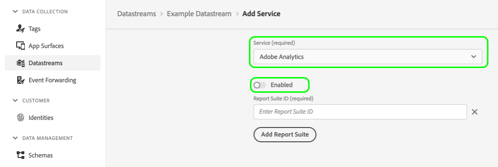

# Registro del lado del cliente para datos de A4T en el SDK web de Platform

## Información general {#overview}

El SDK web de Adobe Experience Platform le permite recopilar [Adobe Analytics para Target (A4T)](https://experienceleague.adobe.com/docs/target/using/integrate/a4t/a4t.html?lang=es) en el lado del cliente de la aplicación web.

El registro en el lado del cliente significa que es relevante [!DNL Target] los datos se devuelven del lado del cliente, lo que le permite recopilarlos y compartirlos con Analytics. Esta opción debe habilitarse si desea enviar manualmente datos a Analytics mediante el complemento [API de inserción de datos](https://experienceleague.adobe.com/docs/analytics/import/c-data-insertion-api.html).

>[!NOTE]
>
>Un método para realizar esto mediante [AppMeasurement.js](https://experienceleague.adobe.com/docs/analytics/implementation/js/overview.html?lang=es) está actualmente en desarrollo y estará disponible en un futuro próximo.

Este documento trata los pasos para configurar el registro A4T del lado del cliente para el SDK web y proporciona algunos ejemplos de implementación para casos de uso comunes.

## Requisitos previos {#prerequisites}

Este tutorial supone que está familiarizado con los conceptos y procesos fundamentales relacionados con el uso del SDK web para fines de personalización. Consulte la siguiente documentación si necesita una introducción:

* [Configuración del SDK web](../../../fundamentals/configuring-the-sdk.md)
* [Envío de eventos](../../../fundamentals/tracking-events.md)
* [Representación de contenido personalizado](../../rendering-personalization-content.md)

## Configuración del registro de cliente de Analytics {#set-up-client-side-logging}

Las siguientes subsecciones describen cómo habilitar el registro del lado del cliente de Analytics para la implementación del SDK web.

### Habilitar el registro en el lado del cliente de Analytics {#enable-analytics-client-side-logging}

Para tener en cuenta que el registro del lado del cliente de Analytics está habilitado para la implementación, debe deshabilitar la configuración de Adobe Analytics en su [datastream](../../../datastreams/overview.md).



### Recuperar [!DNL A4T] datos del SDK y enviarlos a Analytics {#a4t-to-analytics}

Para que este método de informes funcione correctamente, debe enviar la variable [!DNL A4T] datos relacionados recuperados de [`sendEvent`](../../../fundamentals/tracking-events.md) en la visita de Analytics.

Cuando Target Edge calcula una respuesta de propuestas, comprueba si el registro del lado del cliente de Analytics está habilitado (es decir, si Analytics está deshabilitado en el conjunto de datos). Si el registro del lado del cliente está habilitado, el sistema agrega un token de Analytics a cada propuesta en la respuesta.

El flujo tiene un aspecto similar al siguiente:


El siguiente es un ejemplo de `interact` cuando el registro del lado del cliente de Analytics está habilitado. Si la propuesta es para una actividad que tiene informes de Analytics, tendrá un `scopeDetails.characteristics.analyticsToken` propiedad.

```json
{
  "requestId": "1234",
  "handle": [
    {
      "payload": [
        {
          "id": "AT:eyJhY3Rpdml0eUlkIjoiNDM0Njg5IiwiZXhwZXJpZW5jZUlkIjoiMCJ9",
          "scope": "a4t-test",
          "scopeDetails": {
            "decisionProvider": "TGT",
            "activity": {
              "id": "434689"
            },
            "experience": {
              "id": "0"
            },
            "strategies": [
              {
                "algorithmID": "0",
                "trafficType": "0"
              }
            ],
            "characteristics": {
              "eventToken": "2lTS5KA6gj4JuSjOdhqUhGqipfsIHvVzTQxHolz2IpTMromRrB5ztP5VMxjHbs7c6qPG9UF4rvQTJZniWgqbOw==",
              "analyticsToken": "434689:0:0|2,434689:0:0|1"
            }
          },
          "items": [
            {
              "id": "1184844",
              "schema": "https://ns.adobe.com/personalization/html-content-item",
              "meta": {
                "geo.state": "bucuresti",
                "activity.id": "434689",
                "experience.id": "0",
                "activity.name": "a4t test form based activity",
                "offer.id": "1184844",
                "profile.tntId": "04608610399599289452943468926942466370-pybgfJ"
              },
              "data": {
                "id": "1184844",
                "format": "text/html",
                "content": "<div> analytics impressions </div>"
              }
            }
          ]
        },
        {
          "id": "AT:eyJhY3Rpdml0eUlkIjoiNDM0Njg5IiwiZXhwZXJpZW5jZUlkIjoiMCJ9",
          "scope": "a4t-test",
          "scopeDetails": {
            "decisionProvider": "TGT",
            "activity": {
              "id": "434689"
            },
            "characteristics": {
              "eventToken": "E0gb6q1+WyFW3FMbbQJmrg==",
              "analyticsToken": "434689:0:0|32767"
            }
          },
          "items": [
            {
              "id": "434689",
              "schema": "https://ns.adobe.com/personalization/measurement",
              "data": {
                "type": "click",
                "format": "application/vnd.adobe.target.metric"
              }
            }
          ]
        }
      ],
      "type": "personalization:decisions",
      "eventIndex": 0
    }
  ]
}
```

Las propuestas de actividades del Compositor de experiencias basadas en formularios pueden contener contenido y elementos de métricas de clic en la misma propuesta. Por lo tanto, en lugar de tener un único token de análisis para la visualización de contenido en `scopeDetails.characteristics.analyticsToken` puede tener una visualización y un token de análisis de clic especificados en `scopeDetails.characteristics.analyticsDisplayToken` y `scopeDetails.characteristics.analyticsClickToken` propiedades, en consecuencia.

```json
{
  "requestId": "1234",
  "handle": [
    {
      "payload": [
        {
          "id": "AT:eyJhY3Rpdml0eUlkIjoiNDM0Njg5IiwiZXhwZXJpZW5jZUlkIjoiMCJ9",
          "scope": "a4t-test",
          "scopeDetails": {
            "decisionProvider": "TGT",
            "activity": {
              "id": "434689"
            },
            "experience": {
              "id": "0"
            },
            "strategies": [
              {
                "algorithmID": "0",
                "trafficType": "0"
              }
            ],
            "characteristics": {
               "displayToken": "2lTS5KA6gj4JuSjOdhqUhGqipfsIHvVzTQxHolz2IpTMromRrB5ztP5VMxjHbs7c6qPG9UF4rvQTJZniWgqbOw==",
               "clickToken": "E0gb6q1+WyFW3FMbbQJmrg==",
               "analyticsDisplayToken": "434689:0:0|2,434689:0:0|1", 
               "analyticsClickToken": "434689:0:0|32767"
            }
          },
          "items": [
            {
              "id": "1184844",
              "schema": "https://ns.adobe.com/personalization/html-content-item",
              "meta": {
                "geo.state": "bucuresti",
                "activity.id": "434689",
                "experience.id": "0",
                "activity.name": "a4t test form based activity",
                "offer.id": "1184844",
                "profile.tntId": "04608610399599289452943468926942466370-pybgfJ"
              },
              "data": {
                "id": "1184844",
                "format": "text/html",
                "content": "<div> analytics impressions </div>"
              }
            },
            {
              "id": "434689",
              "schema": "https://ns.adobe.com/personalization/measurement",
              "data": {
                "type": "click",
                "format": "application/vnd.adobe.target.metric"
              }
            }
          ]
        }
      ],
      "type": "personalization:decisions",
      "eventIndex": 0
    }
  ]
}
```

Todos los valores de `scopeDetails.characteristics.analyticsToken`, así como `scopeDetails.characteristics.analyticsDisplayToken` (para contenido mostrado) y `scopeDetails.characteristics.analyticsClickToken` (para las métricas de clics) son las cargas útiles de A4T que deben recopilarse e incluirse como `tnta` en el [API de inserción de datos](https://github.com/AdobeDocs/analytics-1.4-apis/blob/master/docs/data-insertion-api/index.md) llamada a .

>[!IMPORTANT]
>
>La variable `analyticsToken`, `analyticsDisplayToken`, `analyticsClickToken` las propiedades pueden contener varios tokens, concatenados como una sola cadena delineada por comas.
>
>En los ejemplos de implementación que se proporcionan en la siguiente sección, se recopilan varios tokens de Analytics de forma iterativa. Para concatenar una matriz de tokens de Analytics, utilice una función similar a la siguiente:
>
>
```javascript
>var concatenateAnalyticsPayloads = function concatenateAnalyticsPayloads(analyticsPayloads) {
>   if (analyticsPayloads.size > 1) {
>       return [].concat(analyticsPayloads).join(',');
>   }
>   return [].concat(analyticsPayloads).join();
>};
>```

## Ejemplos de implementación {#implementation-examples}

Las siguientes subsecciones muestran cómo implementar el registro del lado del cliente de Analytics para casos de uso comunes.

### Actividades del Compositor de experiencias basadas en formularios {#form-based-composer}

Puede utilizar el SDK web para controlar la ejecución de propuestas desde [Compositor de experiencias basadas en formularios de Adobe Target](https://experienceleague.adobe.com/docs/target/using/experiences/form-experience-composer.html) actividades.

Cuando solicita propuestas para un ámbito de decisión específico, la propuesta devuelta contiene el token apropiado de Analytics. Una práctica recomendada es encadenar el SDK web de Platform `sendEvent` e itere en las propuestas devueltas para ejecutarlas mientras recopila los tokens de Analytics al mismo tiempo.

Puede almacenar en déclencheur un `sendEvent` para un ámbito de actividad del Compositor de experiencias basadas en formularios como este:

```javascript
alloy("sendEvent", {
    "decisionScopes": ["a4t-test"],
    "xdm": {
      "web": {
        "webPageDetails": {
          "name": "Home Page"
        }
      }
    }
  }
).then(function(results) {
  for (var i = 0; i < results.propositions.length; i++) {
    //Execute the propositions and collect the Analytics payload
  }
});
```

A partir de aquí, debe implementar código para ejecutar las propuestas y construir una carga útil que se enviará finalmente a Analytics. Este es un ejemplo de qué `results.propositions` puede contener:

```json
[
  {
    "id": "AT:eyJhY3Rpdml0eUlkIjoiNDM0Njg5IiwiZXhwZXJpZW5jZUlkIjoiMCJ9",
    "scope": "a4t-test",
    "scopeDetails": {
      "decisionProvider": "TGT",
      "activity": {
        "id": "434689"
      },
      "experience": {
        "id": "0"
      },
      "strategies": [
        {
          "algorithmID": "0",
          "trafficType": "0"
        }
      ],
      "characteristics": {
        "eventToken": "2lTS5KA6gj4JuSjOdhqUhGqipfsIHvVzTQxHolz2IpTMromRrB5ztP5VMxjHbs7c6qPG9UF4rvQTJZniWgqbOw==",
        "analyticsToken": "434689:0:0|2,434689:0:0|1"
      }
    },
    "items": [
      {
        "id": "1184844",
        "schema": "https://ns.adobe.com/personalization/html-content-item",
        "meta": {
          "geo.state": "bucuresti",
          "activity.id": "434689",
          "experience.id": "0",
          "activity.name": "a4t test form based activity",
          "offer.id": "1184844",
          "profile.tntId": "04608610399599289452943468926942466370-pybgfJ"
        },
        "data": {
          "id": "1184844",
          "format": "text/html",
          "content": "<div> analytics impressions </div>"
        }
      }
    ]
  },
  {
    "id": "AT:eyJhY3Rpdml0eUlkIjoiNDM0Njg5IiwiZXhwZXJpZW5jZUlkIjoiMCJ9",
    "scope": "a4t-test",
    "scopeDetails": {
      "decisionProvider": "TGT",
      "activity": {
        "id": "434689"
      },
      "characteristics": {
        "eventToken": "E0gb6q1+WyFW3FMbbQJmrg==",
        "analyticsToken": "434689:0:0|32767"
      }
    },
    "items": [
      {
        "id": "434689",
        "schema": "https://ns.adobe.com/personalization/measurement",
        "data": {
          "type": "click",
          "format": "application/vnd.adobe.target.metric"
        }
      }
    ]
  },
  {
    "id": "AT:eyJhY3Rpdml0eUlkIjoiNDM0Njg5IiwiZXhwZXJpZW5jZUlkIjoiMCJ9",
    "scope": "a4t-test",
    "scopeDetails": {
      "decisionProvider": "TGT",
      "activity": {
        "id": "434688"
      },
      "experience": {
        "id": "0"
      },
      "strategies": [
        {
          "algorithmID": "0",
          "trafficType": "0"
        }
      ],
      "characteristics": {
          "displayToken": "91TS5KA6gj4JuSjOdhqUhGqipfsIHvVzTQxHolz2IpTMromRrB5ztP5VMxjHbs7c6qPG9UF4rvQTJZniWgqgEt==",
          "clickToken": "Tagb6q1+WyFW3FMbbQJrtg==",
          "analyticsDisplayTokens": "434688:0:0|2,434688:0:0|1",
          "analyticsClickTokens": "434688:0:0|32767"
        }
      }
    },
    "items": [
      {
        "id": "1184845",
        "schema": "https://ns.adobe.com/personalization/html-content-item",
        "meta": {
          "geo.state": "bucuresti",
          "activity.id": "434688",
          "experience.id": "0",
          "activity.name": "a4t test form based activity 1",
          "offer.id": "1184845"
        },
        "data": {
          "id": "1184845",
          "format": "text/html",
          "content": "<div> analytics impressions 1</div>"
        }
      },
      {
        "id": "434688",
        "schema": "https://ns.adobe.com/personalization/measurement",
        "data": {
          "type": "click",
          "format": "application/vnd.adobe.target.metric"
        }
      }
    ]
  }
]
```

Para extraer el token de Analytics de una propuesta con elementos de contenido, puede implementar una función similar a la siguiente:

```javascript
function getDisplayAnalyticsPayload(proposition) {
  if (!proposition || !proposition.scopeDetails || !proposition.scopeDetails.characteristics) {
    return;
  }
  var characteristics = proposition.scopeDetails.characteristics;
  if (characteristics.analyticsDisplayToken) {
    return characteristics.analyticsDisplayToken;
  }
  return characteristics.analyticsToken;
}
```

Una propuesta puede tener diferentes tipos de elementos, como indica el `schema` propiedad del elemento en cuestión. Existen cuatro esquemas de elementos de propuesta compatibles con las actividades del Compositor de experiencias basadas en formularios:

```javascript
var HTML_SCHEMA = "https://ns.adobe.com/personalization/html-content-item";
var MEASUREMENT_SCHEMA = "https://ns.adobe.com/personalization/measurement";
var JSON_SCHEMA = "https://ns.adobe.com/personalization/json-content-item";
var REDIRECT_SCHEMA = "https://ns.adobe.com/personalization/redirect-item";
```

`HTML_SCHEMA` y `JSON_SCHEMA` son los esquemas que reflejan el tipo de oferta, mientras que `MEASUREMENT_SCHEMA` refleja las métricas que deben adjuntarse a un elemento DOM.

Las cargas útiles de Analytics para métricas de clics deben recopilarse y enviarse a Analytics por separado de los elementos de contenido, en el momento en que el visitante haga clic en el contenido que se ha mostrado anteriormente.

La siguiente función de ayuda para obtener las cargas útiles de la métrica de clics A4T será útil en este caso:

```javascript
function getClickAnalyticsPayload(proposition) {
  if (!proposition || !proposition.scopeDetails || !proposition.scopeDetails.characteristics) {
    return;
  }
  var characteristics = proposition.scopeDetails.characteristics;
  if (characteristics.analyticsClickToken) {
    return characteristics.analyticsClickToken;
  }
  return characteristics.analyticsToken;
}
```

#### Resumen de implementación {#implementation-summary}

En resumen, se deben ejecutar los siguientes pasos al aplicar actividades del Compositor de experiencias basadas en formularios con el SDK web de Platform:

1. Envíe un evento que obtenga ofertas de actividad del Compositor de experiencias basadas en formularios;
1. Aplique los cambios de contenido a la página;
1. Envíe el `decisioning.propositionDisplay` evento de notificación;
1. Recopile los tokens de visualización de Analytics de la respuesta del SDK y construya una carga útil para la visita de Analytics;
1. Envíe la carga útil a Analytics mediante el complemento [API de inserción de datos](https://github.com/AdobeDocs/analytics-1.4-apis/blob/master/docs/data-insertion-api/index.md);
1. Si hay alguna métrica de clics en las propuestas enviadas, los oyentes de clics deben configurarse para que cuando se haga clic, se envíe la variable `decisioning.propositionInteract` evento de notificación. La variable `onBeforeEventSend` debe configurarse para que cuando intercepte `decisioning.propositionInteract` , suceden las siguientes acciones:
   1. Recopilación de los tokens de Analytics de clic `xdm._experience.decisioning.propositions`
   1. Envío de la visita de Analytics de clic con la carga útil de Analytics recopilada mediante [API de inserción de datos](https://github.com/AdobeDocs/analytics-1.4-apis/blob/master/docs/data-insertion-api/index.md);

```javascript
alloy("sendEvent", {
    "decisionScopes": ["a4t-test"],
    "xdm": {
      "web": {
        "webPageDetails": {
          "name": "Home Page"
        }
      }
    }
  }
).then(function(results) {
  var analyticsPayload = new Set();
  results.propositions.forEach(function (proposition) {
    proposition.items.forEach(function (item) {
      if (item.schema === HTML_SCHEMA) {
        // 1. Apply offer
        // 2. Collect executed propositions and send the decisioning.propositionDisplay notification event
        // 3. Collect the display Analytics tokens
      }
      if (item.schema === MEASUREMENT_SCHEMA) {
        // Setup click listener, so that when clicked:
        // 1. Collect clicked propositions and send the decisioning.propositionInteract notification event
        // Note: onBeforeEventSend handler should be configured, so that when intercepting decisioning.propositionInteract events:
        //   1. Collect the click Analytics tokens from xdm._experience.decisioning.propositions
        //   2. Send the click Analytics hit with the collected Analytics payload via Data Insertion API
      }
    });
  });
  // Send the page view Analytics hit with the collected display Analytics payload via Data Insertion API
});
```

### Actividades del Compositor de experiencias visuales {#visual-experience-composer-acitivties}

El SDK web le permite gestionar ofertas creadas mediante [Compositor de experiencias visuales (VEC)](https://experienceleague.adobe.com/docs/target/using/experiences/vec/visual-experience-composer.html).

>[!NOTE]
>
>Los pasos para implementar este caso de uso son muy similares a los pasos para [Actividades del Compositor de experiencias basadas en formularios](#form-based-composer). Consulte la sección anterior para obtener más información.

Cuando el procesamiento automático está habilitado, puede recopilar los tokens de Analytics de las propuestas que se ejecutaron en la página. Una práctica recomendada es encadenar el SDK web de Platform `sendEvent` e iterar en las propuestas devueltas para filtrar los que el SDK web ha intentado procesar.

**Ejemplo**

```javascript
alloy("sendEvent", {
    "renderDecisions": true,
    "xdm": {
      "web": {
        "webPageDetails": {
          "name": "Home Page"
        }
      }
    }
  }
).then(function (results) {
  var analyticsPayloads = new Set();
  
  for (var i = 0; i < results.propositions.length; i++) {
  
    var proposition = propositions[i];
    var renderAttempted = proposition.renderAttempted;

    if (renderAttempted === true) {
      var analyticsPayload = getDisplayAnalyticsPayload(proposition);
      
      if (analyticsPayload !== undefined) {
        analyticsPayloads.add(analyticsPayload);
      }
    }
  }
  var analyticsPayloadsToken = concatenateAnalyticsPayloads(analyticsPayloads);
  // Send the page view Analytics hit with collected Analytics payload via Data Insertion API
});
```

### Uso `onBeforeEventSend` para administrar las métricas de página {#using-onbeforeeventsend}

Con las actividades de Adobe Target, puede configurar distintas métricas en la página, ya sea de forma manual adjunta al DOM o automáticamente adjunta al DOM (Actividades creadas por VEC). Ambos tipos son una interacción tardía del usuario final en la página web.

Para tener en cuenta esto, la práctica recomendada es recopilar cargas de Analytics mediante la variable `onBeforeEventSend` Vinculación del SDK web de Adobe Experience Platform. La variable `onBeforeEventSend` el vínculo debe configurarse con la variable `configure` y se reflejarán en todos los eventos que se envían a través del conjunto de datos.

A continuación se muestra un ejemplo de cómo `onBeforeEventSent` se puede configurar para las visitas de déclencheur Analytics:

```javascript
alloy("configure", {
  edgeConfigId: "datastream configuration ID",
  orgId: "adobe ORG ID",
  onBeforeEventSend: function(options) {
    const xdm = options.xdm;
    const eventType = xdm.eventType;
    if (eventType === "decisioning.propositionInteract") {
      const analyticsPayloads = new Set();
      const propositions = xdm._experience.decisioning.propositions;

      for (var i = 0; i < propositions.length; i++) {
        var proposition = propositions[i];
        analyticsPayloads.add(getClickAnalyticsPayload(proposition));
      }
      // Trigger the Analytics hit
    }
  }
});
```

## Pasos siguientes {#next-steps}

Esta guía abarcaba el registro del lado del cliente para datos de A4T en el SDK web. Consulte la guía de [registro en el lado del servidor](server-side.md) para obtener más información sobre cómo administrar los datos de A4T en la red perimetral.
