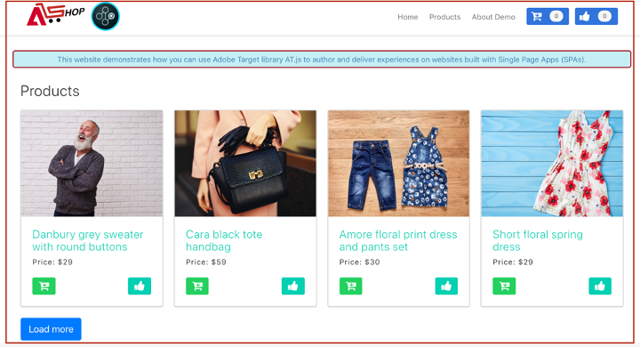

# Implementación de aplicación de una sola página

El SDK web de Adobe Experience Platform proporciona funciones enriquecidas que equipan a su empresa para ejecutar la personalización en tecnologías de cliente de próxima generación, como aplicaciones de una sola página (SPA).

Los sitios web tradicionales funcionaban en modelos de navegación “página a página”, conocidos como aplicaciones de varias páginas, en las que los diseños de sitios web estaban perfectamente asociados a las direcciones URL y las transiciones de una página web a otra requerían la carga de páginas.

Las aplicaciones web modernas, como las aplicaciones de una sola página, han adoptado un modelo que impulsa el uso rápido de la representación de la interfaz de usuario del navegador, que a menudo es independiente de las recargas de página. Estas experiencias se pueden activar mediante interacciones con los clientes, como desplazamientos, clics y movimientos del cursor. A medida que han evolucionado los paradigmas de la web moderna, la relevancia de los eventos genéricos tradicionales, como una carga de página, para implementar personalización y experimentación ya no funciona.


## Ventajas del SDK web de plataforma para SPA

A continuación se indican algunas ventajas del uso del SDK web de Adobe Experience Platform para las aplicaciones de una sola página:

* Capacidad de almacenar en caché todas las ofertas de carga de página para reducir varias llamadas al servidor a una sola llamada al servidor.
* Mejore considerablemente la experiencia del usuario en el sitio, ya que las ofertas se muestran inmediatamente a través de la memoria caché, sin que las llamadas al servidor tradicionales lo requieran de tiempo de demora.
* Una sola línea de código y una única configuración de desarrollador permiten a los especialistas en marketing crear y ejecutar actividades A/B y de segmentación de experiencias (XT) mediante el Compositor de experiencias visuales (VEC) en su SPA.

## Vistas XDM y aplicaciones de una sola página

El Adobe Target VEC para SPA aprovecha un concepto llamado Vistas: un grupo lógico de elementos visuales que juntos componen una experiencia SPA. Por lo tanto, una aplicación de una sola página puede considerarse una transición a través de Vistas, en lugar de direcciones URL, en función de las interacciones del usuario. Una vista suele representar un sitio completo o elementos visuales agrupados dentro de un sitio.

Para explicar mejor cuáles son las Vistas, el siguiente ejemplo utiliza un hipotético sitio de comercio electrónico en línea implementado en React para explorar Vistas de ejemplo.

Después de navegar al sitio principal, una imagen primordial promociona una venta de Pascua así como los productos más recientes disponibles en el sitio. En este caso, se podría definir una Vista para toda la pantalla de inicio. Esta Vista podría llamarse simplemente &quot;hogar&quot;.


A medida que el cliente se interesa más por los productos que vende el negocio, decide hacer clic en el vínculo **Productos**. De manera similar a la página de inicio, se puede definir todo el sitio del producto como una vista. Esta Vista podría denominarse &quot;products-all&quot;.



Dado que una Vista puede definirse como un sitio completo o un grupo de elementos visuales en un sitio, los cuatro productos mostrados en el sitio de productos podrían agruparse y considerarse como una Vista. Esta vista podría denominarse &quot;productos&quot;.


Cuando el cliente decide hacer clic en el botón **Cargar más** para explorar más productos en el sitio, la dirección URL del sitio web no cambia en este caso, pero se puede crear una Vista aquí para representar sólo la segunda fila de productos que se muestran. El nombre de la Vista podría ser &quot;products-page-2&quot;.


El cliente decide comprar algunos productos del sitio y pasa a la pantalla de cierre de compra. En el sitio de cierre de compra, el cliente tiene opciones para elegir el envío normal o el envío expreso. Una Vista puede ser cualquier grupo de elementos visuales de un sitio, por lo que se puede crear una Vista para las preferencias de envío y denominarla &quot;Preferencias de Envío&quot;.


El concepto de Vistas puede ampliarse mucho más que esto. Estos son sólo algunos ejemplos de Vistas que se pueden definir en un sitio.

## Implementación de Vistas XDM

Las Vistas XDM se pueden aprovechar en Adobe Target para que los especialistas en marketing puedan ejecutar pruebas A/B y XT en SPA mediante el Compositor de experiencias visuales. Esto requiere realizar los siguientes pasos para completar una configuración de desarrollador única:

1. Instalar [SDK web de Adobe Experience Platform](../../fundamentals/installing-the-sdk.md)
2. Determine todas las Vistas XDM de la aplicación de una sola página que desee personalizar.
3. Después de definir las Vistas XDM, para ofrecer actividades AB o XT VEC, implemente la función `sendEvent()` con `renderDecisions` establecida en `true` y la Vista XDM correspondiente en la aplicación de una sola página. La Vista XDM debe pasarse en `xdm.web.webPageDetails.viewName`. Este paso permite a los especialistas en marketing aprovechar el Compositor de experiencias visuales para iniciar pruebas A/B y XT para esos XDM.

   ```javascript
   alloy("sendEvent", { 
     "renderDecisions": true, 
     "xdm": { 
       "web": { 
         "webPageDetails": { 
         "viewName":"home" 
         }
       } 
     } 
   });
   ```

>[!NOTE]
>
>En la primera llamada `sendEvent()`, se buscarán y almacenarán en caché todas las Vistas XDM que se deban procesar para el usuario final. Las llamadas subsiguientes `sendEvent()` con Vistas XDM pasadas se leerán desde la caché y se procesarán sin una llamada al servidor.

## `sendEvent()` ejemplos de funciones

Esta sección describe tres ejemplos que muestran cómo invocar la función `sendEvent()` en React para un hipotético SPA de comercio electrónico.

### Ejemplo 1: Página de inicio de prueba A/B

El equipo de mercadotecnia desea ejecutar pruebas A/B en toda la página de inicio.


Para ejecutar pruebas A/B en todo el sitio principal, `sendEvent()` debe invocarse con el XDM `viewName` establecido en `home`:

```jsx
function onViewChange() { 
  
  var viewName = window.location.hash; // or use window.location.pathName if router works on path and not hash 

  viewName = viewName || 'home'; // view name cannot be empty 

  // Sanitize viewName to get rid of any trailing symbols derived from URL 

  if (viewName.startsWith('#') || viewName.startsWith('/')) { 
    viewName = viewName.substr(1); 
  }
   
  alloy("sendEvent", { 
    "renderDecisions": true, 
    "xdm": { 
      "web": { 
        "webPageDetails": { 
          "viewName":"home" 
        } 
      } 
    }
  }); 
} 

// react router v4 

const history = syncHistoryWithStore(createBrowserHistory(), store); 

history.listen(onViewChange); 

// react router v3 

<Router history={hashHistory} onUpdate={onViewChange} > 
```

### Ejemplo 2: Productos personalizados

El equipo de mercadotecnia desea personalizar la segunda fila de productos cambiando el color de la etiqueta de precio a rojo después de que un usuario haga clic en **Cargar más**.


```jsx
function onViewChange(viewName) { 

  alloy("sendEvent", { 
    "renderDecisions": true, 
    "xdm": { 
      "web": { 
        "webPageDetails": { 
          "viewName": viewName
        }
      } 
    } 
  }); 
} 

class Products extends Component { 
  
  render() { 
    return ( 
      <button type="button" onClick={this.handleLoadMoreClicked}>Load more</button> 
    ); 
  } 

  handleLoadMoreClicked() { 
    var page = this.state.page + 1; // assuming page number is derived from component’s state 
    this.setState({page: page}); 
    onViewChange('PRODUCTS-PAGE-' + page); 
  } 

} 
```

### Ejemplo 3: Preferencias de envío de prueba A/B

El equipo de mercadotecnia desea ejecutar una prueba A/B para ver si el cambio del color del botón de azul a rojo cuando se selecciona **Envío expreso** puede aumentar las conversiones (en lugar de mantener el color del botón en azul para ambas opciones de envío).


Para personalizar el contenido del sitio en función de la preferencia de envío seleccionada, se puede crear una Vista para cada preferencia de envío. Cuando **Envío normal** está seleccionado, la Vista se puede denominar &quot;cierre de compra normal&quot;. Si selecciona **Envío expreso**, la Vista se puede denominar &quot;cierre de compra-express&quot;.

```jsx
function onViewChange(viewName) { 
  alloy("sendEvent", { 
    "renderDecisions": true, 
    "xdm": { 
      "web": { 
        "webPageDetails": { 
          "viewName": viewName 
        }
      }
    }
  }); 
} 

class Checkout extends Component { 

  render() { 
    return ( 
      <div onChange={this.onDeliveryPreferenceChanged}> 
        <label> 
          <input type="radio" id="normal" name="deliveryPreference" value={"Normal Delivery"} defaultChecked={true}/> 
          <span> Normal Delivery (7-10 business days)</span> 
        </label> 
        <label> 
          <input type="radio" id="express" name="deliveryPreference" value={"Express Delivery"}/> 
          <span> Express Delivery* (2-3 business days)</span> 
        </label> 
      </div> 
    ); 
  } 

  onDeliveryPreferenceChanged(evt) { 
    var selectedPreferenceValue = evt.target.value; 
    onViewChange(selectedPreferenceValue); 
  } 

} 
```

## Uso del Compositor de experiencias visuales para un SPA

Cuando haya terminado de definir sus Vistas XDM e implementado `sendEvent()` con las Vistas XDM pasadas, el VEC podrá detectar estas Vistas y permitir a los usuarios crear acciones y modificaciones para actividades A/B o XT.

>[!NOTE]
>
>Para utilizar el VEC para su SPA, debe instalar y activar la extensión del asistente de [Firefox](https://addons.mozilla.org/en-US/firefox/addon/adobe-target-vec-helper/) o [Chrome](https://chrome.google.com/webstore/detail/adobe-target-vec-helper/ggjpideecfnbipkacplkhhaflkdjagak) VEC.

### Panel de modificaciones

El panel Modificaciones captura las acciones creadas para una Vista en particular. Todas las acciones de una Vista se agrupan bajo esa Vista.


### Acciones

Al hacer clic en una acción se resalta el elemento del sitio donde se aplicará esta acción. Cada acción de VEC creada en una Vista tiene los iconos siguientes: **Información**, **Editar**, **Clonar**, **Mover** y **Eliminar**. Estos iconos se explican con más detalle en la tabla siguiente.


| Icono | Descripción |
|---|---|
| Información | Muestra los detalles de esta acción. |
| Edit | Permite editar las propiedades de esta acción directamente. |
| Clonar | Clona la acción a una o varias vistas del panel Modificaciones o a una o varias vistas a las que ha llegado a través del VEC. La acción no tiene que incluirse necesariamente en el panel Modificaciones.<br/><br/>**Nota:** Después de realizar una operación de clonación, debe desplazarse a la Vista en el VEC mediante Examinar para ver si la acción clonada fue una operación válida. Si la acción no se puede aplicar a la vista, aparecerá un error. |
| Mover | Mueve la acción a un Evento de carga de página o a cualquier otra Vista que ya se encuentre en el panel Modificaciones.<br/><br/>**Evento de carga de página:** Cualquier acción que corresponda al evento de carga de página se aplica a la carga de página inicial de la aplicación web. <br/><br/>**Nota:** Después de realizar una operación de movimiento, debe desplazarse a la Vista en el VEC mediante Examinar para ver si el movimiento fue una operación válida. Si la acción no se puede aplicar a la vista, aparecerá un error. |
| Eliminar | Elimina la acción. |

## Uso del VEC para SPA ejemplos

Esta sección describe tres ejemplos para usar el Compositor de experiencias visuales para crear acciones y modificaciones para actividades A/B o XT.

### Ejemplo 1: Actualizar Vista &quot;principal&quot;

Anteriormente, en este documento se definía una Vista denominada &quot;home&quot; para todo el sitio de inicio. Ahora el equipo de mercadotecnia desea actualizar la vista &quot;principal&quot; de las siguientes maneras:

* Cambie los botones **Añadir al carro** y **Me gusta** a una parte más clara de azul. Esto debería suceder durante la carga de la página porque implica cambiar los componentes del encabezado.
* Cambie la etiqueta **Productos más recientes para 2019** a **Productos más calientes para 2019** y cambie el color del texto a morado.

Para realizar estas actualizaciones en el VEC, seleccione **Componer** y aplique esos cambios a la vista &quot;principal&quot;.


### Ejemplo 2: Cambio de las etiquetas de producto

Para la Vista &quot;products-page-2&quot;, el equipo de mercadotecnia desea cambiar la etiqueta **Price** a **Precio de venta** y cambiar el color de la etiqueta a rojo.

Para realizar estas actualizaciones en el VEC, se requieren los siguientes pasos:

1. Seleccione **Examinar** en el VEC.
2. Seleccione **Productos** en la navegación superior del sitio.
3. Seleccione **Cargar más** una vez para vista de la segunda fila de productos.
4. Seleccione **Componer** en el VEC.
5. Aplique acciones para cambiar la etiqueta de texto a **Precio de venta** y el color a rojo.


### Ejemplo 3: Personalización del estilo de preferencias de envío

Las vistas se pueden definir en un nivel granular, como un estado o una opción de un botón de radio. Anteriormente, en este documento se definían Vistas para las preferencias de envío, &quot;cierre de compra-normal&quot; y &quot;cierre de compra-express&quot;. El equipo de mercadotecnia desea cambiar el color del botón a rojo para la Vista &quot;checkout-express&quot;.

Para realizar estas actualizaciones en el VEC, se requieren los siguientes pasos:

1. Seleccione **Examinar** en el VEC.
2. Añada productos al carro de compras del sitio.
3. Seleccione el icono del carro en la esquina superior derecha del sitio.
4. Seleccione **Cierre la compra del pedido**.
5. Seleccione el botón de radio **Envío Express** en **Preferencias de Envío**.
6. Seleccione **Componer** en el VEC.
7. Cambie el color del botón **Pagar** a rojo.

>[!NOTE]
>
>La Vista &quot;checkout-express&quot; no aparece en el panel Modificaciones hasta que se selecciona el botón de opción **Express Envío**. Esto se debe a que la función `sendEvent()` se ejecuta cuando se selecciona el botón de radio **Express Envío**, por lo que el VEC no conoce la Vista &quot;checkout-express&quot; hasta que se selecciona el botón de radio.


