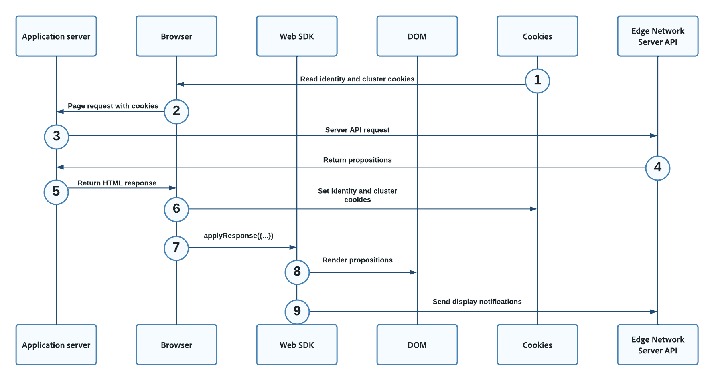

# Personalización híbrida mediante el SDK web y la API del servidor de red perimetral

## Información general {#overview}

La personalización híbrida describe el proceso de recuperación de contenido personalizado en el lado del servidor, mediante el uso de [API de servidor de red perimetral](../..//server-api/overview.md)y procesándolo en el lado del cliente, utilizando la variable [SDK web](../home.md).

Puede utilizar la personalización híbrida con soluciones de personalización como Adobe Target o Offer decisioning, siendo la diferencia el contenido del [!UICONTROL API de servidor] carga útil.

## Requisitos previos {#prerequisites}

Antes de implementar la personalización híbrida en las propiedades web, asegúrese de cumplir las siguientes condiciones:

* Ha decidido qué solución de personalización desea utilizar. Esto tendrá un impacto en el contenido del [!UICONTROL API de servidor] carga útil.
* Tiene acceso a un servidor de aplicaciones que puede utilizar para realizar la [!UICONTROL API de servidor] llamadas a .
* Tiene acceso a la variable [API de servidor de red perimetral](../../server-api/authentication.md).
* Tiene correctamente [configurado e implementado](../fundamentals/configuring-the-sdk.md) SDK web en las páginas que desee personalizar.

## Diagrama de flujo {#flow-diagram}

El diagrama de flujo siguiente describe el orden de los pasos realizados para ofrecer una personalización híbrida.



1. Las cookies existentes almacenadas anteriormente por el explorador con el prefijo `kndctr_`, se incluyen en la solicitud del explorador.
1. El explorador web del cliente solicita la página web desde el servidor de aplicaciones.
1. Cuando el servidor de aplicaciones recibe la solicitud de página, realiza una `POST` solicitud al [Punto de recopilación de datos interactivos de API de servidor](../../server-api/interactive-data-collection.md) para recuperar contenido personalizado. La variable `POST` la solicitud contiene un `event` y `query`. Las cookies del paso anterior, si están disponibles, se incluyen en la `meta>state>entries` matriz.
1. La API del servidor devuelve el contenido de personalización al servidor de aplicaciones.
1. El servidor de aplicaciones devuelve una respuesta del HTML al explorador del cliente, que contiene la variable [cookies de identidad y clúster](#cookies).
1. En la página del cliente, la variable [!DNL Web SDK] `applyResponse` se llama al comando , pasando los encabezados y el cuerpo del [!UICONTROL API de servidor] respuesta del paso anterior.
1. La variable [!DNL Web SDK] procesa la carga de la página [[!DNL Visual Experience Composer (VEC)]](https://experienceleague.adobe.com/docs/target/using/experiences/vec/visual-experience-composer.html?lang=en) ofertas automáticamente, ya que la variable `renderDecisions` el indicador está establecido en `true`.
1. Basado en formularios [!DNL JSON] las ofertas se aplican manualmente a través de la variable `applyPersonalization` para actualizar el [!DNL DOM] en función de la oferta de personalización.
1. En las actividades basadas en formularios, los eventos de visualización deben enviarse manualmente para indicar cuándo se ha mostrado la oferta. Esto se realiza mediante la variable `sendEvent` comando.

## Cookies {#cookies}

Las cookies se utilizan para mantener la identidad del usuario y la información del clúster.  Al utilizar una implementación híbrida, el servidor de aplicaciones web gestiona el almacenamiento y el envío de estas cookies durante el ciclo de vida de la solicitud.

| Cookie | Finalidad | Almacenado por | Enviado por |
|---|---|---|---|
| `kndctr_AdobeOrg_identity` | Contiene detalles de identidad del usuario. | Servidor de aplicaciones | Servidor de aplicaciones |
| `kndctr_AdobeOrg_cluster` | Indica qué clúster de red perimetral debe utilizarse para cumplir las solicitudes. | Servidor de aplicaciones | Servidor de aplicaciones |

## Ubicación de la solicitud {#request-placement}

Las solicitudes de API del servidor son necesarias para obtener propuestas y enviar una notificación de visualización. Cuando se utiliza una implementación híbrida, el servidor de aplicaciones realiza estas solicitudes a la API del servidor.

| Solicitud | Hecho por |
|---|---|
| Solicitud de interacción para recuperar propuestas | Servidor de aplicaciones |
| Solicitud interactiva para enviar notificaciones de visualización | Servidor de aplicaciones |

## Repercusiones de Analytics {#analytics}

Al implementar la personalización híbrida, debe prestar especial atención para que las visitas de página no se cuenten varias veces en Analytics.

Cuando [configurar un conjunto de datos](../datastreams/overview.md) en Analytics, los eventos se reenvían automáticamente para que se capturen las visitas individuales de la página.

El ejemplo de esta implementación utiliza dos conjuntos de datos diferentes:

* Un conjunto de datos configurado para Analytics. Este conjunto de datos se utiliza para interacciones del SDK web.
* Un segundo conjunto de datos sin una configuración de Analytics. Este conjunto de datos se utiliza para solicitudes de API del servidor.

De este modo, la solicitud del lado del servidor no registra ningún evento de Analytics, pero las solicitudes del lado del cliente sí lo hacen. Esto hace que las solicitudes de Analytics se cuenten con precisión.


## Solicitud del lado del servidor {#server-side-request}

El ejemplo de solicitud que se muestra a continuación ilustra una solicitud de API de servidor que el servidor de aplicaciones podría utilizar para recuperar el contenido de personalización.

>[!IMPORTANT]
>
>Esta solicitud de ejemplo utiliza Adobe Target como solución de personalización. Su solicitud puede variar según la solución de personalización elegida.


**Formato de API**

```http
POST /ee/v2/interact
```

### Solicitud {#request}

```shell
curl -X POST "https://edge.adobedc.net/ee/v2/interact?dataStreamId={DATASTREAM_ID}" 
-H "Content-Type: text/plain" 
-d '{
   "event":{
      "xdm":{
         "web":{
            "webPageDetails":{
               "URL":"http://localhost/"
            },
            "webReferrer":{
               "URL":""
            }
         },
         "identityMap":{
            "FPID":[
               {
                  "id":"xyz",
                  "authenticatedState":"ambiguous",
                  "primary":true
               }
            ]
         },
         "timestamp":"2022-06-23T22:21:00.878Z"
      },
      "data":{
         
      }
   },
   "query":{
      "identity":{
         "fetch":[
            "ECID"
         ]
      },
      "personalization":{
         "schemas":[
            "https://ns.adobe.com/personalization/default-content-item",
            "https://ns.adobe.com/personalization/html-content-item",
            "https://ns.adobe.com/personalization/json-content-item",
            "https://ns.adobe.com/personalization/redirect-item",
            "https://ns.adobe.com/personalization/dom-action"
         ],
         "decisionScopes":[
            "__view__",
            "sample-json-offer"
         ]
      }
   },
   "meta":{
      "state":{
         "domain":"localhost",
         "cookiesEnabled":true,
         "entries":[
            {
               "key":"kndctr_XXX_AdobeOrg_identity",
               "value":"abc123"
            },
            {
               "key":"kndctr_XXX_AdobeOrg_cluster",
               "value":"or2"
            }
         ]
      }
   }
}'
```

| Parámetro | Tipo | Requerido | Descripción |
| --- | --- | --- | --- |
| `dataStreamId` | `String` | Sí. | El ID del conjunto de datos que utiliza para pasar las interacciones a la red perimetral. Consulte la [información general sobre datastreams](../datastreams/overview.md) para aprender a configurar un conjunto de datos. |
| `requestId` | `String` | No | Un ID aleatorio para correlacionar solicitudes de servidor internas. Si no se proporciona ninguno, la red perimetral generará uno y lo devolverá en la respuesta. |

### Respuesta del lado del servidor {#server-response}

La respuesta de ejemplo siguiente muestra el aspecto que podría tener la respuesta de API del servidor.


```json
{
   "requestId":"5c539bd0-33bf-43b6-a054-2924ac58038b",
   "handle":[
      {
         "payload":[
            {
               "id":"XXX",
               "namespace":{
                  "code":"ECID"
               }
            }
         ],
         "type":"identity:result"
      },
      {
         "payload":[
            {
               "..."
            },
            {
               "..."
            }
         ],
         "type":"personalization:decisions",
         "eventIndex":0
      }
   ]
}
```

## Solicitud del lado del cliente {#client-request}

En la página del cliente, la variable [!DNL Web SDK] `applyResponse` se llama al comando , pasando los encabezados y el cuerpo de la respuesta del lado del servidor.

```js
   alloy("applyResponse", {
      "renderDecisions": true,
      "responseHeaders": {
         "cache-control": "no-cache, no-store, max-age=0, no-transform, private",
         "connection": "close",
         "content-encoding": "deflate",
         "content-type": "application/json;charset=utf-8",
         "date": "Mon, 11 Jul 2022 19:42:01 GMT",
         "server": "jag",
         "strict-transport-security": "max-age=31536000; includeSubDomains",
         "transfer-encoding": "chunked",
         "vary": "Origin",
         "x-adobe-edge": "OR2;9",
         "x-content-type-options": "nosniff",
         "x-konductor": "22.6.78-BLACKOUTSERVERDOMAINS:7fa23f82",
         "x-rate-limit-remaining": "599",
         "x-request-id": "5c539bd0-33bf-43b6-a054-2924ac58038b",
         "x-xss-protection": "1; mode=block"
      },
      "responseBody": {
         "requestId": "5c539bd0-33bf-43b6-a054-2924ac58038b",
         "handle": [
         {
            "payload": [
               {
               "id": "XXX",
               "namespace": {
                  "code": "ECID"
               }
               }
            ],
            "type": "identity:result"
         },
         {
            "payload": [
               {...}, 
               {...}
            ],
            "type": "personalization:decisions",
            "eventIndex": 0
         }
         ]
      }
   }
   ).then(applyPersonalization("sample-json-offer"));
```

Basado en formularios [!DNL JSON] las ofertas se aplican manualmente a través de la variable `applyPersonalization` para actualizar el [!DNL DOM] en función de la oferta de personalización. En las actividades basadas en formularios, los eventos de visualización deben enviarse manualmente para indicar cuándo se ha mostrado la oferta. Esto se realiza mediante la variable `sendEvent` comando.

```js
function sendDisplayEvent(decision) {
    const { id, scope, scopeDetails = {} } = decision;

    alloy("sendEvent", {
        xdm: {
            eventType: "decisioning.propositionDisplay",
            _experience: {
                decisioning: {
                    propositions: [
                        {
                            id: id,
                            scope: scope,
                            scopeDetails: scopeDetails,
                        },
                    ],
                },
            },
        },
    });
}
```

## Aplicación de ejemplo {#sample-app}

Para ayudarle a experimentar y obtener más información sobre este tipo de personalización, le ofrecemos una aplicación de ejemplo que puede descargar y utilizar para realizar pruebas. Puede descargar la aplicación, junto con instrucciones detalladas sobre cómo utilizarla, desde esta [Repositorio de GitHub](https://github.com/adobe/alloy-samples).


