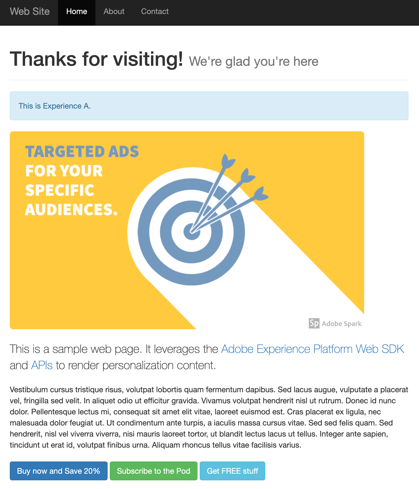

# Personalización del lado del servidor mediante la API del servidor de red perimetral

## Información general {#overview}

La personalización del lado del servidor implica el uso de [API del servidor de red perimetral](../../server-api/overview.md) para personalizar la experiencia del cliente en las propiedades web.

En el ejemplo descrito en este artículo, el contenido de personalización se recupera en el lado del servidor mediante la API de servidor. A continuación, el HTML se procesa en el servidor, según el contenido de personalización recuperado.

La siguiente tabla muestra un ejemplo de contenido personalizado y no personalizado.

| Página de muestra sin personalización | Página de muestra con personalización |
|---|---|
|  |  |

## Consideraciones {#considerations}

### Cookies {#cookies}

Las cookies se utilizan para mantener la identidad del usuario y la información de clúster.  Al utilizar una implementación del lado del servidor, el servidor de aplicaciones gestiona el almacenamiento y el envío de estas cookies durante el ciclo vital de la solicitud.

| Cookie | Finalidad | Almacenado por | Enviado por |
|---|---|---|---|
| `kndctr_AdobeOrg_identity` | Contiene detalles de identidad del usuario. | Servidor de aplicaciones | Servidor de aplicaciones |
| `kndctr_AdobeOrg_cluster` | Indica qué clúster de red perimetral debe usarse para cumplir las solicitudes. | Servidor de aplicaciones | Servidor de aplicaciones |

### Solicitar ubicación {#request-placement}

Las solicitudes de personalización son necesarias para obtener propuestas y enviar una notificación de visualización. Al utilizar una implementación del lado del servidor, el servidor de aplicaciones realiza estas solicitudes a la API del servidor de red perimetral.

| Solicitud | Realizado por |
|---|---|
| Solicitud de interacción para recuperar propuestas | Servidor de aplicaciones llamando a la API del servidor de red perimetral. |
| Solicitud de interacción para enviar notificaciones de visualización | Servidor de aplicaciones llamando a la API del servidor de red perimetral. |

## Aplicación de ejemplo {#sample-app}

El proceso descrito a continuación utiliza una aplicación de ejemplo que puede utilizar como punto de partida para experimentar y obtener más información sobre este tipo de personalización.

Puede descargar este ejemplo y personalizarlo según sus necesidades. Por ejemplo, puede cambiar las variables de entorno para que la aplicación de ejemplo extraiga ofertas de su propia configuración de Experience Platform.

Para ello, abra el `.env` en la raíz del repositorio y modifique las variables según su configuración. Reinicie la aplicación de ejemplo y estará listo para experimentar con su propio contenido de personalización.

### Ejecución del ejemplo {#running-sample}

Siga los pasos a continuación para ejecutar la aplicación de ejemplo.

1. Clonar [este repositorio](https://github.com/adobe/alloy-samples) a su equipo local.
2. Abra un terminal y vaya al `personalization-server-side` carpeta.
3. Ejecutar `npm install`.
4. Ejecutar `npm start`.
5. Abra el explorador web y vaya a `http://localhost`.

## Resumen del proceso {#process}

En esta sección se describen los pasos utilizados para recuperar el contenido personalizado.

1. [Express](https://expressjs.com/) se utiliza para una implementación ligera del lado del servidor. Esto administra las solicitudes y el enrutamiento básicos del servidor.
2. El explorador solicita la página web. Las cookies almacenadas anteriormente por el explorador, con el prefijo `kndctr_`, se incluyen.
3. Cuando se solicita la página desde el servidor de aplicaciones, se envía un evento a [punto final de recopilación de datos interactivos](../../../server-api/interactive-data-collection.md) para recuperar contenido de personalización. La aplicación de ejemplo utiliza métodos de ayuda para simplificar la creación y el envío de solicitudes a la API (consulte [aepEdgeClient.js](https://github.com/adobe/alloy-samples/blob/main/common/aepEdgeClient.js)). El `POST` la solicitud contiene un `event` y una `query`. Las cookies del paso anterior, si están disponibles, se incluyen en la variable `meta>state>entries` matriz.

   ```js
   fetch(
   "https://edge.adobedc.net/ee/v2/interact?dataStreamId=abc&requestId=123",
   {
      headers: {
         accept: "*/*",
         "accept-language": "en-US,en;q=0.9",
         "cache-control": "no-cache",
         "content-type": "text/plain; charset=UTF-8",
         pragma: "no-cache",
         "sec-fetch-dest": "empty",
         "sec-fetch-mode": "cors",
         "sec-fetch-site": "cross-site",
         "sec-gpc": "1",
         "Referrer-Policy": "strict-origin-when-cross-origin",
         Referer: "http://localhost/",
      },
      body: JSON.stringify({
         event: {
         xdm: {
            web: {
               webPageDetails: {
               URL: "http://localhost/",
               },
               webReferrer: {
               URL: "",
               },
            },
            identityMap: {
               FPID: [
               {
                  id: "xyz",
                  authenticatedState: "ambiguous",
                  primary: true,
               },
               ],
            },
            timestamp: "2022-06-23T22:21:00.878Z",
         },
         data: {},
         },
         query: {
         identity: {
            fetch: ["ECID"],
         },
         personalization: {
            schemas: [
               "https://ns.adobe.com/personalization/default-content-item",
               "https://ns.adobe.com/personalization/html-content-item",
               "https://ns.adobe.com/personalization/json-content-item",
               "https://ns.adobe.com/personalization/redirect-item",
               "https://ns.adobe.com/personalization/dom-action",
            ],
            decisionScopes: ["__view__", "sample-json-offer"],
         },
         },
         meta: {
         state: {
            domain: "localhost",
            cookiesEnabled: true,
            entries: [
               {
               "key": "kndctr_XXX_AdobeOrg_identity",
               "value": "abc123"
               },
               {
               "key": "kndctr_XXX_AdobeOrg_cluster",
               "value": "or2"
               }
            ],
         },
         },
      }),
      method: "POST",
   }
   ).then((res) => res.json());
   ```

4. La oferta de Target de la actividad basada en formularios se lee de la respuesta y se utiliza al producir la respuesta del HTML.
5. Para las actividades basadas en formularios, los eventos de visualización deben enviarse manualmente en la implementación para indicar cuándo se ha mostrado la oferta. En este ejemplo, la notificación se envía del lado del servidor, durante el ciclo de vida de la solicitud.

   ```js
   function sendDisplayEvent(aepEdgeClient, req, propositions, cookieEntries) {
   const address = getAddress(req);
   
   aepEdgeClient.interact(
      {
         event: {
         xdm: {
            web: {
               webPageDetails: { URL: address },
               webReferrer: { URL: "" },
            },
            timestamp: new Date().toISOString(),
            eventType: "decisioning.propositionDisplay",
            _experience: {
               decisioning: {
               propositions: propositions.map((proposition) => {
                  const { id, scope, scopeDetails } = proposition;
   
                  return {
                     id,
                     scope,
                     scopeDetails,
                  };
               }),
               },
            },
         },
         },
         query: { identity: { fetch: ["ECID"] } },
         meta: {
         state: {
            domain: "",
            cookiesEnabled: true,
            entries: [...cookieEntries],
         },
         },
      },
      {
         Referer: address,
      }
   );
   }
   ```

6. [!DNL Visual Experience Composer (VEC)] Las ofertas de se ignoran, ya que solo se pueden procesar mediante SDK web.
7. Cuando se devuelve la respuesta del HTML, el servidor de aplicaciones establece las cookies de identidad y de clúster en la respuesta.