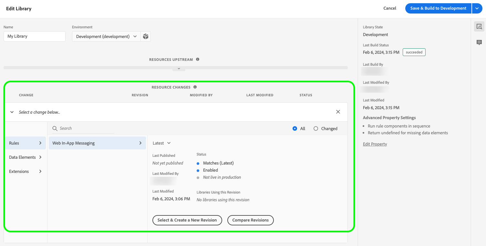

# Configuración de la compatibilidad con la mensajería web en la aplicación en el SDK web


Los mensajes en la aplicación son notificaciones que puede enviar a los usuarios dentro de su aplicación web, guiándolos a puntos de interés específicos.

Puede utilizar estas notificaciones para diferentes fines, como promocionar nuevas funciones, presentar ofertas especiales o facilitar la incorporación del usuario.

Con los mensajes en la aplicación, puede interactuar de forma eficaz con su audiencia y dirigirla a aspectos importantes de su aplicación.

>[!IMPORTANT]
>
>La mensajería en la aplicación web es una [Adobe Journey Optimizer](https://experienceleague.adobe.com/docs/journey-optimizer/using/ajo-home.html?lang=es) , que utiliza el SDK web para ofrecer el contenido personalizado.
>
>Para obtener instrucciones detalladas sobre cómo configurar la campaña de mensajería en la aplicación web, consulte la [Documentación de Adobe Journey Optimizer](https://experienceleague.adobe.com/docs/journey-optimizer/using/in-app/create-in-app-web.html).


## Requisitos previos {#prerequisites}

### Versión de extensión de etiqueta de SDK web {#extension-version}

La funcionalidad de mensajería en la aplicación web requiere la última versión de la extensión de etiqueta del SDK web.

### Configuración de un CSP para mensajería web en la aplicación {#csp}

Al configurar [Mensajería en la aplicación web](../personalization/web-in-app-messaging.md), debe incluir la siguiente directiva en su CSP:

```
default-src  blob:;
```

Para obtener más información sobre la configuración de un CSP, consulte la [documentación dedicada](../fundamentals/configuring-a-csp.md).

## Configuración de la mensajería web en la aplicación mediante la extensión de etiqueta del SDK web {#tag-extension}

Consulte la [Página de configuración de extensión de etiqueta de SDK web](../../tags/extensions/client/web-sdk/web-sdk-extension-configuration.md) para saber dónde puede encontrar la configuración que se describe a continuación.

Después de que tenga [instalado](../../tags/extensions/client/web-sdk/web-sdk-extension-configuration.md#install-the-web-sdk-tag-extension) Con la extensión de etiqueta del SDK web, siga los pasos a continuación para configurar la extensión para la mensajería web en la aplicación.

En el **[!UICONTROL Personalización]** , marque la **[!UICONTROL Habilitar almacenamiento de personalización]** opción. Esta opción permite al SDK web realizar un seguimiento de las experiencias que el usuario ha visto en las cargas de página.


La mensajería web en la aplicación admite dos tipos de déclencheur:

* [Envío de datos a Platform](#send-data-platform)
* [Activación manual de mensajes](#manual-trigger)

Consulte las secciones siguientes para configurar la extensión de etiquetas del SDK web según los déclencheur que desee utilizar.

### Pasos de configuración para **[!UICONTROL Envío de datos a Platform]** déclencheur {#send-data-platform}

Seleccione la propiedad de etiqueta que contiene la extensión del SDK web y [crear una regla nueva](../../tags/ui/managing-resources/rules.md##create-a-rule) con la siguiente configuración:

1. **[!UICONTROL Extensión]**: [!UICONTROL Núcleo]
2. **[!UICONTROL Tipo de evento]**: [!UICONTROL Library Loaded (Page Top)]

   

3. Seleccionar **[!UICONTROL Conservar cambios]** para guardar la configuración del evento.

A continuación, debe agregar una acción a la regla que ha creado.

1. En el [!DNL Actions] , seleccione **[!UICONTROL Añadir]**.
   

2. Utilice lo siguiente **[!UICONTROL Acción]** configuración:
   * **[!UICONTROL Extensión]**: [!UICONTROL SDK web de Adobe Experience Platform]
   * **[!UICONTROL Tipo de acción]**: [!UICONTROL Enviar evento]

     

3. En el lado derecho de la pantalla, en el **[!UICONTROL Personalización]** , habilite la sección **[!UICONTROL Procesar decisiones de personalización visuales]** opción.
   

4. En el lado derecho de la pantalla, en el **[!UICONTROL Contexto de decisión]** , defina la **[!UICONTROL Clave]**/**[!UICONTROL Valor]** pares que utilizó en la configuración de su campaña para cumplir los requisitos para el mensaje en la aplicación.
   

5. Seleccionar **[!UICONTROL Conservar cambios]** para guardar la configuración.


A continuación, debe agregar la regla recién creada a la biblioteca de propiedades de etiquetas. Para ello, vaya a **[!UICONTROL Flujo de publicación]** y seleccione la regla que creó anteriormente.



Una vez añadida la regla a la biblioteca, seleccione **[!UICONTROL Guardar y generar en desarrollo]**.


El proceso de configuración se ha completado y el mensaje está listo para mostrarse a los usuarios.

### Pasos de configuración para utilizar déclencheur manuales {#manual-trigger}

Seleccione la propiedad de etiqueta que contiene la extensión del SDK web y [crear una regla nueva](../../tags/ui/managing-resources/rules.md##create-a-rule) con la siguiente configuración:

1. **[!UICONTROL Extensión]**: [!UICONTROL Núcleo]
2. **[!UICONTROL Tipo de evento]**: [!UICONTROL Clic]
3. Establezca el déclencheur de un elemento específico de la página, identificado por un selector CSS de su elección.

   


A continuación, debe agregar una acción a la regla que ha creado.

1. En el [!DNL Actions] , seleccione **[!UICONTROL Añadir]**.
   

2. Utilice lo siguiente **[!UICONTROL Acción]** configuración:
   * **[!UICONTROL Extensión]**: [!UICONTROL SDK web de Adobe Experience Platform]
   * **[!UICONTROL Tipo de acción]**: [!UICONTROL Evaluar conjuntos de reglas]

     

3. En el lado derecho de la pantalla, habilite la opción **[!UICONTROL Procesar decisiones de personalización visuales]** opción.
   


4. En el lado derecho de la pantalla, en el **[!UICONTROL Contexto de decisión]** , defina la **[!UICONTROL Clave]**/**[!UICONTROL Valor]** pares que utilizó en la configuración de su campaña para cumplir los requisitos para el mensaje en la aplicación.
   

5. Seleccionar **[!UICONTROL Conservar cambios]** para guardar la configuración.

A continuación, debe agregar la regla recién creada a la biblioteca de propiedades de etiquetas. Para ello, vaya a **[!UICONTROL Flujo de publicación]** y seleccione la regla que creó anteriormente.


Una vez añadida la regla a la biblioteca, seleccione **[!UICONTROL Guardar y generar en desarrollo]**.


El proceso de configuración se ha completado y el mensaje está listo para mostrarse a los usuarios.

## Configuración de la mensajería web en la aplicación mediante la biblioteca JavaScript del SDK web {#js-library}

Como alternativa al uso de la extensión de etiqueta del SDK web, también puede configurar la mensajería en la aplicación web directamente desde la biblioteca JavaScript del SDK web.


Puede mostrar mensajes web en la aplicación desde Adobe Journey Optimizer de dos formas.

### Método 1: Recuperación automática del contenido personalizado {#automatic}

Para que el SDK web recupere automáticamente el contenido de personalización al cargar la página, utilice el `sendEvent` , como se muestra en el ejemplo siguiente.

```js
  alloy("sendEvent", {
      renderDecisions: true,
      personalization: {
          surfaces: ['#welcome']
      }
  });
```

### Método 2: Recuperación manual del contenido de personalización en función de la acción del usuario {#manual}

Para mostrar el contenido de personalización solo después de que el usuario realice una acción específica, utilice el `evaluateRulesets` como se muestra en el ejemplo siguiente.

En este ejemplo, el contenido de personalización se muestra cuando un usuario hace clic en **[!UICONTROL Comprar ahora]** en el sitio web.

```js
 alloy("evaluateRulesets", {
     renderDecisions: true,
     personalization: {
         decisionContext: {
             "userAction": "buy_now"
         }
     }
 });
```

### Configuración del almacenamiento de personalización {#personalization-storage}

Puede elegir mostrar mensajes en la aplicación a los usuarios un número determinado de veces, o cada vez que visiten una página, a través del `personalizationStorageEnabled` opción de configuración.

En el [Configuración del SDK web](../fundamentals/configuring-the-sdk.md) configure el `personalizationStorageEnabled` opción según sus necesidades:

* `personalizationStorageEnabled: true` Almacena en déclencheur el mensaje en la aplicación con la frecuencia definida en la [Campaña de Adobe Journey Optimizer](https://experienceleague.adobe.com/docs/journey-optimizer/using/in-app/create-in-app-web.html#configure-inapp).
* `personalizationStorageEnabled: false` Almacena en déclencheur el mensaje en la aplicación en cada carga de página.