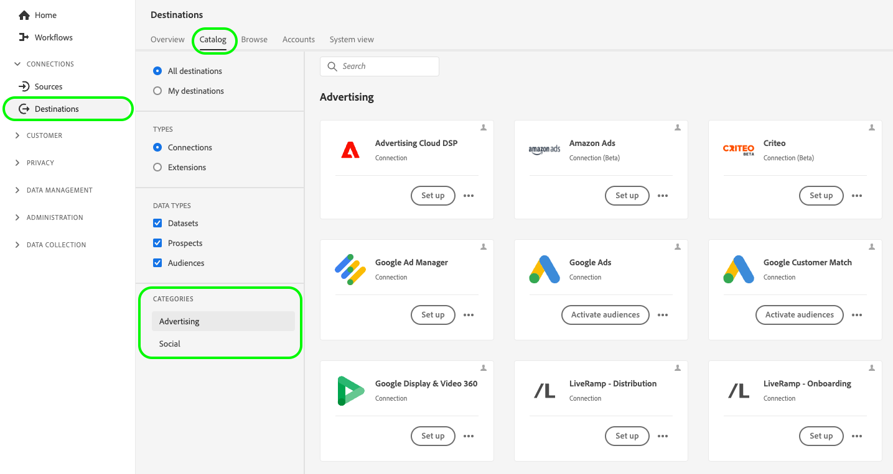
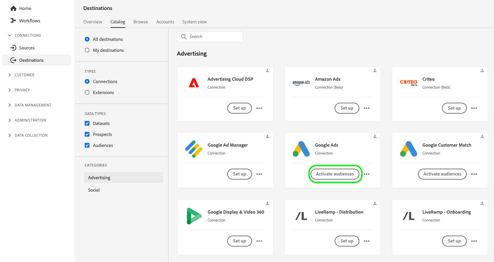

# Activar audiencias mediante la activación expandida de Audience Manager

En esta página se describe el flujo de trabajo completo que debe seguir para activar audiencias de Audience Manager a las plataformas de destino admitidas por la activación expandida.

## Antes de empezar {#before-you-begin}

Los pasos descritos en esta guía suponen que ha leído el [Página de información general de activación expandida](overview.md) y ha confirmado que cumple los requisitos previos para la activación de audiencia.

>[!IMPORTANT]
>
>Para activar audiencias mediante [!DNL Expanded Activation], asegúrese de que las audiencias de los Audience Manager se basen en **direcciones de correo electrónico con hash**. Consulte la [requisitos previos](overview.md#prerequisites) para obtener más información.

## Paso 1: Configuración de la conexión de origen del Audience Manager {#configure-source}

El [Conector de origen del Audience Manager](../sources/connectors/adobe-applications/audience-manager.md) envía los datos de audiencia recopilados en Adobe Audience Manager para su activación en las plataformas de destino admitidas por la activación expandida.

Siga la guía de cómo [crear una conexión de origen de Audience Manager](../sources/tutorials/ui/create/adobe-applications/audience-manager.md) para configurar el conector de origen.

>[!TIP]
>
>El conector de origen de Adobe Audience Manager es el único conector de origen disponible en la activación expandida.
>
>Si desea introducir audiencias basadas en identificadores adicionales, debe adquirir una edición de [Real-Time CDP](../rtcdp/overview.md). Póngase en contacto con el representante del Adobe para obtener más información.

### Visualización y monitorización de audiencias ingeridas {#view-audiences}

Las audiencias que introduce en la activación expandida desde Audience Manager están disponibles para que las vea en la **[!UICONTROL Audiencias]** panel.

Para ver las audiencias, vaya a **[!UICONTROL Cliente]** -> **[!UICONTROL Audiencias]** -> **[!UICONTROL Examinar]**.

>[!IMPORTANT]
>
>* Las audiencias pueden tardar hasta 48 horas en rellenarse completamente en la activación expandida. Esto también se aplica a las actualizaciones de audiencias de Audience Manager existentes.
>* Las audiencias de Audience Manager recién creadas no aparecen automáticamente en la activación expandida. Para introducir nuevos segmentos en la activación expandida, debe añadirlos a través del conector de origen del Audience Manager.

Después de configurar el conector de origen del Audience Manager, cambie a [paso 2](#create-destination-connection).

## Paso 2: Crear una nueva conexión de destino {#create-destination-connection}

Para poder enviar las audiencias de Audience Manager a la plataforma de destino que elija, primero debe crear una conexión con una plataforma de destino.

En la barra lateral izquierda, vaya a **[!UICONTROL Conexiones]** -> **[!UICONTROL Destinos]** -> **[!UICONTROL Catálogo]**.

Las categorías de destino disponibles para [!DNL Expanded Activation] son [publicidad](../destinations/catalog/advertising/overview.md) y [social](../destinations/catalog/social/overview.md).

Para crear una nueva conexión a una plataforma de destino, siga la guía de [cómo crear una nueva conexión de destino](../destinations/ui/connect-destination.md). A continuación, cambie a [paso 3](#activate-audiences).

## Paso 3: Activación de audiencias en el destino {#activate-audiences}

Después de que haya [audiencias de Audience Manager ingeridas](#configure-source) y [creó una nueva conexión de destino](#create-destination-connection), ahora puede activar las audiencias en la plataforma de destino que elija.

Para activar audiencias en su destino, siga la guía de [cómo activar audiencias en destinos de streaming](../destinations/ui/activate-segment-streaming-destinations.md).

## Verificar activación de audiencia {#verify}

Compruebe la [documentación de supervisión de destino](../dataflows/ui/monitor-destinations.md) para obtener información detallada sobre cómo monitorizar el flujo de datos a sus destinos.