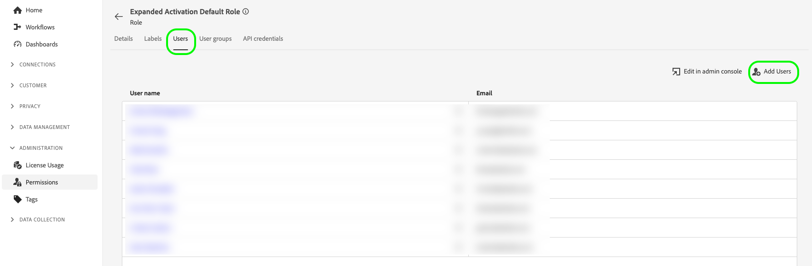

# Administración de cuentas

Para introducir audiencias de Audience Manager y activarlas en medios sociales y publicitarios, primero debe crear una cuenta de usuario de activación expandida y asignar la cuenta a la función de permiso correcta.

En esta página se explica cómo crear una cuenta de usuario en el Admin Console y cómo asignar los permisos correctos para la activación expandida.

## Creación de cuentas de usuario {#create-users}

Para poder usar [!DNL Audience Manager Expanded Activation], debe crear una cuenta de usuario.

Para crear una cuenta de usuario para [!DNL Expanded Activation], siga las instrucciones de administración de usuarios de la documentación de [Adobe Admin Console](https://helpx.adobe.com/es/enterprise/using/manage-users-individually.html).

## Agregar usuarios a la función de permiso {#permissions}

Después de crear una cuenta de usuario, debe agregarla a la función de permiso [!DNL Expanded Activation], en la interfaz de usuario [!DNL Expanded Activation].

Vaya a **[!UICONTROL Administración]** -> **[!UICONTROL Permisos]** -> **[!UICONTROL Roles]** y seleccione la **[!UICONTROL Función predeterminada de activación expandida]**.

Vaya a la ficha **[!UICONTROL Usuarios]** y seleccione **[!UICONTROL Agregar usuarios]**.

Seleccione el usuario recién creado de la lista disponible y seleccione **[!UICONTROL Guardar]**.

La cuenta de usuario ahora se crea y se asigna a la función correcta. Ya está lista para obtener acceso a la interfaz de usuario **[!UICONTROL Activación expandida]**.

## Monitorización del uso de licencias {#license-usage}

Su contrato de [!DNL Audience Manager Expanded Activation] especifica el número máximo de correos electrónicos con hash que puede introducir en su cuenta.

Puede encontrar esta información en la página **[!UICONTROL Administración]** -> **[!UICONTROL Uso de licencias]**.

En esta página puede encontrar la siguiente información:

* **[!UICONTROL Producto]**: El producto de Adobe para el que tiene licencia. Siempre será **[!UICONTROL Activación expandida de Audience Manager]**.
* **[!UICONTROL Métrica principal]**: Nombre de la métrica de la que se está realizando un seguimiento para su uso. Esta siempre será **[!UICONTROL audiencia direccionable]**.
* **[!UICONTROL Cantidad de licencias]**: El número máximo de correos electrónicos con hash que puede ingerir con licencia.

  >[!TIP]
  >
  >Ingesta correos electrónicos con hash a través del [conector de origen del Audience Manager](../sources/connectors/adobe-applications/audience-manager.md). Consulte la documentación sobre [cómo activar audiencias](activate-audiences.md) para obtener más información.

* **[!UICONTROL Uso]**: el número de correos electrónicos con hash que ha ingerido.
* **[!UICONTROL Uso %]**: porcentaje del importe de la licencia que ha utilizado.

Para obtener más información sobre el uso de licencias en Experience Platform, consulte la [documentación sobre el uso de licencias](../dashboards/guides/license-usage.md).

## Pasos siguientes {#next-steps}

Ahora que ha configurado al menos una cuenta de usuario con el acceso correcto a la activación expandida, puede empezar a usar la cuenta para [activar audiencias](activate-audiences.md).
