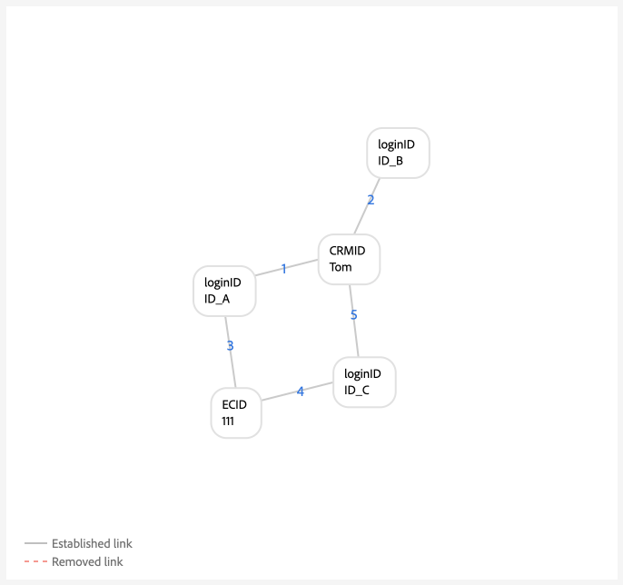

# Guía de configuración de reglas de vinculación de gráfico de identidad

>[!AVAILABILITY]
>
>Las reglas de vinculación de gráficos de identidad están actualmente en fase beta. Póngase en contacto con el equipo de su cuenta de Adobe para obtener información sobre los criterios de participación. La funcionalidad y la documentación están sujetas a cambios.

Lea este documento para obtener una guía paso a paso que puede seguir al implementar los datos con el servicio de identidad de Adobe Experience Platform.

Descripción paso a paso:

1. [Crear las áreas de nombres de identidad necesarias](#namespace)
2. [Utilice la herramienta de simulación de gráficos para familiarizarse con el algoritmo de optimización de identidad](#graph-simulation)
3. [Utilice la herramienta de configuración de identidad para designar las áreas de nombres únicas y configurar las clasificaciones de prioridad para las áreas de nombres](#identity-settings)
4. [Creación de un esquema de modelo de datos de experiencia (XDM)](#schema)
5. [Crear un conjunto de datos](#dataset)
6. [Ingesta de datos en Experience Platform](#ingest)

## Requisitos previos a la implementación

Antes de empezar, primero debe asegurarse de que los eventos autenticados en el sistema siempre contengan un identificador de persona.

## Definición de permisos {#set-permissions}

El primer paso en el proceso de implementación del servicio de identidad es garantizar que la cuenta de Experience Platform se añada a una función que esté aprovisionada con los permisos necesarios. El administrador puede configurar permisos para su cuenta navegando a la interfaz de usuario de permisos en Adobe Experience Cloud. A partir de ahí, la cuenta debe agregarse a una función con los siguientes permisos:

* [!UICONTROL Ver configuración de identidad]: aplique este permiso para poder ver áreas de nombres únicas y su prioridad en la página de exploración del área de nombres de identidad.
* [!UICONTROL Editar configuración de identidad]: aplique este permiso para poder editar y guardar la configuración de identidad.

Para obtener más información sobre los permisos, lea la [guía de permisos](../../access-control/abac/ui/permissions.md).

## Crear sus áreas de nombres de identidad {#namespace}

Si los datos lo requieren, primero debe crear los espacios de nombres adecuados para su organización. Para obtener información sobre cómo crear un área de nombres personalizada, lea la guía sobre [creación de un área de nombres personalizada en la interfaz de usuario](../features/namespaces.md#create-custom-namespaces).

## Uso de la herramienta de simulación de gráficos {#graph-simulation}

A continuación, vaya a la [herramienta de simulación de gráficos](./graph-simulation.md) en el área de trabajo de la interfaz de usuario del servicio de identidad. Puede utilizar la herramienta de simulación de gráficos para simular gráficos de identidad, creados con una variedad de diferentes configuraciones de área de nombres única y prioridad de área de nombres.

Mediante la creación de diferentes configuraciones, puede utilizar la herramienta de simulación de gráficos para aprender y comprender mejor cómo el algoritmo de optimización de identidad y determinadas configuraciones pueden afectar al comportamiento del gráfico.

## Configuración de la identidad {#identity-settings}

Una vez que tengas una mejor idea de cómo deseas que se comporte tu gráfico, ve a la [herramienta de configuración de identidad](./identity-settings-ui.md) en el área de trabajo de la interfaz de usuario del servicio de identidad.

Utilice la herramienta de configuración de identidad para designar las áreas de nombres únicas y configurar las áreas de nombres por orden de prioridad. Una vez que haya terminado de aplicar la configuración, debe esperar al menos seis horas antes de continuar con la ingesta de datos, ya que la nueva configuración tarda al menos seis horas en reflejarse en el servicio de identidad.

## Creación de un esquema XDM {#schema}

Una vez establecidas las áreas de nombres únicas y las prioridades del área de nombres, ahora puede continuar con la configuración necesaria para introducir los datos. En primer lugar, debe crear un esquema XDM. En función de los datos, es posible que tenga que crear un esquema tanto para XDM Individual Profile como para XDM ExperienceEvent.

Para introducir datos en el perfil del cliente en tiempo real, debe asegurarse de que el esquema contenga al menos un campo que se haya designado como identidad principal. Al establecer una identidad principal, puede habilitar un esquema determinado para la ingesta de perfiles.

Para obtener instrucciones sobre cómo crear un esquema, lea la guía sobre [creación de un esquema XDM en la interfaz de usuario](../../xdm/tutorials/create-schema-ui.md).

## Crear un conjunto de datos {#dataset}

A continuación, cree un conjunto de datos para proporcionar una estructura para los datos que va a introducir. Un conjunto de datos es una construcción de almacenamiento y administración para una colección de datos, normalmente una tabla, que contiene un esquema (columnas) y campos (filas). Los conjuntos de datos trabajan en conjunto con esquemas y, para introducir datos en el Perfil del cliente en tiempo real, el conjunto de datos debe estar habilitado para la ingesta de perfiles. Para que el conjunto de datos esté habilitado para el perfil, debe hacer referencia a un esquema que esté habilitado para la ingesta de perfiles.

Para obtener instrucciones sobre cómo crear un conjunto de datos, lea la [guía de IU de conjuntos de datos](../../catalog/datasets/user-guide.md).

## Ingesta de datos {#ingest}

>[!WARNING]
>
>* Durante el proceso previo a la implementación, debe asegurarse de que los eventos autenticados que el sistema enviará al Experience Platform siempre contengan un identificador de persona, como CRMID.
>* Durante la implementación, debe asegurarse de que el área de nombres única con la prioridad más alta esté siempre presente en cada perfil. Consulte el [apéndice](#appendix) para ver ejemplos de escenarios de gráficos que se solucionan asegurándose de que cada perfil contenga el área de nombres única con la prioridad más alta.

En este punto, debería tener lo siguiente:

* Los permisos necesarios para acceder a las funciones del servicio de identidad.
* Áreas de nombres para sus datos.
* Áreas de nombres únicas designadas y prioridades configuradas para sus áreas de nombres.
* Al menos un esquema XDM. (Según los datos y el caso de uso específico, es posible que deba crear esquemas de perfil y de evento de experiencia).
* Un conjunto de datos basado en el esquema.

Una vez que tenga todos los elementos enumerados arriba, puede empezar a ingerir los datos en Experience Platform. Puede realizar la ingesta de datos de varias formas diferentes. Puede utilizar los siguientes servicios para llevar los datos a Experience Platform:

* [Ingesta por lotes y streaming](../../ingestion/home.md)
* [Recopilación de datos en Experience Platform](../../collection/home.md)
* [fuentes de Experience Platform](../../sources/home.md)

>[!TIP]
>
>Una vez introducidos los datos, la carga de datos sin procesar del XDM no cambia. Es posible que siga viendo las configuraciones de identidad principales en la interfaz de usuario. Sin embargo, estas configuraciones se sobrescribirán con la configuración de identidad.

Para obtener cualquier comentario, use la opción **[!UICONTROL comentarios de Beta]** en el área de trabajo de la interfaz de usuario del servicio de identidad.

## Apéndice {#appendix}

Lea esta sección para obtener información adicional a la que puede hacer referencia al implementar la configuración de identidad y las áreas de nombres únicas.

### Escenario de dispositivo compartido {#shared-device-scenario}

Debe asegurarse de que se utiliza un solo área de nombres en todos los perfiles que representen a una persona. Al hacerlo, el servicio de identidad puede detectar el identificador de persona adecuado en un gráfico determinado.

>[!BEGINTABS]

>[!TAB Sin un área de nombres de identificador de persona individual]

Sin un área de nombres única que represente los identificadores de persona, puede terminar con un gráfico que se vincule a identificadores de persona diferentes para el mismo ECID. En este ejemplo, B2BCRM y B2CRM están vinculados al mismo ECID al mismo tiempo. Este gráfico sugiere que Tom, usando su cuenta de inicio de sesión B2C, compartió un dispositivo con Summer, usando su cuenta de inicio de sesión B2B. Sin embargo, el sistema reconocerá que este es un perfil (colapso de gráfico).

>[!TAB Con un área de nombres de identificador de persona individual]

Dado un área de nombres única (en este caso, un CRMID en lugar de dos áreas de nombres dispares), el servicio de identidad puede discernir el identificador de persona que se asoció por última vez con el ECID. En este ejemplo, como existe un CRMID único, el servicio de identidad puede reconocer un escenario de &quot;dispositivo compartido&quot;, en el que dos entidades comparten el mismo dispositivo.

>[!ENDTABS]

### Escenario de ID de inicio de sesión pendiente {#dangling-loginid-scenario}

El siguiente gráfico simula un escenario de ID de inicio de sesión &quot;colgado&quot;. En este ejemplo, dos ID de inicio de sesión diferentes están enlazados al mismo ECID. Sin embargo, `{loginID: ID_C}` no está vinculado al CRMID. Por lo tanto, el servicio de identidad no puede detectar que estos dos ID de inicio de sesión representen dos entidades diferentes.

>[!BEGINTABS]

>[!TAB Id. de inicio de sesión ambiguo]

En este ejemplo, `{loginID: ID_C}` se deja colgado y desenlazado a un CRMID. Por lo tanto, la entidad de la persona a la que se debe asociar este ID de inicio de sesión queda ambigua.

>[!TAB loginID está vinculado a un CRMID]

En este ejemplo, `{loginID: ID_C}` está vinculado a `{CRMID: Tom}`. Por lo tanto, el sistema puede discernir que este ID de inicio de sesión está asociado con Tom.

>[!TAB loginID está enlazado a otro CRMID]

En este ejemplo, `{loginID: ID_C}` está vinculado a `{CRMID: Summer}`. Por lo tanto, el sistema puede discernir que este ID de inicio de sesión está asociado con otra entidad de persona, en este caso, Summer.

Este ejemplo también muestra que Tom y Summer son dos entidades de persona distintas que comparten un dispositivo, que se representa mediante `{ECID: 111}`.

>[!ENDTABS]
