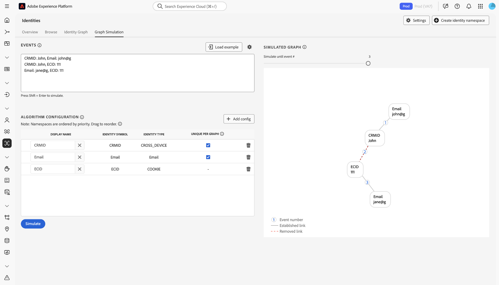
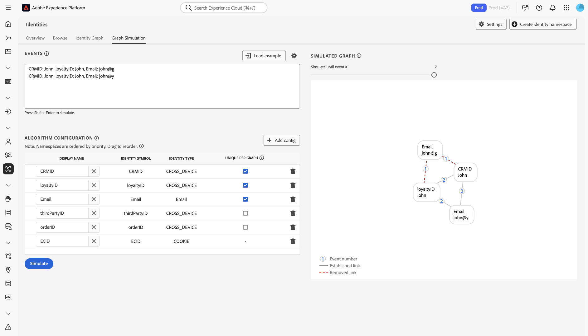

# Guía de configuraciones de [!DNL Identity Graph Linking Rules] {#configurations-guide}

>[!CONTEXTUALHELP]
>id="platform_identities_algorithmconfiguration"
>title="Configuración del algoritmo"
>abstract="Configure un área de nombres único y una prioridad de área de nombres adaptada a las identidades ingeridas."

>[!NOTE]
>
>* &quot;CRMID&quot; y &quot;loginID&quot; son áreas de nombres personalizadas. En este documento, &quot;CRMID&quot; es un identificador de persona y &quot;loginID&quot; es un identificador de inicio de sesión asociado a una persona determinada.
>* Para simular los escenarios de gráficos de ejemplo descritos en este documento, primero debe crear dos áreas de nombres personalizadas, una con el símbolo de identidad &quot;CRMID&quot; y otra con el símbolo de identidad &quot;loginID&quot;. Los símbolos de identidad distinguen entre mayúsculas y minúsculas.

Lea este documento para obtener más información acerca de los diferentes tipos de implementación que puede configurar con [!DNL Identity Graph Linking Rules].

Los escenarios de gráficos de clientes se pueden agrupar en tres categorías diferentes.

* **Básico**: [Las implementaciones básicas](#basic-implementations) incluyen gráficos que generalmente incluyen implementaciones simples. Estas implementaciones tienden a girar en torno a un único área de nombres entre dispositivos (por ejemplo, CRMID). Aunque las implementaciones básicas son bastante sencillas, puede producirse un colapso del gráfico, a menudo debido a **escenarios de dispositivos compartidos**.
* **Intermedio**: [Las implementaciones intermedias](#intermediate-implementations) incluyen varias variables como **varios espacios de nombres entre dispositivos**, **identidades no únicas** y **varios espacios de nombres únicos**.
* **Avanzadas**: [Las implementaciones avanzadas](#advanced-implementations) implican escenarios de gráficos complejos y de varias capas. Para implementaciones avanzadas, es esencial establecer la prioridad de área de nombres correcta para garantizar que se eliminen los vínculos adecuados, lo que evita el colapso del gráfico.

## Introducción 

Antes de sumergirse en el siguiente documento, asegúrese de familiarizarse con varios conceptos importantes del servicio de identidad y [!DNL Identity Graph Linking Rules].

* [Introducción al servicio de identidad](../home.md)
* [Información general de [!DNL Identity Graph Linking Rules]](../identity-graph-linking-rules/namespace-priority.md)
* [Prioridad del área de nombres](namespace-priority.md)
* [Área de nombres única](overview.md#unique-namespace)
* [Simulación de gráficos](graph-simulation.md)

## Implementaciones básicas {#basic-implementations}

Lea esta sección para ver las implementaciones básicas de [!DNL Identity Graph Linking Rules].

### Caso de uso: implementación simple que utiliza un área de nombres entre dispositivos

Por lo general, los clientes de Adobe tienen un único área de nombres entre dispositivos que se utiliza en todas sus propiedades, incluidas la web, la móvil y las aplicaciones. Este sistema es agnóstico tanto desde el punto de vista industrial como geográfico, ya que los clientes de los servicios minoristas, de telecomunicaciones y financieros utilizan este tipo de implementación.

Normalmente, un usuario final está representado por un área de nombres entre dispositivos (a menudo un CRMID), por lo tanto, el CRMID debe clasificarse como un área de nombres única. Un usuario final propietario de un equipo y de un(a) [!DNL iPhone] que no comparta su dispositivo podría tener un gráfico de identidad como el siguiente.

Imagine que es arquitecto de datos en una compañía de comercio electrónico llamada **ACME**. John y Jane son sus clientes. Son usuarios finales que viven juntos en San José, California. Comparten un equipo de escritorio y lo utilizan para examinar el sitio web. Del mismo modo, John y Jane también comparten un(a) [!DNL iPad] y ocasionalmente usan este(a) [!DNL iPad] para navegar por Internet, incluido el sitio web.

**Modo de texto**

```json
CRMID: John, ECID: 123
CRMID: John, ECID: 999, IDFA: a-b-c
```

**Configuración de algoritmo (Configuración de identidad)**

Configure los siguientes ajustes en la interfaz de simulación de gráficos antes de simular el gráfico.

| Nombre para mostrar | Símbolo de identidad | Tipo de identidad | Único por gráfico | Prioridad del área de nombres |
| --- | --- | --- | --- | --- |
| CRMID | CRMID | CROSS_DEVICE | ✔️ | 1 |
| ECID | ECID | COOKIE | | 2 |
| IDFA | IDFA | DISPOSITIVO | | 3 |

**Gráfico simulado**

+++Seleccionar para ver un gráfico simulado

En este gráfico, John (el usuario final) se representa mediante el CRMID. {ECID: 123} representa el explorador web que John utilizó en su equipo personal para visitar su plataforma de comercio electrónico. {ECID: 999} representa el explorador que usó en su [!DNL iPhone] y {IDFA: a-b-c} representa su [!DNL iPhone].


+++

### Ejercicio

Simule la siguiente configuración en Simulación de gráficos. Puede crear sus propios eventos o copiar y pegar mediante el modo de texto.

>[!BEGINTABS]

>[!TAB Dispositivo compartido (PC)]

**Dispositivo compartido (PC)**

**Modo de texto:**

```json
CRMID: John, ECID: 111
CRMID: Jane, ECID: 111
```

**Gráfico simulado**

+++Seleccionar para ver un gráfico simulado

En este gráfico, John y Jane están representados por sus propios CRMID respectivos:

* {CRMID: John}
* {CRMID: Jane}

El explorador del equipo de escritorio que ambos usan para visitar su plataforma de comercio electrónico está representado por {ECID: 111}. En este escenario de gráfico, Jane es el último usuario final autenticado y, por lo tanto, se elimina el vínculo entre {ECID: 111} y {CRMID: John}.


+++

>[!TAB Dispositivo compartido (móvil)]

**Dispositivo compartido (móvil)**

**Modo de texto:**

```json
CRMID: John, ECID: 111, IDFA: a-b-c
CRMID: Jane, ECID: 111, IDFA: a-b-c
```

**Gráfico simulado**

+++Seleccionar para ver un gráfico simulado

En este gráfico, John y Jane están representados por sus propios CRMID respectivos. El explorador que utilizan está representado por {ECID: 111} y [!DNL iPad] que comparten está representado por {IDFA: a-b-c}. En este escenario de gráfico, Jane es el último usuario final autenticado y, por lo tanto, se eliminan los vínculos de {ECID: 111} y {IDFA: a-b-c} a {CRMID: John}.


+++

>[!ENDTABS]

## Implementaciones intermedias {#intermediate-implementations}

Lea esta sección para implementaciones intermedias de [!DNL Identity Graph Linking Rules].

### Caso de uso: Sus datos incluyen identidades no únicas

>[!TIP]
>
>* Una **identidad no única** es una identidad asociada con un área de nombres no única.
>
>* En los ejemplos siguientes, `CChash` es un área de nombres personalizada que representa un número de tarjeta de crédito con hash.

Es un arquitecto de datos que trabaja para un banco comercial que emite tarjetas de crédito. Su equipo de marketing ha indicado que desea incluir el historial de transacciones de tarjetas de crédito anteriores en un perfil. Este gráfico de identidad puede tener el siguiente aspecto.

**Modo de texto:**

```json
CRMID: John, CChash: 1111-2222 
CRMID: John, CChash: 3333-4444 
CRMID: John, ECID: 123 
CRMID: John, ECID: 999, IDFA: a-b-c
```

**Configuración de algoritmo (Configuración de identidad)**

Configure los siguientes ajustes en la interfaz de simulación de gráficos antes de simular el gráfico.

| Nombre para mostrar | Símbolo de identidad | Tipo de identidad | Único por gráfico | Prioridad del área de nombres |
| --- | --- | --- | --- | --- |
| CRMID | CRMID | CROSS_DEVICE | ✔️ | 1 |
| Chash | Chash | CROSS_DEVICE | | 2 |
| ECID | ECID | COOKIE | | 3 |
| IDFA | IDFA | DISPOSITIVO | | 4 |

**Gráfico simulado**

+++Seleccionar para ver un gráfico simulado


+++

No hay garantías de que estos números de tarjeta de crédito, o cualquier otra área de nombres no única, siempre se asociarán a un único usuario final. Dos usuarios finales pueden registrarse con la misma tarjeta de crédito, y es posible que haya valores de marcador de posición no únicos que se hayan introducido erróneamente. En pocas palabras, no hay garantía de que las áreas de nombres no únicas no causen el colapso del gráfico.

Para resolver este problema, el servicio de identidad elimina los vínculos más antiguos y conserva los más recientes. Esto garantiza que solo tenga un CRMID en un gráfico, lo que evita el colapso del gráfico.

### Ejercicio

Simule las siguientes configuraciones en Simulación de gráficos. Puede crear sus propios eventos o copiar y pegar mediante el modo de texto.

>[!BEGINTABS]

>[!TAB Dos usuarios finales con la misma tarjeta de crédito]

Dos usuarios finales diferentes se suscriben al sitio web de comercio electrónico con la misma tarjeta de crédito. Su equipo de marketing desea evitar el colapso del gráfico asegurándose de que la tarjeta de crédito esté asociada con un solo perfil.

**Modo de texto:**

```json
CRMID: John, CChash: 1111-2222
CRMID: Jane, CChash: 1111-2222
CRMID: John, ECID: 123
CRMID: Jane, ECID:456
```

**Gráfico simulado**

+++Seleccionar para ver un gráfico simulado


+++

>[!TAB Número de tarjeta de crédito no válido]

Debido a datos no limpios, se ha introducido un número de tarjeta de crédito no válido en Experience Platform.

**Modo de texto:**

```json
CRMID: John, CChash: undefined
CRMID: Jane, CChash: undefined
CRMID: Jack, CChash: undefined
CRMID: Jill, CChash: undefined
```

**Gráfico simulado**

+++Seleccionar para ver un gráfico simulado


+++

>[!ENDTABS]

### Caso de uso: sus datos incluyen CRMID con hash y sin hash

Su está ingiriendo un CRMID sin hash (sin conexión) y un CRMID con hash (en línea). Esperan una relación directa entre los CRMID sin hash y con hash. Cuando un usuario final navega con una cuenta autenticada, el CRMID con hash se envía junto con el ID del dispositivo (representado en el servicio de identidad como un ECID).

**Configuración de algoritmo (Configuración de identidad)**

Configure los siguientes ajustes en la interfaz de simulación de gráficos antes de simular el gráfico.

| Nombre para mostrar | Símbolo de identidad | Tipo de identidad | Único por gráfico | Prioridad del área de nombres |
| --- | --- | --- | --- | --- | 
| CRMID | CRMID | CROSS_DEVICE | ✔️ | 1 |
| CRMIDhash | CRMIDhash | CROSS_DEVICE | ✔️ | 2 |
| ECID | ECID | COOKIE | | 3 |


**Ejercicio**

Simule las siguientes configuraciones en Simulación de gráficos. Puede crear sus propios eventos o copiar y pegar mediante el modo de texto.

>[!BEGINTABS]

>[!TAB Escenario 1: dispositivo compartido]

John y Jane comparten un dispositivo.

**Modo de texto:**

```json
CRMID: John, CRMIDhash: John
CRMID: Jane, CRMIDhash: Jane
CRMIDhash: John, ECID: 111 
CRMIDhash: Jane, ECID: 111
```


>[!TAB Escenario 2: datos erróneos]

Debido a errores en el proceso de hash, se genera un CRMID con hash no único que se envía al servicio de identidad.

**Modo de texto:**

```json
CRMID: John, CRMIDhash: aaaa
CRMID: Jane, CRMIDhash: aaaa
```


>[!ENDTABS]
<!-- 
### Use case: You are using Real-Time CDP and Adobe Commerce

You have two types of end-users:

* **Members**: An end-user who is assigned a CRMID and has an email account registered to your system.
* **Guests**: An end-user who is not a member. They do not have an assigned CRMID and their email accounts are not registered to your system.

In this scenario, your customers are sending data from Adobe Commerce to Real-Time CDP.

**Exercise**

Simulate the following configurations in the graph simulation tool. You can either create your own events, or copy and paste using text mode.

>[!BEGINTABS]

>[!TAB Shared device between two members]

In this scenario, two members share the same device to browse an e-commerce website.

**Text mode**

```json
CRMID: John, Email: john@g
CRMID: Jane, Email: jane@g
CRMID: John, ECID: 111
CRMID: Jane, ECID: 111
```


>[!TAB Shared device between two guests]

In this scenario, two guests share the same device to browse an e-commerce website.

**Text mode**

```json
Email: john@g, ECID: 111
Email: jane@g, ECID: 111
```


>[!TAB Shared device between a member and a guest]

In this scenario, a member and a guest share the same device to browse an e-commerce website.

**Text mode**

```json
CRMID: John, Email: john@g
CRMID: John, ECID: 111
Email: jane@g, ECID: 111
```



>[!ENDTABS] -->

### Caso de uso: sus datos incluyen tres áreas de nombres únicas

El cliente define una entidad de una sola persona de la siguiente manera:

* Un usuario final con un CRMID asignado.
* Usuario final asociado a una dirección de correo electrónico con hash, de modo que los perfiles se puedan activar en destinos que admitan correo electrónico con hash (por ejemplo, [!DNL Facebook]).
* Usuario final asociado a una dirección de correo electrónico, de modo que el personal de soporte pueda buscar su perfil en Real-Time CDP utilizando dicha dirección de correo electrónico.

| Nombre para mostrar | Símbolo de identidad | Tipo de identidad | Único por gráfico | Prioridad del área de nombres |
| --- | --- | --- | --- | --- |
| CRMID | CRMID | CROSS_DEVICE | ✔️ | 1 |
| Correo electrónico | Correo electrónico | Correo electrónico | ✔️ | 2 |
| Email_LC_SHA256 | Email_LC_SHA256 | Correo electrónico | ✔️ | 3 |
| ECID | ECID | COOKIE | | 4 |

Simule las siguientes configuraciones en la herramienta de simulación de gráficos. Puede crear sus propios eventos o copiar y pegar mediante el modo de texto.

>[!BEGINTABS]

>[!TAB Dos usuarios finales iniciaron sesión]

En esta situación, John y Jane inician sesión en un sitio web de comercio electrónico.

**Modo de texto**

```json
CRMID: John, Email: john@g, Email_LC_SHA256: john_hash 
CRMID: Jane, Email: jane@g, Email_LC_SHA256: jane_hash 
CRMID: John, ECID: 111 
CRMID: Jane, ECID: 111
```


>[!TAB Un usuario final cambia su correo electrónico]

**Modo de texto**

```json
CRMID: John, Email: john@g, Email_LC_SHA256: john_hash
CRMID: John, Email: john@y, Email_LC_SHA256: john_y_hash
```


>[!ENDTABS]

## Implementaciones avanzadas {#advanced-implementations}

Las implementaciones avanzadas implican escenarios de gráficos complejos y de varias capas. Estos tipos de implementaciones incluyen el uso de **namespace priority** para identificar los vínculos correctos que deben quitarse para evitar el colapso del gráfico.

**Prioridad del área de nombres** son metadatos que clasifican los áreas de nombres según su importancia. Si un gráfico contiene dos identidades, cada una con áreas de nombres únicas diferentes, el servicio de identidad utiliza la prioridad del área de nombres para decidir qué vínculos eliminar. Para obtener más información, lea la [documentación sobre la prioridad del área de nombres](../identity-graph-linking-rules/namespace-priority.md).

La prioridad del área de nombres juega un papel crítico en escenarios de gráficos complejos. Los gráficos pueden tener varias capas: un usuario final puede estar asociado con varios ID de inicio de sesión y estos ID de inicio de sesión pueden tener un cifrado hash. Además, se pueden vincular distintos ECID a distintos ID de inicio de sesión. Para asegurarse de que el vínculo correcto se elimine en la capa correcta, las configuraciones de prioridad de área de nombres deben ser correctas.

Lea esta sección para ver las implementaciones avanzadas de [!DNL Identity Graph Linking Rules].

### Caso de uso: necesita soporte para varias líneas de negocios

Los usuarios finales tienen dos cuentas diferentes, una cuenta personal y una cuenta empresarial. Cada cuenta se identifica con un ID diferente. En esta situación, un gráfico típico tendría el siguiente aspecto:

**Modo de texto***

```json
CRMID: John, loginID: JohnPersonal
CRMID: John, loginID: JohnBusiness
loginID: JohnPersonal, ECID: 111
loginID: JohnPersonal, ECID: 222
loginID: JohnBusiness, ECID: 222
```

**Configuración de algoritmo (Configuración de identidad)**

Configure los siguientes ajustes en la interfaz de simulación de gráficos antes de simular el gráfico.

| Nombre para mostrar | Símbolo de identidad | Tipo de identidad | Único por gráfico | Prioridad del área de nombres |
| --- | --- | --- | --- | --- |
| CRMID | CRMID | CROSS_DEVICE | ✔️ | 1 |
| loginID | loginID | CROSS_DEVICE | | 2 |
| ECID | ECID | COOKIE | | 3 |

**Gráfico simulado**

+++Seleccionar para ver un gráfico simulado


+++


**Ejercicio**

Simule la siguiente configuración en Simulación de gráficos. Puede crear sus propios eventos o copiar y pegar mediante el modo de texto.

>[!BEGINTABS]

>[!TAB Dispositivo compartido]

**Modo de texto**

```json
CRMID: John, loginID: JohnPersonal
CRMID: John, loginID: JohnBusiness
CRMID: Jane, loginID: JanePersonal
CRMID: Jane, loginID: JaneBusiness
loginID: JohnPersonal, ECID: 111
loginID: JanePersonal, ECID: 111
```


>[!TAB Se han enviado datos incorrectos a Real-Time CDP]

```json
CRMID: John, loginID: JohnPersonal
CRMID: John, loginID: error
CRMID: Jane, loginID: JanePersonal
CRMID: Jane, loginID: error
loginID: JohnPersonal, ECID: 111
loginID: JanePersonal, ECID: 222
```


>[!ENDTABS]

### Caso de uso: tiene implementaciones complejas que requieren varias áreas de nombres

Es una empresa de medios de comunicación y entretenimiento y los usuarios finales tienen lo siguiente:
* UN CRMID
* Un ID de fidelidad
Además, los usuarios finales pueden realizar una compra en el sitio web de comercio electrónico y estos datos están vinculados a su dirección de correo electrónico. Los datos de usuario también los enriquece un proveedor de bases de datos de terceros y se envían a Experience Platform por lotes.

**Modo de texto**

```json
CRMID: John, loyaltyID: John, Email: john@g
Email: john@g, orderID: aaa
CRMID: John, thirdPartyID: xyz
CRMID: John, ECID: 111
```

**Configuración de algoritmo (Configuración de identidad)**

Configure los siguientes ajustes en la interfaz de simulación de gráficos antes de simular el gráfico.

| Nombre para mostrar | Símbolo de identidad | Tipo de identidad | Único por gráfico | Prioridad del área de nombres |
| --- | --- | --- | --- | --- |
| CRMID | CRMID | CROSS_DEVICE | ✔️ | 1 |
| loyaltyID | loyaltyID | CROSS_DEVICE | | 2 |
| Correo electrónico | Correo electrónico | Correo electrónico | | 3 |
| thirdPartyID | thirdPartyID | CROSS_DEVICE | | 4 |
| orderID | orderID | CROSS_DEVICE | | 5 |
| ECID | ECID | COOKIE | | 6 |

**Ejercicio**

Simule la siguiente configuración en Simulación de gráficos. Puede crear sus propios eventos o copiar y pegar mediante el modo de texto.

>[!BEGINTABS]

>[!TAB Dispositivo compartido]

**Modo de texto**

```json
CRMID: John, loyaltyID: John, Email: john@g
CRMID: Jane, loyaltyID: Jane, Email: jane@g
Email: john@g, orderID: aaa 
CRMID: John, thirdPartyID: xyz 
CRMID: John, ECID: 111
CRMID: Jane, ECID: 111
```


>[!TAB El usuario final cambia su dirección de correo electrónico]

**Modo de texto**

```json
CRMID: John, loyaltyID: John, Email: john@g
CRMID: John, loyaltyID: John, Email: john@y
```



>[!TAB Cambia la asociación thirdPartyID]

**Modo de texto**

```json
CRMID: John, loyaltyID: John, Email: john@g
CRMID: Jane, loyaltyID: Jane, Email: jane@g
CRMID: John, thirdPartyID: xyz
CRMID: Jane, thirdPartyID: xyz
```


>[!TAB ID de pedido no único]

**Modo de texto**

```json
CRMID: John, loyaltyID: John, Email: john@g
CRMID: Jane, loyaltyID: Jane, Email: jane@g
Email: john@g, orderID: aaa
Email: jane@g, orderID: aaa
```


>[!TAB ID de fidelidad erróneo]

**Modo de texto**

```json
CRMID: John, loyaltyID: aaa, Email: john@g
CRMID: Jane, loyaltyID: aaa, Email: jane@g
```


>[!ENDTABS]

## Pasos siguientes

Para obtener más información sobre [!DNL Identity Graph Linking Rules], lea la siguiente documentación:

* [Información general de [!DNL Identity Graph Linking Rules]](./overview.md)
* [Algoritmo de optimización de identidad](./identity-optimization-algorithm.md)
* [Guía de implementación](./implementation-guide.md)
* [Resolución de problemas y preguntas frecuentes](./troubleshooting.md)
* [Prioridad del área de nombres](./namespace-priority.md)
* [IU de simulación de gráficos](./graph-simulation.md)
* [IU de configuración de identidad](./identity-settings-ui.md)