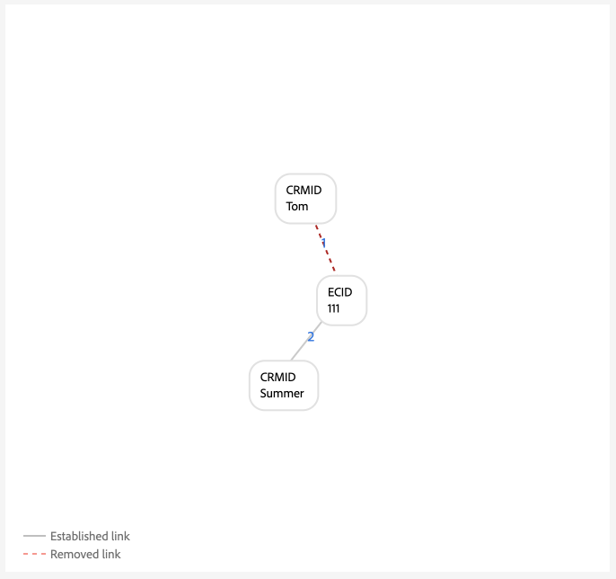

# Ejemplo de configuraciones de gráficos

>[!AVAILABILITY]
>
>Las reglas de vinculación de gráficos de identidad están actualmente en fase beta. Póngase en contacto con el equipo de su cuenta de Adobe para obtener información sobre los criterios de participación. La funcionalidad y la documentación están sujetas a cambios.

>[!NOTE]
>
>* &quot;CRMID&quot; y &quot;loginID&quot; son áreas de nombres personalizadas. En este documento, &quot;CRMID&quot; es un identificador de persona y &quot;loginID&quot; es un identificador de inicio de sesión asociado a una persona determinada.
>* Para simular los escenarios de gráficos de ejemplo descritos en este documento, primero debe crear dos áreas de nombres personalizadas, una con el símbolo de identidad &quot;CRMID&quot; y otra con el símbolo de identidad &quot;loginID&quot;. Los símbolos de identidad distinguen entre mayúsculas y minúsculas.

Este documento describe ejemplos de configuraciones de gráficos de escenarios comunes que podrían surgir al trabajar con datos de identidad.

## Solo CRMID

Este es un ejemplo de escenario de implementación simple en el que se incorporan eventos en línea (CRMID y ECID) y eventos sin conexión (registros de perfil) solo se almacenan con el CRMID.

**Implementación:**

| Áreas de nombres utilizadas | método de colección de comportamiento web |
| --- | --- |
| CRMID, ECID | SDK web |

**Eventos:**

Puede crear este escenario en la simulación de gráficos copiando los siguientes eventos en el modo de texto:

* CRMID: Tom, ECID: 111

**Configuración del algoritmo:**

Puede crear este escenario en la simulación de gráficos configurando la siguiente configuración para la configuración del algoritmo:

| Prioridad | Nombre para mostrar | Tipo de identidad | Único por gráfico |
| ---| --- | --- | --- |
| 1 | CRMID | CROSS_DEVICE | Sí |
| 2 | ECID | COOKIE | No |

**Selección de identidad principal para el perfil del cliente en tiempo real:**

En el contexto de esta configuración, la identidad principal se define de esta manera:

| Estado de autenticación | Área(s) de nombres en eventos | Identidad principal |
| --- | --- | --- |
| Authenticated | CRMID, ECID | CRMID |
| No autenticado | ECID | ECID |

>[!BEGINTABS]

>[!TAB Escenario ideal para gráficos de una sola persona]

El siguiente es un ejemplo de gráfico ideal de una sola persona, donde CRMID es único y tiene la prioridad más alta.

>[!TAB escenario de gráfico de varias personas]

El siguiente es un ejemplo de gráfico de varias personas. Este ejemplo muestra un escenario de &quot;dispositivo compartido&quot;, en el que hay dos CRMID y se elimina el que tiene el vínculo establecido más antiguo.

>[!ENDTABS]

## CRMID con correo electrónico con hash

En esta situación, se ingiere un CRMID que representa los datos en línea (evento de experiencia) y sin conexión (registro de perfil). Este escenario también implica la ingesta de un correo electrónico con hash, que representa otro área de nombres enviado en el conjunto de datos de registro de CRM junto con el CRMID.

**Implementación:**

| Áreas de nombres utilizadas | método de colección de comportamiento web |
| --- | --- |
| CRMID, Email_LC_SHA256, ECID | SDK web |

**Eventos:**

Puede crear este escenario en la simulación de gráficos copiando los siguientes eventos en el modo de texto:

* CRMID: Tom, Email_LC_SHA256: tom@acme.com
* CRMID: Tom, ECID: 111
* CRMID: Summer, Email_LC_SHA256: Summer@acme.com
* CRMID: Summer, ECID: 222

**Configuración del algoritmo:**

Puede crear este escenario en la simulación de gráficos configurando la siguiente configuración para la configuración del algoritmo:

| Prioridad | Nombre para mostrar | Tipo de identidad | Único por gráfico |
| ---| --- | --- | --- |
| 1 | CRMID | CROSS_DEVICE | Sí |
| 2 | Correos electrónicos (SHA256, en minúsculas) | Correo electrónico | No |
| 3 | ECID | COOKIE | No |

**Selección de identidad principal para el perfil:**

En el contexto de esta configuración, la identidad principal se define de esta manera:

| Estado de autenticación | Área(s) de nombres en eventos | Identidad principal |
| --- | --- | --- |
| Authenticated | CRMID, ECID | CRMID |
| No autenticado | ECID | ECID |

>[!BEGINTABS]

>[!TAB Escenario ideal para gráficos de una sola persona]

>[!TAB gráfico de varias personas: dispositivo compartido]

>[!TAB gráfico de varias personas: correo electrónico no único]

>[!ENDTABS]

## CRMID con correo electrónico con hash, teléfono con hash, GAID e IDFA

Este escenario es similar al anterior. Sin embargo, en esta situación, el correo electrónico y el teléfono con hash se están marcando como identidades para usarlos en la coincidencia de segmentos.

**Implementación:**

| Áreas de nombres utilizadas | método de colección de comportamiento web |
| --- | --- |
| CRMID, Email_LC_SHA256, Phone_SHA256, GAID, IDFA, ECID | SDK web |

**Eventos:**

Puede crear este escenario en la simulación de gráficos copiando los siguientes eventos en el modo de texto:

* CRMID: Tom, Email_LC_SHA256: aabbcc, Phone_SHA256: 123-4567
* CRMID: Tom, ECID: 111
* CRMID: Tom, ECID: 222, IDFA: A-A-A
* CRMID: Summer, Email_LC_SHA256: ddeeff, Phone_SHA256: 765-4321
* CRMID: Summer, ECID: 333
* CRMID: Summer, ECID: 444, GAID: B-B-B

**Configuración del algoritmo:**

Puede crear este escenario en la simulación de gráficos configurando la siguiente configuración para la configuración del algoritmo:

| Prioridad | Nombre para mostrar | Tipo de identidad | Único por gráfico |
| ---| --- | --- | --- |
| 1 | CRMID | CROSS_DEVICE | Sí |
| 2 | Correos electrónicos (SHA256, en minúsculas) | Correo electrónico | No |
| 3 | Teléfono (SHA256) | Teléfono | No |
| 4 | ID de anuncio de Google (GAID) | DISPOSITIVO | No |
| 5 | Apple IDFA (ID para Apple) | DISPOSITIVO | No |
| 6 | ECID | COOKIE | No |

**Selección de identidad principal para el perfil:**

En el contexto de esta configuración, la identidad principal se define de esta manera:

| Estado de autenticación | Área(s) de nombres en eventos | Identidad principal |
| --- | --- | --- |
| Authenticated | CRMID, IDFA, ECID | CRMID |
| Authenticated | CRMID, GAID, ECID | CRMID |
| Authenticated | CRMID, ECID | CRMID |
| No autenticado | GAID, ECID | GAID |
| No autenticado | IDFA, ECID | IDFA |
| No autenticado | ECID | ECID |

>[!BEGINTABS]

>[!TAB Escenario ideal para gráficos de una sola persona]

>[!ENDTABS]

<!-- 
## Single CRMID with multiple login IDs (simple)

In this scenario, there is a single CRMID that represents a person entity. However, a person entity may have multiple login identifiers:

* A given person entity can have different account account types (personal vs. business, account by state, account by brand, etc.)
* A given person entity may use different email addresses for any number of accounts.

Therefore, **it is crucial that the CRMID is always sent for every user**. Failure to do so may result in a "dangling" login ID scenario, where a single person entity is assumed to be sharing a device with another person.

**Implementation:**

| Namespaces used | Web behavior collection method |
| --- | --- |
| CRMID, loginID, ECID | Web SDK |

**Events:**

You can create this scenario in graph simulation by copying the following events to text mode:

* CRMID: John, loginID: ID_A
* CRMID: John, loginID: ID_B
* loginID: ID_A, ECID: 111
* CRMID: Jane, loginID: ID_C
* CRMID: Jane, loginID: ID_D
* loginID: ID_C, ECID: 222

**Algorithm configuration:**

You can create this scenario in graph simulation by configuring the following setup for your algorithm configuration:

| Priority | Display name | Identity symbol | Identity type | Unique per graph |
| ---| --- | --- | --- | --- |
| 1 | CRMID | CRMID | CROSS_DEVICE | Yes |
| 2 | loginID | loginID | CROSS_DEVICE | No |
| 3 | ECID | ECID | COOKIE | No |

## Single CRMID with multiple login IDs (complex)

In this scenario, there is a single CRMID that represents a person entity. However, a person entity may have multiple login identifiers:

* A given person entity can have different account account types (personal vs. business, account by state, account by brand, etc.)
* A given person entity may use different email addresses for any number of accounts.

The case of "dangling" loginID also applies for this scenario.

**Implementation:**

| Namespaces used | Web behavior collection method |
| --- | --- |
| CRMID, Email_LC_SHA256, Phone_SHA256, loginID, ECID, AAID | Adobe Analytics source connector |

**Events:**

You can create this scenario in graph simulation by copying the following events to text mode:

* CRMID: John, Email_LC_SHA256: aabbcc, Phone_SHA256: 123-4567
* CRMID: John, loginID: ID_A
* CRMID: John, loginID: ID_B
* loginID:ID_A, ECID: 111, AAID: AAA
* CRMID: Jane, Email_LC_SHA256: ddeeff, Phone_SHA256: 765-4321
* CRMID: Jane, loginID: ID_C
* CRMID: Jane, loginID: ID_D
* loginID: ID_C, ECID: 222, AAID: BBB

**Algorithm configuration:**

You can create this scenario in graph simulation by configuring the following setup for your algorithm configuration:

| Priority | Display name | Identity symbol | Identity type | Unique per graph |
| ---| --- | --- | --- | --- |
| 1 | CRMID | CRMID | CROSS_DEVICE | Yes |
| 2 | Email_LC_SHA256 | Email_LC_SHA256 | EMAIL | No |
| 3 | Phone_SHA256 | Phone_SHA256 | PHONE | No |
| 4 | loginID | loginID | CROSS_DEVICE | No |
| 5 | ECID | ECID | COOKIE | No |
| 6 | AAID | AAID | COOKIE | No |
 -->
