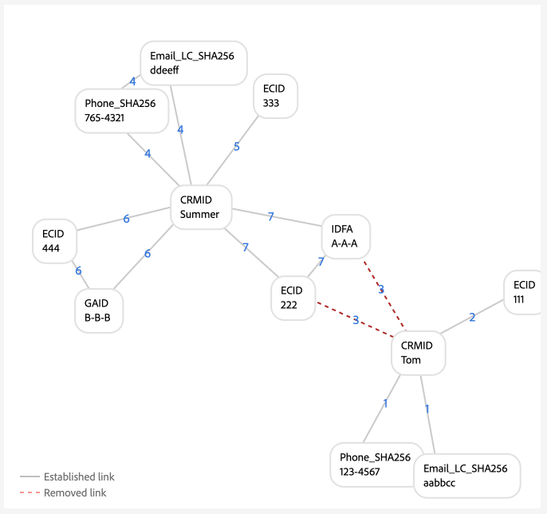
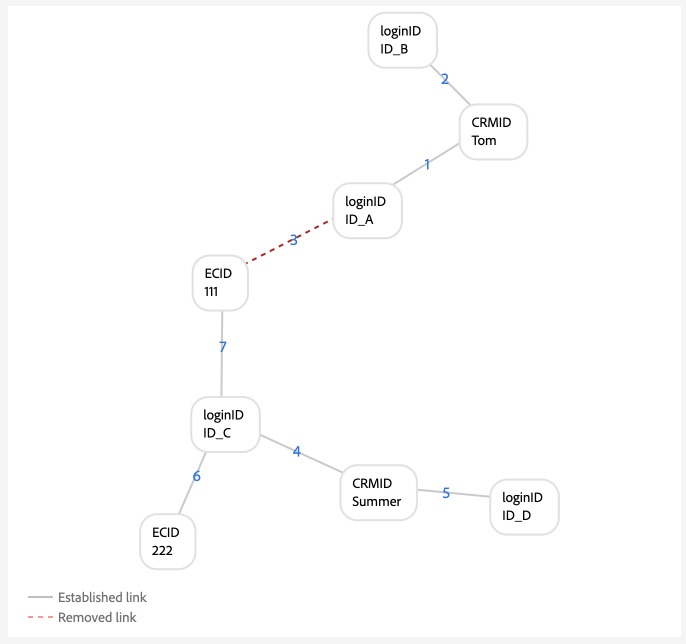
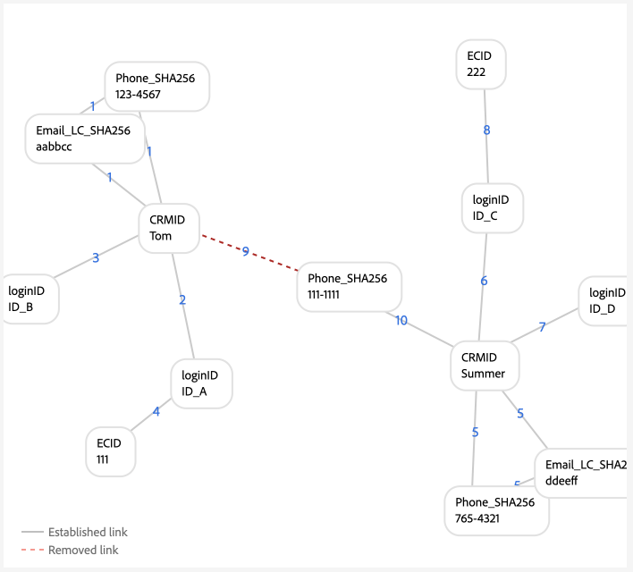
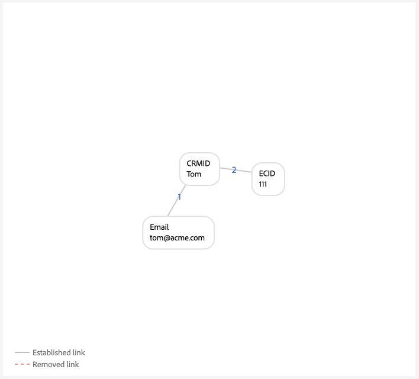
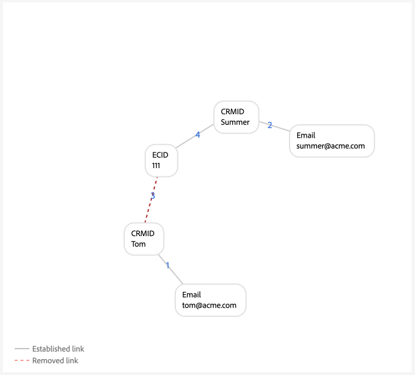

# Ejemplos de configuraciones de gráficos {#examples-of-graph-configurations}

>[!CONTEXTUALHELP]
>id="platform_identities_algorithmconfiguration"
>title="Configuración de algoritmo"
>abstract="Configure un espacio de nombres único y una prioridad de área de nombres adaptada a las identidades ingeridas."
>additional-url="https://experienceleague.adobe.com/en/docs/experience-platform/identity/features/identity-graph-linking-rules/example-configurations" text="Más información"

>[!AVAILABILITY]
>
>Las reglas de vinculación de gráficos de identidad están actualmente en disponibilidad limitada. Póngase en contacto con el equipo de su cuenta de Adobe para obtener información sobre cómo acceder a la función en los entornos limitados de desarrollo.

>[!NOTE]
>
>* &quot;CRMID&quot; y &quot;loginID&quot; son áreas de nombres personalizadas. En este documento, &quot;CRMID&quot; es un identificador de persona y &quot;loginID&quot; es un identificador de inicio de sesión asociado a una persona determinada.
>* Para simular los escenarios de gráficos de ejemplo descritos en este documento, primero debe crear dos áreas de nombres personalizadas, una con el símbolo de identidad &quot;CRMID&quot; y otra con el símbolo de identidad &quot;loginID&quot;. Los símbolos de identidad distinguen entre mayúsculas y minúsculas.

Este documento describe ejemplos de configuración de gráficos de escenarios comunes que podrían surgir al trabajar con reglas de vinculación de gráficos de identidad y datos de identidad.

## Solo CRMID

Este es un ejemplo de escenario de implementación simple en el que se incorporan eventos en línea (CRMID y ECID) y eventos sin conexión (registros de perfil) solo se almacenan con el CRMID.

**Implementación:**

| Áreas de nombres utilizadas | método de colección de comportamiento web |
| --- | --- |
| CRMID, ECID | SDK web |

**Eventos:**

Puede crear este escenario en la simulación de gráficos copiando los siguientes eventos en el modo de texto:

```shell
CRMID: Tom, ECID: 111
```

**Configuración del algoritmo:**

Puede crear este escenario en la simulación de gráficos configurando la siguiente configuración para la configuración del algoritmo:

| Prioridad | Nombre para mostrar | Tipo de identidad | Único por gráfico |
| ---| --- | --- | --- |
| 1 | CRMID | CROSS_DEVICE | Sí |
| 2 | ECID | COOKIE | No |

**Selección de identidad principal para el perfil del cliente en tiempo real:**

En el contexto de esta configuración, la identidad principal se define de esta manera:

| Estado de autenticación | Área(s) de nombres en eventos | Identidad principal |
| --- | --- | --- |
| Authenticated | CRMID, ECID | CRMID |
| No autenticado | ECID | ECID |

**Ejemplos de gráficos**

>[!BEGINTABS]

>[!TAB Gráfico ideal para una sola persona]

El siguiente es un ejemplo de gráfico ideal de una sola persona, donde CRMID es único y tiene la prioridad más alta.


>[!TAB Gráfico de varias personas]

El siguiente es un ejemplo de gráfico de varias personas. Este ejemplo muestra un escenario de &quot;dispositivo compartido&quot;, en el que hay dos CRMID y se elimina el que tiene el vínculo establecido más antiguo.


**Entrada de eventos de simulación de gráficos**

```shell
CRMID: Tom, ECID: 111
CRMID: Summer, ECID: 111
```

>[!ENDTABS]

## CRMID con correo electrónico con hash

En esta situación, se ingiere un CRMID que representa los datos en línea (evento de experiencia) y sin conexión (registro de perfil). Este escenario también implica la ingesta de un correo electrónico con hash, que representa otro área de nombres enviado en el conjunto de datos de registro de CRM junto con el CRMID.

>[!IMPORTANT]
>
>**Es crucial que el CRMID siempre se envíe para cada usuario**. Si no se hace esto, puede ocurrir un escenario de ID de inicio de sesión &quot;colgado&quot;, en el que se supone que una sola entidad de persona comparte un dispositivo con otra persona.

**Implementación:**

| Áreas de nombres utilizadas | método de colección de comportamiento web |
| --- | --- |
| CRMID, Email_LC_SHA256, ECID | SDK web |

**Eventos:**

Puede crear este escenario en la simulación de gráficos copiando los siguientes eventos en el modo de texto:

```shell
CRMID: Tom, Email_LC_SHA256: tom<span>@acme.com
CRMID: Tom, ECID: 111
CRMID: Summer, Email_LC_SHA256: summer<span>@acme.com
CRMID: Summer, ECID: 222
```

**Configuración del algoritmo:**

Puede crear este escenario en la simulación de gráficos configurando la siguiente configuración para la configuración del algoritmo:

| Prioridad | Nombre para mostrar | Tipo de identidad | Único por gráfico |
| ---| --- | --- | --- |
| 1 | CRMID | CROSS_DEVICE | Sí |
| 2 | Correos electrónicos (SHA256, en minúsculas) | Correo electrónico | No |
| 3 | ECID | COOKIE | No |

**Selección de identidad principal para el perfil:**

En el contexto de esta configuración, la identidad principal se define de esta manera:

| Estado de autenticación | Área(s) de nombres en eventos | Identidad principal |
| --- | --- | --- |
| Authenticated | CRMID, ECID | CRMID |
| No autenticado | ECID | ECID |

**Ejemplos de gráficos**

>[!BEGINTABS]

>[!TAB Gráfico ideal para una sola persona]

Los siguientes son ejemplos de un par de gráficos ideales para una sola persona, donde cada CRMID está asociado con su respectivo área de nombres de correo electrónico con hash y ECID.


>[!TAB Gráfico de varias personas: dispositivo compartido]

El siguiente es un ejemplo de escenario de gráfico de varias personas en el que dos personas comparten un dispositivo.


**Entrada de eventos de simulación de gráficos**

```shell
CRMID: Tom, Email_LC_SHA256: aabbcc
CRMID: Tom, ECID: 111
CRMID: Summer, Email_LC_SHA256: ddeeff
CRMID: Summer, ECID: 222
CRMID: Summer, ECID: 111
```

>[!TAB Gráfico de varias personas: correo electrónico no único]

El siguiente es un ejemplo de escenario de gráfico de varias personas en el que el correo electrónico no es único y se asocia con dos CRMID diferentes.


**Entrada de eventos de simulación de gráficos**

```shell
CRMID: Tom, Email_LC_SHA256: aabbcc
CRMID: Tom, ECID: 111
CRMID: Summer, Email_LC_SHA256: ddeeff
CRMID: Summer, ECID: 222
CRMID: Summer, Email_LC_SHA256: aabbcc
```

>[!ENDTABS]

## CRMID con correo electrónico con hash, teléfono con hash, GAID e IDFA

Este escenario es similar al anterior. Sin embargo, en este escenario, el correo electrónico y el teléfono con hash se están marcando como identidades a utilizar en [[!DNL Segment Match]](../../segmentation/ui/segment-match/overview.md).

>[!IMPORTANT]
>
>**Es crucial que el CRMID siempre se envíe para cada usuario**. Si no se hace esto, puede ocurrir un escenario de ID de inicio de sesión &quot;colgado&quot;, en el que se supone que una sola entidad de persona comparte un dispositivo con otra persona.

**Implementación:**

| Áreas de nombres utilizadas | método de colección de comportamiento web |
| --- | --- |
| CRMID, Email_LC_SHA256, Phone_SHA256, GAID, IDFA, ECID | SDK web |

**Eventos:**

Puede crear este escenario en la simulación de gráficos copiando los siguientes eventos en el modo de texto:

```shell
CRMID: Tom, Email_LC_SHA256: aabbcc, Phone_SHA256: 123-4567
CRMID: Tom, ECID: 111
CRMID: Tom, ECID: 222, IDFA: A-A-A
CRMID: Summer, Email_LC_SHA256: ddeeff, Phone_SHA256: 765-4321
CRMID: Summer, ECID: 333
CRMID: Summer, ECID: 444, GAID:B-B-B
```

**Configuración del algoritmo:**

Puede crear este escenario en la simulación de gráficos configurando la siguiente configuración para la configuración del algoritmo:

| Prioridad | Nombre para mostrar | Tipo de identidad | Único por gráfico |
| ---| --- | --- | --- |
| 1 | CRMID | CROSS_DEVICE | Sí |
| 2 | Correos electrónicos (SHA256, en minúsculas) | Correo electrónico | No |
| 3 | Teléfono (SHA256) | Teléfono | No |
| 4 | ID de anuncio de Google (GAID) | DISPOSITIVO | No |
| 5 | Apple IDFA (ID para Apple) | DISPOSITIVO | No |
| 6 | ECID | COOKIE | No |

**Selección de identidad principal para el perfil:**

En el contexto de esta configuración, la identidad principal se define de esta manera:

| Estado de autenticación | Área(s) de nombres en eventos | Identidad principal |
| --- | --- | --- |
| Authenticated | CRMID, IDFA, ECID | CRMID |
| Authenticated | CRMID, GAID, ECID | CRMID |
| Authenticated | CRMID, ECID | CRMID |
| No autenticado | GAID, ECID | GAID |
| No autenticado | IDFA, ECID | IDFA |
| No autenticado | ECID | ECID |

**Ejemplos de gráficos**

>[!BEGINTABS]

>[!TAB Gráfico ideal para una sola persona]

El siguiente es un escenario ideal para gráficos de una sola persona en el que el correo electrónico con hash y el teléfono con hash se marcan como identidades para su uso en [!DNL Segment Match]. En este escenario, los gráficos se dividen en dos para representar a entidades de persona diferentes.


>[!TAB Gráfico de varias personas: dispositivo compartido, equipo compartido]

El siguiente es un escenario de gráfico de varias personas en el que dos personas comparten un dispositivo (equipo). En este escenario, el equipo compartido está representado por `{ECID: 111}` y está vinculado a `{CRMID: Summer}` porque ese vínculo es el vínculo establecido más recientemente. `{CRMID: Tom}` se ha quitado porque el vínculo entre `{CRMID: Tom}` y `{ECID: 111}` es anterior y porque CRMID es el área de nombres única designada en esta configuración.


**Entrada de eventos de simulación de gráficos**

```shell
CRMID: Tom, Email_LC_SHA256: aabbcc, Phone_SHA256: 123-4567
CRMID: Tom, ECID: 111
CRMID: Tom, ECID: 222, IDFA: A-A-A
CRMID: Summer, Email_LC_SHA256: ddeeff, Phone_SHA256: 765-4321
CRMID: Summer, ECID: 333
CRMID: Summer, ECID: 444, GAID:B-B-B
CRMID: Summer, ECID: 111
```

>[!TAB Gráfico de varias personas: dispositivo compartido, dispositivo móvil Android]

El siguiente es un escenario de gráfico de varias personas en el que dos personas comparten un dispositivo Android. En este escenario, CRMID está configurado como un área de nombres única y, por lo tanto, el vínculo más reciente de `{CRMID: Tom, GAID: B-B-B, ECID:444}` reemplaza al `{CRMID: Summer, GAID: B-B-B, ECID:444}` más antiguo.


**Entrada de eventos de simulación de gráficos**

```shell
CRMID: Tom, Email_LC_SHA256: aabbcc, Phone_SHA256: 123-4567
CRMID: Tom, ECID: 111
CRMID: Tom, ECID: 222, IDFA: A-A-A
CRMID: Summer, Email_LC_SHA256: ddeeff, Phone_SHA256: 765-4321
CRMID: Summer, ECID: 333
CRMID: Summer, ECID: 444, GAID: B-B-B
CRMID: Tom, ECID: 444, GAID: B-B-B
```

>[!TAB Gráfico de varias personas: dispositivo compartido, dispositivo móvil de Apple, sin restablecimiento de ECID]

El siguiente es un escenario de gráfico de varias personas en el que dos personas comparten un dispositivo Apple. En este escenario, el IDFA se comparte, pero el ECID no se restablece.



**Entrada de eventos de simulación de gráficos**

```shell
CRMID: Tom, Email_LC_SHA256: aabbcc, Phone_SHA256: 123-4567
CRMID: Tom, ECID: 111
CRMID: Tom, ECID: 222, IDFA: A-A-A
CRMID: Summer, Email_LC_SHA256: ddeeff, Phone_SHA256: 765-4321
CRMID: Summer, ECID: 333
CRMID: Summer, ECID: 444, GAID: B-B-B
CRMID: Summer, ECID: 222, IDFA: A-A-A
```

>[!TAB Gráfico de varias personas: dispositivos compartidos, Apple, restablecimientos de ECID]

El siguiente es un escenario de gráfico de varias personas en el que dos personas comparten un dispositivo Apple. En este escenario, el ECID se restablece, pero el IDFA sigue siendo el mismo.


**Entrada de eventos de simulación de gráficos**

```shell
CRMID: Tom, Email_LC_SHA256: aabbcc, Phone_SHA256: 123-4567
CRMID: Tom, ECID: 111
CRMID: Tom, ECID: 222, IDFA: A-A-A
CRMID: Summer, Email_LC_SHA256: ddeeff, Phone_SHA256: 765-4321
CRMID: Summer, ECID: 333
CRMID: Summer, ECID: 444, GAID: B-B-B
CRMID: Summer, ECID: 555, IDFA: A-A-A
```

>[!TAB Gráfico de varias personas: teléfono no único]

El siguiente es un escenario de gráfico de varias personas en el que dos personas comparten el mismo número de teléfono.


**Entrada de eventos de simulación de gráficos**

```shell
CRMID: Tom, Email_LC_SHA256: aabbcc, Phone_SHA256: 123-4567
CRMID: Tom, ECID: 111
CRMID: Tom, ECID: 222, IDFA: A-A-A
CRMID: Summer, Email_LC_SHA256: ddeeff, Phone_SHA256: 765-4321
CRMID: Summer, ECID: 333
CRMID: Summer, ECID: 444, GAID: B-B-B
CRMID: Summer, Phone_SHA256: 123-4567
```

En este ejemplo, `{Phone_SHA256}` también está marcado como un área de nombres única. Por lo tanto, un gráfico no puede tener más de una identidad con el área de nombres `{Phone_SHA256}`. En este escenario, `{Phone_SHA256: 765-4321}` se desenlazó de `{CRMID: Summer}` y `{Email_LC_SHA256: ddeeff}` porque es el vínculo más antiguo,


>[!TAB Gráfico de varias personas: correo electrónico no único]

El siguiente es un escenario de gráfico de varias personas en el que dos personas comparten el correo electrónico.


**Entrada de eventos de simulación de gráficos**

```shell
CRMID: Tom, Email_LC_SHA256: aabbcc, Phone_SHA256: 123-4567
CRMID: Tom, ECID: 111
CRMID: Tom, ECID: 222, IDFA: A-A-A
CRMID: Summer, Email_LC_SHA256: ddeeff, Phone_SHA256: 765-4321
CRMID: Summer, ECID: 333
CRMID: Summer, ECID: 444, GAID: B-B-B
CRMID: Summer, Email_LC_SHA256: aabbcc
```

>[!ENDTABS]

## Un CRMID con varios ID de inicio de sesión (versión simple)

En este escenario, hay un solo CRMID que representa una entidad de persona. Sin embargo, una entidad de persona puede tener varios identificadores de inicio de sesión:

* Una entidad de persona determinada puede tener diferentes tipos de cuenta (personal frente a empresarial, cuenta por estado, cuenta por marca, etc.)
* Una entidad de persona determinada puede utilizar direcciones de correo electrónico diferentes para cualquier número de cuentas.

>[!IMPORTANT]
>
>**Es crucial que el CRMID siempre se envíe para cada usuario**. Si no se hace esto, puede ocurrir un escenario de ID de inicio de sesión &quot;colgado&quot;, en el que se supone que una sola entidad de persona comparte un dispositivo con otra persona.

**Implementación:**

| Áreas de nombres utilizadas | método de colección de comportamiento web |
| --- | --- |
| CRMID, loginID, ECID | SDK web |

**Eventos:**

Puede crear este escenario en la simulación de gráficos copiando los siguientes eventos en el modo de texto:

```shell
CRMID: Tom, loginID: ID_A
CRMID: Tom, loginID: ID_B
loginID: ID_A, ECID: 111
CRMID: Summer, loginID: ID_C
CRMID: Summer, loginID: ID_D
loginID: ID_C, ECID: 222
```

**Configuración del algoritmo:**

Puede crear este escenario en la simulación de gráficos configurando la siguiente configuración para la configuración del algoritmo:

| Prioridad | Nombre para mostrar | Tipo de identidad | Único por gráfico |
| ---| --- | --- | --- |
| 1 | CRMID | CROSS_DEVICE | Sí |
| 2 | loginID | CROSS_DEVICE | No |
| 3 | ECID | COOKIE | No |

**Selección de identidad principal para el perfil:**

En el contexto de esta configuración, la identidad principal se define de esta manera:

| Estado de autenticación | Área(s) de nombres en eventos | Identidad principal |
| --- | --- | --- |
| Authenticated | loginID, ECID | loginID |
| Authenticated | loginID, ECID | loginID |
| Authenticated | CRMID, loginID, ECID | CRMID |
| Authenticated | CRMID, ECID | CRMID |
| No autenticado | ECID | ECID |

**Ejemplos de gráficos**

>[!BEGINTABS]

>[!TAB Escenario ideal para una sola persona]

El siguiente es un escenario de gráfico de una sola persona con un único CRMID y varios ID de inicio de sesión.


>[!TAB Escenario de gráfico de varias personas: dispositivo compartido]

El siguiente es un escenario de gráfico de varias personas en el que dos personas comparten un dispositivo. En este escenario, `{ECID:111}` está vinculado con `{loginID:ID_A}` y `{loginID:ID_C}`, y el vínculo establecido más antiguo de `{ECID:111, loginID:ID_A}` se elimina.



**Entrada de eventos de simulación de gráficos**

```shell
CRMID: Tom, loginID: ID_A
CRMID: Tom, loginID: ID_B
loginID: ID_A, ECID: 111
CRMID: Summer, loginID: ID_C
CRMID: Summer, loginID: ID_D
loginID: ID_C, ECID: 222
loginID: ID_C, ECID: 111
```

>[!TAB Escenario de gráfico de varias personas: datos incorrectos]

El siguiente es un escenario de gráfico de varias personas que implica datos incorrectos. En este escenario, `{loginID:ID_D}` está vinculado incorrectamente a dos usuarios diferentes y se elimina el vínculo con la marca de tiempo anterior, en favor del vínculo establecido más recientemente.


**Entrada de eventos de simulación de gráficos**

```shell
CRMID: Tom, loginID: ID_A
CRMID: Tom, loginID: ID_B
loginID: ID_A, ECID: 111
CRMID: Summer, loginID: ID_C
CRMID: Summer, loginID: ID_D
loginID: ID_C, ECID: 222
CRMID: Tom, loginID: ID_D
```

>[!TAB &#39;Dangling&#39; loginID]

El siguiente gráfico simula un escenario de ID de inicio de sesión &quot;colgado&quot;. En este ejemplo, dos ID de inicio de sesión diferentes están enlazados al mismo ECID. Sin embargo, `{loginID:ID_C}` no está vinculado al CRMID. Por lo tanto, el servicio de identidad no puede detectar que estos dos ID de inicio de sesión representen dos entidades diferentes.


**Entrada de eventos de simulación de gráficos**

```shell
CRMID: Tom, loginID: ID_A
CRMID: Tom, loginID: ID_B
loginID: ID_A, ECID: 111
loginID: ID_C, ECID: 111
```

>[!ENDTABS]

## Un CRMID con varios ID de inicio de sesión (versión compleja)

En este escenario, hay un solo CRMID que representa una entidad de persona. Sin embargo, una entidad de persona puede tener varios identificadores de inicio de sesión:

* Una entidad de persona determinada puede tener diferentes tipos de cuenta (personal frente a empresarial, cuenta por estado, cuenta por marca, etc.)
* Una entidad de persona determinada puede utilizar direcciones de correo electrónico diferentes para cualquier número de cuentas.

>[!IMPORTANT]
>
>**Es crucial que el CRMID siempre se envíe para cada usuario**. Si no se hace esto, puede ocurrir un escenario de ID de inicio de sesión &quot;colgado&quot;, en el que se supone que una sola entidad de persona comparte un dispositivo con otra persona.

**Implementación:**

| Áreas de nombres utilizadas | método de colección de comportamiento web |
| --- | --- |
| CRMID, Email_LC_SHA256, Phone_SHA256, loginID, ECID | Conector de origen de Adobe Analytics. <br> **Nota:** De forma predeterminada, los AAID están bloqueados en el servicio de identidad, por lo que debe asignar una prioridad mayor a los ECID que a los AAID al usar el origen de Analytics. Lea la [guía de implementación](./implementation-guide.md#ingest-your-data) para obtener más información.</br> |

**Eventos:**

Puede crear este escenario en la simulación de gráficos copiando los siguientes eventos en el modo de texto:

```shell
CRMID: Tom, Email_LC_SHA256: aabbcc, Phone_SHA256: 123-4567
CRMID: Tom, loginID: ID_A
CRMID: Tom, loginID: ID_B
loginID: ID_A, ECID: 111
CRMID: Summer, Email_LC_SHA256: ddeeff, Phone_SHA256: 765-4321
CRMID: Summer, loginID: ID_C
CRMID: Summer, loginID: ID_D
loginID: ID_C, ECID: 222
```

**Configuración del algoritmo:**

Puede crear este escenario en la simulación de gráficos configurando la siguiente configuración para la configuración del algoritmo:

| Prioridad | Nombre para mostrar | Tipo de identidad | Único por gráfico |
| ---| --- | --- | --- | 
| 1 | CRMID | CROSS_DEVICE | Sí |
| 2 | Email_LC_SHA256 | Correo electrónico | No |
| 3 | Phone_SHA256 | Teléfono | No |
| 4 | loginID | CROSS_DEVICE | No |
| 5 | ECID | COOKIE | No |
| 6 | AAID | COOKIE | No |

**Selección de identidad principal para el perfil:**

En el contexto de esta configuración, la identidad principal se define de esta manera:

| Estado de autenticación | Área(s) de nombres en eventos | Identidad principal |
| --- | --- | --- |
| Authenticated | loginID, ECID | loginID |
| Authenticated | loginID, ECID | loginID |
| Authenticated | CRMID, loginID, ECID | CRMID |
| Authenticated | CRMID, ECID | CRMID |
| No autenticado | ECID | ECID |

**Ejemplos de gráficos**

>[!BEGINTABS]

>[!TAB Gráfico ideal para una sola persona]

A continuación se muestra un ejemplo de dos gráficos de una sola persona, cada uno con un CRMID y varios ID de inicio de sesión.


>[!TAB Gráfico de varias personas: dispositivo compartido 1]

El siguiente es un escenario de dispositivo compartido de varias personas donde `{ECID:111}` está vinculado a `{loginID:ID_A}` y a `{loginID:ID_C}`. En este caso, los vínculos establecidos más antiguos se eliminan en favor de los vínculos establecidos más recientemente.


**Entrada de eventos de simulación de gráficos**

```shell
CRMID: Tom, Email_LC_SHA256: aabbcc, Phone_SHA256: 123-4567
CRMID: Tom, loginID: ID_A
CRMID: Tom, loginID: ID_B
loginID: ID_A, ECID: 111
CRMID: Summer, Email_LC_SHA256: ddeeff, Phone_SHA256: 765-4321
CRMID: Summer, loginID: ID_C
CRMID: Summer, loginID: ID_D
loginID: ID_C, ECID: 222
loginID: ID_C, ECID: 111
```

>[!TAB Gráfico de varias personas: dispositivo compartido 2]

En esta situación, en lugar de enviar solo el ID de inicio de sesión, tanto el ID de inicio de sesión como el CRMID se envían como eventos de experiencia.


**Entrada de eventos de simulación de gráficos**

```shell
CRMID: Tom, Email_LC_SHA256: aabbcc, Phone_SHA256: 123-4567
CRMID: Tom, loginID: ID_A
CRMID: Tom, loginID: ID_B
loginID: ID_A, ECID: 111
CRMID: Summer, Email_LC_SHA256: ddeeff, Phone_SHA256: 765-4321
CRMID: Summer, loginID: ID_C
CRMID: Summer, loginID: ID_D
loginID: ID_C, ECID: 222
CRMID: Summer, loginID: ID_C, ECID: 111
loginID: ID_A, ECID: 111
```

>[!TAB Gráfico de varias personas: datos de loginID incorrectos]

En este escenario, `{loginID:ID_C}` está vinculado a `{CRMID:Tom}` y a `{CRMID:Summer}` y, por lo tanto, se considera que son datos incorrectos porque los escenarios de gráficos ideales no deben vincular los mismos loginIDs a dos usuarios diferentes. En este caso, los vínculos establecidos más antiguos se eliminan en favor de los vínculos establecidos más recientemente.


**Entrada de eventos de simulación de gráficos**

```shell
CRMID: Tom, Email_LC_SHA256: aabbcc, Phone_SHA256: 123-4567
CRMID: Tom, loginID: ID_A
CRMID: Tom, loginID: ID_B
loginID: ID_A, ECID: 111
CRMID: Summer, Email_LC_SHA256: ddeeff, Phone_SHA256: 765-4321
CRMID: Summer, loginID: ID_C
CRMID: Summer, loginID: ID_D
loginID: ID_C, ECID: 222
CRMID: Tom, loginID: ID_C
```

>[!TAB Gráfico de varias personas: correo electrónico no único]

En esta situación, un correo electrónico no único se vincula con dos CRMID diferentes, por lo que los vínculos establecidos más antiguos se eliminan en favor de los vínculos establecidos más recientemente.


**Entrada de eventos de simulación de gráficos**

```shell
CRMID: Tom, Email_LC_SHA256: aabbcc, Phone_SHA256: 123-4567
CRMID: Tom, loginID: ID_A
CRMID: Tom, loginID: ID_B
loginID: ID_A, ECID: 111
CRMID: Summer, Email_LC_SHA256: ddeeff, Phone_SHA256: 765-4321
CRMID: Summer, loginID: ID_C
CRMID: Summer, loginID: ID_D
loginID: ID_C, ECID: 222
CRMID: Summer, Email_LC_SHA256: aabbcc
```

>[!TAB Gráfico de varias personas: teléfono no único]

En esta situación, se vincula un número de teléfono no único con dos CRMID diferentes, los vínculos establecidos más antiguos se eliminan en favor de los vínculos establecidos más recientemente.



**Entrada de eventos de simulación de gráficos**

```shell
CRMID: Tom, Email_LC_SHA256: aabbcc, Phone_SHA256: 123-4567
CRMID: Tom, loginID: ID_A
CRMID: Tom, loginID: ID_B
loginID: ID_A, ECID: 111
CRMID: Summer, Email_LC_SHA256: ddeeff, Phone_SHA256: 765-4321
CRMID: Summer, loginID: ID_C
CRMID: Summer, loginID: ID_D
loginID: ID_C, ECID: 222
CRMID: Tom, Phone_SHA256: 111-1111
CRMID: Summer, Phone_SHA256: 111-1111
```

>[!ENDTABS]

## Uso en otros Adobe Commerce

Los ejemplos de configuración de gráficos de esta sección describen casos de uso para Adobe Commerce. Los ejemplos siguientes se centran en los clientes minoristas con dos tipos de usuarios:

* Usuario registrado (usuarios que han creado una cuenta)
* Usuarios invitados (usuarios que solo tienen una dirección de correo electrónico)

>[!IMPORTANT]
>
>**Es crucial que el CRMID siempre se envíe para cada usuario**. Si no se hace esto, puede ocurrir un escenario de ID de inicio de sesión &quot;colgado&quot;, en el que se supone que una sola entidad de persona comparte un dispositivo con otra persona.

**Implementación:**

| Áreas de nombres utilizadas | método de colección de comportamiento web |
| --- | --- |
| CRMID, correo electrónico, ECID | SDK web |

**Eventos:**

Puede crear este escenario en la simulación de gráficos copiando los siguientes eventos en el modo de texto:

```shell
CRMID: Tom, Email: tom@acme.com
CRMID: Tom, ECID: 111
```

**Configuración del algoritmo:**

Puede crear este escenario en la simulación de gráficos configurando la siguiente configuración para la configuración del algoritmo:

| Prioridad | Nombre para mostrar | Tipo de identidad | Único por gráfico |
| ---| --- | --- | --- | 
| 1 | CRMID | CROSS_DEVICE | Sí |
| 2 | Correo electrónico | Correo electrónico | Sí |
| 5 | ECID | COOKIE | No |

**Selección de identidad principal para el perfil:**

En el contexto de esta configuración, la identidad principal se define de esta manera:

| Actividad del usuario | Área(s) de nombres en eventos | Identidad principal |
| --- | --- | --- |
| Exploración autenticada | CRMID, ECID | CRMID |
| Cierre de compra de invitado | Correo electrónico, ECID | Correo electrónico |
| Exploración no autenticada | ECID | ECID |

>[!WARNING]
>
>Los usuarios registrados deben usar CRMID y correo electrónico en sus perfiles para que funcionen los siguientes escenarios de gráficos.

**Ejemplos de gráficos**

>[!BEGINTABS]

>[!TAB Gráfico ideal para una sola persona]

El siguiente es un ejemplo ideal de gráfico de una sola persona.



>[!TAB Gráficos multipersona]

El siguiente es un ejemplo de gráfico de varias personas en el que dos usuarios registrados navegan con el mismo dispositivo.



**Entrada de eventos de simulación de gráficos**

```shell
CRMID: Tom, Email: tom@acme.com
CRMID: Summer, Email: summer@acme.com
CRMID: Tom, ECID: 111
CRMID: Summer, ECID: 111
```

En esta situación, un usuario registrado y un usuario invitado comparten el mismo dispositivo.


**Entrada de eventos de simulación de gráficos**

```shell
CRMID: Tom, Email: tom@acme.com
CRMID: Tom, ECID: 111
Email: summer@acme.com, ECID: 111
```

En esta situación, un usuario registrado y un usuario invitado comparten un dispositivo. Sin embargo, se produce un error de implementación porque el CRMID no contiene un área de nombres de correo electrónico correspondiente. En esta situación, Tom es el usuario registrado y Summer es el usuario invitado. A diferencia del escenario anterior, las dos entidades se combinan, ya que no hay áreas de nombres de correo electrónico comunes en las dos entidades de persona.


**Entrada de eventos de simulación de gráficos**

```shell
CRMID: Tom, ECID: 111
Email: summer@acme.com, ECID: 111
```

En esta situación, dos usuarios invitados comparten el mismo dispositivo.


**Entrada de eventos de simulación de gráficos**

```shell
Email: tom@acme.com, ECID: 111
Email: summer@acme.com, ECID: 111
```

En esta situación, un usuario invitado extrae un elemento y luego se registra con el mismo dispositivo.


**Entrada de eventos de simulación de gráficos**

```shell
Email: tom@acme.com, ECID: 111
Email: tom@acme.com, CRMID: Tom
CRMID: Tom, ECID: 111
```

>[!ENDTABS]

## Pasos siguientes

Para obtener más información sobre las reglas de vinculación de gráficos de identidad, lea la siguiente documentación:

* [Resumen de reglas de vinculación de gráficos de identidad](./overview.md)
* [Algoritmo de optimización de identidad](./identity-optimization-algorithm.md)
* [Guía de implementación](./implementation-guide.md)
* [Resolución de problemas y preguntas frecuentes](./troubleshooting.md)
* [Prioridad de espacios de nombres](./namespace-priority.md)
* [IU de simulación de gráficos](./graph-simulation.md)
* [IU de configuración de identidad](./identity-settings-ui.md)