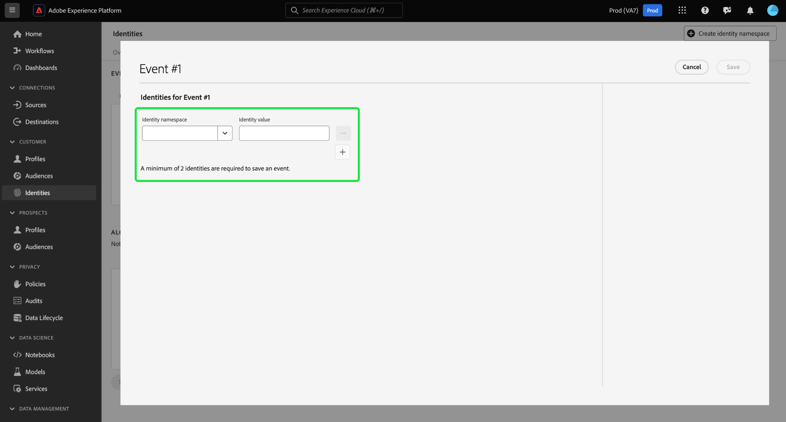

# Guía de la interfaz de usuario [!DNL Graph Simulation]

>[!AVAILABILITY]
>
>Las reglas de vinculación de gráficos de identidad están actualmente en fase beta. Póngase en contacto con el equipo de su cuenta de Adobe para obtener información sobre los criterios de participación. La funcionalidad y la documentación están sujetas a cambios.

[!DNL Graph Simulation] es una herramienta en la interfaz de usuario del servicio de identidad que puedes usar para simular cómo se comporta un gráfico de identidad dada una combinación particular de identidades y cómo configuras el [algoritmo de optimización de identidad](./identity-optimization-algorithm.md).

Lea este documento para aprender cómo puede usar [!DNL Graph Simulation] para comprender mejor el comportamiento del gráfico de identidad y cómo funciona el algoritmo del gráfico.

## Conocer la interfaz de [!DNL Graph Simulation] {#interface}

Puede acceder a [!DNL Graph Simulation] en la interfaz de usuario de Adobe Experience Platform. Seleccione **[!UICONTROL Identidades]** en el panel de navegación izquierdo y, a continuación, seleccione **[!UICONTROL Simulación de gráfico]** en el encabezado superior.

La interfaz [!DNL Graph Simulation] se puede dividir en tres secciones:

>[!BEGINTABS]

>[!TAB Eventos]

Eventos: use el panel **[!UICONTROL Eventos]** para agregar identidades y simular un gráfico. Una identidad completa debe tener un área de nombres de identidad y su valor de identidad correspondiente. Debe añadir al menos dos identidades para simular un gráfico. También puede seleccionar **[!UICONTROL Cargar ejemplo]** para introducir un evento preconfigurado y configurar el algoritmo.

>[!TAB Configuración de algoritmo]

Configuración del algoritmo: Utilice el panel **[!UICONTROL Configuración del algoritmo]** para agregar y configurar el algoritmo de optimización para sus áreas de nombres. Puede arrastrar y soltar un área de nombres para modificar su respectiva clasificación de prioridad. También puede seleccionar **[!UICONTROL Únicos por gráfico]** para determinar si un área de nombres es única.

>[!TAB Visor de gráficos simulado]

Visualizador de gráficos simulado: el visualizador de gráficos simulado muestra el gráfico resultante en función de los eventos añadidos y del algoritmo configurado. Una línea recta entre dos identidades significa que se establece un vínculo. Una línea de puntos indica que se ha eliminado un vínculo.

>[!ENDTABS]

## Añadir eventos {#add-events}

Para empezar, seleccione **[!UICONTROL Agregar eventos]**.

Aparece una ventana emergente para [!UICONTROL Evento #1]. Desde aquí, introduzca su área de nombres de identidad y la combinación de valor de identidad. Puede utilizar el menú desplegable para seleccionar un área de nombres de identidad. También puede escribir las primeras letras de un área de nombres y, a continuación, seleccionar las opciones proporcionadas en el menú desplegable. Una vez que haya seleccionado el área de nombres, proporcione un valor de identidad que se corresponda con el área de nombres.

>[!TIP]
>
>El valor de identidad que ingresó durante [!DNL Graph Simulation] ejercicios no tiene por qué ser valores de identidad reales y puede ser marcadores de posición simples.

Una vez completada la primera identidad, seleccione el icono de agregar (**`+`**) para agregar una segunda identidad.

A continuación, repita los mismos pasos y añada una segunda identidad. Se requieren dos identidades completas para generar un gráfico de identidades. En el ejemplo siguiente, se agrega un ECID como área de nombres y se proporciona con el valor `111`. Cuando termine, seleccione **[!UICONTROL Guardar]**.

La interfaz [!UICONTROL Events] se actualiza para mostrar su primer evento, que en este caso es: `{Email: tom@acme.com, ECID: 111}`.

A continuación, repita los mismos pasos para agregar un segundo evento. Para el evento #2, agregue `{Email: summer@acme.com}` como su primera identidad y, a continuación, agregue la misma `{ECID: 111}` como la segunda identidad, creando así un segundo evento de: `{Email: summer@acme.com}, {ECID: 111}`. Cuando finalice, debería tener dos eventos, uno para `{Email: tom@acme.com, ECID: 111}` y otro para `{Email: summer@acme.com}, {ECID: 111}`.

### Cargar ejemplo {#load-example}

Seleccione **[!UICONTROL Cargar ejemplo]** para configurar un gráfico de ejemplo con un algoritmo preestablecido y una configuración de evento.

Aparece una ventana emergente que le proporciona escenarios de gráficos disponibles entre los que puede elegir:

| Gráfico de ejemplo | Descripción | Ejemplo |
| --- | --- | --- |
| Dispositivo compartido | Dispositivo compartido hace referencia a escenarios en los que dos usuarios diferentes inician sesión en el mismo dispositivo individual. | Un esposo y una esposa comparten un iPad para navegar por Internet y el comercio electrónico. |
| Teléfono no válido (no único) | El teléfono no válido o no único se refiere a situaciones en las que dos usuarios diferentes utilizan el mismo número de teléfono para crear una cuenta. | Una madre y su hija usan su número de teléfono residencial compartido para registrarse en cualquier cuenta de comercio electrónico. |
| Valores de identidad “incorrectos” | Los valores de identidad &quot;incorrectos&quot; se refieren a escenarios en los que el servicio de identidad genera IDFA no únicos debido a una implementación errónea. | WebSDK envía erróneamente un valor `user_null` para cada evento debido a problemas de implementación de código. |

Seleccione cualquiera de las opciones para cargar [!DNL Graph Simulation] con los eventos y el algoritmo preconfigurados. Puede seguir realizando configuraciones en cualquier ejemplo de escenario de gráfico cargado previamente.

Cuando termine, seleccione **[!UICONTROL Simular]**.

### Usar versión de texto {#use-text-version}

También puede utilizar el modo de texto para configurar eventos. Para usar el modo de texto, seleccione el icono de configuración y, a continuación, seleccione **[!UICONTROL Texto (usuarios avanzados)]**.

Puede introducir manualmente sus identidades con el modo de texto. Use dos puntos (`:`) para distinguir el valor de identidad que corresponde al área de nombres que ha introducido y, a continuación, use una coma (`,`) para separar las identidades. Para distinguir distintos eventos entre sí, utilice una nueva línea para cada evento.

### Editar evento {#edit-event}

Para editar un evento, seleccione los puntos suspensivos (`...`) junto a un evento determinado y, a continuación, seleccione **[!UICONTROL Editar]**.

### Eliminar evento {#delete-event}

Para eliminar un evento, seleccione los puntos suspensivos (`...`) junto a un evento determinado y, a continuación, seleccione **[!UICONTROL Eliminar]**.

## Configurar algoritmo {#configure-algorithm}

>[!IMPORTANT]
>
>El algoritmo que configure dicta cómo el servicio de identidad trata las áreas de nombres introducidas en los eventos. Las configuraciones que haya creado en [!DNL Graph Simulation UI] no se guardarán en la configuración de identidad.

Una vez añadidos los eventos, se puede configurar el algoritmo que se utilizará para simular el gráfico. Para empezar, seleccione **[!UICONTROL Agregar configuración]**.

Aparecerá una fila de configuración vacía. En primer lugar, escriba el mismo espacio de nombres que utilizó para los eventos. En este caso, comience introduciendo Email. Una vez que hayas ingresado el área de nombres, las columnas de [!UICONTROL Símbolo de identidad] y [!UICONTROL Tipo de identidad] se rellenarán automáticamente.

A continuación, repita los mismos pasos y agregue la segunda área de nombres, que en este caso es el ECID. Una vez introducidas todas las áreas de nombres, puede empezar a configurar sus prioridades y exclusividad.

* **Prioridad de área de nombres**: La prioridad de un área de nombres determina su importancia relativa en comparación con las otras áreas de nombres de un gráfico de identidad determinado. Por ejemplo, si el gráfico de identidad tiene cuatro áreas de nombres diferentes: CRM ID, ECID, Correo electrónico y Apple IDFA, puede configurar prioridades para determinar un orden de importancia para las cuatro áreas de nombres.
* **Área de nombres única**: Si se designa un área de nombres como única, el Servicio de identidad generará gráficos con la advertencia de que solo puede existir una identidad con un área de nombres única. Por ejemplo, si el área de nombres de correo electrónico está designada como un área de nombres única, un gráfico solo puede tener una identidad con el correo electrónico. Si hay más de una identidad con el área de nombres de correo electrónico, se eliminará el vínculo más antiguo.

Para configurar la prioridad del área de nombres, seleccione y arrastre las filas de área de nombres al orden de prioridad que desee, donde la fila superior representa la prioridad superior y la fila inferior representa la prioridad inferior. Para designar un área de nombres como única, active la casilla de verificación **[!UICONTROL Única por gráfico]**.

Cuando termine, seleccione **[!UICONTROL Simular]**.

## Ver gráfico simulado

La sección [!UICONTROL Gráfico simulado] muestra los gráficos de identidad generados en función de los eventos que agregó y el algoritmo que configuró.

| Iconos de gráficos | Descripción |
| --- | --- |
| Línea sólida | Una línea sólida representa un vínculo establecido entre dos identidades. |
| Línea de puntos | Una línea de puntos representa un vínculo eliminado entre dos identidades. |
| Número en línea | Un número de una línea representa la marca de tiempo del momento en el que se generó ese vínculo determinado. El número más bajo (1), representa el vínculo establecido más antiguo. |

En el gráfico de ejemplo siguiente, existe una línea de puntos entre `{Email: tom@acme.com}` y `{ECID: 111}` debido a las siguientes razones:

* El correo electrónico se ha designado como único durante el paso de configuración del algoritmo. Por lo tanto, solo puede existir una identidad con un área de nombres de correo electrónico en un gráfico.
* El vínculo entre `{Email: tom@acme.com}` y `{ECID: 111}` fue la primera identidad establecida (#1 de evento). Es el vínculo más antiguo y, por lo tanto, se elimina.

## Pasos siguientes

Al leer este documento, ahora sabe cómo usar la herramienta [!DNL Graph Simulation] para comprender mejor cómo se tratan los datos de identidad según un conjunto determinado de reglas y configuraciones. Para obtener más información, lea los siguientes documentos:

* [Reglas de vinculación de gráfico de identidad](./overview.md)
* [Guía de configuración](./configuration.md)
* [Algoritmo de optimización de identidad](./identity-optimization-algorithm.md)
* [Prioridad de área de nombres](./namespace-priority.md)
* [Ejemplo de configuraciones de gráficos](./example-configurations.md)
