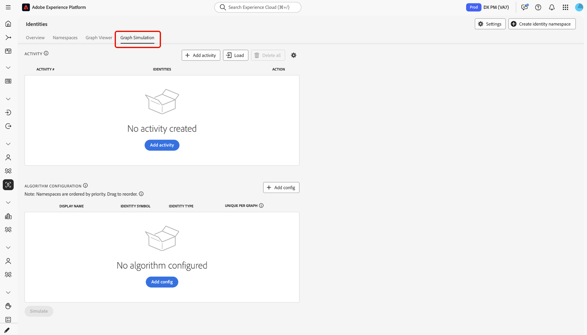
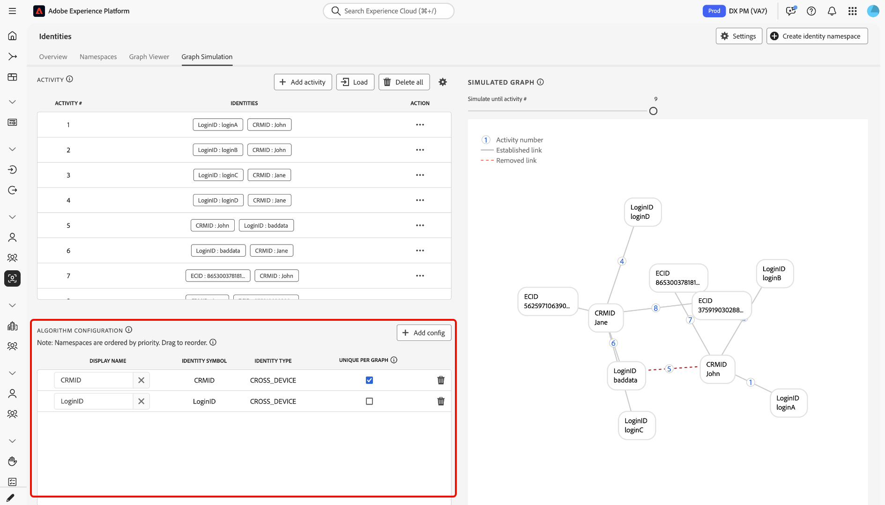
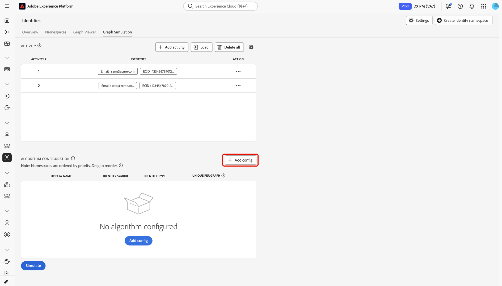
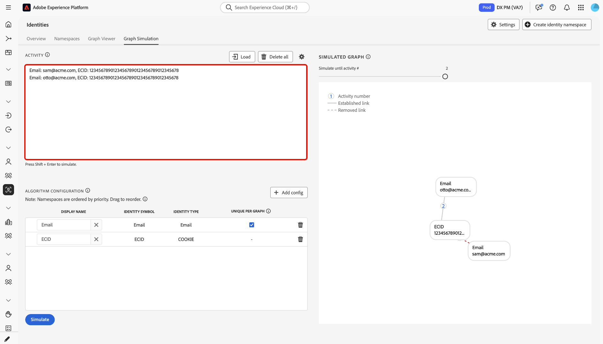
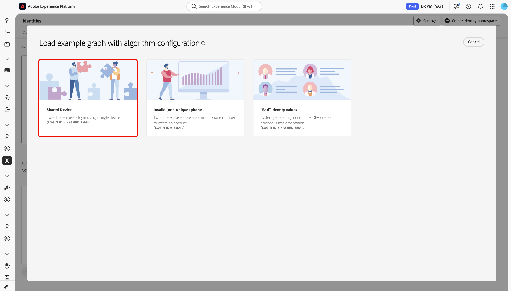
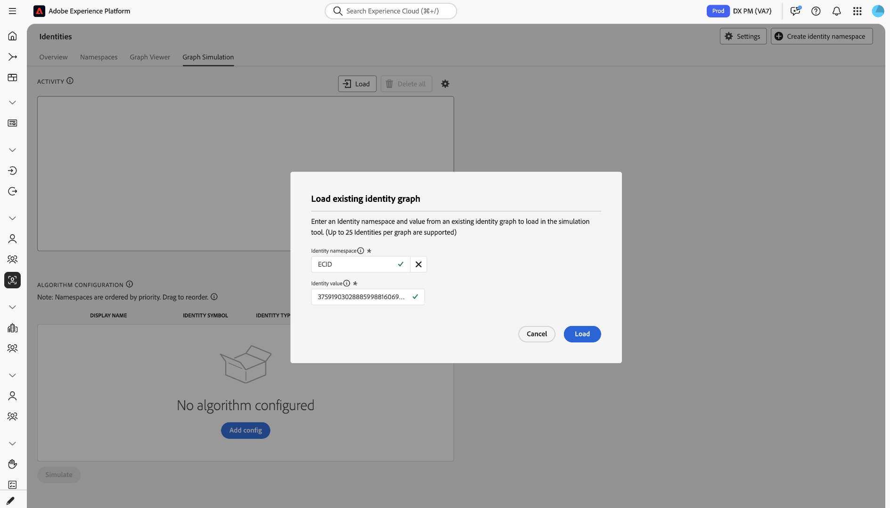
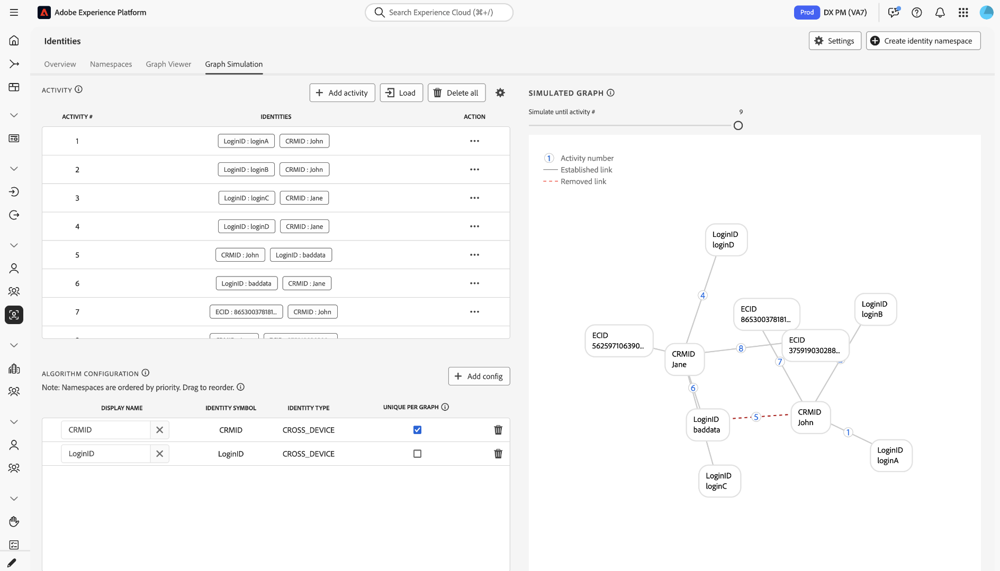

# Guía de la interfaz de usuario de [!DNL Graph Simulation] {#graph-simulation}

>[!CONTEXTUALHELP]
>id="platform_identities_graphsimulation"
>title="Simulación de gráficos"
>abstract="Simule gráficos para comprender cómo vincula el servicio de identidad las identidades y cómo funciona el algoritmo de optimización de identidad."

[!DNL Graph Simulation] es una herramienta en la interfaz de usuario del servicio de identidad que puede usar para simular el comportamiento de un gráfico de identidad en función de las identidades que proporcione y de cómo configure el [algoritmo de optimización de identidad](./identity-optimization-algorithm.md).

Utilícelo para probar de forma segura el comportamiento del gráfico antes de aplicar [!DNL Identity Graph Linking Rules] a los datos de producción. Al definir eventos de ejemplo y configurar el algoritmo de optimización de identidad, incluidas las prioridades de área de nombres y la configuración de &quot;único por gráfico&quot;, puede ver si las identidades se combinan en un gráfico o permanecen separadas y, a continuación, ajustar la configuración según sea necesario. Utilice esta capacidad para lo siguiente:

* Evitar el colapso del gráfico (por ejemplo, cuando varias personas comparten un dispositivo o un número de teléfono)
* Ajuste las prioridades del área de nombres (por ejemplo, si EMAIL o CRM_ID deben ser dominantes)
* Evalúe cómo los identificadores de baja calidad o reutilizados pueden afectar a la vinculación en su entorno.

También puede ensayar cambios de configuración y depurar problemas de identidad que se muestran en las aplicaciones de flujo descendente. Por ejemplo, si el tamaño de la audiencia o los perfiles combinados parecen incorrectos, puede reconstruir los eventos relevantes en [!DNL Graph Simulation] para ver cómo las reglas actuales dan forma al gráfico y probar alternativas más seguras.

Los escenarios de ejemplo integrados le ayudan a explicar el comportamiento de identidad y el riesgo de colapso de gráficos a las partes interesadas, así como a apoyar la aceptación de la calidad de los datos y la gobernanza de la identidad.

## Explicación de la interfaz [!DNL Graph Simulation]

Para obtener acceso a [!DNL Graph Simulation], vaya al área de trabajo del servicio de identidad en la interfaz de usuario de Adobe Experience Platform y, a continuación, seleccione **[!UICONTROL Graph Simulation]**.

La interfaz está organizada en tres secciones principales:

>[!BEGINTABS]

>[!TAB Actividad]

Utilice el panel **[!UICONTROL Activity]** para agregar identidades y simular un gráfico. Cada identidad necesita un área de nombres y un valor. Debe añadir al menos dos identidades para ejecutar una simulación. También puede seleccionar **[!UICONTROL Load]** para importar una configuración de evento y algoritmo preconfigurada o para abrir un gráfico existente.

>[!TAB Configuración de algoritmo]

Utilice el panel **[!UICONTROL Algorithm configuration]** para agregar y configurar el algoritmo de optimización de sus áreas de nombres. Arrastre y suelte las filas del área de nombres para cambiar el orden de prioridad. También puede seleccionar **[!UICONTROL Unique Per Graph]** para marcar si un área de nombres debe ser única dentro del gráfico.

>[!TAB Gráfico simulado]

Utilice la pantalla **[!UICONTROL Simulated graph]** para revisar el gráfico generado a partir de las actividades y la configuración del algoritmo. Una línea sólida entre dos identidades significa que el vínculo se conserva; una línea de puntos significa que el algoritmo eliminó ese vínculo.

>[!ENDTABS]

## [!DNL Graph Simulation] flujo de trabajo

### Añadir actividades

Para empezar a simular gráficos de identidad, seleccione **[!UICONTROL Add Activity]**.

Cuando aparezca la ventana emergente de [!UICONTROL Activity #1], elija un área de nombres de identidad e introduzca su valor. Puede elegir un área de nombres en la lista desplegable o escribir algunas letras para filtrar la lista. Después de seleccionar un área de nombres, introduzca el valor de identidad coincidente.

>[!TIP]
>
>No tiene que usar valores de identidad reales al usar [!DNL Graph Simulation].

La interfaz [!UICONTROL Activity] se actualiza para mostrar su primera actividad.

Vuelva a seleccionar **[!UICONTROL Add Activity]** y complete una segunda actividad. Necesita al menos dos identidades completas (área de nombres más valor) para generar un gráfico.

### Configurar algoritmo

>[!IMPORTANT]
>
>El algoritmo que configure controla cómo el servicio de identidad trata los espacios de nombres en sus actividades. No se guardó nada de lo configurado en [!DNL Graph Simulation UI] en la configuración de identidad del servicio de identidad.

Una vez que las actividades estén configuradas, configure el algoritmo de la simulación. Seleccione **[!UICONTROL Add config]**.

Añada cada área de nombres que desee que el algoritmo tenga en cuenta. Utilice la lista desplegable para buscar o escriba las primeras letras para reducir la lista.

* **Prioridad del área de nombres**: Usted controla el orden de importancia de cada área de nombres dentro de su gráfico de identidad. Por ejemplo, si el gráfico utiliza CRMID, ECID, correo electrónico y Apple IDFA, puede establecer su prioridad para reflejar cuál debe considerarse primero al vincular identidades. El área de nombres que se encuentra en la parte superior de la lista tendrá la prioridad más alta.
* **Área de nombres única**: cuando un área de nombres se marca como única, el servicio de identidad garantiza que solo aparezca una identidad con ese área de nombres en un gráfico. Por ejemplo, si el correo electrónico se establece como único, cada gráfico contiene solo una identidad de correo electrónico. Si hay varias identidades con el mismo correo electrónico, se eliminará la conexión más antigua para mantener la exclusividad.

Arrastre las filas del área de nombres en orden de prioridad: la fila superior es la prioridad más alta y la inferior es la más baja. Para tratar un área de nombres como única dentro del gráfico, seleccione su casilla de verificación **[!UICONTROL Unique Per Graph]**.

Cuando esté listo, seleccione **[!UICONTROL Simulate]**.

### Ver gráfico simulado

La sección [!UICONTROL Simulated Graph] muestra los gráficos creados a partir de las actividades y la configuración del algoritmo.

| Iconos de gráficos | Descripción |
| --- | --- |
| Línea sólida | Una línea sólida representa un vínculo establecido entre dos identidades. |
| Línea de puntos | Una línea de puntos representa un vínculo eliminado entre dos identidades. |
| Número en línea | Un número en una línea indica cuándo se formó ese vínculo en relación con los demás. El número más bajo (1) es el vínculo más antiguo. |

## Funciones adicionales

También puede editar o eliminar actividades, introducir actividades en modo de texto, cargar un escenario de ejemplo o extraer un gráfico existente del servicio de identidad.

### Editar actividad {#edit-activity}

Para editar una actividad, seleccione los puntos suspensivos (`...`) junto a una actividad determinada y seleccione **[!UICONTROL Edit]**.

### Eliminar actividad {#delete-activity}

Para eliminar una actividad, seleccione los puntos suspensivos (`...`) junto a una actividad determinada y, a continuación, seleccione **[!UICONTROL Delete]**.

### Usar modo de texto {#use-text-mode}

Puede utilizar el modo de texto para configurar sus actividades. Para usar el modo de texto, seleccione el icono de configuración y, a continuación, seleccione **[!UICONTROL Text (Advanced users)]**.

Se abrió el control 

En modo de texto, escriba cada identidad como `namespace:value`. Separe varias identidades en el mismo evento con una coma (`,`). Inicie una nueva línea para cada evento.

### Cargar ejemplo {#load-example}

Seleccione **[!UICONTROL Load example]** para cargar un gráfico listo para usar con actividades preestablecidas y configuración de algoritmo.

Un cuadro de diálogo enumera los escenarios que puede abrir:

| Gráfico de ejemplo | Descripción | Ejemplo |
| --- | --- | --- |
| Dispositivo compartido | Dos usuarios diferentes inician sesión en el mismo dispositivo. | Un esposo y una esposa comparten un iPad para navegar y hacer comercio electrónico. |
| Teléfono no válido (no único) | Dos usuarios diferentes se registran con el mismo número de teléfono. | Una madre y una hija usan un número de teléfono residencial compartido para registrarse en cuentas de comercio electrónico. |
| Valores de identidad “incorrectos” | Los errores de implementación envían ID duplicados o de marcador de posición (por ejemplo, el mismo IDFA para muchos usuarios). | Web SDK envía un valor `user_null` en cada actividad debido a un defecto de código. |

Elija un escenario para cargar [!DNL Graph Simulation] con actividades y configuraciones de algoritmo coincidentes. Puede editar el resultado como cualquier otra simulación.

### Cargar gráfico existente {#load-existing-graph}

Puede usar [!DNL Graph Simulation] para cargar un gráfico existente y ver sus actividades, configuración de algoritmo y gráfico.

Seleccione **[!UICONTROL Load]** y luego seleccione **[!UICONTROL Existing graph]**.

En el cuadro de diálogo, introduzca un área de nombres y un valor de identidad que pertenezcan al gráfico que desee inspeccionar.

Cuando la carga se realiza correctamente, [!DNL Graph Simulation] muestra el gráfico que contiene esa identidad.

>[!TIP]
>
>Después de configurar los ajustes en la primera pantalla de [Ajustes de identidad](./identity-settings-ui.md), puede usar la opción **cargar gráficos existentes** para simular el gráfico en función de esos ajustes exactos. La simulación utilizará la configuración definida.

## Próximos pasos

Puede usar [!DNL Graph Simulation] para ver cómo el servicio de identidad vincula identidades con reglas diferentes antes de cambiar la configuración de producción. Para profundizar, consulte la siguiente documentación:

* [Información general de [!DNL Identity Graph Linking Rules]](./overview.md)
* [Algoritmo de optimización de identidad](./identity-optimization-algorithm.md)
* [Guía de implementación](./implementation-guide.md)
* [Resolución de problemas y preguntas frecuentes](./troubleshooting.md)
* [Ejemplos de configuraciones de gráficos](./example-configurations.md)
* [Prioridad del espacio de nombres](./namespace-priority.md)
* [IU de configuración de identidad](./identity-settings-ui.md)
