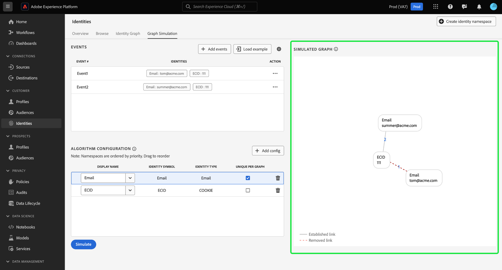

# Simulación de gráfico

La simulación de gráficos es una herramienta en la interfaz de usuario del servicio de ID que puede utilizar para simular cómo se comporta un gráfico de identidad dada una combinación particular de identidades y cómo se configura el [algoritmo de optimización de identidad](./identity-optimization-algorithm.md).

Lea este documento para aprender a utilizar la simulación de gráficos para comprender mejor el comportamiento del gráfico de identidad y cómo funciona el algoritmo de gráficos.

## Conozca la interfaz de simulación de gráficos

Puede acceder a Simulación de gráfico en la interfaz de usuario de Adobe Experience Platform. Seleccionar **[!UICONTROL Identidades]** en el panel de navegación izquierdo y seleccione **[!UICONTROL Simulación de gráfico]** desde el encabezado superior.

La interfaz de simulación de gráficos se puede dividir en tres secciones:

* Eventos: utilice el **[!UICONTROL Eventos]** panel para añadir identidades y simular un gráfico. Una identidad completa debe tener un área de nombres de identidad y su valor de identidad correspondiente. Debe añadir al menos dos identidades para simular un gráfico. También puede seleccionar **[!UICONTROL Cargar ejemplo]** para introducir un evento preconfigurado y la configuración del algoritmo.

* Configuración del algoritmo: Utilice **[!UICONTROL Configuración de algoritmo]** para añadir y configurar el algoritmo de optimización de sus áreas de nombres. Puede arrastrar y soltar un área de nombres para modificar su respectiva clasificación de prioridad. También puede seleccionar **[!UICONTROL Únicos por gráfico]** para determinar si un área de nombres es única.

* Visualizador de gráficos simulado: el visualizador de gráficos simulado muestra el gráfico resultante en función de los eventos añadidos y del algoritmo configurado. Una línea recta entre dos nodos significa que se establece un vínculo. Una línea de puntos indica que se ha eliminado un vínculo.

## Añadir eventos

Para empezar, seleccione **[!UICONTROL Añadir eventos]**.

Aparece una ventana emergente para [!UICONTROL #1 de eventos]. Desde aquí, introduzca su área de nombres de identidad y la combinación de valor de identidad. Puede utilizar el menú desplegable para seleccionar un área de nombres de identidad. También puede escribir las primeras letras de un área de nombres y, a continuación, seleccionar las opciones proporcionadas en el menú desplegable. Una vez que haya seleccionado el área de nombres, proporcione un valor de identidad que se corresponda con el área de nombres.

>[!TIP]
>
>El valor de identidad que introduzca durante los ejercicios de simulación de gráficos no tiene por qué ser valores de identidad reales y puede ser marcadores de posición simples.

Una vez completada la primera identidad, seleccione el icono de añadir (**`+`**) para añadir una segunda identidad.

A continuación, repita los mismos pasos y añada una segunda identidad. Se requieren dos identidades completas para generar un gráfico de identidades. En el ejemplo siguiente, se agrega un ECID como área de nombres y se proporciona con un valor de `111`. Cuando termine, seleccione **[!UICONTROL Guardar]**.

El [!UICONTROL Eventos] se actualiza la interfaz para mostrar su primer evento, que en este caso es: `{Email: tom@acme.com, ECID: 111}`.

A continuación, repita los mismos pasos para agregar un segundo evento. Para #2 de eventos, agregue `{Email: summer@acme.com}` como su primera identidad y, a continuación, agregue la misma `{ECID: 111}` como la segunda identidad, creando así un segundo evento de: `{Email: summer@acme.com}, {ECID: 111}`. Cuando termine, debe tener dos eventos, uno para `{Email: tom@acme.com, ECID: 111}` y uno para `{Email: summer@acme.com}, {ECID: 111}`.

### Cargar ejemplo

+++Seleccione esta opción para ver los pasos sobre cómo utilizar los ejemplos de gráficos precargados

Para configurar un gráfico de ejemplo con un algoritmo preconfigurado, seleccione **[!UICONTROL Cargar ejemplo]**. Aparece una ventana emergente que le proporciona escenarios de gráficos disponibles entre los que puede elegir:

| Gráfico de ejemplo | Descripción | Ejemplo |
| --- | --- | --- |
| Dispositivo compartido | Dispositivo compartido hace referencia a escenarios en los que dos usuarios diferentes inician sesión en el mismo dispositivo individual. | Un esposo y una esposa comparten un iPad para navegar por Internet y el comercio electrónico. |
| Teléfono no válido (no único) | El teléfono no válido o no único se refiere a situaciones en las que dos usuarios diferentes utilizan el mismo número de teléfono para crear una cuenta. | Una madre y su hija usan su número de teléfono residencial compartido para registrarse en cualquier cuenta de comercio electrónico. |
| Valores de identidad “incorrectos” | Los valores de identidad &quot;incorrectos&quot; se refieren a escenarios en los que el servicio de identidad genera IDFA no únicos debido a una implementación errónea. | WebSDK envía erróneamente un `user_null` valor para cada evento debido a problemas de implementación de código. |

Seleccione cualquiera de las opciones para cargar Graph Simulation con eventos y algoritmos preconfigurados. Puede seguir realizando configuraciones en cualquier ejemplo de escenario de gráfico cargado previamente.

Cuando termine, seleccione **[!UICONTROL Simular]**.

+++

### Usar versión de texto

+++Seleccione esta opción para ver los pasos sobre cómo utilizar la versión de texto

También puede utilizar el modo de texto para configurar eventos. Para utilizar el modo de texto, seleccione el icono de engranaje (?) y luego seleccione. **[!UICONTROL Texto (usuarios avanzados)]**.

Puede introducir manualmente sus identidades con el modo de texto. Use dos puntos (`:`) para distinguir el valor de identidad que corresponde al área de nombres introducido y, a continuación, utilice una coma (`,`) para separar sus identidades. Para distinguir distintos eventos entre sí, utilice una nueva línea para cada evento.

+++

### Editar evento

Para editar un evento, seleccione los puntos suspensivos (`...`) junto a un evento determinado y, a continuación, seleccione **[!UICONTROL Editar]**.

### Eliminar evento

Para eliminar un evento, seleccione los puntos suspensivos (`...`) junto a un evento determinado y, a continuación, seleccione **[!UICONTROL Eliminar]**.

## Configurar algoritmo

El algoritmo que configure dictará cómo el servicio de identidad trata las áreas de nombres introducidas en los eventos. Las configuraciones que cree en la IU de simulación de gráficos no se guardan en la configuración de identidad.

Para empezar, seleccione add (`+`) en la esquina inferior del panel de configuración del algoritmo.

Aparecerá una fila de configuración vacía. En primer lugar, escriba el mismo espacio de nombres que utilizó para los eventos. En este caso, comience introduciendo el ID de CRM. Una vez que haya introducido el área de nombres, las columnas de [!UICONTROL Símbolo de identidad] y [!UICONTROL Tipo de identidad] se rellena automáticamente.

A continuación, repita los mismos pasos y agregue la segunda área de nombres, que en este caso es el ECID. Una vez introducidas todas las áreas de nombres, puede empezar a configurar sus prioridades y exclusividad.

* **Prioridad de área de nombres**: la prioridad de un área de nombres determina su importancia relativa en comparación con las demás áreas de nombres de un gráfico de identidades determinado. Por ejemplo, si el gráfico de identidad tiene cuatro áreas de nombres diferentes: CRM ID, ECID, Correo electrónico y Apple IDFA, puede configurar prioridades para determinar un orden de importancia para las cuatro áreas de nombres. (AÑADIR POR QUÉ)
* **Área de nombres única**: si un área de nombres está designada como única, el servicio de identidad generará gráficos con la advertencia de que solo puede existir una identidad con un área de nombres única determinada. Por ejemplo, si CRM ID está designado como área de nombres única, un gráfico solo puede tener una identidad con CRM ID. Si hay más de una identidad con el área de nombres de ID de CRM, se eliminará el vínculo más antiguo.

Para configurar la prioridad del área de nombres, seleccione y arrastre las filas de área de nombres al orden de prioridad que desee, donde la fila superior representa la prioridad superior y la fila inferior representa la prioridad inferior. Para designar un área de nombres como única, seleccione **[!UICONTROL Únicos por gráfico]** casilla de verificación

Cuando termine, seleccione **[!UICONTROL Simular]**.

## Ver gráfico simulado

El [!UICONTROL Gráfico simulado] Esta sección muestra los gráficos de identidad generados en función de los eventos agregados y el algoritmo configurado.

| Iconos de gráficos | Descripción |
| --- | --- |
| Línea sólida | Una línea sólida representa un vínculo establecido entre dos identidades. |
| Línea de puntos | Una línea de puntos representa un vínculo eliminado entre dos identidades. |
| Número en línea | Un número de una línea representa la marca de tiempo del momento en el que se generó ese vínculo determinado. El número más bajo (1), representa el vínculo establecido más antiguo. |

En el gráfico de ejemplo siguiente, existe una línea de puntos entre `{CRM ID: Tom}` y `{ECID: 111}` debido a las siguientes razones:

* El ID de CRM se designó como único durante el paso de configuración del algoritmo. Por lo tanto, solo puede existir una identidad con un área de nombres de ID de CRM en un gráfico.
* El vínculo entre `{CRM ID: Tom}` y `{ECID: 111}` fue la primera identidad establecida (#1 de evento). Es el vínculo más antiguo y, por lo tanto, se elimina.

## Ejemplo de escenarios de gráficos

>[!NOTE]
>
>&quot;ID de CRM&quot; es un área de nombres personalizada. Por lo tanto, los ejemplos siguientes requieren que cree un área de nombres personalizada con un nombre para mostrar y un símbolo de identidad de &quot;CRM ID&quot;.

Los siguientes ejemplos de sección de escenarios de gráficos pueden ser útiles para la simulación de gráficos.

### Solo ID de CRM

Eventos:

* ID de CRM: Tom, ECID: 111

Configuración de algoritmo:

| Prioridad | Nombre para mostrar | Símbolo de identidad | Tipo de identidad | Único por gráfico |
| ---| --- | --- | --- | --- |
| 1 | ID de CRM | ID de CRM | CROSS_DEVICE | Sí |
| 2 | ECID | ECID | COOKIE | NO |

+++Seleccionar para ver un gráfico simulado

+++

### ID de CRM con correo electrónico con hash

En esta situación, se incorpora un ID de CRM que representa los datos en línea (evento de experiencia) y sin conexión (registro de perfil). Este escenario también implica la ingesta de un correo electrónico con hash, que representa otro área de nombres enviado en el conjunto de datos de registro de CRM junto con el ID de CRM.

Eventos:

* ID de CRM: Tom, Email_LC_SHA256: tom@acme.com
* ID de CRM: Tom, ECID: 111
* CRM ID: Summer, Email_LC_SHA256: Summer@acme.com
* ID de CRM: Summer, ECID: 222

Configuración de algoritmo:

| Prioridad | Nombre para mostrar | Símbolo de identidad | Tipo de identidad | Único por gráfico |
| ---| --- | --- | --- | --- |
| 1 | ID de CRM | ID de CRM | CROSS_DEVICE | Sí |
| 2 | Correos electrónicos (SHA256, en minúsculas) | Email_LC_SHA256 | Correo electrónico | NO |
| 3 | ECID | ECID | COOKIE | NO |

+++Seleccionar para ver un gráfico simulado

+++

### ID de CRM con correo electrónico con hash, teléfono con hash, GAID e IDFA

Eventos:

* ID de CRM: Tom, Email_LC_SHA256: aabbcc, Phone_SHA256: 123-4567
* ID de CRM: Tom, ECID: 111
* ID de CRM: Tom, ECID: 222, IDFA: A-A-A
* ID de CRM: Summer, Email_LC_SHA256: ddeeff, Phone_SHA256: 765-4321
* ID de CRM: Summer, ECID: 333
* ID de CRM: Summer, ECID: 444, GAID: B-B-B

Configuración de algoritmo:

| Prioridad | Nombre para mostrar | Símbolo de identidad | Tipo de identidad | Único por gráfico |
| ---| --- | --- | --- | --- |
| 1 | ID de CRM | ID de CRM | CROSS_DEVICE | Sí |
| 2 | Correos electrónicos (SHA256, en minúsculas) | Email_LC_SHA256 | Correo electrónico | NO |
| 3 | Teléfono (SHA256) | Phone_SHA256 | Teléfono | NO |
| 4 | ID de anuncio de Google (GAID) | GAID | DISPOSITIVO | NO |
| 5 | Apple IDFA (ID para Apple) | IDFA | DISPOSITIVO | NO |
| 6 | ECID | ECID | COOKIE | NO |

+++Seleccionar para ver un gráfico simulado

+++