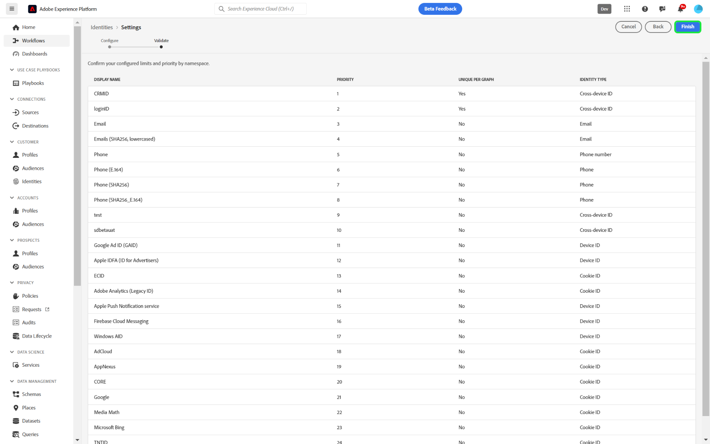

# IU de configuración de identidad

>[!AVAILABILITY]
>
>Esta función aún no está disponible; se espera que el programa beta para reglas de vinculación de gráficos de identidad comience en julio en zonas protegidas de desarrollo. Póngase en contacto con el equipo de su cuenta de Adobe para obtener información sobre los criterios de participación.

La configuración de identidad es una característica de la interfaz de usuario del servicio de identidad de Adobe Experience Platform que puede utilizar para designar áreas de nombres únicas y configurar la prioridad del área de nombres.

Lea esta guía para aprender a configurar los ajustes de identidad en la interfaz de usuario.

## Requisitos previos

Lea los siguientes documentos antes de empezar a trabajar con la configuración de identidad:

* [Guía de configuración de reglas de vinculación de gráfico de identidad](./configuration.md)
* [Algoritmo de optimización de identidad](./identity-optimization-algorithm.md)
* [Prioridad de área de nombres](./namespace-priority.md)
* [Simulación de gráfico](./graph-simulation.md)

## Configuración de la identidad

Para obtener acceso a la configuración de identidad, vaya al área de trabajo del servicio de identidad en la interfaz de usuario de Adobe Experience Platform y, a continuación, seleccione **[!UICONTROL Configuración]**.

La página de configuración de identidad se divide en dos secciones: [!UICONTROL Áreas de nombres de persona] y [!UICONTROL Áreas de nombres de dispositivos o cookies]. Las áreas de nombres de persona son identificadores para individuos únicos. Pueden ser ID entre dispositivos, direcciones de correo electrónico y números de teléfono. Las áreas de nombres de dispositivos o cookies son identificadores para dispositivos y exploradores web y no se les puede dar una prioridad mayor que a las áreas de nombres de personas. Tampoco puede designar un dispositivo o espacio de nombres de cookie para que sea un espacio de nombres único.

### Configurar prioridad de área de nombres

Para configurar la prioridad del área de nombres, seleccione un área de nombres en el menú de configuración de identidad y, a continuación, arrastre y suelte el área de nombres en el orden que desee. Coloque un área de nombres en la parte superior de la lista para darle una prioridad mayor y, a la inversa, coloque un área de nombres en la parte inferior de la lista para darle una prioridad menor. El área de nombres con la prioridad más alta también debe designarse como área de nombres única.

### Designar un área de nombres única

Para designar un área de nombres única, active la casilla de verificación [!UICONTROL Único por gráfico] que corresponde a ese área de nombres. Puede seleccionar más de un área de nombres única para la configuración de identidad.

Una vez establecidas las áreas de nombres únicas, los gráficos ya no podrán tener varias identidades que contengan un área de nombres única. Por ejemplo, si ha designado el CRM ID como un área de nombres única, un gráfico solo puede tener una identidad con el área de nombres del CRM ID. Para obtener más información, lea la [descripción general del algoritmo de optimización de identidad](./identity-optimization-algorithm.md#unique-namespace).

Cuando haya terminado con sus configuraciones, seleccione **[!UICONTROL Siguiente]**. Aparecerá un mensaje de confirmación, aprovecha esta oportunidad para comprobar que las configuraciones son correctas y, a continuación, selecciona **[!UICONTROL Finalizar]**.

Aparece una advertencia que indica que la nueva configuración no tendrá implicaciones en los vínculos existentes de un gráfico de identidades y en los fragmentos de perfil de evento de experiencia que ya se han introducido. Además, se le notifica que la nueva configuración del sistema tardará hasta seis horas en reflejarse. Para confirmar, escribe el nombre de tu zona protegida y selecciona **[!UICONTROL Confirmar]**.

## Pasos siguientes

Ahora ha configurado las prioridades del área de nombres y ha designado las áreas de nombres únicas mediante la página de interfaz de usuario de configuración de identidad. Para obtener más información, lea la [descripción general de las reglas de vinculación de gráficos de identidad](./overview.md).