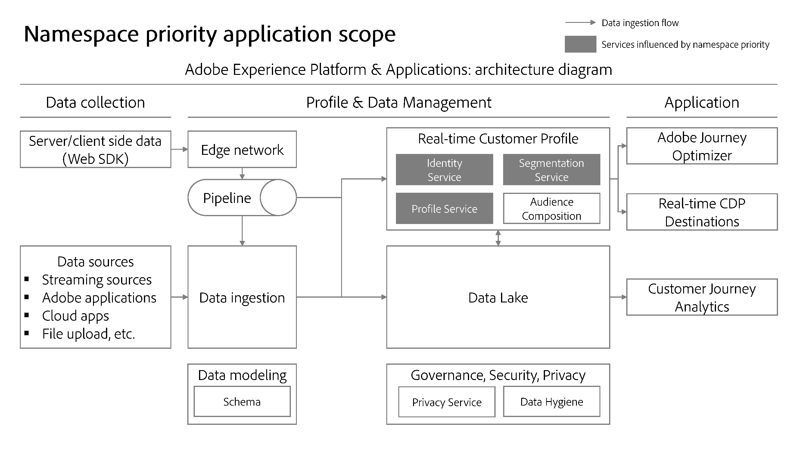

# Prioridad de espacios de nombres {#namespace-priority}

>[!CONTEXTUALHELP]
>id="platform_identities_namespacepriority"
>title="Prioridad de área de nombres"
>abstract="La prioridad del espacio de nombres determina cómo se quitan los vínculos del gráfico de identidad."

>[!AVAILABILITY]
>
>Las reglas de vinculación de gráficos de identidad están actualmente en disponibilidad limitada. Póngase en contacto con el equipo de su cuenta de Adobe para obtener información sobre cómo acceder a la función en los entornos limitados de desarrollo.

Cada implementación de cliente es única y está diseñada para satisfacer los objetivos de una organización en particular y, como tal, la importancia de un área de nombres determinada varía según el cliente. Algunos ejemplos del mundo real son:

* Su compañía podría considerar que cada dirección de correo electrónico representa una entidad de una sola persona y, por lo tanto, usar [configuración de identidad](./identity-settings-ui.md) para configurar el área de nombres de correo electrónico como única. Sin embargo, es posible que otra empresa desee representar las entidades de una sola persona como si tuvieran varias direcciones de correo electrónico y, por lo tanto, configurar el área de nombres de correo electrónico como no única. Estas empresas necesitarían utilizar otro área de nombres de identidad como única, como un área de nombres CRMID, para que pueda haber un identificador de una sola persona vinculado a las distintas direcciones de correo electrónico.
* Puede recopilar el comportamiento en línea mediante un área de nombres de &quot;ID de inicio de sesión&quot;. Este ID de inicio de sesión podría tener una relación 1:1 con el CRMID, que luego almacena atributos de un sistema CRM y puede considerarse el área de nombres más importante. En este caso, está determinando que el área de nombres CRMID es una representación más precisa de una persona, mientras que el área de nombres de ID de inicio de sesión es la segunda más importante.

Debe realizar configuraciones en Identity Service que reflejen la importancia de las áreas de nombres, ya que esto influye en la forma y división de los perfiles y sus gráficos de identidad relacionados.

## Determine sus prioridades

La determinación de la prioridad del área de nombres se basa en los siguientes factores:

### Estructura del gráfico de identidad

Si la estructura de gráficos de su organización tiene capas, la prioridad del área de nombres debe reflejarla para que los vínculos correctos se eliminen en caso de colapso del gráfico.

>[!TIP]
>
>* El &quot;colapso de gráfico&quot; se refiere a escenarios en los que varios perfiles dispares se combinan involuntariamente en un único gráfico de identidad.
>
>* Un gráfico de capas hace referencia a gráficos de identidad que tienen varios niveles de vínculos. Vea la siguiente imagen para ver un ejemplo de un gráfico con tres capas.

### Significado semántico del área de nombres

Una identidad representa un objeto real. Hay tres objetos que se representan en el gráfico de identidad. En orden de importancia, son:

* Personas (entre dispositivos, correo electrónico, número de teléfono)
* Dispositivo de hardware
* Explorador web (cookie)

Las áreas de nombres de persona son relativamente inmutables en comparación con los dispositivos de hardware (como IDFA y GAID), que son relativamente inmutables en comparación con los exploradores web. Básicamente, usted (persona) siempre será una sola entidad, que puede tener varios dispositivos de hardware (teléfono, portátil, tableta, etc.) y utilizar varios navegadores (Google Chrome, Safari, FireFox, etc.)

Otra forma de abordar este tema es a través de la cardinalidad. Para una entidad de persona determinada, ¿cuántas identidades se crearán? En la mayoría de los casos, una persona tendrá un CRMID, un puñado de identificadores de dispositivos de hardware (los restablecimientos IDFA/GAID no deberían ocurrir con frecuencia) e incluso más cookies (es concebible que una persona navegue en varios dispositivos, utilice el modo incógnito o restablezca cookies en un momento dado). Por lo general, **la cardinalidad inferior indica un área de nombres con un valor más alto**.

## Validar la configuración de prioridad del área de nombres

Una vez que tenga idea de cómo priorizar las áreas de nombres, puede utilizar la herramienta Simulación de gráficos en la interfaz de usuario para probar varios escenarios de colapso de gráficos y asegurarse de que las configuraciones de prioridad devuelvan los resultados de gráficos esperados. Para obtener más información, lea la guía sobre el uso de [Herramienta de simulación de gráficos](./graph-simulation.md).

## Configurar prioridad de área de nombres

La prioridad del área de nombres se puede configurar usando la [interfaz de usuario de configuración de identidad](./identity-settings-ui.md). En la interfaz de configuración de identidad, puede arrastrar y soltar un área de nombres para determinar su importancia relativa.

>[!IMPORTANT]
>
>No puede priorizar áreas de nombres de dispositivos/cookies sobre áreas de nombres de personas. Esta restricción garantiza que no se produzcan errores de configuración.

## Uso de prioridad de área de nombres

Actualmente, la prioridad del área de nombres influye en el comportamiento del sistema de Perfil del cliente en tiempo real. El diagrama siguiente ilustra este concepto. Para obtener más información, lea la guía sobre [Adobe Experience Platform y los diagramas de arquitectura de aplicaciones](https://experienceleague.adobe.com/en/docs/blueprints-learn/architecture/architecture-overview/platform-applications).

### Servicio de identidad: algoritmo de optimización de identidad

Para estructuras de gráficos relativamente complejas, la prioridad del área de nombres desempeña un papel importante a la hora de garantizar que se eliminen los vínculos correctos cuando se producen escenarios de colapso de gráficos. Para obtener más información, lea la [descripción general del algoritmo de optimización de identidad](../identity-graph-linking-rules/identity-optimization-algorithm.md).

### Perfil del cliente en tiempo real: determinación de identidad principal para eventos de experiencia

* Una vez que haya configurado la configuración de identidad para una zona protegida determinada, la identidad principal de los eventos de experiencia se determinará mediante la prioridad de área de nombres más alta de la configuración.
   * Esto se debe a que los eventos de experiencia son de naturaleza dinámica. Un mapa de identidad puede contener tres o más identidades y la prioridad del área de nombres garantiza que el área de nombres más importante esté asociada al evento de experiencia.
* Como resultado, Real-Time Customer Profile **ya no usará las siguientes configuraciones**:
   * La configuración de identidad principal (`primary=true`) al enviar identidades en identityMap mediante Web SDK, Mobile SDK o la API de Edge Network Server (el área de nombres de identidad y el valor de identidad se seguirán usando en el perfil). **Nota**: Los servicios fuera del perfil del cliente en tiempo real, como el almacenamiento del lago de datos o Adobe Target, seguirán usando la configuración de identidad principal (`primary=true`).
   * Cualquier campo marcado como identidad principal en un esquema de clase de evento de experiencia XDM.
   * Configuración de identidad principal predeterminada en el conector de origen de Adobe Analytics (ECID o AAID).
* Por otro lado, la prioridad **namespace no determina la identidad principal para los registros de perfil**.
   * Para los registros de perfil, debe seguir definiendo los campos de identidad en el esquema, incluida la identidad principal. Lea la guía [definición de campos de identidad en la interfaz de usuario](../../xdm/ui/fields/identity.md) para obtener más información.

>[!TIP]
>
>* La prioridad del área de nombres es **una propiedad de un área de nombres**. Es un valor numérico asignado a un área de nombres para indicar su importancia relativa.
>
>* La identidad principal es la identidad con la que se almacena un fragmento de perfil. Un fragmento de perfil es un registro de datos que almacena información sobre un usuario determinado: atributos (por ejemplo, registros CRM) o eventos (por ejemplo, navegación por sitios web).

### Ejemplo de escenario

Esta sección proporciona un ejemplo de cómo la configuración de prioridad puede afectar a los datos.

Supongamos que se establecen las siguientes configuraciones para una zona protegida determinada:

| Área de nombres | Aplicación real del área de nombres | Prioridad |
| --- | --- | --- |
| CRMID | Usuario | 1 |
| IDFA | Dispositivo de hardware de Apple (iPhone, IPad, etc.) | 2 |
| GAID | Dispositivo de hardware de Google (Google Pixel, Pixelbook, etc.) | 3 |
| ECID | Explorador web (Firefox, Safari, Google Chrome, etc.) | 4 |
| AAID | Explorador web | 5 |

{style="table-layout:auto"}

Dadas las configuraciones descritas anteriormente, las acciones del usuario y la determinación de la identidad principal se resolverán de esta manera:

| Acción del usuario (evento de experiencia) | Estado de autenticación | Fuente de datos | Áreas de nombres en evento | Área de nombres de identidad principal |
| --- | --- | --- | --- | --- |
| Ver página de oferta de tarjeta de crédito | No autenticado (anónimo) | SDK web | `{ECID}` | ECID |
| Ver página de ayuda | No autenticado | SDK móvil | `{ECID, IDFA}` | IDFA |
| Ver saldo de cuenta corriente | Authenticated | SDK web | `{CRMID, ECID}` | CRMID |
| Regístrese para obtener un préstamo hipotecario | Authenticated | Conector de origen de Analytics | `{CRMID, ECID, AAID}` | CRMID |
| Transferir $1,000 de cheques a ahorros | Authenticated | SDK móvil | `{CRMID, GAID, ECID}` | CRMID |

{style="table-layout:auto"}

### Servicio de segmentación: almacenamiento de metadatos de pertenencia a segmentos

Para un perfil combinado determinado, las suscripciones a segmentos se almacenarán en la identidad con la prioridad de área de nombres más alta.

Por ejemplo, supongamos que hay dos perfiles:

* El perfil 1 representa a John.
   * El perfil de John es apto para S1 (abono a segmento 1). Por ejemplo, S1 podría hacer referencia a un segmento de clientes que se identifican como hombres.
   * El perfil de John también cumple los requisitos para S2 (abono a segmento 2). Esto podría hacer referencia a un segmento de clientes cuyo estado de fidelidad es oro.
* El Perfil 2 representa a Jane.
   * El perfil de Jane es apto para S3 (abono a segmento 3). Esto podría hacer referencia a un segmento de clientes que se identifican como mujeres.
   * El perfil de Jane también cumple los requisitos para S4 (abono a segmento 4). Esto podría hacer referencia a un segmento de clientes cuyo estado de lealtad es de platino.

Si John y Jane comparten un dispositivo, el ECID (explorador web) se transfiere de una persona a otra. Sin embargo, esto no influye en la información de abono de segmentos almacenada en contra de John y Jane.

Si los criterios de calificación de segmentos se basaran únicamente en eventos anónimos almacenados contra el ECID, Jane cumpliría los requisitos para ese segmento

## Implicaciones en otros servicios de Experience Platform {#implications}

Esta sección describe cómo la prioridad del área de nombres puede afectar a otros servicios de Experience Platform.

### Administración avanzada del ciclo de vida de los datos

La eliminación de registros de higiene de datos solicita funciones de la siguiente manera, para una identidad determinada:

* Perfil del cliente en tiempo real: elimina cualquier fragmento de perfil con la identidad especificada como identidad principal. **La identidad principal del perfil se determinará ahora en función de la prioridad del área de nombres.**
* Repositorio de datos: elimina cualquier registro con la identidad especificada como identidad principal. A diferencia del perfil del cliente en tiempo real, la identidad principal en el lago de datos se basa en la identidad principal especificada en WebSDK (`primary=true`) o en un campo marcado como identidad principal

Para obtener más información, lea la [descripción general avanzada de la administración del ciclo vital](../../hygiene/home.md).

### Atributos calculados

Si la configuración de identidad está habilitada, los atributos calculados utilizarán la prioridad de área de nombres para almacenar el valor de atributo calculado. Para un evento determinado, la identidad con la prioridad de área de nombres más alta tendrá el valor del atributo calculado escrito en ella. Para obtener más información, lea la [guía de IU de atributos calculados](../../profile/computed-attributes/ui.md).

### Lago de datos

La ingesta de datos en el lago de datos seguirá cumpliendo la configuración de identidad principal establecida en [Web SDK](../../tags/extensions/client/web-sdk/data-element-types.md#identity-map) y los esquemas.

El lago de datos no determinará la identidad principal en función de la prioridad del área de nombres. Por ejemplo, Adobe Customer Journey Analytics seguirá utilizando valores en el mapa de identidad incluso después de habilitar la prioridad del área de nombres (por ejemplo, al agregar un conjunto de datos a una nueva conexión), porque Customer Journey Analytics consume sus datos del lago de datos.

### Esquemas del modelo de datos de experiencia (XDM)

Cualquier esquema que no sea un evento de experiencia XDM, como los perfiles individuales de XDM, seguirá respetando cualquier [campo que marque como identidad](../../xdm/ui/fields/identity.md).

Para obtener más información sobre los esquemas XDM, lea la [descripción general de esquemas](../../xdm/home.md).

### Servicios inteligentes

Al seleccionar los datos, deberá especificar un área de nombres, que se utilizará para determinar los eventos que calculan las puntuaciones y los eventos que almacenan las puntuaciones calculadas. Se recomienda seleccionar el área de nombres que representa a una persona.

* Si recopila datos de comportamiento web mediante WebSDk, se recomienda elegir el área de nombres CRMID dentro del mapa de identidad.
* Si está recopilando datos de comportamiento web mediante el conector de origen de Analytics, debe seleccionar el descriptor de identidad (CRMID).

Esta configuración resulta en calcular puntuaciones solo mediante eventos autenticados.

Para obtener más información, lea los documentos sobre [Attribution AI](../../intelligent-services/attribution-ai/overview.md) y [inteligencia artificial aplicada al cliente](../../intelligent-services/customer-ai/overview.md).

### Destinos creados por socios

Es posible que los resultados actualizados de descalificación de audiencia para perfiles asociados a un dispositivo compartido no se envíen a destinos descendentes. Esto puede ocurrir en ciertos casos excepcionales en los que:

* La calificación de audiencias se basa únicamente en la actividad anónima.
* Los inicios de sesión en varios perfiles se producen en un corto período de tiempo.

Para obtener más información sobre los destinos creados por el socio, lea la [descripción general de los destinos](../../destinations/home.md#adobe-built-and-partner-built-destinations).

### Privacy Service

[Las solicitudes de eliminación de Privacy Service](../privacy.md) funcionan de la siguiente manera, para una identidad determinada:

* Perfil del cliente en tiempo real: elimina cualquier fragmento de perfil con el valor de identidad especificado como identidad principal. **La identidad principal del perfil se determinará ahora en función de la prioridad del área de nombres.**
* Lago de datos: elimina cualquier registro con la identidad especificada como identidad principal o secundaria.

Para obtener más información, lea la [descripción general del servicio de privacidad](../../privacy-service/home.md).

### Adobe Target

Adobe Target puede generar una segmentación de usuarios inesperada para escenarios de dispositivos compartidos al utilizar la segmentación de Edge.