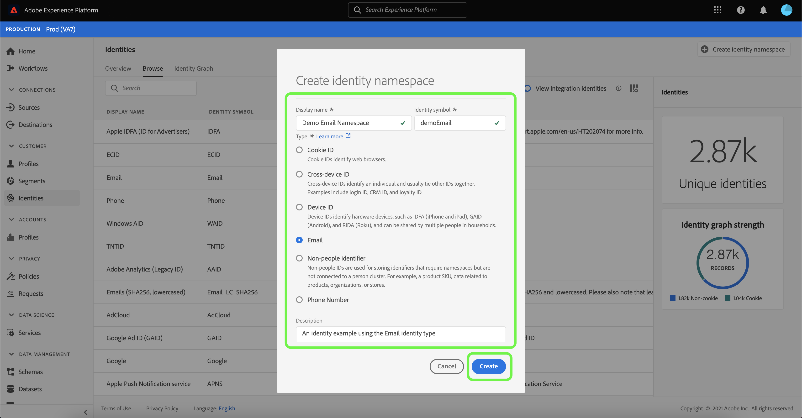

# Información general sobre la Área de nombres de identidad

Las Áreas de nombres de identidad son un componente del servicio [de](./home.md) identidad que sirve de indicadores del contexto al que se relaciona la identidad. Por ejemplo, distinguen un valor de &quot;name@email.com&quot; como dirección de correo electrónico o &quot;443522&quot; como ID de CRM numérico.

## Primeros pasos

Trabajar con Áreas de nombres de identidad requiere comprender los distintos servicios de Adobe Experience Platform implicados. Antes de comenzar a trabajar con Áreas de nombres, consulte la documentación de los siguientes servicios:

- [Perfil](../profile/home.md)del cliente en tiempo real: Proporciona un perfil de cliente unificado en tiempo real basado en datos agregados de varias fuentes.
- [Servicio](./home.md)de identidad: Obtenga una mejor vista de los clientes individuales y su comportamiento al unir identidades entre dispositivos y sistemas.
- [Privacy Service](../privacy-service/home.md): Las Áreas de nombres de identidad se utilizan para cumplir con el Reglamento General de Protección de Datos (RGPD), en el que las solicitudes del RGPD pueden hacerse en relación con una Área de nombres.

## Explicación de las Áreas de nombres de identidad

Una identidad completa incluye un valor de ID y una Área de nombres. Al hacer coincidir los datos de registros en distintos fragmentos de perfil, como cuando el Perfil del cliente en tiempo real combina datos de perfil, tanto el valor de identidad como la Área de nombres deben coincidir.

Por ejemplo, dos fragmentos de perfil pueden contener ID principales diferentes pero comparten el mismo valor para la Área de nombres &quot;Correo electrónico&quot;, por lo que Platform puede ver que estos fragmentos son en realidad el mismo individuo y reunir los datos en el gráfico de identidad del individuo.

### Tipos de identidad

Los datos se pueden identificar mediante varios tipos de identidad diferentes. El tipo de identidad se especifica en el momento en que se crea la Área de nombres de identidad y controla si los datos se conservan o no en el gráfico de identidad, así como las instrucciones especiales sobre cómo se deben gestionar dichos datos.

Los siguientes tipos de identidad están disponibles en la plataforma:

| Tipo de identidad | Descripción |
| --- | --- |
| Cookie | Estas identidades son fundamentales para la expansión y constituyen la mayoría del gráfico de identidad. Sin embargo, por naturaleza se descienden rápidamente y pierden su valor con el tiempo. La eliminación de cookies se gestiona especialmente en el gráfico de identidad. |
| Dispositivo cruzado | Esto indica que el servicio de identidad debe considerar que es un identificador de personas sólido y, por lo tanto, preservarlo para siempre. Algunos ejemplos son: ID de inicio de sesión, ID de CRM, ID de lealtad, etc. |
| Device | Incluye IDFA, GAID y otros ID de IOT. Pueden compartirlas las personas de los hogares. |
| Correo electrónico | Las identidades de este tipo incluyen información de identificación personal (PII). Esto indica a Identity Service que debe gestionar el valor con sensibilidad. |
| Dispositivo móvil | Las identidades de este tipo incluyen PII. Esto indica a Identity Service que debe gestionar el valor con sensibilidad. |
| No personas | Se utiliza para almacenar identificadores que necesitan Áreas de nombres, pero que no están vinculados a un clúster de personas. Estos identificadores se filtran desde el gráfico de identidad. Los casos de uso posibles incluyen datos relacionados con productos, organizaciones, tiendas, etc. (Por ejemplo, un SKU de producto). |
| Phone | Las identidades de este tipo incluyen PII. Esto indica a Identity Service que debe gestionar el valor con sensibilidad. |

### Áreas de nombres estándar

Adobe Experience Platform proporciona varias Áreas de nombres de identidad disponibles para todas las organizaciones. Se conocen como Áreas de nombres estándar y se pueden ver mediante la API de servicio de identidad o a través de la interfaz de usuario de la plataforma.

Para vista de Áreas de nombres estándar en la interfaz de usuario, haga clic en **Identidades** en el carril izquierdo y, a continuación, haga clic en la ficha *Examinar* . Se mostrarán todas las Áreas de nombres de identidad accesibles para su organización, pero las que tengan &quot;Estándar&quot; como &quot;Propietario&quot; son las Áreas de nombres estándar proporcionadas por Adobe.

Luego puede hacer clic en una de las Áreas de nombres enumeradas para obtener detalles de la vista.

## Administración de Áreas de nombres para su organización

Según los datos de la organización y los casos de uso, es posible que necesite Áreas de nombres personalizadas.

Estos son visibles en la interfaz de usuario como las Áreas de nombres con &quot;Personalizado&quot; como &quot;Propietario&quot;. Las Áreas de nombres personalizadas se pueden crear mediante la API de servicio de identidad o mediante la interfaz de usuario.

Para crear una Área de nombres personalizada mediante la interfaz de usuario, haga clic en **Crear Área de nombres** de identidad y, a continuación, complete el cuadro de diálogo y haga clic en **Crear**.

Las Áreas de nombres que defina son privadas para su organización y requieren un &quot;símbolo de identidad&quot; único (o &quot;código&quot; si utiliza la API) para poder crearlas correctamente.

De forma similar a las Áreas de nombres estándar, puede hacer clic en una Área de nombres personalizada desde la ficha *Examinar* para vista de sus detalles. Sin embargo, con una Área de nombres personalizada también puede editar su Nombre para mostrar y su Descripción desde el área de detalles.

>[!NOTE] Una vez creada una Área de nombres, no se puede eliminar y su &quot;Símbolo de identidad&quot; (o &quot;código&quot; en la API) y &quot;Tipo&quot; no se pueden cambiar.

## Áreas de nombres en los datos de identidad

El suministro de la Área de nombres de una identidad depende del método que se utilice para proporcionar datos de identidad. Para obtener más información sobre cómo proporcionar datos de identidad de datos, consulte la sección sobre el [suministro de datos](./home.md#supplying-identity-data-to-identity-service) de identidad en la descripción general del servicio de identidad.
