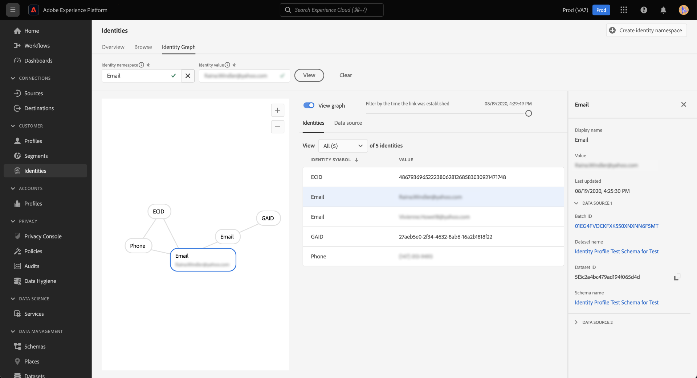

# Visualizador de gráficos de identidad

Un gráfico de identidad es un mapa de relaciones entre distintas identidades de un cliente en particular, que le proporciona una representación visual de cómo el cliente interactúa con la marca en diferentes canales. El servicio de identidad de Adobe Experience Platform administra y actualiza todos los gráficos de identidad de los clientes de forma colectiva casi en tiempo real como respuesta a la actividad de los clientes.

El visualizador de gráficos de identidad en la interfaz de usuario de Platform le permite visualizar y comprender mejor qué identidades de clientes se vinculan y de qué maneras. El visor le permite arrastrar e interactuar con diferentes partes del gráfico, lo que le permite examinar relaciones de identidad complejas, depurar de forma más eficaz y beneficiarse de una mayor transparencia con la forma en que se utiliza la información.

El siguiente documento proporciona pasos sobre cómo acceder y utilizar el visualizador de gráficos de identidad en la interfaz de usuario de Platform.

## Tutorial en vídeo

El siguiente vídeo tiene como objetivo ayudarle a comprender el visualizador de gráficos de identidad.

>[!VIDEO](https://video.tv.adobe.com/v/331030/?quality=12&learn=on)

## Primeros pasos

Trabajar con el visualizador de gráficos de identidad requiere comprender los distintos servicios de Adobe Experience Platform implicados. Antes de empezar a trabajar con el visualizador de gráficos de identidad, revise la documentación de los siguientes servicios:

- [[!DNL Identity Service]](../home.md): obtenga una mejor vista de los clientes individuales y su comportamiento uniendo identidades entre dispositivos y sistemas.
- [Perfil del cliente en tiempo real](../../profile/home.md): el perfil del cliente en tiempo real aprovecha los gráficos de identidad para crear una vista completa y singular de los atributos y el comportamiento del cliente.

### Terminología

- **Identidad (nodo):** Una identidad o un nodo son datos únicos de una entidad, normalmente una persona. Una identidad se compone de un área de nombres de identidad y un valor de identidad. Por ejemplo, una identidad completa podría consistir en un área de nombres de identidad para **Correo electrónico**, combinado con un valor de identidad de **petirrojo@email.com**.
- **Vínculo (borde):** Un vínculo o un extremo representa la conexión entre identidades. Los vínculos de identidad incluyen propiedades como las marcas de tiempo establecidas por primera vez y las actualizadas por última vez. La primera marca de tiempo establecida define la fecha y la hora a la que una nueva identidad se vincula a una identidad existente. La marca de tiempo de la última actualización define la fecha y la hora en la que se actualizó por última vez un vínculo de identidad existente.
- **Gráfico (clúster):** Un gráfico o un clúster es un grupo de identidades y vínculos que representan a una persona.

## Acceso al visor de gráficos de identidad {#access-identity-graph-viewer}

En la IU de Platform, seleccione **[!UICONTROL Identidades]** en el panel de navegación izquierdo y seleccione **[!UICONTROL Gráfico de identidad]** de la lista de pestañas del encabezado.

Para ver un gráfico de identidad, proporcione un área de nombres de identidad y su valor correspondiente y, a continuación, seleccione **[!UICONTROL Ver]**.

>[!TIP]
>
>Seleccione el icono de tabla  para ver un panel con una lista de todas las áreas de nombres de identidad disponibles en su organización. Puede utilizar cualquiera de las áreas de nombres de identidad siempre que tenga un valor de identidad válido conectado a ellas. Para obtener más información, lea la [guía del área de nombres de identidad](../namespaces.md).

## Explicación de la interfaz del visor de gráficos de identidad

La interfaz del visualizador de gráficos de identidad está formada por varios elementos que puede utilizar para interactuar con los datos de identidad y comprender mejor dichos datos.

El gráfico de identidad muestra todas las identidades vinculadas a la combinación de área de nombres de identidad y valor que ha introducido. Cada nodo consta de un área de nombres de identidad y su valor correspondiente. Puede seleccionar, mantener pulsado y arrastrar cualquier nodo para interactuar con el gráfico. También puede pasar el ratón sobre un nodo para ver información acerca de su valor de identidad correspondiente. Seleccionar **[!UICONTROL Ver gráfico]** para ocultar o mostrar el gráfico.

>[!IMPORTANT]
>
>Un gráfico de identidad requiere que se genere un mínimo de dos identidades vinculadas y una combinación de área de nombres de identidad y valor válida. El número máximo de identidades que puede mostrar el visor de gráficos es de 150. Consulte la [apéndice](#appendix) para obtener más información.

Seleccione un vínculo dentro del gráfico para ver el conjunto de datos y el ID de lote que contribuyen a ese vínculo. Al seleccionar un vínculo, también se actualiza el carril derecho para proporcionar más información sobre los detalles de la fuente de datos, así como propiedades como las marcas de tiempo establecidas por primera vez y las actualizadas por última vez.

El [!UICONTROL Identidades] proporciona una vista diferente de los datos de identidad, y enumera el área de nombres de identidad y la combinación de valores de identidad en formato de tabla. Si se selecciona un nodo en el gráfico, se actualizará el elemento de línea resaltado en la [!UICONTROL Identidades] tabla.

Utilice el menú desplegable para ordenar los datos del gráfico y resaltar la información de un área de nombres de identidad específica. Por ejemplo, seleccione **[!UICONTROL Correo electrónico]** en el menú para ver datos específicos del área de nombres de identidad de correo electrónico.

El carril derecho muestra información sobre una identidad seleccionada, incluida la marca de tiempo de la última actualización. El carril derecho también muestra información sobre la fuente de datos que corresponde con la identidad seleccionada, incluidos el ID de lote, el nombre del conjunto de datos, el ID del conjunto de datos y el nombre del esquema.

La siguiente tabla proporciona información adicional sobre las propiedades de la fuente de datos que se muestran en el carril derecho:

| Fuente de datos | Descripción |
| --- | --- | 
| ID de lote | El identificador generado automáticamente que corresponde a los datos por lotes. |
| ID de conjunto de datos | El identificador generado automáticamente que corresponde con su conjunto de datos. |
| Nombre del conjunto de datos | Nombre del conjunto de datos que contiene los datos por lotes. |
| Nombre del esquema | Nombre del esquema. El esquema proporciona un conjunto de reglas que representan y validan la estructura y el formato de los datos. |

También puede utilizar la variable *[!UICONTROL Fuente de datos]* para ver una lista de fuentes de datos que contribuyen a sus identidades. Seleccionar [!UICONTROL Fuente de datos] para obtener una vista tabular de los conjuntos de datos y los ID de lote.

Utilice el control deslizante para filtrar los datos de gráficos por el momento en el que se establecieron las identidades por primera vez. De forma predeterminada, el visor de gráficos de identidades muestra todas las identidades vinculadas dentro del gráfico. Mantenga pulsado y arrastre el control deslizante para ajustar la hora a la última marca de tiempo a la que se vinculó una nueva identidad al gráfico. En el siguiente ejemplo, el gráfico muestra que el vínculo de identidad más reciente (GAID) se estableció en **[!UICONTROL 19/08/2020, 4:29:14:00]**.

Ajuste el control deslizante para ver que se ha establecido otro vínculo de identidad (correo electrónico) en **[!UICONTROL 19/08/2020, 4:25:13:00]**.

También puede ajustar el control deslizante para ver la iteración más temprana del gráfico. En el ejemplo siguiente, el visor de gráficos de identidad muestra en qué se creó el gráfico por primera vez **[!UICONTROL 19/08/2020, 4:11:16:00]**, con sus primeros vínculos siendo ECID, Correo electrónico y Teléfono.

## Apéndice

En la siguiente sección se proporciona información adicional para trabajar con el visor de gráficos de identidad.

### Explicación de los mensajes de error

Pueden producirse errores al acceder al visor del gráfico de identidades. A continuación se muestra una lista de requisitos previos y limitaciones que se deben tener en cuenta al trabajar con el visualizador de gráficos de identidad.

- Debe existir un valor de identidad en el área de nombres seleccionada.
- El visor de gráficos de identidad requiere un mínimo de dos identidades vinculadas para su generación. Es posible que solo haya un valor de identidad y ninguna identidad vinculada, y en este caso, el valor solo existiría en [!DNL Profile] visor.
- El visualizador del gráfico de identidades no puede superar el máximo de 150 identidades.

### Acceso al visor de gráficos de identidad desde conjuntos de datos

También puede acceder al visor de gráficos de identidad mediante la interfaz de conjuntos de datos. De los conjuntos de datos [!UICONTROL Examinar] , seleccione un conjunto de datos con el que desee interactuar y, a continuación, seleccione **[!UICONTROL Previsualizar conjunto de datos]**

En la ventana de vista previa, seleccione un icono de huella digital para ver las identidades representadas a través del visor de gráficos de identidades.

>[!TIP]
>
>El icono de huella digital solo aparece si el conjunto de datos tiene dos o más identidades.

## Pasos siguientes

Al leer este documento, ha aprendido a explorar los gráficos de identidad de sus clientes en la interfaz de usuario de Platform. Para obtener más información sobre identidades en Platform, consulte la [Introducción al servicio de identidad](../home.md)

## Changelog

| Fecha | Acción |
| ---- | ------ |
| 2021-01 | <ul><li>Se ha agregado compatibilidad con la transmisión de datos ingeridos y zonas protegidas sin producción.</li><li>Se han corregido errores menores.</li></ul> |
| 2021-02 | <ul><li>Se puede acceder al visualizador de gráficos de identidad mediante la previsualización de conjuntos de datos.</li><li>Se han corregido errores menores.</li><li>El visualizador de gráficos de identidad pasa a estar disponible de forma general.</li></ul> |
| 2023-01 | <ul><li>Actualizaciones de IU.</li></ul> |
