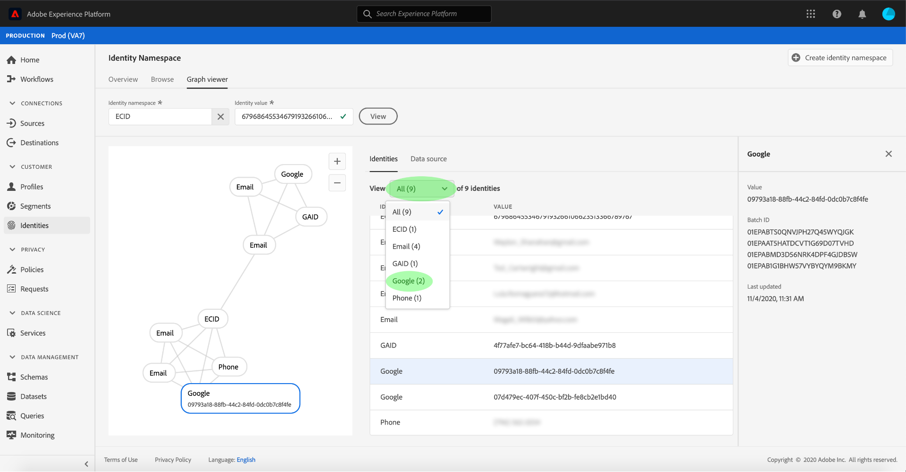
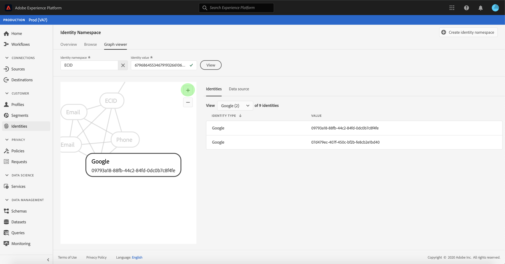

# (Beta) Visor de gráficos de identidad

>[!NOTE]
>
>El visor de gráficos de identidad se encuentra actualmente en fase beta. Sus características están sujetas a cambios.

Un gráfico de identidad es un mapa de las relaciones entre las distintas identidades de un cliente en particular, que le proporciona una representación visual de cómo el cliente interactúa con la marca en diferentes canales. Todos los gráficos de identidad del cliente son administrados y actualizados colectivamente por Adobe Experience Platform Identity Service en tiempo casi real, en respuesta a la actividad del cliente.

El visor de gráficos de identidad de la interfaz de usuario de la plataforma le permite visualizar y comprender mejor qué identidades de cliente se unen y de qué manera. El visor le permite arrastrar e interactuar con diferentes partes del gráfico, lo que le permite examinar relaciones de identidad complejas, depurar de forma más eficaz y beneficiarse de una mayor transparencia con la forma en que se utiliza la información.

## Primeros pasos

Trabajar con el visor de gráficos de identidad requiere comprender los distintos servicios de Adobe Experience Platform implicados. Antes de empezar a trabajar con el visor de gráficos de identidad, consulte la documentación de los siguientes servicios:

- [[!DNL Identity Service]](../home.md):: Obtenga una mejor vista de los clientes individuales y su comportamiento al unir identidades entre dispositivos y sistemas.

### Terminología

- **Identidad (nodo):** Una identidad o un nodo son datos exclusivos de una entidad, normalmente una persona. Una identidad está compuesta por un valor de Área de nombres e identidad.
- **Vínculo (borde):** Un vínculo o un borde representa la conexión entre identidades.
- **Gráfico (clúster):** Un gráfico o un clúster es un grupo de identidades y vínculos que representan a una persona.

## Acceso al visor del gráfico de identidad

Para utilizar el visor de gráficos de identidad en la interfaz de usuario, seleccione **[!UICONTROL Identidades]** en el panel de navegación izquierdo y, a continuación, seleccione la ficha Gráfico **[!UICONTROL de]** identidad. En la pantalla Área de nombres **[!UICONTROL de]** identidad, haga clic en el icono **[!UICONTROL Seleccionar Área de nombres]** de identidad para buscar la Área de nombres que desee utilizar.

Aparece el panel **[!UICONTROL Seleccionar Área de nombres]** de identidad. Esta pantalla contiene una lista de Áreas de nombres disponibles para su organización, incluida información sobre el nombre **** para mostrar de una Área de nombres, el símbolo **** de identidad, el **[!UICONTROL propietario]**, la fecha de **[!UICONTROL última actualización]** y la **[!UICONTROL descripción]**. Puede utilizar cualquiera de las Áreas de nombres proporcionadas siempre que tenga un valor de identidad válido conectado a ellas.

Seleccione la Área de nombres que desee utilizar y haga clic en **[!UICONTROL Seleccionar]** para continuar.

Una vez seleccionada una Área de nombres, introduzca su valor correspondiente para un cliente concreto en el cuadro de texto Valor **[!UICONTROL de]** identidad y seleccione **[!UICONTROL Vista]**.

Aparece el visor del gráfico de identidad. A la izquierda de la pantalla se encuentra el gráfico de identidad que muestra todas las identidades vinculadas a la Área de nombres seleccionada y el valor de identidad introducido. Cada nodo de identidad consta de una Área de nombres y su correspondiente valor de ID. Puede seleccionar y mantener cualquier identidad para arrastrar el gráfico e interactuar con él. Como alternativa, puede pasar el ratón sobre una identidad para ver información sobre su valor de ID. La salida del gráfico también se muestra como una lista tabulada en el centro de la pantalla.

>[!IMPORTANT]
>
>Un gráfico de identidad requiere un mínimo de dos identidades vinculadas para generar, así como un par de Áreas de nombres e ID válido. El número máximo de identidades que puede mostrar el visor de gráficos es 150. See the [appendix](#appendix) section below for more information.

Seleccione una identidad para actualizar la fila resaltada en la tabla **[!UICONTROL Identidades]** y para actualizar la información proporcionada en el carril derecho, que incluye un **[!UICONTROL valor]** de identidad, un ID **[!UICONTROL de]** lote y la fecha de **[!UICONTROL última actualización]** .

Puede filtrar por un gráfico y aislar una Área de nombres específica mediante la opción de ordenación situada encima de la tabla **[!UICONTROL Identidades]** . En el menú desplegable, seleccione la Área de nombres que desee resaltar.

Se devuelve el visor de gráficos, resaltando la Área de nombres seleccionada. La opción de filtro también actualiza la tabla **[!UICONTROL Identidades]** para devolver información solamente para la Área de nombres seleccionada.

La parte superior derecha del cuadro del visor de gráficos contiene opciones para la ampliación. Seleccione el icono **(+)** para acercar el gráfico o el icono **(-)** para alejarlo.

Para obtener más información sobre los lotes, seleccione el origen **[!UICONTROL de]** datos en el encabezado. La tabla **[!UICONTROL Origen]** de datos muestra una lista de los ID de **[!UICONTROL lote]** asociados al gráfico, así como los ID **[!UICONTROL vinculados]**, el esquema de origen y la fecha de ingesta.

Puede seleccionar cualquiera de los vínculos de un gráfico de identidad para ver todos los lotes de origen que contribuyeron al vínculo.

Como alternativa, puede seleccionar un lote para ver todos los vínculos en los que contribuyó este lote.

También se puede acceder a los gráficos de identidad con clústeres de identidades más grandes a través del visor de gráficos de identidad.

## Apéndice

La siguiente sección proporciona información adicional para trabajar con el visor de gráficos de identidad.

### Explicación de los mensajes de error

Pueden producirse errores al acceder al visor del gráfico de identidad. A continuación se presenta una lista de requisitos previos y limitaciones que deben tenerse en cuenta al trabajar con el visor de gráficos de identidad.

- Debe existir un valor de identidad en la Área de nombres seleccionada.
- El visor de gráficos de identidad requiere un mínimo de dos identidades vinculadas para generar.
- El visor de gráficos de identidad no puede superar el máximo de 150 identidades.
- Actualmente no se puede acceder al visor de gráficos de identidad en los entornos limitados que no son de producción.
- Actualmente, el visor de gráficos de identidad solo admite datos ingestados por lotes y no muestra datos ingestados mediante fuentes de flujo continuo.

## Pasos siguientes

Al leer este documento, ha aprendido a explorar los gráficos de identidad de sus clientes en la interfaz de usuario de la plataforma. Para obtener más información sobre las identidades en la plataforma, consulte la información general del servicio de [identidad](../home.md)