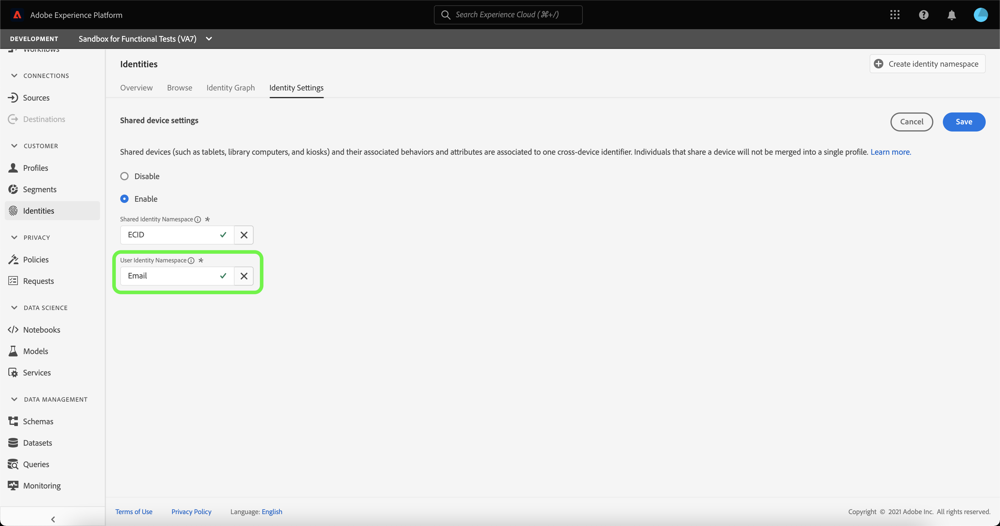

# Información general sobre la detección de dispositivos compartidos (Beta)

>[!IMPORTANT]
>
>El [!DNL Shared Device Detection] La función está en versión beta. Sus funciones y documentación están sujetas a cambios.

Adobe Experience Platform [!DNL Identity Service] le ayuda a obtener una mejor vista de sus clientes y de su comportamiento al unir identidades entre dispositivos y sistemas, lo que le permite ofrecer experiencias digitales personales impactantes en tiempo real.

[!DNL Shared Device] hace referencia a dispositivos utilizados por más de un individuo. Algunos ejemplos de dispositivos compartidos son tabletas, equipos de biblioteca y quioscos. A través de [!DNL Shared Device Detection] función, se puede evitar que distintos usuarios del mismo dispositivo se fusionen en una sola identidad, lo que permite una representación más precisa de un individuo.

Con [!DNL Shared Device Detection] puede:

* Crear gráficos de identidad independientes para distintos usuarios del mismo dispositivo.
* Impedir la mezcla de datos de distintas personas utilizando el mismo dispositivo;
* Genere una visión más limpia y precisa de sus clientes.

>[!TIP]
>
>Configuraciones para [!DNL Shared Device Detection] debe completarse antes de habilitar Perfil para el conjunto de datos, ya que ya no puede revisar la configuración una vez que se hayan generado los gráficos en [!DNL Identity Service].

## Introducción a [!DNL Shared Device Detection]

Uso de [!DNL Shared Device Detection] requiere una comprensión de los distintos servicios de Platform implicados. Antes de comenzar a trabajar con [!DNL Shared Device Detection], consulte la documentación de los siguientes servicios:

* [[!DNL Identity Service]](../home.md): obtenga una mejor vista de los clientes individuales y su comportamiento uniendo identidades entre dispositivos y sistemas.
   * [Visualizador de gráficos de identidad](./identity-graph-viewer.md): Visualice e interactúe con el visualizador de gráficos de identidad para comprender mejor cómo se vinculan las identidades de los clientes y de qué formas.
   * [Áreas de nombres de identidad](../namespaces.md): consulte los componentes de una identidad completa y cómo las áreas de nombres de identidad le permiten distinguir el contexto y el tipo de una identidad.

## Explicación [!DNL Shared Device Detection]

Es importante entender la siguiente terminología al trabajar con
[!DNL Shared Device Detection]. Consulte la tabla siguiente para obtener una lista de los términos esenciales para comprender [!DNL Shared Device Detection].

### Terminología

| Términos | Definición |
| --- | --- |
| Dispositivo compartido | Un dispositivo compartido es cualquier dispositivo que utilice más de un individuo. Algunos ejemplos de dispositivos compartidos son tabletas, equipos de biblioteca y quioscos. |
| [!DNL Shared Device Detection] | [!DNL Shared Device Detection] hace referencia a un valor de configuración que permite separar datos de distintos usuarios del mismo dispositivo. |
| Área de nombres de identidad compartida | El área de nombres de identidad compartida representa el dispositivo que varios usuarios podrían usar. El área de nombres de identidad compartida suele ser el ECID, pero se puede establecer en otros ID de dispositivo. |
| Área de nombres de identidad | El área de nombres de identidad del usuario representa al usuario autenticado (que ha iniciado sesión) de un dispositivo compartido. |
| Último usuario autenticado | El último usuario autenticado representa al usuario que inició sesión por última vez en un dispositivo, si este lo están iniciando varias cuentas. |

{style="table-layout:auto"}

[!DNL Shared Device Detection] funciona estableciendo dos áreas de nombres: **Área de nombres de identidad compartida** y el **Área de nombres de identidad**.

* El área de nombres de identidad compartida representa el dispositivo que varios usuarios podrían usar. El Adobe recomienda que los clientes utilicen ECID como identificador de dispositivo compartido.
* El área de nombres de identidad del usuario está asignada al área de nombres de identidad que corresponde al ID de inicio de sesión de un usuario, puede ser el ID de CRM, la dirección de correo electrónico, el correo electrónico con hash o el número de teléfono de un usuario.

Un dispositivo compartido, como una tableta, tiene un solo **Área de nombres de identidad compartida**. Por otro lado, cada usuario de un dispositivo compartido tiene su propio designado **Área de nombres de identidad** que se corresponde con sus respectivos ID de inicio de sesión. Por ejemplo, una tableta que Kevin y Nora comparten para uso de comercio electrónico tiene su propio ECID de `1234`, mientras que Kevin tiene su propia Área de nombres de identidad de usuario asignada a su `kevin@email.com` y Nora tiene su propia Área de nombres de identidad de usuario asignada a ella `nora@email.com` cuenta.

[!DNL Shared Device Detection] puede hacer distinciones entre varios usuarios del mismo dispositivo vinculando el área de nombres de identidad compartida (por ejemplo, ECID) con el último área de nombres de identidad de usuario del usuario autenticado (ID de inicio de sesión).

### Envío de datos de identidad a un gráfico de identidad

Considere el siguiente ejemplo para comprender mejor cómo [!DNL Shared Device Detection] funciona:

>[!NOTE]
>
>En este diagrama, el área de nombres de identidad compartida se configura como ECID y el área de nombres de identidad de usuario se configura como ID de CRM.

* Kevin y Nora comparten una tableta para visitar un sitio web de comercio electrónico. Sin embargo, ambos tienen sus propias cuentas independientes que cada uno utiliza para navegar y comprar en línea;
   * Como dispositivo compartido, la tableta tiene un ECID correspondiente, que representa el ID de cookie del explorador web de la tableta;
* Supongamos que Kevin usa la tableta y **inicia sesión** a su cuenta de comercio electrónico para buscar auriculares, esto significa que el ID de CRM de Kevin (**Área de nombres de identidad**) ahora está vinculado con el ECID de la tableta (**Área de nombres de identidad compartida**). Los datos de navegación de la tableta ahora están incorporados con el gráfico de identidad de Kevin.
   * Si Kevin **cierra sesión** y Nora usa la tableta y... **inicia sesión** a su propia cuenta y compra una cámara, su ID de CRM ahora está vinculado al ECID de la tableta. Por lo tanto, los datos de navegación de la tableta ahora están incorporados con el gráfico de identidad de Nora.
   * Si Nora **no cierra la sesión** y Kevin usa la tableta, pero... **no inicia sesión**, los datos de navegación de la tableta se siguen incorporando a Nora, ya que permanece como el usuario autenticado y su ID de CRM sigue vinculado al ECID de la tableta.
   * Si Nora **no cierra la sesión** y Kevin usa la tableta, pero... **no inicia sesión**, entonces los datos de navegación de la tableta siguen incorporados con el gráfico de identidad de Nora, porque como el **último usuario autenticado**, su ID de CRM permanece vinculado al ECID de la tableta.
   * Si Kevin **inicia sesión** de nuevo, su CRM ID ahora se vincula al ECID de la tableta, ya que ahora es el último usuario autenticado y los datos de navegación de la tableta ahora se incorporan con su gráfico de identidad.

### Cómo [!DNL Profile Service] combina fragmentos de perfil con [!DNL Shared Device Detection] activado

[!DNL Profile Service] toma nota de los fragmentos de perfil y de los perfiles combinados. Cada perfil de cliente individual está compuesto por varios fragmentos de perfil que se han combinado para formar una sola vista de ese cliente. Por ejemplo, si un cliente interactúa con su marca en varios canales, su organización tendrá varios fragmentos de perfil relacionados con ese único cliente que aparecerán en varios conjuntos de datos. Cuando estos fragmentos se incorporan en Platform, se combinan para crear un único perfil para ese cliente.

Cuándo [!DNL Shared Device Detection] está activada, [!DNL Profile] define la identidad principal del fragmento de perfil en función de si el evento de experiencia está autenticado o no

Un **evento de experiencia autenticada** es una acción completada por un usuario mientras inicia sesión en un dispositivo. Para los eventos de experiencia autenticados, la identidad principal es la **Área de nombres de identidad** (ID de inicio de sesión). Un **evento de experiencia no autenticado** es una acción completada por un usuario que no ha iniciado sesión en un dispositivo. Para los eventos de experiencia no autenticados, la identidad principal es la **Área de nombres de identidad compartida** (ECID).

Para obtener más información, consulte la  [[!DNL Real-Time Customer Profile] descripción general](../../profile/home.md).

## IU de dispositivos compartidos

En la IU de Platform, seleccione **[!UICONTROL Identidades]** en la barra de navegación izquierda y, a continuación, seleccione **[!UICONTROL Configuración de identidad]**.

El [!UICONTROL Configuración de dispositivo compartido] , que le proporciona una interfaz para configurar los ajustes de dispositivos compartidos para sus datos. La configuración de dispositivos compartidos está deshabilitada de forma predeterminada.

Cuando está habilitada, la configuración de dispositivos compartidos permite separar datos de distintos usuarios del mismo dispositivo. Esta configuración permite una representación más limpia y precisa de los gráficos de identidad, donde las identidades de los usuarios del mismo dispositivo no se combinan.

Seleccionar **[!UICONTROL Activar]** para empezar a modificar la configuración del dispositivo compartido.

El [!UICONTROL Área de nombres de identidad compartida] y [!UICONTROL Área de nombres de identidad] aparecen opciones de configuración que le permiten modificar las áreas de nombres de identidad que desea utilizar.

[!UICONTROL Área de nombres de identidad compartida] representa un único dispositivo que utilizan varios usuarios diferentes. Esta área de nombres siempre está configurada como **[!UICONTROL ECID]** porque todos los usuarios de Platform utilizan **[!UICONTROL ECID]** como identificador del explorador web.

El [!UICONTROL Área de nombres de identidad] permite identificar a distintos usuarios del mismo dispositivo e impedir que se combinen datos en el mismo gráfico de identidad.

Seleccione el **[!UICONTROL Área de nombres de identidad]** barra de búsqueda e introduzca un área de nombres de identidad o seleccione un área de nombres de identidad en el menú desplegable.

>[!TIP]
>
>El [!UICONTROL Área de nombres de identidad] debe asignarse al área de nombres de identidad que corresponda al ID de inicio de sesión del usuario final. Las opciones incluyen ID de cliente, correo electrónico y correo electrónico con hash.

Una vez que haya configurado su [!UICONTROL Configuración de dispositivo compartido], seleccione **[!UICONTROL Guardar]**.

Aparece una ventana emergente que le solicita que confirme la selección. Seleccionar **[!UICONTROL Sí]** para completar la configuración.

