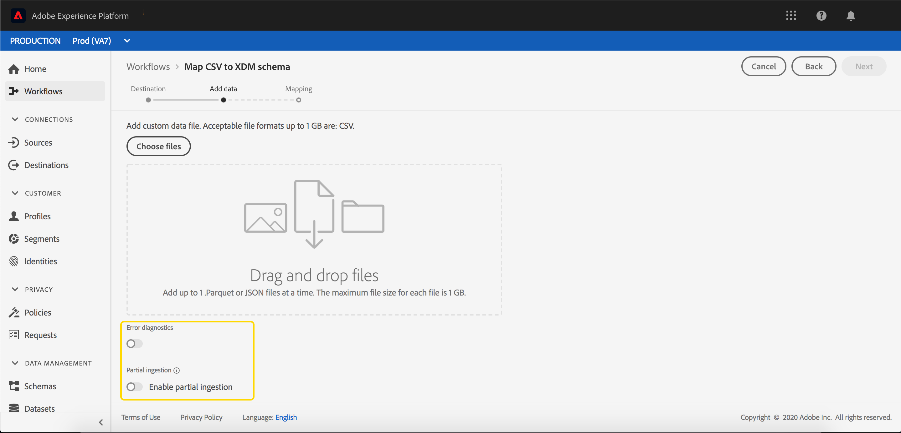

# Ingesta parcial por lotes

La ingesta parcial de lotes es la capacidad de ingerir datos que contengan errores, hasta un umbral determinado. Con esta capacidad, los usuarios pueden ingerir correctamente todos sus datos correctos en Adobe Experience Platform, mientras que todos sus datos incorrectos se procesan por lotes por separado, junto con los detalles de por qué no son válidos.

Este documento proporciona un tutorial para administrar la ingesta parcial de lotes.

## Primeros pasos

Este tutorial requiere un conocimiento práctico de los distintos servicios de Adobe Experience Platform implicados en la ingesta parcial de lotes. Antes de comenzar este tutorial, consulte la documentación de los siguientes servicios:

- [Ingesta por lotes](./overview.md): El método que [!DNL Platform] Ingesta y almacena datos de archivos de datos, como CSV y Parquet.
- [[!DNL Experience Data Model (XDM)]](../../xdm/home.md): El marco normalizado por el cual [!DNL Platform] organiza los datos de experiencia del cliente.

Las secciones siguientes proporcionan información adicional que debe conocer para realizar llamadas a [!DNL Platform] API.

### Leer llamadas de API de ejemplo

Esta guía proporciona ejemplos de llamadas a la API para demostrar cómo dar formato a las solicitudes. Estas incluyen rutas de acceso, encabezados necesarios y cargas de solicitud con el formato correcto. También se proporciona el JSON de muestra devuelto en las respuestas de API. Para obtener información sobre las convenciones utilizadas en la documentación para las llamadas de API de ejemplo, consulte la sección sobre [cómo leer llamadas de API de ejemplo](../../landing/troubleshooting.md#how-do-i-format-an-api-request) en el [!DNL Experience Platform] guía de solución de problemas.

### Recopilar valores para encabezados necesarios

Para realizar llamadas a [!DNL Platform] API, primero debe completar la variable [tutorial de autenticación](https://www.adobe.com/go/platform-api-authentication-en). Al completar el tutorial de autenticación, se proporcionan los valores para cada uno de los encabezados necesarios en todos los [!DNL Experience Platform] Llamadas de API, como se muestra a continuación:

- Autorización: Portador `{ACCESS_TOKEN}`
- x-api-key: `{API_KEY}`
- x-gw-ims-org-id: `{ORG_ID}`

Todos los recursos de [!DNL Experience Platform] están aisladas para entornos limitados virtuales específicos. Todas las solicitudes a [!DNL Platform] Las API requieren un encabezado que especifique el nombre del simulador para pruebas en el que se realizará la operación:

- x-sandbox-name: `{SANDBOX_NAME}`

>[!NOTE]
>
>Para obtener más información sobre los entornos limitados en [!DNL Platform], consulte la [documentación general de entorno limitado](../../sandboxes/home.md).

## Habilitar un lote para la ingesta parcial de lotes en la API {#enable-api}

>[!NOTE]
>
>En esta sección se describe cómo habilitar un lote para la ingesta parcial de lotes mediante la API. Para obtener instrucciones sobre el uso de la interfaz de usuario, lea la [habilitar un lote para la ingesta parcial de lotes en la interfaz de usuario](#enable-ui) paso a paso.

Puede crear un nuevo lote con la ingesta parcial activada.

Para crear un nuevo lote, siga los pasos de la sección [guía para desarrolladores sobre ingesta por lotes](./api-overview.md). Una vez que llegue al **[!UICONTROL Crear lote]** , añada el siguiente campo dentro del cuerpo de la solicitud:

```json
{
    "enableErrorDiagnostics": true,
    "partialIngestionPercent": 5
}
```

| Propiedad | Descripción |
| -------- | ----------- |
| `enableErrorDiagnostics` | Un indicador que permita [!DNL Platform] para generar mensajes de error detallados sobre el lote. |
| `partialIngestionPercent` | El porcentaje de errores aceptables antes de todo el lote fallará. Por lo tanto, en este ejemplo, un máximo del 5 % del lote puede ser de errores antes de que falle. |


## Habilitar un lote para la ingesta parcial de lotes en la interfaz de usuario {#enable-ui}

>[!NOTE]
>
>En esta sección se describe cómo habilitar un lote para la ingesta parcial de lotes mediante la interfaz de usuario. Si ya ha habilitado un lote para la ingesta parcial de lotes mediante la API, puede pasar a la siguiente sección.

Para habilitar un lote para la ingesta parcial a través de la variable [!DNL Platform] La interfaz de usuario de puede crear un nuevo lote a través de conexiones de origen, crear un nuevo lote en un conjunto de datos existente o crear un nuevo lote a través de la[!UICONTROL Asignación de CSV al flujo XDM]&quot;.

### Crear una nueva conexión de origen {#new-source}

Para crear una nueva conexión de origen, siga los pasos indicados en la sección [Resumen de fuentes](../../sources/home.md). Una vez que llegue al **[!UICONTROL Detalles de flujo de datos]** , tome nota del **[!UICONTROL Ingesta parcial]** y **[!UICONTROL Diagnóstico de errores]** campos.


La variable **[!UICONTROL Ingesta parcial]** permite habilitar o deshabilitar el uso de la ingesta parcial de lotes.

La variable **[!UICONTROL Diagnóstico de errores]** la opción de alternancia solo aparece cuando la variable **[!UICONTROL Ingesta parcial]** la opción está desactivada. Esta función permite [!DNL Platform] para generar mensajes de error detallados sobre los lotes ingestados. Si la variable **[!UICONTROL Ingesta parcial]** activa, los diagnósticos de error mejorados se aplican automáticamente.


La variable **[!UICONTROL Umbral de error]** permite establecer el porcentaje de errores aceptables antes de que se produzca un error en todo el lote. De forma predeterminada, este valor se establece en 5%.

### Usar un conjunto de datos existente {#existing-dataset}

Para utilizar un conjunto de datos existente, comience seleccionando un conjunto de datos. La barra lateral de la derecha se rellena con información sobre el conjunto de datos.


La variable **[!UICONTROL Ingesta parcial]** permite habilitar o deshabilitar el uso de la ingesta parcial de lotes.

La variable **[!UICONTROL Diagnóstico de errores]** la opción de alternancia solo aparece cuando la variable **[!UICONTROL Ingesta parcial]** la opción está desactivada. Esta función permite [!DNL Platform] para generar mensajes de error detallados sobre los lotes ingestados. Si la variable **[!UICONTROL Ingesta parcial]** activa, los diagnósticos de error mejorados se aplican automáticamente.


La variable **[!UICONTROL Umbral de error]** permite establecer el porcentaje de errores aceptables antes de que se produzca un error en todo el lote. De forma predeterminada, este valor se establece en 5%.

Ahora puede cargar datos mediante la variable **Añadir datos** y se incorporará mediante ingesta parcial.

### Utilice el[!UICONTROL Asignación de CSV al esquema XDM]&quot; flujo {#map-flow}

Para usar el[!UICONTROL Asignación de CSV al esquema XDM]&quot;, siga los pasos enumerados en la [Asignación de un tutorial de archivo CSV](../tutorials/map-csv/overview.md). Una vez que llegue al **[!UICONTROL Añadir datos]** , tome nota del **[!UICONTROL Ingesta parcial]** y **[!UICONTROL Diagnóstico de errores]** campos.



La variable **[!UICONTROL Ingesta parcial]** permite habilitar o deshabilitar el uso de la ingesta parcial de lotes.

La variable **[!UICONTROL Diagnóstico de errores]** la opción de alternancia solo aparece cuando la variable **[!UICONTROL Ingesta parcial]** la opción está desactivada. Esta función permite [!DNL Platform] para generar mensajes de error detallados sobre los lotes ingestados. Si la variable **[!UICONTROL Ingesta parcial]** activa, los diagnósticos de error mejorados se aplican automáticamente.


**[!UICONTROL Umbral de error]** permite establecer el porcentaje de errores aceptables antes de que se produzca un error en todo el lote. De forma predeterminada, este valor se establece en 5%.

## Pasos siguientes {#next-steps}

Este tutorial trata sobre cómo crear o modificar un conjunto de datos para habilitar la ingesta parcial de lotes. Para obtener más información sobre la ingesta por lotes, lea la [guía para desarrolladores sobre ingesta por lotes](./api-overview.md).

Para obtener información sobre la monitorización de los errores de ingesta parcial, lea la [guía de diagnóstico de errores de ingesta por lotes](../quality/error-diagnostics.md).
