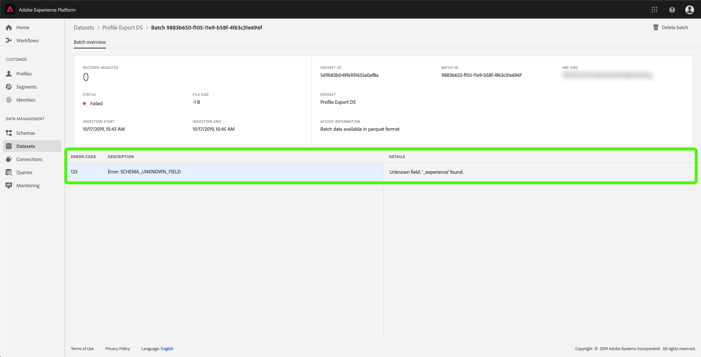

# Monitoreo de la ingesta de datos

La ingestión de datos le permite transferir sus datos a Adobe Experience Platform. Puede utilizar la ingestión por lotes, que le permite insertar los datos mediante varios tipos de archivo (como CSV), o la ingestión por flujo continuo, que le permite ingestar los datos en la plataforma mediante puntos finales de flujo en tiempo real.

Esta guía del usuario proporciona un paso para supervisar los datos en la interfaz de usuario de Adobe Experience Platform. Esta guía requiere un Adobe ID y acceso a Adobe Experience Platform.

## Monitoreo de la transmisión de datos end-to-end

En la interfaz de usuario [de la plataforma de](https://platform.adobe.com)experiencia, haga clic en **Monitoreo** en el menú de navegación de la izquierda y, a continuación, haga clic en **Transmisión de extremo a extremo**.

Aparece la página de supervisión *de flujo completo* . Este espacio de trabajo proporciona un gráfico que muestra la tasa de eventos transmitidos recibidos por Plataforma, un gráfico que muestra la tasa de eventos transmitidos que fueron procesados correctamente por el Perfil [del cliente en tiempo](../../profile/home.md)real, así como una lista detallada de los datos entrantes.

De forma predeterminada, el gráfico superior muestra la tasa de ingestión durante los últimos siete días. Este intervalo de fechas se puede ajustar para mostrar varios períodos de tiempo haciendo clic en el botón resaltado.

El gráfico inferior muestra la tasa de eventos de flujo procesados correctamente por Perfiles en los últimos siete días. Este intervalo de fechas se puede ajustar para mostrar varios períodos de tiempo haciendo clic en el botón resaltado.

> [!NOTE] Para que los datos se muestren en este gráfico, los datos deben habilitarse **explícitamente** para el Perfil. Para aprender a habilitar la transmisión de datos para Perfil, lea la guía [del usuario de](../../catalog/datasets/user-guide.md#enable-a-dataset-for-real-time-customer-profile)conjuntos de datos.

Debajo de los gráficos hay una lista de todos los registros de ingestión de flujo que corresponden al intervalo de fechas mostrado arriba. Cada lote de la lista muestra su ID, el nombre del conjunto de datos, cuándo se actualizó por última vez, el número de registros en el lote, así como el número de errores (si existe). Puede hacer clic en cualquiera de los registros para obtener información más detallada sobre ese registro.

### Visualización de registros de flujo continuo

Al ver los detalles de un registro transmitido correctamente, se muestra información como el número de registros ingestados, el tamaño del archivo, el inicio de ingestión y las horas de finalización.

Los detalles de un registro de flujo fallido muestran la misma información que un registro exitoso.

Además, los registros con errores proporcionan detalles sobre los errores que se produjeron durante el procesamiento del lote. En el ejemplo siguiente, se produjo un error del sistema al validar el datasetId del catálogo.

## Monitorear la ingesta de datos de extremo a extremo por lotes

En la interfaz de usuario [de la plataforma de](https://platform.adobe.com)experiencia, haga clic en **Supervisión** en el menú de navegación de la izquierda.

Se abre la página de supervisión **por lotes de extremo a extremo** , que muestra una lista de los lotes ingestados anteriormente. Puede hacer clic en cualquiera de los lotes para obtener información más detallada sobre ese registro.

### Visualización de lotes

Al ver los detalles de un lote exitoso, se muestra información como el número de registros ingestados, el tamaño del archivo, el inicio de ingestión y las horas de finalización.

Los detalles de un lote dañado muestran la misma información que un lote exitoso, con la adición del número de registros fallidos.

Además, los lotes con errores proporcionan detalles sobre los errores que se produjeron durante el procesamiento del lote. En el ejemplo siguiente, se produjo un error con el lote ingestado porque se utilizó un campo desconocido de `_experience`.

