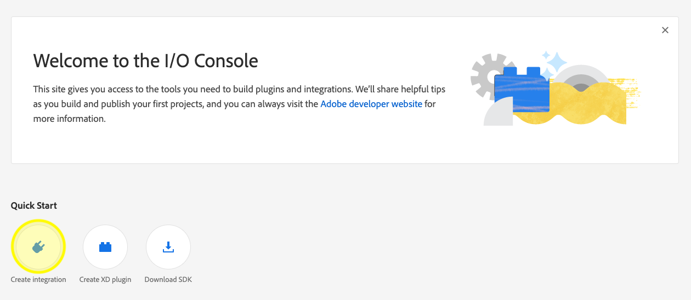
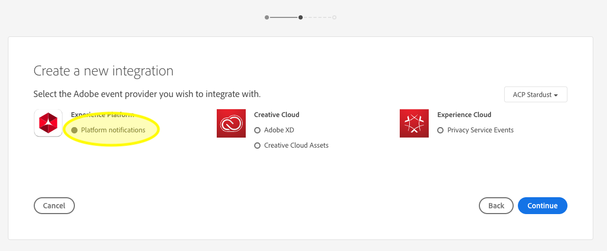
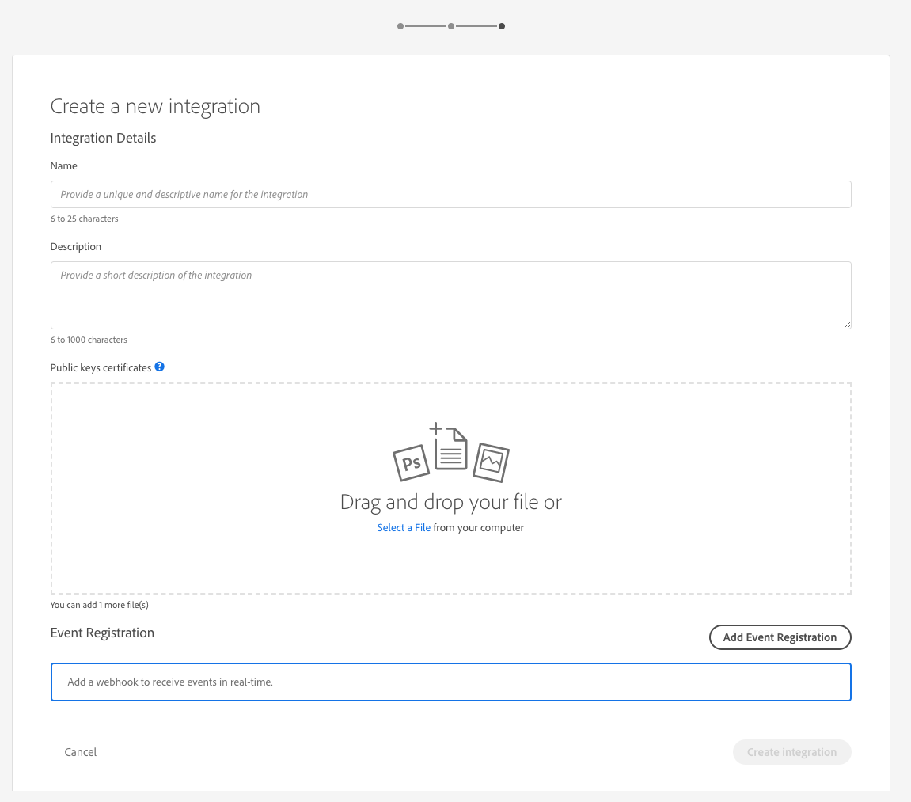

# Notificaciones de ingestión de datos

El proceso de ingesta de datos en Adobe Experience Platform consta de varios pasos. Una vez que identifique los archivos de datos que se deben ingerir en la plataforma, el proceso de ingestión comienza y cada paso se produce de forma consecutiva hasta que los datos se ingieren correctamente o se producen errores. El proceso de inserción se puede iniciar con la API [de inserción de datos de la plataforma de](https://www.adobe.io/apis/experienceplatform/home/api-reference.html#!acpdr/swagger-specs/ingest-api.yaml) Adobe Experience Platform o con la interfaz de usuario de la plataforma de experiencia.

Los datos cargados en la plataforma deben seguir varios pasos para llegar a su destino, al Data Lake o al almacén de datos de Perfil del cliente en tiempo real. Cada paso implica el procesamiento de los datos, la validación de los datos y, a continuación, el almacenamiento de los datos antes de pasarlos al siguiente paso. Dependiendo de la cantidad de datos que se ingesten, este proceso puede llevar mucho tiempo y siempre hay una posibilidad de que el proceso falle debido a errores de validación, semántica o procesamiento. En el evento de un error, los problemas de datos deben corregirse y, a continuación, se debe reiniciar todo el proceso de ingestión utilizando los archivos de datos corregidos.

Para ayudar a supervisar el proceso de ingestión, la plataforma de experiencia permite suscribirse a un conjunto de eventos que se publican en cada paso del proceso, notificándole el estado de los datos ingestados y los posibles errores.

## eventos de notificación de estado disponibles

A continuación se muestra una lista de las notificaciones de estado de ingesta de datos disponibles a las que puede suscribirse.

>[!NOTE] Solo se proporciona un tema de evento para todas las notificaciones de ingesta de datos. Para distinguir entre distintos estados, se puede utilizar el código de evento.

| Servicio de plataforma | Estado | Descripción del evento | Código de Evento |
| ---------------- | ------ | ----------------- | ---------- |
| Aterrizaje de datos | success | Ingesta - Lote correcto | ing_load_success |
| Aterrizaje de datos | error | Ingestión: error en el lote | ing_load_fail |
| Perfil del cliente en tiempo real | success | Servicio de Perfil: lote de carga de datos correcto | ps_load_success |
| Perfil del cliente en tiempo real | error | Servicio de Perfil: error en el lote de carga de datos | ps_load_fail |
| Gráfico de identidad | success | Gráfico de identidad: lote de carga de datos correcto | ig_load_success |
| Gráfico de identidad | error | Gráfico de identidad: error en el lote de carga de datos | ig_load_fail |

## esquema de carga útil de notificación

El esquema de evento de notificación de ingestión de datos es un esquema del Modelo de datos de experiencia (XDM) que contiene campos y valores que proporcionan detalles sobre el estado de los datos que se están ingeriendo. Visite la repo pública de XDM GitHub para poder vista del último esquema [de carga útil de](https://github.com/adobe/xdm/blob/master/schemas/common/notifications/ingestion.schema.json)notificación.

## Suscripción a las notificaciones de estado de inserción de datos

A través de los Eventos [de E/S de](https://www.adobe.io/apis/experienceplatform/events.html)Adobe, puede suscribirse a varios tipos de notificaciones mediante los enlaces web. Para obtener más información sobre los enlaces web y cómo suscribirse a los Eventos de Adobe I/O mediante los enlaces web, consulte la [introducción a la guía Webhooks](https://www.adobe.io/apis/experienceplatform/events/docs.html#!adobedocs/adobeio-events/master/intro/webhook_docs_intro.md) de Eventos de Adobe I/O.

### Crear una nueva integración con la consola de Adobe I/O

Inicie sesión en la consola [de E/S de](https://console.adobe.io/home) Adobe y haga clic en la ficha *Integraciones* o en **Crear integración** en Inicio rápido. Cuando aparezca la pantalla *Integración* , haga clic en **Nueva integración** para crear una nueva integración.



Aparece la pantalla *Crear nueva integración* . Seleccione **Recibir eventos en tiempo real** cercanos y haga clic en **Continuar**.


La siguiente pantalla ofrece opciones para crear integraciones con diferentes eventos, productos y servicios disponibles para su organización en función de sus suscripciones, derechos y permisos. Para esta integración, seleccione Notificaciones **de** plataforma en Plataforma de experiencia y, a continuación, haga clic en **Continuar**.



Aparece el formulario Detalles *de la* integración, que requiere que proporcione un nombre y una descripción para la integración, así como un certificado de clave pública.

Si no tiene un certificado público, puede generar uno en la terminal mediante el siguiente comando:

```shell
openssl req -x509 -sha256 -nodes -days 365 -newkey rsa:2048 -keyout private.key -out certificate_pub
```

Una vez que haya generado un certificado, arrastre y suelte el archivo en el cuadro Certificados **de claves** públicas o haga clic en **Seleccionar un archivo** para examinar el directorio de archivos y seleccionar el certificado directamente.

Después de agregar el certificado, aparece la opción Registro *de* Evento. Haga clic en **Añadir registro** de Evento.



El cuadro de diálogo Detalles *de registro de* Evento se expande para mostrar controles adicionales. Aquí puede seleccionar los tipos de evento que desee y registrar su enlace web. Escriba un nombre para el registro en el evento, la URL del enlace web *(opcional)* y una breve descripción. Finalmente, seleccione los tipos de evento a los que desea suscribirse (notificación de ingesta de datos) y haga clic en **Guardar**.


## Pasos siguientes

Una vez que haya creado la integración de E/S, podrá realizar la vista de las notificaciones recibidas para dicha integración. Consulte la guía [Seguimiento de Eventos](https://www.adobe.io/apis/experienceplatform/events/docs.html#!adobedocs/adobeio-events/master/support/tracing.md) de E/S de Adobe para obtener instrucciones detalladas sobre cómo rastrear sus eventos.
