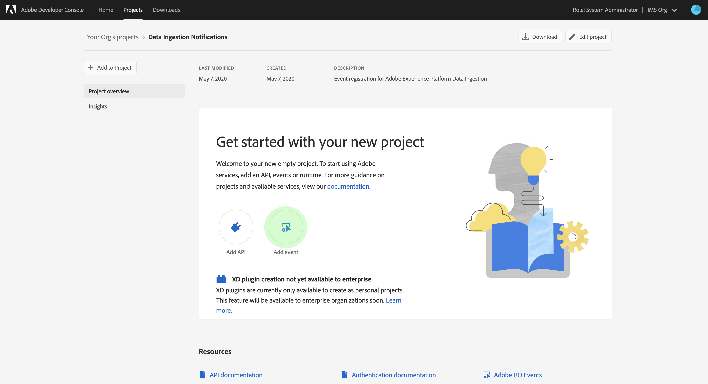
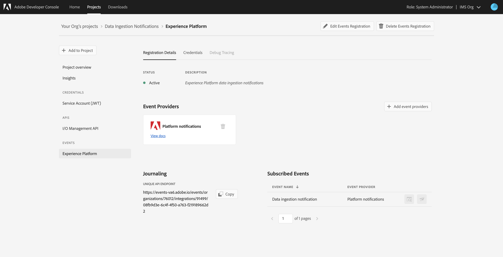

# Notificaciones de ingestión de datos

El proceso de ingesta de datos en Adobe Experience Platform consta de varios pasos. Una vez que identifique los archivos de datos que se deben ingerir en la plataforma, el proceso de ingestión comienza y cada paso se produce de forma consecutiva hasta que los datos se ingieren correctamente o se producen errores. El proceso de inserción se puede iniciar con la API [de inserción de datos de la plataforma de](https://www.adobe.io/apis/experienceplatform/home/api-reference.html#!acpdr/swagger-specs/ingest-api.yaml) Adobe Experience Platform o con la interfaz de usuario de la plataforma de experiencia.

Los datos cargados en la plataforma deben seguir varios pasos para llegar a su destino, al Data Lake o al almacén de datos de Perfil del cliente en tiempo real. Cada paso implica el procesamiento de los datos, la validación de los datos y, a continuación, el almacenamiento de los datos antes de pasarlos al siguiente paso. Dependiendo de la cantidad de datos que se ingesten, este proceso puede llevar mucho tiempo y siempre hay una posibilidad de que el proceso falle debido a errores de validación, semántica o procesamiento. En el evento de un error, los problemas de datos deben corregirse y, a continuación, se debe reiniciar todo el proceso de ingestión utilizando los archivos de datos corregidos.

Para ayudar a supervisar el proceso de ingestión, la plataforma de experiencia permite suscribirse a un conjunto de eventos que se publican en cada paso del proceso, notificándole el estado de los datos ingestados y los posibles errores.

## eventos de notificación de estado disponibles

A continuación se muestra una lista de las notificaciones de estado de ingesta de datos disponibles a las que puede suscribirse.

>[!NOTE] Solo se proporciona un tema de evento para todas las notificaciones de ingesta de datos. Para distinguir entre distintos estados, se puede utilizar el código de evento.

| Servicio de plataforma | Estado | Descripción del evento | Código de Evento |
| ---------------- | ------ | ----------------- | ---------- |
| Aterrizaje de datos | success | Ingesta - Lote correcto | ing_load_success |
| Aterrizaje de datos | error | Ingestión: error en el lote | ing_load_fail |
| Perfil del cliente en tiempo real | success | Servicio de Perfil: lote de carga de datos correcto | ps_load_success |
| Perfil del cliente en tiempo real | error | Servicio de Perfil: error en el lote de carga de datos | ps_load_fail |
| Gráfico de identidad | success | Gráfico de identidad: lote de carga de datos correcto | ig_load_success |
| Gráfico de identidad | error | Gráfico de identidad: error en el lote de carga de datos | ig_load_fail |

## esquema de carga útil de notificación

El esquema de evento de notificación de ingestión de datos es un esquema del Modelo de datos de experiencia (XDM) que contiene campos y valores que proporcionan detalles sobre el estado de los datos que se están ingeriendo. Visite la repo pública de XDM GitHub para poder vista del último esquema [de carga útil de](https://github.com/adobe/xdm/blob/master/schemas/common/notifications/ingestion.schema.json)notificación.

## Suscripción a las notificaciones de estado de ingesta de datos

A través de los Eventos [de E/S de](https://www.adobe.io/apis/experienceplatform/events.html)Adobe, puede suscribirse a varios tipos de notificaciones mediante los enlaces web. Las secciones siguientes describen los pasos para suscribirse a las notificaciones de la plataforma para eventos de ingesta de datos mediante Adobe Developer Console.

### Crear un nuevo proyecto en Adobe Developer Console

Vaya a [Adobe Developer Console](https://www.adobe.com/go/devs_console_ui) e inicie sesión con su Adobe ID. A continuación, siga los pasos descritos en el tutorial sobre la [creación de un proyecto](https://www.adobe.io/apis/experienceplatform/console/docs.html#!AdobeDocs/adobeio-console/master/projects-empty.md) vacío en la documentación de Adobe Developer Console.

### Añadir eventos de la plataforma de experiencia en el proyecto

Una vez creado un nuevo proyecto, navegue a la pantalla de información general de dicho proyecto. Desde aquí, haga clic en **[!UICONTROL Añadir evento]**.

Aparece el cuadro de diálogo _[!UICONTROL Añadir eventos]_. Haga clic en Plataforma**[!UICONTROL  de ]**experiencia para filtrar la lista de opciones disponibles y, a continuación, haga clic en Notificaciones**[!UICONTROL  de ]**plataforma antes de hacer clic en**[!UICONTROL  Siguiente ]**.

La siguiente pantalla muestra una lista de tipos de evento a los que suscribirse. Seleccione **[!UICONTROL Notificación]** de inserción de datos y, a continuación, haga clic en **[!UICONTROL Siguiente]**.

La siguiente pantalla le solicita que cree un testigo web JSON (JWT). Tiene la opción de generar automáticamente un par de claves o cargar su propia clave pública generada en la terminal.

A efectos de este tutorial, se sigue la primera opción. Haga clic en el cuadro de opciones para **[!UICONTROL Generar un par]** de claves y, a continuación, haga clic en el botón **[!UICONTROL Generar par]** de claves en la esquina inferior derecha.

Cuando se genera el par de claves, el explorador lo descarga automáticamente. Debe almacenar el archivo usted mismo, ya que no se mantiene en la consola de desarrollador.

La siguiente pantalla le permite revisar los detalles del par de claves recién generado. Haga clic en **[!UICONTROL Siguiente]** para continuar.

En la pantalla siguiente, especifique un nombre y una descripción para el registro de eventos. Lo mejor es crear un nombre único y fácilmente identificable para ayudar a diferenciar este registro de eventos de otros en el mismo proyecto.

Más abajo en la misma pantalla, puede configurar de forma opcional cómo recibir eventos. **[!UICONTROL Weblink]** le permite proporcionar una dirección de webgancho personalizada para recibir eventos, mientras que la acción **** Runtime le permite hacer lo mismo con [Adobe I/O Runtime](https://www.adobe.io/apis/experienceplatform/runtime/docs.html).

Este tutorial omite este paso de configuración opcional. Una vez que haya terminado, haga clic en **[!UICONTROL Guardar eventos]** configurados para completar el registro de eventos.

Aparece la página de detalles del registro de evento recién creado, donde puede revisar los eventos recibidos, realizar un seguimiento de depuración y editar su configuración.

## Pasos siguientes

Una vez que haya registrado las notificaciones de la plataforma en el proyecto, puede realizar la vista de eventos recibidos del panel del proyecto. Consulte la guía [Seguimiento de Eventos](https://www.adobe.io/apis/experienceplatform/events/docs.html#!adobedocs/adobeio-events/master/support/tracing.md) de E/S de Adobe para obtener instrucciones detalladas sobre cómo rastrear sus eventos.
