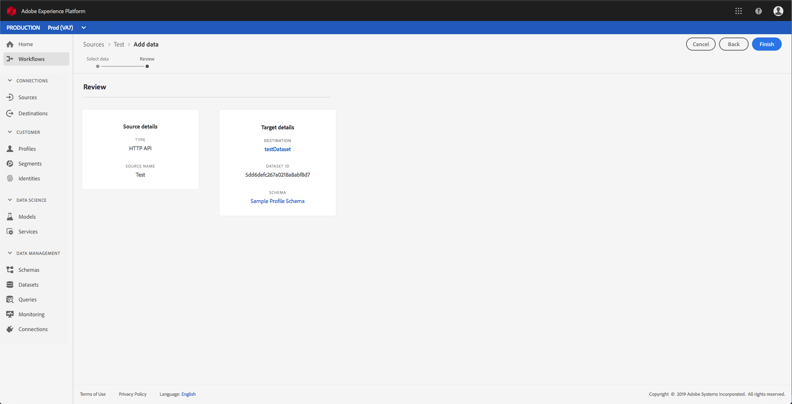

# Creación de una conexión de flujo continuo mediante la interfaz de usuario

Esta guía de la interfaz de usuario le ayudará a crear una conexión de flujo continuo con Adobe Experience Platform.

## Primeros pasos

Para inicio de datos de flujo continuo a [!DNL Experience Platform], primero debe crear una conexión HTTP de flujo. Al crear una conexión de flujo continuo, debe proporcionar detalles clave como, por ejemplo, el origen de los datos de flujo continuo y si desea o no enviar datos desde un origen de confianza (autenticado) o no de confianza (no autenticado).

Después de registrar una conexión de flujo, tendrá una dirección URL única que puede utilizarse para transmitir datos a [!DNL Platform].

Tenga en cuenta que para completar esta guía, necesitará tener acceso a Adobe Experience Platform. Si no tiene acceso a [!DNL Platform], póngase en contacto con el administrador del sistema antes de continuar.

## Creación de una conexión de flujo continuo

Después de iniciar sesión en la interfaz de usuario, haga clic en [!DNL Experience Platform] Fuentes **[!UICONTROL para abrir la ficha]** Catálogo **** . Esta página muestra los tipos de origen disponibles como tarjetas individuales, y cada tarjeta contiene una burbuja que muestra el número de flujos de datos que se han creado desde conexiones de flujo a conjuntos de datos.

En la página **[!UICONTROL Fuentes]** , haga clic en API **** HTTP y, a continuación, en **[!UICONTROL Connect source]**.

Aparece la pantalla **[!UICONTROL Conectar a HTTP]** . En Detalles **** del servicio, proporcione el **[!UICONTROL nombre]** y una **[!UICONTROL descripción]** para la nueva conexión de flujo continuo.

En Autenticación **[!UICONTROL de cuenta]**, seleccione las siguientes propiedades de configuración para la conexión de flujo continuo:

- **[!UICONTROL Autenticación]:** Indica si la conexión de flujo requiere autenticación. La autenticación garantiza que los datos se recopilen a partir de fuentes de confianza. Se recomienda activarlo si se trata de información personal identificable (PII).
- **[!UICONTROL Compatibilidad]de Esquema XDM:** Indica si esta conexión de transmisión enviará o no eventos compatibles con esquemas XDM. De forma predeterminada, esta propiedad está **activada**.

Una vez que haya terminado de seleccionar las propiedades de configuración, haga clic en **[!UICONTROL Connect]**. La conexión HTTP de flujo se ha creado y ahora se puede ver en la ficha **[!UICONTROL Examinar]** del espacio de trabajo **[!UICONTROL Fuentes]** .

Desde la ficha **[!UICONTROL Examinar]** , puede hacer clic en la conexión HTTP de flujo recién creada y vista los detalles de esa conexión.

Al hacer clic en el hipervínculo del nombre de la conexión, puede seleccionar los datos que se mostrarán configurando qué conjunto de datos está conectado, haciendo clic en **[!UICONTROL Seleccionar datos]**.

Puede [crear un nuevo conjunto de datos](#create-a-new-dataset) o [utilizar uno existente](#use-an-existing-dataset).

### Crear un nuevo conjunto de datos

Para crear un nuevo conjunto de datos, proporcione el **[!UICONTROL Nombre]**, la **[!UICONTROL Descripción]** y el **[!UICONTROL Esquema]** de destinatario para el conjunto de datos.

Después de insertar todos los detalles y hacer clic en **[!UICONTROL Siguiente]**, puede revisar los detalles proporcionados antes de hacer clic en **[!UICONTROL Finalizar]** para conectar el conjunto de datos a la conexión HTTP de flujo.

### Usar un conjunto de datos existente

Para utilizar un conjunto de datos existente, seleccione el nombre **[!UICONTROL del conjunto de datos de]** salida.

Después de hacer clic en **[!UICONTROL Siguiente]**, puede revisar los detalles antes de hacer clic en **[!UICONTROL Finalizar]** para conectar el conjunto de datos seleccionado a la conexión HTTP de flujo.

## Pasos siguientes

Siguiendo este tutorial, ha creado una conexión HTTP de flujo que le permite utilizar el extremo de flujo para acceder a una variedad de [!DNL Data Ingestion] API. Para obtener instrucciones sobre cómo crear una conexión de flujo en la API, lea el tutorial [de](../tutorials/create-streaming-connection.md)creación de una conexión de flujo.
